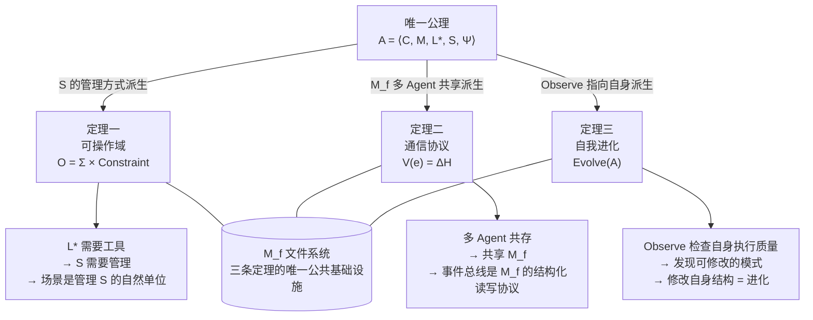
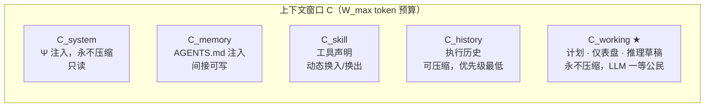
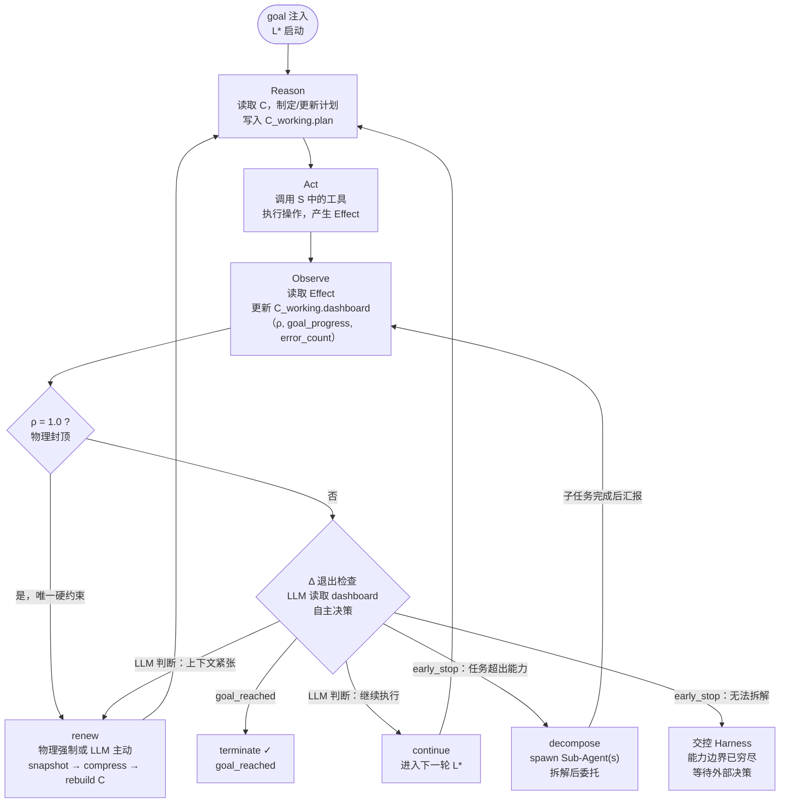
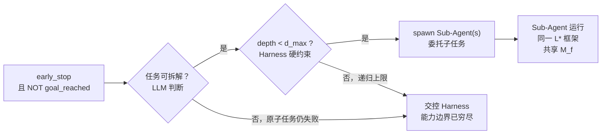
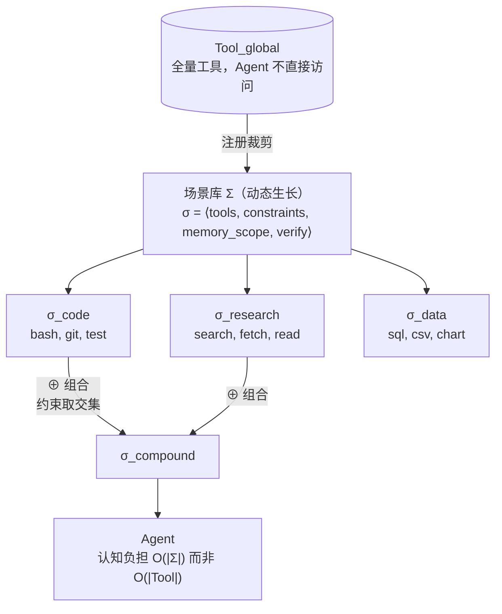
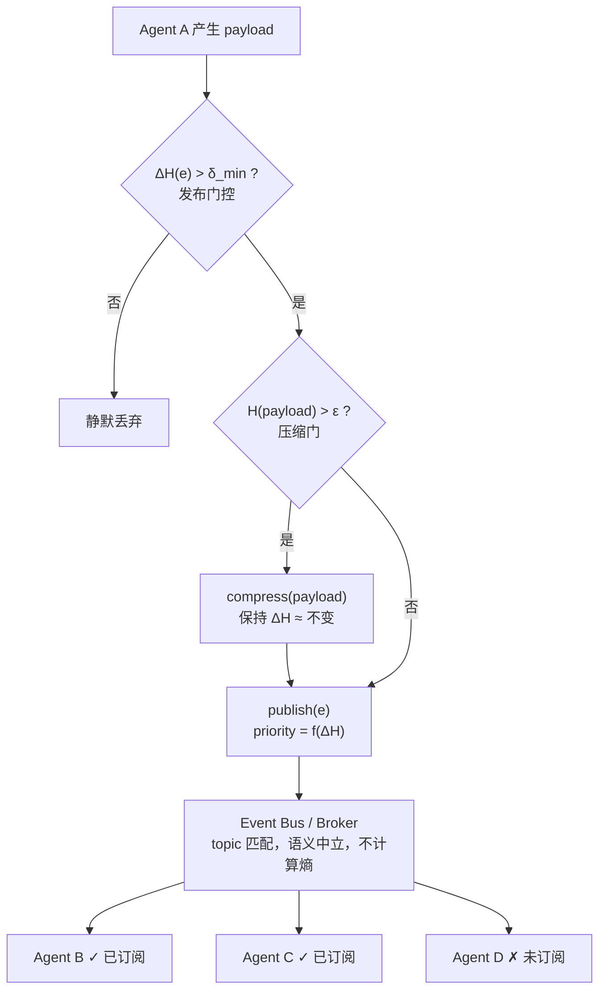
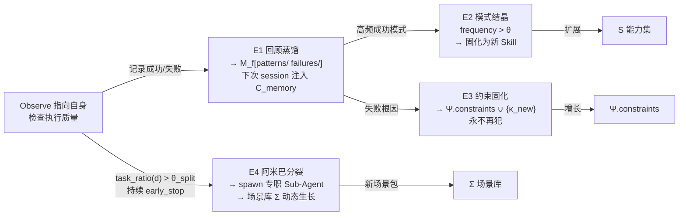
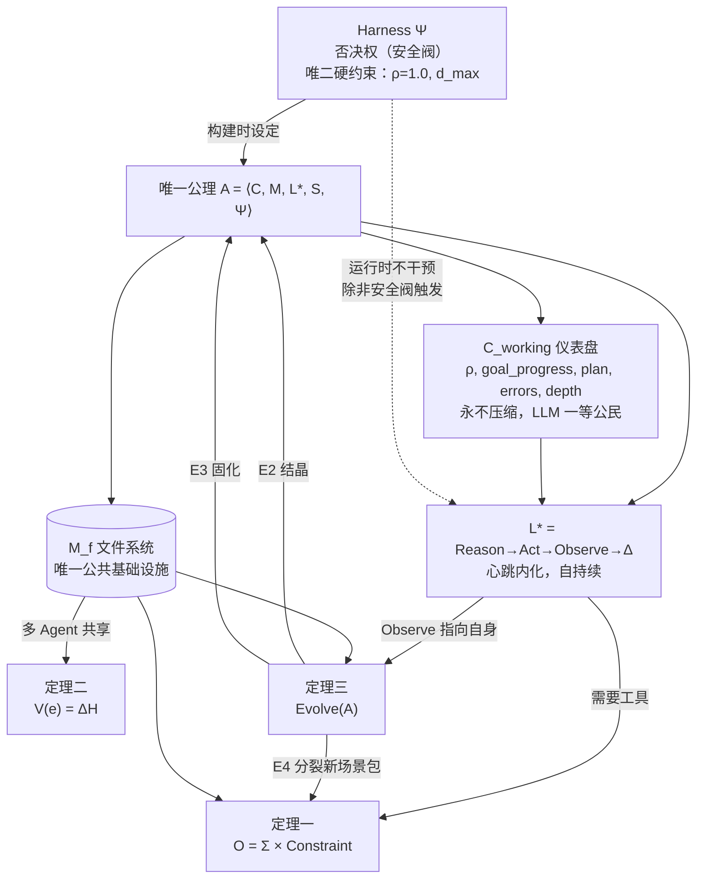

# Agent 公理系统 v2.0

> 基于 v1.0 的根本性重构：公理一是唯一公理，二三四是它的推论。

---

## 与 v1.0 的核心差异

| 维度 | v1.0 | v2.0 |
|---|---|---|
| 系统结构 | 四条平行公理 | 一条公理 + 三条派生定理 |
| 心跳机制 | `H_b` 独立于 `L` | 吸收进 `L*` 的 Δ 阶段 |
| ρ 阈值 | 多档静态规则（0.6/0.85） | 只有 ρ=1.0 是硬约束，其余交 LLM |
| early_stop | 需要对抗的失败信号 | 能力边界声明，触发拆解或交控 Harness |
| 控制论立场 | 未明确 | 带安全阀的自主体：L* 自主，Harness 拥有否决权 |
| 自我感知信息 | 散落在 C_history | C_working 的一等公民，永不压缩 |

---

## 元定理

```
唯一公理：A = ⟨C, M, L*, S, Ψ⟩

定理一（可操作域）  从 S 的管理方式派生    →  O = Σ × Constraint
定理二（通信协议）  从 M_f 多 Agent 共享派生 →  V(e) = ΔH，Pub/Sub
定理三（自我进化）  从 Observe 指向自身派生  →  Evolve(A) = {E1,E2,E3,E4}
```



---

## 唯一公理：A = ⟨C, M, L*, S, Ψ⟩

### 基本定义

| 符号 | 名称 | 定义 |
|---|---|---|
| `C` | Context 上下文 | 当前 token 窗口，Agent 的唯一感知界面，`\|C\| ≤ W_max` |
| `M` | Memory 记忆 | `M = (M_s, M_f, M_w)`，会话内 / 文件系统 / 模型权重 |
| `L*` | Loop 自持续执行闭环 | `(Reason → Act → Observe → Δ)*`，心跳内化于 Δ |
| `S` | Skill 能力集 | 渐进式披露的工具/MCP 集合，按需加载进 `C` |
| `Ψ` | Harness 外壳 | 构建环境与边界，拥有否决权，不替模型做决策 |

**公理 0（Agent 不等于模型）：**

```
Agent = Model ∘ Ψ

Ψ 的职责边界：
  ✓  设计 C_system（初始上下文结构）
  ✓  提供工具和场景包（S, Σ）
  ✓  设置物理约束（ρ=1.0 强制 renew，d_max 拆解深度上限）
  ✓  拥有否决权（安全阀，不轻易使用）

  ✗  不在运行时覆盖 LLM 的续写/拆解判断
  ✗  不设置任意的中间阈值规则
```

> **Ψ 是舞台，不是演员。**

---

### 上下文分区

```
C = C_system ⊕ C_memory ⊕ C_skill ⊕ C_history ⊕ C_working

保护优先级：C_system > C_working > C_memory > C_skill > C_history
```



**关键设计原则：C_working 的仪表盘永不压缩**

```
C_working 中始终维护一个活的自我感知仪表盘：

dashboard = {
  ρ:              当前上下文压力（token 数 / W_max）
  goal_progress:  任务完成度的 LLM 自评（自由文本）
  plan:           当前执行计划（Todo list，no-op tool）
  error_count:    最近 N 步的错误计数
  depth:          当前 Sub-Agent 递归深度
}
```

LLM 做所有决策时，这个仪表盘总是在场。信任 LLM 的判断力，首先要保证它有足够的信息。

**硬边界：** `C_system` 和 `M_weight` 永远不可编辑——Agent 自主性的上限由 Harness 在构建时设定，不可在运行时逾越。

---

### L*：带心跳的自持续执行闭环

这是 v2.0 最核心的变化。`H_b` 作为独立元素消失，心跳被吸收进 `L*` 的 Δ 阶段。

```
L* = (Reason → Act → Observe → Δ)*
```



#### Δ 的完整决策语义

```
Δ（每轮 Observe 后执行）：

物理层（规则，不过 LLM）：
  ρ = 1.0  →  强制 renew，这是唯一的硬性约束

语义层（全部交 LLM，基于 C_working.dashboard）：
  goal_reached = true
            →  terminate ✓

  LLM 判断上下文紧张（ρ 高但未到 1.0，近期推理质量下降）
            →  主动 renew（compress C_history，注入摘要，重建 C）

  LLM 判断任务可以继续
            →  continue，进入下一轮 Reason

  early_stop AND 任务可拆解
            →  decompose，spawn Sub-Agent(s)
               slice = LLM 判断的最小必要上下文
               depth++，检查 depth < d_max（Harness 设置的唯一结构约束）

  early_stop AND 任务不可拆解（depth = d_max 或无法细分）
            →  交控 Harness，报告能力边界
```

#### early_stop 的语义重定义

> **early_stop 不是失败信号，而是能力边界声明。**
> 模型在说："此任务超出我当前 L\* 在当前 C 下能处理的范围。"
> 系统的正确响应是拆解，不是强迫重试。



**递归终止保证：**
```
d_max 是 Harness 在构建时设置的唯一结构约束（非语义约束）。
当 depth = d_max 时，强制交控 Harness，防止无限递归。

最小可执行任务的判定：
  若单步 Act → Observe 后 goal_reached = true，则为原子任务。
  所有复杂任务 = 原子任务在 L* 上的组合：
    横向：多轮循环
    纵向：Sub-Agent 树（深度 ≤ d_max）
```

---

### renew（上下文窗口重建）

```
renew（主动或强制触发）：

  1. snapshot(C_working.dashboard) → M_f["working_state"]
  2. snapshot(C_working.plan)      → M_f["plan_state"]
  3. summary = compress(C_history)
       压缩评分：score(h) = K(h) · rel(h, goal) · e^(−λ·age(h))
       K=1 不可压缩核：关键决策 / 最近错误 / 任务目标
  4. new_C ← C_system
             ⊕ reload(C_memory)
             ⊕ C_skill
             ⊕ summary
             ⊕ M_f["working_state"]   ← dashboard 恢复
             ⊕ M_f["plan_state"]      ← 计划恢复
  5. resume(new_C, original_goal)     ← goal 永远随 renew 传递
```

renew 的本质：**用 M_f 做一次上下文的磁盘换页。** 新窗口比旧窗口小得多，但 goal、仪表盘、计划、关键历史全部保留。

---

## 定理一：可操作域

**派生路径：** `L*` 需要工具 → `S` 需要管理 → 场景是管理 `S` 的自然单位 → 场景绑定消除运行时选择负担

```
O_A = Σ_A × Constraint_A

σ = ⟨id, tools, constraints, memory_scope, verify_hook⟩
```



**场景组合：**
```
σ_compound = σ_a ⊕ σ_b
  tools       = σ_a.tools ∪ σ_b.tools
  constraints = σ_a.constraints ∩ σ_b.constraints   ← 取更严约束
  verify_hook = σ_b.verify_hook ∘ σ_a.verify_hook   ← 串联验证
```

> 推论：约束收窄反而提升可靠性（Harness 悖论）。解决方案空间变小，模型不再浪费 token 探索死路。

---

## 定理二：通信协议

**派生路径：** 多 Agent 共存 → 共享 `M_f` → 事件总线是 `M_f` 的结构化读写协议 → `ΔH` 决定写入价值

```
V(e) = ΔH(e) = H(Ω) − H(Ω | e)

Event e = ⟨id, sender, topic, payload, ΔH, priority, ts⟩
priority = f(ΔH)，由 Producer 写入，Broker 视为不透明数字
```



**三条操作公理：**

```
T2.1 发布门控：publish(e) 当且仅当 ΔH(e) > δ_min
T2.2 发布前压缩：H(payload) > ε → compress，保持 ΔH ≈ 不变
T2.3 任务复杂度隔离：H(task) 属于 L* 的 Δ 层，不参与 ΔH(e) 计算
     H(task)高 → 触发 decompose（L* 机制）
     ΔH(e)高  → 提升事件优先级（通信机制）
     任务难 ≠ 事件重要，混用导致错误设计
```

---

## 定理三：自我进化

**派生路径：** `Observe` 步骤可以指向外部世界，也可以指向 Agent 自身 → 自我观察 → 发现可修改的模式 → 修改自身结构 = 进化

```
Evolve(A) = {E1_回顾蒸馏, E2_模式结晶, E3_约束固化, E4_阿米巴分裂}
```



**四种机制的层次：**

| 机制 | 层面 | 改变什么 | 时机 |
|---|---|---|---|
| E1 回顾蒸馏 | 个体内 | `C_memory` 增长 | 每个任务结束 |
| E2 模式结晶 | 个体内 | `S` 扩展 | 高频成功模式 |
| E3 约束固化 | 个体内 | `Ψ.constraints` 增长 | 每次失败后 |
| E4 阿米巴分裂 | 系统级 | Multi-Agent 拓扑 + `Σ` | 领域持续高负载 |

> ⚠️ **E3 棘轮风险：** 约束只增不减可能导致能力退化。建议定期执行约束审计——检查过时或相互矛盾的约束。

---

## 公理与定理的依赖关系



---

## 控制论立场：带安全阀的自主体

```
平时：L* 完全自主
  → LLM 基于 C_working.dashboard 自主做所有决策
  → Harness 不干预

例外（Harness 否决权触发）：
  → ρ = 1.0（物理封顶，强制 renew）
  → depth = d_max（递归上限，强制交控）
  → 安全边界违反（Ψ.constraints 被触碰）
  → 外部中断信号

唯二结构约束（非语义，Harness 在构建时设定）：
  ρ = 1.0    →  物理事实，模型无法在满窗口运行
  d_max      →  防止无限递归的拓扑约束
```

> **核心立场：** 只有物理事实和拓扑约束才是硬性约束。其他所有判断——续写、压缩、拆解、终止——都是语义层面的问题，应该由 LLM 基于完整的自我感知信息来做。信任 LLM 的判断力，首先要保证它总是有足够的信息。

---

## 开放问题（v2.0 新增）

1. **LLM 自我感知的可靠性：** LLM 在 `C_working.dashboard` 上更新 `goal_progress` 时，这个自评是否足够准确？尤其是在长任务末期，模型是否会系统性地高估或低估完成度？

2. **d_max 的设定依据：** 拆解深度上限是 Harness 的唯一结构约束，但它应该是固定值还是任务类型相关的函数？`d_max(σ_code) ≠ d_max(σ_research)`？

3. **E4 与 L* 的耦合：** 阿米巴分裂产生的专职 Sub-Agent 也在同一 `L*` 框架下运行。分裂后的系统拓扑不是树而是 DAG（Sub-Agent 可能共享场景包），DAG 上的 `M_f` 写冲突如何解决？

4. **进化的可观测指标：** E1-E4 全部通过 `M_f` 持久化，但"系统整体进化了多少"的量化指标仍未定义（Skill 增长率？约束密度？Sub-Agent 拓扑深度？平均任务成功率？）

5. **Ψ 否决权的触发日志：** 每次 Harness 行使否决权都应该产生一条结构化记录，用于后续分析"Harness 介入了多少次"以及"是否应该调整 d_max 或其他构建时参数"。

---

*Agent 公理系统 v2.0 · 完*
