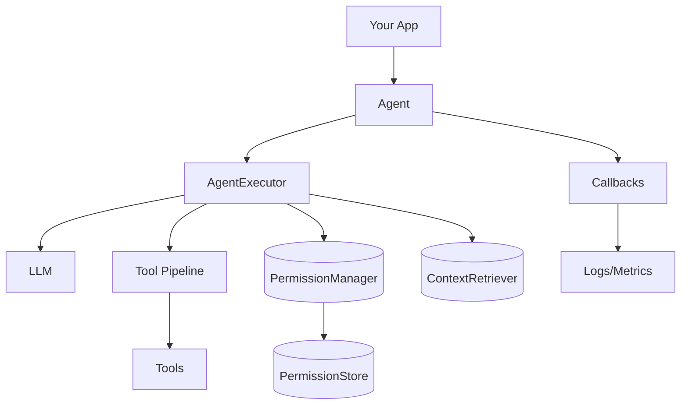

# Loom Agent Framework

> 下一代上下文工程驱动的智能助理框架（对标 LangChain），支持工具流水线、RAG、并发调度与流式事件。

[](https://python.org)
[](LICENSE)
[](https://pypi.org/project/loom-agent/)
[](https://github.com/kongusen/loom-agent/actions/workflows/ci.yml)

## 🚀 Key Features

- **🤖 Multi-Agent Orchestration**: Coordinate multiple specialized agents working together
- **🧠 Intelligent Context Management**: Automatic context optimization and memory management  
- **🔧 Rich Tool Ecosystem**: Built-in tools for file operations, knowledge bases, code execution
- **🌊 Streaming Processing**: Real-time data processing and response streaming
- **🔒 Security First**: Built-in security checks and permission controls
- **⚡ High Performance**: Asynchronous architecture with concurrent processing
- **🔌 Extensible**: Modular design for easy customization and extension
- **🌐 LLM Integration**: Support for multiple LLM providers (OpenAI, Anthropic, etc.)

## 🏗️ Architecture

```
loom/
├── interfaces/   # 抽象接口 (LLM/Tool/Memory/...)
├── core/         # 执行内核 (AgentExecutor/ToolPipeline/RAG/...)
├── components/   # 高层构件 (Agent/Chain/Router/Workflow)
├── llm/          # LLM 子系统 (config/factory/pool/registry)
├── builtin/      # 内置 LLM/Tools/Memory/Retriever
├── patterns/     # 常用模式 (RAG/Multi-Agent)
└── docs/         # 文档
```

## 📦 Installation

```bash
# Option A: install from source (local dev)
git clone https://github.com/your-org/loom-agent.git
cd loom-agent

# Using Poetry (recommended for development)
poetry install

# Or using pip (PEP 517 build; editable)
pip install -e .

# Option B: once published to PyPI (minimal core)
pip install loom-agent

# Install with extras to enable specific features
pip install "loom-agent[openai]"          # OpenAI provider
pip install "loom-agent[anthropic]"       # Anthropic provider
pip install "loom-agent[retrieval]"       # ChromaDB / Pinecone support
pip install "loom-agent[web]"             # FastAPI / Uvicorn / WebSockets
pip install "loom-agent[all]"             # Everything
```

### Extras

- `openai`: OpenAI Chat Completions API 客户端
- `anthropic`: Anthropic Claude 客户端
- `retrieval`: 向量检索能力（ChromaDB、Pinecone、依赖 numpy）
- `web`: FastAPI / Uvicorn / WebSockets 相关能力
- `mcp`: Model Context Protocol 客户端
- `system`: 系统接口（psutil、docker）
- `observability`: 结构化日志与缓存（structlog、cachetools）
- `all`: 打包安装以上全部

## 🏃‍♂️ Quick Start

```python
import asyncio
import loom
from loom.builtin.llms import MockLLM

async def main():
    agent = loom.agent(llm=MockLLM(responses=["Hello from Loom!"]))
    print(await agent.ainvoke("Say hello"))

if __name__ == "__main__":
    asyncio.run(main())
```

OpenAI（通过环境变量快速使用）

```bash
pip install "loom-agent[openai]"
export LOOM_PROVIDER=openai
export OPENAI_API_KEY=sk-...
export LOOM_MODEL=gpt-4o-mini
python - <<'PY'
import asyncio, loom
async def main():
    a = loom.agent_from_env()
    print(await a.ainvoke("Say hello in 5 words"))
asyncio.run(main())
PY
```

### Tool Usage Example (decorator)

```python
import loom
from typing import List

@loom.tool(description="Sum a list of numbers")
def sum_list(nums: List[float]) -> float:
    return sum(nums)

SumTool = sum_list
agent = loom.agent(provider="openai", model="gpt-4o", tools=[SumTool()])
```

## 📚 Documentation

- Framework User Guide: docs/LOOM_USER_GUIDE.md
- Systemized Framework Guide: docs/LOOM_FRAMEWORK_GUIDE.md
- Agent Packs (programmatic): docs/AGENT_PACKS_API.md
- Permissions & Safe Mode: docs/AGENT_PERMISSIONS.md

### Visual Overview (Mermaid)



## 🔧 Core Components

### Agents
- **Agent Controller**: Manages agent lifecycle and coordination
- **Agent Registry**: Agent discovery and capability matching
- **Specialization**: Domain-specific agent behaviors

### Context Management  
- **Context Retrieval**: Intelligent context gathering
- **Context Processing**: Context optimization and compression
- **Memory Management**: Persistent and session memory

### Tool System
- **Tool Registry**: Centralized tool management
- **Tool Executor**: Safe tool execution with monitoring
- **Tool Scheduler**: Intelligent tool scheduling and orchestration

### Orchestration
- **Orchestration Engine**: Multi-agent workflow coordination
- **Strategy System**: Pluggable orchestration strategies
- **Event Coordination**: Inter-agent communication

### Streaming
- **Stream Processor**: Real-time data processing
- **Stream Pipeline**: Multi-stage processing pipelines
- **Stream Optimizer**: Performance optimization

## 🛠️ Built-in Tools

| Tool | Description | Safety Level |
|------|-------------|--------------|
| **File System** | File operations (read, write, list) | Cautious |
| **Knowledge Base** | Document storage and search | Safe |
| **Code Interpreter** | Code execution (Python, JS, Bash) | Exclusive |
| **Web Search** | Web information retrieval | Safe |

## 🌐 LLM Integration

The framework supports multiple LLM providers:

```python
# Environment configuration
export LLM_API_KEY="your-api-key"
export LLM_BASE_URL="https://api.openai.com/v1"  
export LLM_MODEL="gpt-3.5-turbo"

# Supported providers:
# - OpenAI (GPT-3.5, GPT-4)
# - Anthropic (Claude-3)
# - Azure OpenAI
# - Local models (Ollama, etc.)
```

## 📚 Documentation

- Quickstart: `loom/docs/QUICKSTART.md`
- Framework Overview: `loom/docs/README_LOOM.md`
- Callbacks Spec: `loom/docs/CALLBACKS_SPEC.md`
- Examples: `examples/`

## 🔒 Security

The framework implements multiple security layers:

- **Path Traversal Protection**: Prevents unauthorized file access
- **Code Execution Sandboxing**: Safe code execution environment
- **Permission-based Access**: Granular permission controls
- **Input Validation**: Comprehensive input sanitization

## 📊 Performance

- **Concurrent Agent Support**: 100+ agents simultaneously
- **Tool Execution**: Sub-second response times
- **Memory Efficiency**: Optimized context management
- **Streaming Throughput**: 1000+ events/second

## 🤝 Contributing

We welcome contributions! Please see our contributing guidelines for details.

1. Fork the repository
2. Create a feature branch
3. Make your changes
4. Add tests
5. Submit a pull request

## 📄 License

This project is licensed under the MIT License - see the [LICENSE](LICENSE) file for details.

## 🙏 Acknowledgments

- Inspired by modern multi-agent systems research
- Built with Python's async/await ecosystem
- Designed for production scalability

---

**Built with ❤️ for the AI community**

## 🚢 Build & Publish

```bash
# Build wheel and sdist
poetry build

# Publish to PyPI (requires account and API token)
poetry publish --username __token__ --password $PYPI_TOKEN

# Or publish to TestPyPI first
poetry config repositories.testpypi https://test.pypi.org/legacy/
poetry publish -r testpypi --username __token__ --password $TEST_PYPI_TOKEN
```

Tip: remove `asyncio` from dependencies if targeting Python 3.11+, as it is built-in.

### GitHub Actions workflows

- CI runs on PR/push: `.github/workflows/ci.yml`
- Tag-based release to PyPI: push tag `vX.Y.Z` triggers `.github/workflows/release.yml`
- Tag-based prerelease to TestPyPI: push tag `vX.Y.Z-rcN` triggers `.github/workflows/testpypi.yml`

Required repository secrets:
- `PYPI_API_TOKEN` for PyPI
- `TEST_PYPI_API_TOKEN` for TestPyPI

Tag examples:
```bash
git tag v3.0.1-rc1 && git push origin v3.0.1-rc1   # TestPyPI
git tag v3.0.1 && git push origin v3.0.1            # PyPI
```
