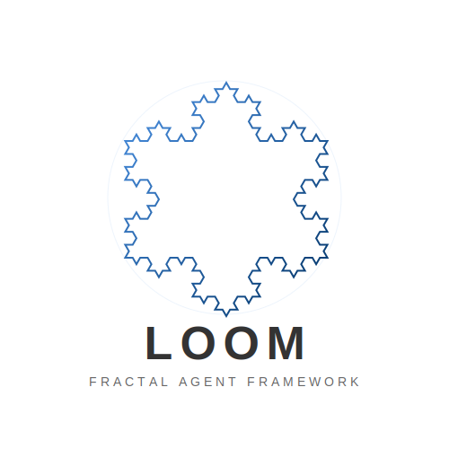

<div align="center">



# Loom

**面向 Python 应用的 Agent SDK：状态化运行、上下文控制、安全边界和可扩展能力。**

[](https://pypi.org/project/loom-agent/)
[](https://www.python.org/downloads/)
[](https://deepwiki.com/kongusen/loom-agent)
[](LICENSE)

[English](README.md) | **中文**

[Wiki](wiki/Home.md) | [快速开始](wiki/01-getting-started/README.md) | [PyPI](https://pypi.org/project/loom-agent/) | [Changelog](CHANGELOG.md)

</div>

---

Loom 是一个可嵌入应用的 Agent SDK，帮助开发者以更低成本搭建出类似 [Hermes](https://github.com/nousresearch/hermes-agent)、[OpenClaw](https://github.com/openclaw/openclaw) 的 Agent 平台能力。它不内建 gateway 产品层、cron 服务、dashboard 或 skill market；这些外部系统应通过 adapter 把事件归一为 runtime signal，再交给内核处理。

`0.8.0` 稳定的是 SDK runtime kernel：

```text
Agent + Runtime + Capability
    -> Run / Session
    -> RuntimeTask / RuntimeSignal
    -> Context / Continuity / Harness / Quality / Governance / Feedback
```

`0.8.1` 补齐 orchestration、knowledge、cron 和新的 `MemorySource` API 等子系统快捷入口。旧 0.x 兼容接口会保留到 `0.8.x`，计划在 `0.9.0` 移除。

## 搜索关键词

Loom 面向以下检索意图：

- Python Agent SDK
- Agent Runtime Framework
- 可嵌入 AI Agent 框架
- Hermes 替代架构
- OpenClaw 风格 Agent 平台组装

## Loom 与 Hermes / OpenClaw 的关系

- Loom 是 SDK/runtime kernel，不是完整托管式 Agent 产品。
- gateway、cron、dashboard、skill market 由业务侧通过 adapter 自行组装。
- 这种边界让团队更容易构建可定制、低耦合的 Agent 平台。
- 现有 Hermes/OpenClaw 风格事件流可归一到 `RuntimeSignal`。

## FAQ

**Loom 是不是像 Hermes / OpenClaw 那样的完整平台？**
不是。Loom 主要提供 runtime kernel 和 SDK 合约，用来在你的业务系统里搭建这类平台能力。

**用 Loom 能做 gateway、cron、dashboard 吗？**
可以。Loom 的设计就是把这些外部系统通过 adapter 接入，再统一进入 runtime signal 和治理能力路径。

**已有 Hermes/OpenClaw 风格流程能迁移吗？**
大多数场景可以。事件编排可映射到 `RuntimeSignal`，策略决策可集中在 `Runtime`。

**Loom 更适合什么团队？**
适合需要可嵌入 Python Agent SDK、且希望在编排、记忆、工具与安全边界上保持模块化控制的团队。

## Use Cases

- 构建客服 Agent 平台：自定义 gateway、路由策略和质量控制。
- 构建企业研发 Copilot：统一工具治理、代码检索与记忆连续性。
- 构建流程自动化 Agent：响应 cron 调度和外部 runtime signal。
- 构建企业知识 Agent：结合检索、引用与策略驱动执行。

## Runtime Kernel 与子系统

runtime kernel 是 Loom 各个子系统共享的执行边界。用户侧通过 `Agent(...)` 配置能力、记忆、知识、调度和编排；这些配置会被归一成 `Runtime`、`Capability` 和 source config，再进入同一条 run/session 执行链路：

```text
Agent API
    -> RuntimeConfig + CapabilitySpec + Source configs
    -> AgentEngine
    -> Context partitions + RuntimeSignal + governed tools
    -> Harness / Quality / Continuity / Feedback
```

7 个用户侧子系统都依赖 runtime kernel，但各自提供的能力不同：

| 子系统 | 依赖的 kernel 合约 | 提供的能力 |
|---|---|---|
| Tool Use | `Capability`、tool registry、`GovernancePolicy` | 把 Python tools、shell、files、web、MCP 和 builtin tools 收敛到同一条受治理的工具路径，统一处理权限、只读、限流和 veto。 |
| Memory | `ContextProtocol`、memory partition、session restore、`MemorySource` 生命周期 | run 开始召回长期应用记忆，run 结束提取并写入新记忆；语义上和 session 历史分离。 |
| Skills | `Capability.skill(...)`、ecosystem loader、tool registry | 按任务加载技能说明和技能工具，不把所有 skill 都塞进基础 prompt。 |
| Harness | `Runtime.harness`、`HarnessRequest`、`HarnessOutcome`、`QualityGate` | 控制一次 run 如何被尝试：single pass、generator/evaluator、多候选生成、人工 gate 或外部 workflow。 |
| Gateway / Orchestration | `RuntimeSignal`、`AttentionPolicy`、`DelegationPolicy`、coordinator | 把外部事件和子任务委派都归一到 signal 与 runtime decision 路径。 |
| Knowledge | `KnowledgeSource`、`KnowledgeResolver`、`C_working.knowledge_surface` | 注入 run-scoped evidence、active questions、citations，并支持按需检索，不污染长期 memory。 |
| Cron | `ScheduleConfig`、`ScheduledJob`、`RuntimeSignal(source="cron")` | 把到期 scheduled prompt 转成 runtime signal，由 attention policy 决定执行、排队或忽略。 |

实际运行时，这些子系统通过同一个 loop 协作：

1. agent 接收 `RuntimeTask` 或 `RuntimeSignal`。
2. runtime policy 决定上下文形状、attention 行为、可用 capability 和 harness 策略。
3. Memory 与 Knowledge 在模型调用前填充对应 context partition。
4. Tool Use、Skills、MCP 和 delegation 通过受治理的 capability path 执行。
5. Harness、Quality、Continuity 和 Feedback 决定任务完成、继续执行或续写上下文。
6. Session 历史和长期 Memory 分别写回自己的 store。

这个结构保证扩展点是模块化的：新的 gateway、scheduler、retriever、memory store 或 skill 都不会绕过 kernel，而是适配到 kernel contract。

## 安装

```bash
pip install loom-agent
export ANTHROPIC_API_KEY=sk-ant-...
```

## 快速开始

```python
import asyncio

from loom import Agent, Capability, Generation, Model, Runtime, tool


@tool(description="搜索文档", read_only=True)
async def search_docs(query: str) -> str:
    return f"结果: {query}"


async def main():
    agent = Agent(
        model=Model.anthropic("claude-sonnet-4"),
        instructions="你是一个简洁的代码助手。",
        tools=[search_docs],
        capabilities=[
            Capability.files(read_only=True),
            Capability.web(),
        ],
        generation=Generation(max_output_tokens=512),
        runtime=Runtime.sdk(),
    )

    result = await agent.run("概括这个仓库")
    print(result.output)


asyncio.run(main())
```

## 公共 API 形状

常规应用代码从 `loom` 导入：

```python
from loom import (
    Agent,
    Capability,
    Harness,
    HarnessCandidate,
    HarnessOutcome,
    HarnessRequest,
    KnowledgeResolver,
    KnowledgeSource,
    MemoryConfig,
    MemoryExtractor,
    MemoryQuery,
    MemoryRecord,
    MemoryResolver,
    MemorySource,
    MemoryStore,
    Model,
    OrchestrationConfig,
    Runtime,
    RuntimeSignal,
    RuntimeTask,
    ScheduleConfig,
    ScheduledJob,
    SessionConfig,
    SignalAdapter,
    RunContext,
    tool,
)
```

推荐的应用结构：

```text
Agent(...)
    -> run(...)
    -> stream(...)
    -> receive(...)
    -> session(SessionConfig(...))
          -> Session
                -> start(...) / run(...) / stream(...) / receive(...)
```

兼容和高级配置路径仍然存在：

- `AgentConfig`、`ModelRef`、`GenerationConfig`、`create_agent()` 会保留到 `0.8.x`
- 新文档和示例优先使用 `Agent`、`Model`、`Generation`、`Runtime`、`Capability`
- `loom.compat.v0` 是显式旧兼容命名空间，计划在 `0.9.0` 移除

## Runtime 语言

简单调用可以直接传字符串：

```python
result = await agent.run("列出这次变更的主要风险")
```

任务需要成功标准、结构化输入或元数据时，用 `RuntimeTask`：

```python
from loom import RuntimeTask

result = await agent.run(
    RuntimeTask(
        goal="重构 runtime API",
        input={"scope": "agent + runtime kernel"},
        criteria=["保持公共 API 兼容", "测试通过"],
    )
)
```

长任务机制通过 `Runtime` 组合：

```python
from loom import Capability, Model, Runtime

agent = Agent(
    model=Model.openai("gpt-5.1"),
    capabilities=[
        Capability.files(read_only=True),
        Capability.web(),
        Capability.shell(require_approval=True),
    ],
    runtime=Runtime.long_running(criteria=["tests stay green"]),
)
```

常用 preset：

```python
Runtime.sdk()
Runtime.long_running(criteria=["tests stay green"])
Runtime.supervised(criteria=["release 前需要人工审批"])
Runtime.autonomous(max_depth=5, max_iterations=200)
Runtime.orchestrated(max_depth=3)
Runtime.scheduled()
```

## Harness

`Harness` 是一次 run 的执行策略。它和 `QualityGate` 分工不同：Harness 决定任务如何被尝试，QualityGate 定义答案如何被验收。

默认策略是一次原始 runtime loop：

```python
from loom import Harness, Runtime

runtime = Runtime.sdk(harness=Harness.single_run())
```

自定义 Harness 可以生成多个可能答案，用应用自己的逻辑评估，再返回被选中的输出：

```python
from loom import Harness, HarnessCandidate, HarnessOutcome, HarnessRequest, Runtime


async def choose_best(request: HarnessRequest) -> HarnessOutcome:
    baseline = await request.run_once()
    candidates = [
        HarnessCandidate(
            id="baseline",
            content=str(baseline["output"]),
            score=0.4,
            rationale="原始 runtime 输出",
        ),
        HarnessCandidate(
            id="expanded",
            content=f"{baseline['output']}\n\n已按 release criteria 检查。",
            score=0.9,
            rationale="应用侧 evaluator 更偏好这个候选",
        ),
    ]
    return HarnessOutcome(
        output=candidates[1].content,
        candidates=candidates,
        selected_candidate_id="expanded",
    )


runtime = Runtime.long_running(
    criteria=["tests stay green"],
    harness=Harness.custom(choose_best, name="release-review"),
)
```

## Orchestration

需要让 agent 自动规划和委派子任务时，可以用 `orchestration=True`，不用手动组装 coordinator/sub-agent：

```python
from loom import Agent, Model, OrchestrationConfig

agent = Agent(
    model=Model.openai("gpt-4o"),
    orchestration=True,
)

advanced = Agent(
    model=Model.openai("gpt-4o"),
    orchestration=OrchestrationConfig(max_depth=5, gen_eval=True),
)
```

`orchestration=` 是 orchestrated runtime profile 的快捷入口，会启用 depth-limited delegation 和延迟 sub-agent wiring。它和 `runtime=` 互斥。

## Capability

`Capability` 是用户侧描述 agent 能力来源的语言。工具、Toolset、MCP、skill 都会收敛到同一条受治理的工具路径：

```python
agent = Agent(
    model=Model.openai("gpt-5.1"),
    capabilities=[
        Capability.files(read_only=True),
        Capability.web(),
        Capability.shell(require_approval=True),
        Capability.mcp("github", command="github-mcp", connect=False),
        Capability.skill(
            "repo-review",
            content="# Review\n检查 diff、风险和测试结果。",
            when_to_use="review,diff",
        ),
    ],
)
```

Capability 使用会统一经过 `GovernancePolicy`，包括权限、veto、限流、只读和破坏性操作边界。

## RuntimeSignal

gateway、cron、heartbeat、webhook 和应用回调都应该归一成 `RuntimeSignal`。内核不区分 signal 来源，只接收信号，再由 `AttentionPolicy` 判断 observe、run 或 interrupt。

```python
from loom import RuntimeSignal, SessionConfig

session = agent.session(SessionConfig(id="ops"))

await session.receive(
    RuntimeSignal.create(
        "部署健康检查到期",
        source="cron",
        type="job",
        urgency="normal",
        payload={"job_id": "deployment-health"},
    )
)
```

外部事件用 `SignalAdapter` 在应用边界标准化：

```python
from loom import SignalAdapter

slack = SignalAdapter(
    source="gateway:slack",
    type="message",
    summary=lambda event: event["text"],
    payload=lambda event: {"channel": event["channel"]},
    dedupe_key=lambda event: event["event_id"],
)

await agent.receive(
    {
        "event_id": "evt-support-1",
        "text": "客户询问部署状态",
        "channel": "support",
    },
    adapter=slack,
    session_id="ops",
)
```

Signal 会进入任务仪表盘上下文 `C_working`，作为 pending events 和 active risks 被 runtime 使用。

## 定时任务

在 agent 上声明 scheduled prompts，然后显式启动/停止进程内 scheduler：

```python
from loom import Agent, Model, ScheduleConfig

agent = Agent(model=Model.openai("gpt-4o"))

agent.every(id="ci", prompt="检查 CI 状态", minutes=30)
agent.once("2026-04-29T09:00:00", id="daily", prompt="总结 inbox")
agent.schedule(
    "custom",
    prompt="执行维护任务",
    every=ScheduleConfig.interval(hours=1),
)

agent.start_scheduler()
# ...
agent.stop_scheduler()
```

到期 job 会先转成 `RuntimeSignal(source="cron", type="scheduled_job")`，再由 attention policy 决定是否执行。`Agent(...)` 构造函数不会自动启动后台线程。

## Session 和恢复

多轮状态使用 `session()`：

```python
from loom import RunContext, SessionConfig

session = agent.session(SessionConfig(id="demo-user"))

first = await session.run("列出一个好 API 的三个特征")
second = await session.run(
    "把上一条答案压缩成一句话",
    context=RunContext(inputs={"previous_answer": first.output}),
)
```

需要持久化时，接入 session store 和恢复策略：

```python
from loom import Agent, FileSessionStore, Model, Runtime, SessionRestorePolicy

agent = Agent(
    model=Model.openai("gpt-5.1"),
    runtime=Runtime.long_running(
        session_restore=SessionRestorePolicy.window(
            max_transcripts=4,
            max_messages=12,
            max_runtime_items=8,
            max_chars=8000,
        )
    ),
    session_store=FileSessionStore(".loom/sessions.json"),
)
```

`FileSessionStore` 持久化 session metadata、run summaries、transcripts、events、artifacts 和 run context。`SessionRestorePolicy` 决定哪些历史进入下一次 run。

## Memory

Memory 分成两个语义：

- `SessionStore` + `SessionRestorePolicy`：持久化和恢复 runtime 历史。
- `MemorySource`：长期应用记忆的召回、提取和写入。

新集成优先使用 `MemorySource`、`MemoryResolver`、`MemoryExtractor`、`MemoryStore`：

```python
from loom import (
    Agent,
    MemoryConfig,
    MemoryExtractor,
    MemoryQuery,
    MemoryRecord,
    MemorySource,
    MemoryStore,
    Model,
)


class VectorMemoryStore(MemoryStore):
    def search(self, query: MemoryQuery) -> list[MemoryRecord]:
        hits = vector_db.search(
            query.text,
            top_k=query.top_k,
            filter={"session_id": query.session_id},
        )
        return [
            MemoryRecord(
                key=hit.id,
                content=hit.text,
                score=hit.score,
                metadata=hit.metadata,
            )
            for hit in hits
        ]

    def upsert(self, record: MemoryRecord, query: MemoryQuery | None = None) -> None:
        vector_db.upsert(
            id=record.key or None,
            text=record.content,
            metadata={**record.metadata, "session_id": query.session_id if query else None},
        )


memory = MemorySource.long_term(
    "project",
    store=VectorMemoryStore(),
    extractor=MemoryExtractor.callable(
        lambda user, assistant, session_id=None: [
            MemoryRecord(
                content=f"{user} -> {assistant}",
                metadata={"session_id": session_id},
            )
        ]
    ),
    instructions="相关时优先使用项目长期记忆。",
)

agent = Agent(
    model=Model.openai("gpt-4o"),
    memory=MemoryConfig(sources=[memory]),
)
```

run 开始时，`MemorySource` 召回记录并注入 memory partition；run 结束时，extractor 可以抽取新记忆并通过 store 写入。`MemoryProvider` 仍保留为 `0.8.x` 兼容桥接层，新代码应使用 `MemorySource`。

## Knowledge

Knowledge 用来声明文档、FAQ、检索系统等外部知识来源：

```python
from loom import Agent, KnowledgeSource, Model

agent = Agent(
    model=Model.anthropic("claude-sonnet-4"),
    knowledge=[
        KnowledgeSource.inline("faq", ["Q: ... A: ..."]),
        KnowledgeSource.from_directory("docs", "./docs", glob="**/*.md"),
    ],
)
```

自定义检索用 `KnowledgeResolver`：

```python
from loom import (
    KnowledgeEvidence,
    KnowledgeEvidenceItem,
    KnowledgeQuery,
    KnowledgeResolver,
    KnowledgeSource,
)


def retrieve_docs(query: KnowledgeQuery) -> KnowledgeEvidence:
    hits = search_index.search(query.text, top_k=query.top_k)
    return KnowledgeEvidence(
        query=query,
        items=[
            KnowledgeEvidenceItem(
                source_name="search",
                title=hit.title,
                content=hit.text,
                uri=hit.url,
                score=hit.score,
            )
            for hit in hits
        ],
    )


source = KnowledgeSource.dynamic("search", KnowledgeResolver.callable(retrieve_docs))
```

## 内核概念

| 概念 | 含义 |
|---|---|
| `Agent` | 用户侧智能体规格 |
| `Runtime` | 执行机制组合 |
| `Run` / `Session` | 单次执行 / 多轮状态边界 |
| `RuntimeTask` | 结构化任务请求 |
| `RuntimeSignal` | gateway、cron、heartbeat、应用回调等外部输入 |
| `AttentionPolicy` | 判断 signal 如何影响执行 |
| `ContextProtocol` | 上下文分区、渲染、压缩、续写 |
| `ContinuityPolicy` | reset/compact 后如何延续任务 |
| `Harness` | 长任务执行策略 |
| `QualityGate` | 验收标准和 PASS/FAIL |
| `DelegationPolicy` | 子任务和子 agent 派发边界 |
| `Capability` | tools、Toolset、MCP、skill 等能力来源 |
| `GovernancePolicy` | 权限、veto、限流、只读/破坏性检查 |
| `FeedbackPolicy` | 运行反馈和演化数据 |

## 版本策略

- `0.8.0` 是当前 SDK runtime kernel 的公共 API 稳定线
- `0.8.1` 补齐 7 个子系统集成层：Tool Use、Memory、Skills、Harness、Gateway/Orchestration、Knowledge、Cron
- `0.8.x` 保留旧兼容导出
- `loom.compat.v0` 是显式 legacy namespace
- `0.9.0` 计划移除旧兼容层

## 验证

当前内核文档和示例以这些检查为准：

```bash
poetry run ruff check loom tests examples
poetry run mypy loom
poetry run pytest -q
```

`0.8.1` 子系统阶段最新全量结果：`565 passed`。

## License

Apache 2.0 with Commons Clause. See [LICENSE](LICENSE).
