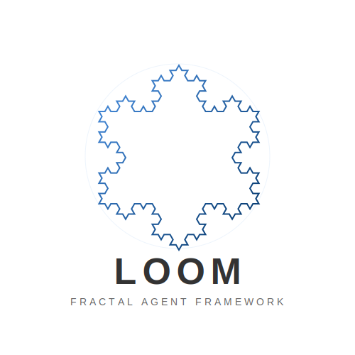

<div align="center">



# loom-agent

**Long Horizon Agents Framework**
*Agents that don't collapse when problems get long.*

[](https://pypi.org/project/loom-agent/)
[](https://www.python.org/downloads/)
[](LICENSE)

**English** | [中文](README.md)

[Manifesto](MANIFESTO.md) | [Documentation](docs/README.md) | [Getting Started](docs/usage/getting-started.md)

</div>

---

## A short story

We built many agents.

They could write code.
They could plan tasks.
They could use tools.

And they all failed the same way.

Not at step one.
Not at step five.

They failed quietly —
around step twenty.

The plan was still there.
The tools were still available.

But no one remembered:

* why this task was started
* what had already been tried
* which decisions mattered
* or who was supposed to act next

The agent didn't crash.

It simply **forgot who it was**.

That was the moment we realized:

> The problem wasn't intelligence.
> It was time.

---

## The Long Horizon Collapse

Real-world tasks are not prompts.

They span dozens of steps, days of time, constantly changing goals.
Plans expire, context explodes, memory fragments.

This is the **Long Horizon Problem**.

Most agent frameworks assume tasks are short, goals are stable, failures are one-time events.
They rely on single planners, global memory, linear execution flows.

This looks great in demos.

But after step 20, agents start endlessly re-planning, contradicting themselves, repeating failed actions.
Adding more tools only accelerates the collapse.

**The problem is not reasoning capability.**

Most agents fail because they lack structure that can remain stable over time.

> More tokens won't fix this.
> Better prompts won't fix this.
> **Only structure can.**

---

## loom-agent: The Answer Through Structural Recursion

Humans never solved complexity by being smarter.

We use **repeating structure**: teams resemble departments, departments resemble companies, companies resemble ecosystems.
Even as scale grows, structure remains stable. This is fractal organization.

**loom-agent makes agents work the same way.**

Instead of building "super agents", we build **self-similar agents**.
Each agent contains the same core structure:

```
Observe → Decide → Act → Reflect → Evolve
```

An agent can create sub-agents, and sub-agents behave exactly the same way.
Tasks become worlds, worlds contain smaller worlds.

**Complexity grows, structure doesn't.**

This means systems can scale infinitely — without redesigning architecture, without prompt inflation, without centralized planners.

---

## The Loom Metaphor

A loom doesn't create fabric through intelligence.

It creates fabric through **structure**.

* threads interweave
* patterns repeat
* tension stays balanced

Agents in loom-agent are threads.

The framework is the loom.

What emerges is not a workflow —
but a living structure that persists over time.

---

## Core Principles

loom-agent's design revolves around four core beliefs:

**Structure over intelligence** — Smarter reasoning doesn't prevent collapse, stable structure does.

**Built for long horizons** — Designed for tasks that last hours or days, require retries and recovery, involve evolving goals.

**Fractal by default** — Every agent can become a system, every system behaves like an agent. Scale without rewriting architecture.

**Identity before memory** — Agents must always know who they are, what role they serve, which phase they belong to, what they're responsible for. Without identity, memory is noise.

---

## Use Cases

loom-agent is not a prompt collection, not a tool orchestration wrapper, not a workflow engine.

It's designed for systems that need to **remain stable over time**:

Long-running autonomous workflows • Research agents • Multi-day task execution • Complex RAG systems • Agent-based SaaS backends • AI operators and copilots

---

## Installation

```bash
pip install loom-agent
```

## Quick Start

### Create Your First Agent

Loom provides a minimal declarative API:

```python
from loom.api import LoomApp, AgentConfig
from loom.providers.llm import OpenAIProvider

# 1. Initialize App
app = LoomApp()

# 2. Configure Model Service
llm = OpenAIProvider(api_key="your-api-key")
app.set_llm_provider(llm)

# 3. Define Agent
config = AgentConfig(
    agent_id="assistant",
    name="Smart Assistant",
    system_prompt="You are a professional, rigorous AI assistant.",
    capabilities=["tool_use", "reflection"],
)

agent = app.create_agent(config)
print(f"Agent Ready: {agent.node_id}")
```

### Build a Fractal Team

Using the composition pattern to encapsulate multiple Agents into a single logical node:

```python
from loom.fractal.composite import CompositeNode
from loom.fractal.strategies import ParallelStrategy

# Combine a researcher and a writer into a "Research Team"
team_node = CompositeNode(
    node_id="research_team",
    children=[researcher_agent, writer_agent],
    strategy=ParallelStrategy() # Execute in parallel
)

# To the caller, this team behaves just like a regular Agent
await team_node.execute_task(task)
```

> For more examples, please refer to the [Getting Started Guide](docs/usage/getting-started.md).

---

## Core Features

### Fractal Architecture
Leveraging `CompositeNode` for true recursive composition. Whether a single agent or a complex collaboration team, they are consistent nodes within Loom.

### Metabolic Memory System
Complete memory spectrum from L1 (Working Memory) to L4 (Semantic Knowledge Base). The system automatically handles information ingestion, digestion, and assimilation.

### Type-Safe Event Bus
Strict CloudEvents standards and Protocol-based handler definitions provide industrial-grade observability for distributed agent systems.

### Axiomatic Framework
Built on 5 foundational axioms ensuring logical consistency and predictability of the system.

---

## Documentation

We provide comprehensive documentation ranging from theoretical foundations to engineering practices:

**Theory**
*   [Axiomatic Framework](docs/concepts/axiomatic-framework.md) - Understanding the 5 core laws behind Loom
*   [Fractal Architecture](docs/framework/fractal-architecture.md) - Countering spatial entropy

**Core Mechanisms**
*   [Context Management](docs/framework/context-management.md) - Intelligent Token optimization strategies
*   [Event Bus](docs/framework/event-bus.md) - The nervous system of the framework
*   [Memory System](docs/features/memory-system.md) - Detailed guide to L1-L4 metabolic memory

**Features & Patterns**
*   [Orchestration Patterns](docs/features/orchestration.md) - Serial, Parallel, and Conditional routing
*   [Tool System](docs/features/tool-system.md) - Safe tool execution mechanisms
*   [Search & Retrieval](docs/features/search-and-retrieval.md) - Semantic knowledge base integration

---

## Project Status

loom-agent is under active development.

The framework focuses on:

* Agent identity modeling
* Fractal agent composition
* Long-horizon execution loops
* Structured memory layering
* Failure-aware task evolution

APIs may evolve rapidly.

Structure will not.

---

## Philosophy

> Intelligence solves problems.
> Structure survives time.

---

## Community & Contact

Join the Loom developer community to discuss the next generation of Agent architecture.


---

## License

**Apache License 2.0 with Commons Clause**.

Free for academic research, personal use, and internal commercial use.
**Commercial sale is strictly prohibited** (including but not limited to paid packaging, hosting services, etc.) without authorization.
See [LICENSE](LICENSE) for details.

---

**Welcome to Long Horizon Agents.**
