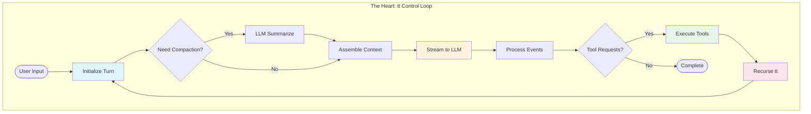
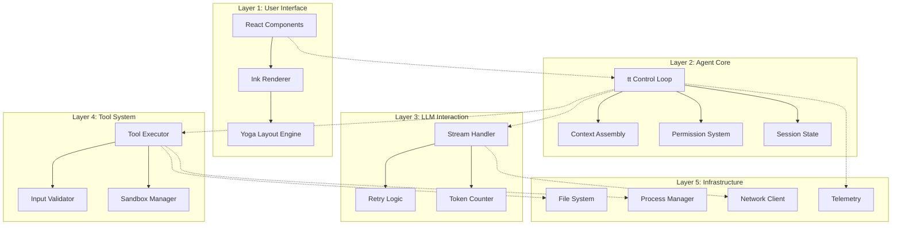

## The `tt` Control Loop: The Beating Heart

The entire Claude Code system revolves around a single async generator function called `tt`. This function orchestrates every interaction, from user input to LLM communication to tool execution. Let's dissect this remarkable piece of engineering:

```tsx
// The actual tt function signature from the codebase
async function* tt(
  currentMessages: CliMessage[],         // Full conversation history
  baseSystemPromptString: string,        // Static system instructions
  currentGitContext: GitContext,         // Real-time git state
  currentClaudeMdContents: ClaudeMdContent[], // Project context
  permissionGranterFn: PermissionGranter, // Permission callback
  toolUseContext: ToolUseContext,         // Shared execution context
  activeStreamingToolUse?: ToolUseBlock,  // Resume streaming state
  loopState: {
    turnId: string,        // UUID for this turn
    turnCounter: number,   // Recursion depth tracker
    compacted?: boolean,   // History compression flag
    isResuming?: boolean   // Resume from saved state
  }
): AsyncGenerator<CliMessage, void, void>

```

This signature reveals the sophisticated state management at play. The function yields `CliMessage` objects that drive UI updates while maintaining conversation flow. Let's examine each phase:

### Phase 1: Turn Initialization & Context Preparation

```tsx
{
  // Signal UI that processing has begun
  yield {
    type: "ui_state_update",
    uuid: `uistate-${loopState.turnId}-${Date.now()}`,
    timestamp: new Date().toISOString(),
    data: { status: "thinking", turnId: loopState.turnId }
  };

  // Check context window pressure
  let messagesForLlm = currentMessages;
  let wasCompactedThisIteration = false;

  if (await shouldAutoCompact(currentMessages)) {
    yield {
      type: "ui_notification",
      data: { message: "Context is large, attempting to compact..." }
    };

    try {
      const compactionResult = await compactAndStoreConversation(
        currentMessages,
        toolUseContext,
        true
      );
      messagesForLlm = compactionResult.messagesAfterCompacting;
      wasCompactedThisIteration = true;
      loopState.compacted = true;

      yield createSystemNotificationMessage(
        `Conversation history automatically compacted. Summary: ${
          compactionResult.summaryMessage.message.content[0].text
        }`
      );
    } catch (compactionError) {
      yield createSystemErrorMessage(
        `Failed to compact conversation: ${compactionError.message}`
      );
    }
  }
}

```

**Performance Profile of Phase 1**:

| Operation | Typical Duration | Complexity |
| --- | --- | --- |
| Token counting | 10-50ms | O(n) messages |
| Compaction decision | <1ms | O(1) |
| LLM summarization | 2000-3000ms | One LLM call |
| Message reconstruction | 5-10ms | O(n) messages |

### Phase 2: Dynamic System Prompt Assembly

The system prompt isn't static—it's assembled fresh for each turn:

```tsx
{
  // Parallel fetch of all context sources
  const [toolSpecs, dirStructure] = await Promise.all([
    // Convert tool definitions to LLM-compatible specs
    Promise.all(
      toolUseContext.options.tools
        .filter(tool => tool.isEnabled ? tool.isEnabled() : true)
        .map(async (tool) => convertToolDefinitionToToolSpecification(tool, toolUseContext))
    ),
    // Get current directory structure
    getDirectoryStructureSnapshot(toolUseContext)
  ]);

  // Assemble the complete system prompt
  const systemPromptForLlm = assembleSystemPrompt(
    baseSystemPromptString,      // Core instructions
    currentClaudeMdContents,     // Project-specific context
    currentGitContext,           // Git status/branch/commits
    dirStructure,                // File tree
    toolSpecs                    // Available tools
  );

  // Prepare messages with cache control
  const apiMessages = prepareMessagesForApi(
    messagesForLlm,
    true // applyEphemeralCacheControl
  );
}

```

The assembly process follows a strict priority order:

```
Priority 1: Base Instructions (~2KB)
    ↓
Priority 2: Model-Specific Adaptations (~500B)
    ↓
Priority 3: CLAUDE.md Content (Variable, typically 5-50KB)
    ↓
Priority 4: Git Context (~1-5KB)
    ↓
Priority 5: Directory Structure (Truncated to fit)
    ↓
Priority 6: Tool Specifications (~10-20KB)

```

### Phase 3: LLM Stream Initialization

```tsx
{
  // Initialize streaming call
  const llmStream = callLlmStreamApi(
    apiMessages,
    systemPromptForLlm,
    toolSpecificationsForLlm,
    toolUseContext.options.mainLoopModel,
    toolUseContext.abortController.signal
  );

  // Initialize accumulators for streaming response
  let accumulatedAssistantMessage: Partial<CliMessage> & {
    message: Partial<ApiMessage> & { content: ContentBlock[] }
  } = {
    type: "assistant",
    uuid: `assistant-${loopState.turnId}-${loopState.turnCounter}-${Date.now()}`,
    timestamp: new Date().toISOString(),
    message: { role: "assistant", content: [] }
  };

  let currentToolUsesFromLlm: ToolUseBlock[] = [];
  let currentThinkingContent: string = "";
  let currentToolInputJsonBuffer: string = "";
}

```

### Phase 4: Stream Event Processing State Machine

This is where the magic happens—processing streaming events in real-time:

```tsx
{
  for await (const streamEvent of llmStream) {
    // Abort check
    if (toolUseContext.abortController.signal.aborted) {
      yield createSystemNotificationMessage("LLM stream processing aborted by user.");
      return;
    }

    switch (streamEvent.type) {
      case "message_start":
        accumulatedAssistantMessage.message.id = streamEvent.message.id;
        accumulatedAssistantMessage.message.model = streamEvent.message.model;
        accumulatedAssistantMessage.message.usage = streamEvent.message.usage;
        yield {
          type: "ui_state_update",
          data: {
            status: "assistant_responding",
            model: streamEvent.message.model
          }
        };
        break;

      case "content_block_start":
        const newBlockPlaceholder = { ...streamEvent.content_block };

        // Initialize empty content based on block type
        if (streamEvent.content_block.type === "thinking") {
          currentThinkingContent = "";
          newBlockPlaceholder.thinking = "";
        } else if (streamEvent.content_block.type === "tool_use") {
          currentToolInputJsonBuffer = "";
          newBlockPlaceholder.input = "";
        } else if (streamEvent.content_block.type === "text") {
          newBlockPlaceholder.text = "";
        }

        accumulatedAssistantMessage.message.content.push(newBlockPlaceholder);
        break;

      case "content_block_delta":
        const lastBlockIndex = accumulatedAssistantMessage.message.content.length - 1;
        if (lastBlockIndex < 0) continue;

        const currentBlock = accumulatedAssistantMessage.message.content[lastBlockIndex];

        if (streamEvent.delta.type === "text_delta" && currentBlock.type === "text") {
          currentBlock.text += streamEvent.delta.text;
          yield {
            type: "ui_text_delta",
            data: {
              textDelta: streamEvent.delta.text,
              blockIndex: lastBlockIndex
            }
          };
        } else if (streamEvent.delta.type === "input_json_delta" && currentBlock.type === "tool_use") {
          currentToolInputJsonBuffer += streamEvent.delta.partial_json;
          currentBlock.input = currentToolInputJsonBuffer;

          // Try parsing incomplete JSON for preview
          const parseAttempt = tryParsePartialJson(currentToolInputJsonBuffer);
          if (parseAttempt.complete) {
            yield {
              type: "ui_tool_preview",
              data: {
                toolId: currentBlock.id,
                preview: parseAttempt.value
              }
            };
          }
        }
        break;

      case "content_block_stop":
        const completedBlock = accumulatedAssistantMessage.message.content[streamEvent.index];

        if (completedBlock.type === "tool_use") {
          try {
            const parsedInput = JSON.parse(currentToolInputJsonBuffer);
            completedBlock.input = parsedInput;
            currentToolUsesFromLlm.push({
              type: "tool_use",
              id: completedBlock.id,
              name: completedBlock.name,
              input: parsedInput
            });
          } catch (e) {
            // Handle malformed JSON from LLM
            completedBlock.input = {
              error: "Invalid JSON input from LLM",
              raw_json_string: currentToolInputJsonBuffer,
              parse_error: e.message
            };
          }
          currentToolInputJsonBuffer = "";
        }

        yield {
          type: "ui_content_block_complete",
          data: { block: completedBlock, blockIndex: streamEvent.index }
        };
        break;

      case "message_stop":
        // LLM generation complete
        const finalAssistantMessage = finalizeCliMessage(
          accumulatedAssistantMessage,
          loopState.turnId,
          loopState.turnCounter
        );
        yield finalAssistantMessage;

        // Move to Phase 5 or 6...
        break;
    }
  }
}

```

**Stream Processing Performance**:

- First token latency: 300-800ms (varies by model)
- Token throughput: 50-100 tokens/second
- UI update frequency: Every token for text, batched for tool inputs
- Memory usage: Constant regardless of response length

### Phase 5: Tool Execution Orchestration

When the LLM requests tool use, the architecture shifts into execution mode:

```tsx
{
  if (finalAssistantMessage.message.stop_reason === "tool_use" &&
      currentToolUsesFromLlm.length > 0) {

    yield { type: "ui_state_update", data: { status: "executing_tools" } };
    let toolResultMessages: CliMessage[] = [];

    // Process tools with intelligent batching
    for await (const toolOutcomeMessage of processToolCallsInParallelBatches(
      currentToolUsesFromLlm,
      finalAssistantMessage,
      permissionGranterFn,
      toolUseContext
    )) {
      yield toolOutcomeMessage;

      if (toolOutcomeMessage.type === 'user' && toolOutcomeMessage.isMeta) {
        toolResultMessages.push(toolOutcomeMessage);
      }
    }

    // Check for abort during tool execution
    if (toolUseContext.abortController.signal.aborted) {
      yield createSystemNotificationMessage("Tool execution aborted by user.");
      return;
    }

    // Sort results to match LLM's request order
    const sortedToolResultMessages = sortToolResultsByOriginalRequestOrder(
      toolResultMessages,
      currentToolUsesFromLlm
    );

    // Phase 6: Recurse with results
    yield* tt(
      [...messagesForLlm, finalAssistantMessage, ...sortedToolResultMessages],
      baseSystemPromptString,
      currentGitContext,
      currentClaudeMdContents,
      permissionGranterFn,
      toolUseContext,
      undefined,
      { ...loopState, turnCounter: loopState.turnCounter + 1 }
    );
    return;
  }
}

```

### Phase 6: Recursion Control

The `tt` function is tail-recursive, allowing for unlimited conversation depth (bounded by safeguards):

```tsx
// Recursion safeguards
if (loopState.turnCounter >= 10) {
  yield createSystemMessage(
    "Maximum conversation depth reached. Please start a new query."
  );
  return;
}

// Memory pressure check before recursion
const estimatedMemory = estimateConversationMemory(messagesForLlm);
if (estimatedMemory > MEMORY_THRESHOLD) {
  // Force compaction before continuing
  const compacted = await forceCompaction(messagesForLlm);
  messagesForLlm = compacted;
}

```

## The Layered Architecture

Claude Code implements a clean layered architecture where each layer has distinct responsibilities:



### Layer Communication Patterns

Communication between layers follows strict patterns:

1. **Downward Communication**: Direct function calls
2. **Upward Communication**: Events and callbacks
3. **Cross-Layer Communication**: Shared context objects

```tsx
// Example: UI to Agent Core communication
class UIToAgentBridge {
  async handleUserInput(input: string) {
    // Downward: Direct call
    const action = await pd(input, this.context);

    // Process based on action type
    switch (action.type) {
      case 'normal_prompt':
        // Start new tt loop iteration
        for await (const message of tt(...)) {
          // Upward: Yield events
          this.uiRenderer.handleMessage(message);
        }
        break;
    }
  }
}

// Example: Tool to UI communication via progress
class ToolToUIBridge {
  async *executeWithProgress(tool: ToolDefinition, input: any) {
    // Tool yields progress
    for await (const event of tool.call(input, this.context)) {
      if (event.type === 'progress') {
        // Transform to UI event
        yield {
          type: 'ui_progress',
          toolName: tool.name,
          progress: event.data
        };
      }
    }
  }
}

```

## Event-Driven & Streaming Architecture

The entire system is built on streaming primitives:

### Stream Backpressure Management

```tsx
class StreamBackpressureController {
  private queue: StreamEvent[] = [];
  private processing = false;
  private pressure = {
    high: 1000,    // Start dropping non-critical events
    critical: 5000 // Drop everything except errors
  };

  async handleEvent(event: StreamEvent) {
    this.queue.push(event);

    // Apply backpressure strategies
    if (this.queue.length > this.pressure.critical) {
      // Keep only critical events
      this.queue = this.queue.filter(e =>
        e.type === 'error' ||
        e.type === 'message_stop'
      );
    } else if (this.queue.length > this.pressure.high) {
      // Drop text deltas, keep structure
      this.queue = this.queue.filter(e =>
        e.type !== 'content_block_delta' ||
        e.delta.type !== 'text_delta'
      );
    }

    if (!this.processing) {
      await this.processQueue();
    }
  }

  private async processQueue() {
    this.processing = true;

    while (this.queue.length > 0) {
      const batch = this.queue.splice(0, 100); // Process in batches
      await this.processBatch(batch);

      // Yield to event loop
      await new Promise(resolve => setImmediate(resolve));
    }

    this.processing = false;
  }
}

```

### Progress Event Aggregation

Multiple concurrent operations need coordinated progress reporting:

```tsx
class ProgressAggregator {
  private progressStreams = new Map<string, AsyncIterator<ProgressEvent>>();

  async *aggregateProgress(
    operations: Array<{ id: string, operation: AsyncIterator<any> }>
  ): AsyncGenerator<AggregatedProgress> {
    // Start all operations
    for (const { id, operation } of operations) {
      this.progressStreams.set(id, operation);
    }

    // Poll all streams
    while (this.progressStreams.size > 0) {
      const promises = Array.from(this.progressStreams.entries()).map(
        async ([id, stream]) => {
          const { value, done } = await stream.next();
          return { id, value, done };
        }
      );

      // Race for next event
      const result = await Promise.race(promises);

      if (result.done) {
        this.progressStreams.delete(result.id);
      } else if (result.value.type === 'progress') {
        yield {
          type: 'aggregated_progress',
          source: result.id,
          progress: result.value
        };
      }
    }
  }
}

```

## State Management Architecture

Claude Code uses a pragmatic approach to state management:

### The Global Session State

```tsx
// Singleton session state with direct mutation
class SessionState {
  private static instance: SessionState;

  // Core state
  sessionId: string = crypto.randomUUID();
  cwd: string = process.cwd();
  totalCostUSD: number = 0;
  totalAPIDuration: number = 0;

  // Model usage tracking
  modelTokens: Record<string, {
    inputTokens: number;
    outputTokens: number;
    cacheReadInputTokens: number;
    cacheCreationInputTokens: number;
  }> = {};

  // Direct mutation methods
  incrementCost(amount: number) {
    this.totalCostUSD += amount;
    this.persistToDisk(); // Async, non-blocking
  }

  updateTokenUsage(model: string, usage: TokenUsage) {
    if (!this.modelTokens[model]) {
      this.modelTokens[model] = {
        inputTokens: 0,
        outputTokens: 0,
        cacheReadInputTokens: 0,
        cacheCreationInputTokens: 0
      };
    }

    const tokens = this.modelTokens[model];
    tokens.inputTokens += usage.input_tokens || 0;
    tokens.outputTokens += usage.output_tokens || 0;
    tokens.cacheReadInputTokens += usage.cache_read_input_tokens || 0;
    tokens.cacheCreationInputTokens += usage.cache_creation_input_tokens || 0;
  }

  private async persistToDisk() {
    // Debounced write to avoid excessive I/O
    clearTimeout(this.persistTimer);
    this.persistTimer = setTimeout(async () => {
      await fs.writeFile(
        '.claude/session.json',
        JSON.stringify(this, null, 2)
      );
    }, 1000);
  }
}

```

### File State with Weak References

```tsx
class ReadFileState {
  private cache = new Map<string, WeakRef<FileContent>>();
  private registry = new FinalizationRegistry((path: string) => {
    // Cleanup when FileContent is garbage collected
    this.cache.delete(path);
  });

  set(path: string, content: FileContent) {
    const ref = new WeakRef(content);
    this.cache.set(path, ref);
    this.registry.register(content, path);
  }

  get(path: string): FileContent | undefined {
    const ref = this.cache.get(path);
    if (ref) {
      const content = ref.deref();
      if (!content) {
        // Content was garbage collected
        this.cache.delete(path);
        return undefined;
      }
      return content;
    }
  }

  checkFreshness(path: string): 'fresh' | 'stale' | 'unknown' {
    const cached = this.get(path);
    if (!cached) return 'unknown';

    const stats = fs.statSync(path);
    if (stats.mtimeMs !== cached.timestamp) {
      return 'stale';
    }

    return 'fresh';
  }
}

```

## Security Architecture

Security is implemented through multiple independent layers:

### Layer 1: Permission System

```tsx
class PermissionEvaluator {
  private ruleCache = new Map<string, CompiledRule>();

  async evaluate(
    tool: ToolDefinition,
    input: any,
    context: ToolPermissionContext
  ): Promise<PermissionDecision> {
    // Priority order evaluation
    const scopes: PermissionRuleScope[] = [
      'cliArg',         // Highest: command line
      'localSettings',  // Project-specific overrides
      'projectSettings',// Shared project rules
      'policySettings', // Organization policies
      'userSettings'    // Lowest: user preferences
    ];

    for (const scope of scopes) {
      const decision = await this.evaluateScope(
        tool, input, context, scope
      );

      if (decision.behavior !== 'continue') {
        return decision;
      }
    }

    // No matching rule - ask user
    return {
      behavior: 'ask',
      suggestions: this.generateSuggestions(tool, input)
    };
  }

  private compileRule(rule: string): CompiledRule {
    if (this.ruleCache.has(rule)) {
      return this.ruleCache.get(rule)!;
    }

    // Parse rule syntax: ToolName(glob/pattern)
    const match = rule.match(/^(\\w+)(?:\\((.+)\\))?$/);
    if (!match) throw new Error(`Invalid rule: ${rule}`);

    const [, toolPattern, pathPattern] = match;

    const compiled = {
      toolMatcher: new RegExp(
        `^${toolPattern.replace('*', '.*')}$`
      ),
      pathMatcher: pathPattern
        ? picomatch(pathPattern)
        : null
    };

    this.ruleCache.set(rule, compiled);
    return compiled;
  }
}

```

### Layer 2: Sandbox Architecture

```tsx
// macOS sandbox implementation
class MacOSSandboxManager {
  generateProfile(
    command: string,
    restrictions: SandboxRestrictions
  ): string {
    const profile = `
(version 1)
(deny default)

; Base permissions
(allow process-exec (literal "/bin/bash"))
(allow process-exec (literal "/usr/bin/env"))

; File system access
${restrictions.allowRead ? '(allow file-read*)' : '(deny file-read*)'}
${restrictions.allowWrite ? '(allow file-write*)' : '(deny file-write*)'}

; Network access
${restrictions.allowNetwork ? `
(allow network-outbound)
(allow network-inbound)
` : `
(deny network*)
`}

; System operations
(allow sysctl-read)
(allow mach-lookup)

; Temporary files
(allow file-write* (subpath "/tmp"))
(allow file-write* (subpath "/var/tmp"))
    `.trim();

    return profile;
  }

  async executeSandboxed(
    command: string,
    profile: string
  ): Promise<ExecutionResult> {
    // Write profile to temporary file
    const profilePath = await this.writeTemporaryProfile(profile);

    try {
      // Execute with sandbox-exec
      const result = await exec(
        `sandbox-exec -p '${profilePath}' ${command}`
      );

      return result;
    } finally {
      // Cleanup
      await fs.unlink(profilePath);
    }
  }
}

```

### Layer 3: Path Validation

```tsx
class PathValidator {
  private boundaries: Set<string>;
  private deniedPatterns: RegExp[];

  constructor(context: SecurityContext) {
    this.boundaries = new Set([
      context.projectRoot,
      ...context.additionalWorkingDirectories
    ]);

    this.deniedPatterns = [
      /\\/\\.(ssh|gnupg)\\//,     // SSH/GPG keys
      /\\/(etc|sys|proc)\\//,    // System directories
      /\\.pem$|\\.key$/,         // Private keys
      /\\.(env|envrc)$/         // Environment files
    ];
  }

  validate(requestedPath: string): ValidationResult {
    const absolute = path.resolve(requestedPath);

    // Check boundaries
    const inBoundary = Array.from(this.boundaries).some(
      boundary => absolute.startsWith(boundary)
    );

    if (!inBoundary) {
      return {
        allowed: false,
        reason: 'Path outside allowed directories'
      };
    }

    // Check denied patterns
    for (const pattern of this.deniedPatterns) {
      if (pattern.test(absolute)) {
        return {
          allowed: false,
          reason: `Path matches denied pattern: ${pattern}`
        };
      }
    }

    return { allowed: true };
  }
}

```

## Performance Architecture

### ANR (Application Not Responding) Detection

The ANR system uses a worker thread to monitor the main event loop:

```tsx
// Worker thread script (embedded as base64)
const anrWorkerScript = `
const { parentPort } = require('worker_threads');

let config = { anrThreshold: 5000, captureStackTrace: false };
let lastPing = Date.now();
let anrTimer = null;

function checkANR() {
  const elapsed = Date.now() - lastPing;

  if (elapsed > config.anrThreshold) {
    // Main thread is not responding
    parentPort.postMessage({
      type: 'anr',
      payload: {
        elapsed,
        stackTrace: config.captureStackTrace
          ? captureMainThreadStack()
          : null
      }
    });
  }

  // Schedule next check
  anrTimer = setTimeout(checkANR, 100);
}

async function captureMainThreadStack() {
  // Use inspector protocol if available
  try {
    const { Session } = require('inspector');
    const session = new Session();
    session.connect();

    const { result } = await session.post('Debugger.enable');
    const stack = await session.post('Debugger.getStackTrace');

    session.disconnect();
    return stack;
  } catch (e) {
    return null;
  }
}

parentPort.on('message', (msg) => {
  if (msg.type === 'config') {
    config = msg.payload;
    lastPing = Date.now();
    checkANR(); // Start monitoring
  } else if (msg.type === 'ping') {
    lastPing = Date.now();
  }
});
`;

// Main thread ANR integration
class ANRMonitor {
  private worker: Worker;
  private pingInterval: NodeJS.Timer;

  constructor(options: ANROptions = {}) {
    // Create worker from embedded script
    this.worker = new Worker(anrWorkerScript, { eval: true });

    // Configure worker
    this.worker.postMessage({
      type: 'config',
      payload: {
        anrThreshold: options.threshold || 5000,
        captureStackTrace: options.captureStackTrace !== false
      }
    });

    // Start heartbeat
    this.pingInterval = setInterval(() => {
      this.worker.postMessage({ type: 'ping' });
    }, options.pollInterval || 50);

    // Handle ANR detection
    this.worker.on('message', (msg) => {
      if (msg.type === 'anr') {
        this.handleANR(msg.payload);
      }
    });
  }

  private handleANR(data: ANRData) {
    // Log to telemetry
    Sentry.captureException(new Error(
      `Application not responding for ${data.elapsed}ms`
    ), {
      extra: {
        stackTrace: data.stackTrace,
        eventLoopDelay: this.getEventLoopDelay()
      }
    });
  }
}

```

### Strategic Caching Layers

```tsx
class CacheArchitecture {
  // L1: In-memory caches
  private schemaCache = new LRUCache<string, JSONSchema>(100);
  private patternCache = new LRUCache<string, CompiledPattern>(500);
  private gitContextCache = new TTLCache<string, GitContext>(30_000); // 30s TTL

  // L2: Weak reference caches
  private fileContentCache = new WeakRefCache<FileContent>();

  // L3: Disk caches
  private diskCache = new DiskCache('.claude/cache');

  async get<T>(
    key: string,
    generator: () => Promise<T>,
    options: CacheOptions = {}
  ): Promise<T> {
    // Check L1
    if (this.schemaCache.has(key)) {
      return this.schemaCache.get(key) as T;
    }

    // Check L2
    const weakRef = this.fileContentCache.get(key);
    if (weakRef) {
      return weakRef as T;
    }

    // Check L3
    if (options.persistent) {
      const diskValue = await this.diskCache.get(key);
      if (diskValue) {
        return diskValue;
      }
    }

    // Generate and cache
    const value = await generator();

    // Store in appropriate cache
    if (options.weak) {
      this.fileContentCache.set(key, value);
    } else if (options.persistent) {
      await this.diskCache.set(key, value, options.ttl);
    } else {
      this.schemaCache.set(key, value as any);
    }

    return value;
  }
}

```

## Telemetry & Observability Design

The three-pillar approach provides comprehensive visibility:

### Pillar 1: Error Tracking (Sentry)

```tsx
class ErrorBoundary {
  static wrap<T extends (...args: any[]) => any>(
    fn: T,
    context: ErrorContext
  ): T {
    return (async (...args: Parameters<T>) => {
      const span = Sentry.startTransaction({
        name: context.operation,
        op: context.category
      });

      try {
        const result = await fn(...args);
        span.setStatus('ok');
        return result;
      } catch (error) {
        span.setStatus('internal_error');

        Sentry.captureException(error, {
          contexts: {
            operation: context,
            state: this.captureState()
          },
          fingerprint: this.generateFingerprint(error, context)
        });

        throw error;
      } finally {
        span.finish();
      }
    }) as T;
  }

  private static captureState() {
    return {
      sessionId: SessionState.instance.sessionId,
      conversationDepth: /* current depth */,
      activeTools: /* currently executing */,
      memoryUsage: process.memoryUsage(),
      eventLoopDelay: this.getEventLoopDelay()
    };
  }
}

```

### Pillar 2: Metrics (OpenTelemetry)

```tsx
class MetricsCollector {
  private meters = {
    api: meter.createCounter('api_calls_total'),
    tokens: meter.createHistogram('token_usage'),
    tools: meter.createHistogram('tool_execution_duration'),
    streaming: meter.createHistogram('streaming_latency')
  };

  recordApiCall(result: ApiCallResult) {
    this.meters.api.add(1, {
      model: result.model,
      status: result.status,
      provider: result.provider
    });

    this.meters.tokens.record(result.totalTokens, {
      model: result.model,
      type: 'total'
    });
  }

  recordToolExecution(tool: string, duration: number, success: boolean) {
    this.meters.tools.record(duration, {
      tool,
      success: String(success),
      concurrent: /* was parallel? */
    });
  }
}

```

### Pillar 3: Feature Flags (Statsig)

```tsx
class FeatureManager {
  async checkGate(
    gate: string,
    context?: FeatureContext
  ): Promise<boolean> {
    return statsig.checkGate(gate, {
      userID: SessionState.instance.sessionId,
      custom: {
        model: context?.model,
        toolsEnabled: context?.tools,
        platform: process.platform
      }
    });
  }

  async getConfig<T>(
    config: string,
    defaultValue: T
  ): Promise<T> {
    const dynamicConfig = statsig.getConfig(config);
    return dynamicConfig.get('value', defaultValue);
  }
}

```

## Resource Management

### Process Lifecycle Management

```tsx
class ProcessManager {
  private processes = new Map<string, ChildProcess>();
  private limits = {
    maxProcesses: 10,
    maxMemoryPerProcess: 512 * 1024 * 1024, // 512MB
    maxTotalMemory: 2 * 1024 * 1024 * 1024  // 2GB
  };

  async spawn(
    id: string,
    command: string,
    options: SpawnOptions
  ): Promise<ManagedProcess> {
    // Check limits
    if (this.processes.size >= this.limits.maxProcesses) {
      await this.killOldestProcess();
    }

    const child = spawn('bash', ['-c', command], {
      ...options,
      // Resource limits
      env: {
        ...options.env,
        NODE_OPTIONS: `--max-old-space-size=${this.limits.maxMemoryPerProcess / 1024 / 1024}`
      }
    });

    // Monitor resources
    const monitor = setInterval(() => {
      this.checkProcessHealth(id, child);
    }, 1000);

    this.processes.set(id, child);

    return new ManagedProcess(child, monitor);
  }

  private async checkProcessHealth(id: string, proc: ChildProcess) {
    try {
      const usage = await pidusage(proc.pid);

      if (usage.memory > this.limits.maxMemoryPerProcess) {
        console.warn(`Process ${id} exceeding memory limit`);
        proc.kill('SIGTERM');
      }
    } catch (e) {
      // Process might have exited
      this.processes.delete(id);
    }
  }
}

```

### Network Connection Pooling

```tsx
class NetworkPool {
  private pools = new Map<string, ConnectionPool>();

  getPool(provider: string): ConnectionPool {
    if (!this.pools.has(provider)) {
      this.pools.set(provider, new ConnectionPool({
        maxConnections: provider === 'anthropic' ? 10 : 5,
        maxIdleTime: 30_000,
        keepAlive: true
      }));
    }

    return this.pools.get(provider)!;
  }

  async request(
    provider: string,
    options: RequestOptions
  ): Promise<Response> {
    const pool = this.getPool(provider);
    const connection = await pool.acquire();

    try {
      return await connection.request(options);
    } finally {
      pool.release(connection);
    }
  }
}

```

---

*This architecture analysis is based on reverse engineering and decompilation. The actual implementation may vary. The patterns presented represent inferred architectural decisions based on observable behavior and common practices in high-performance Node.js applications.*