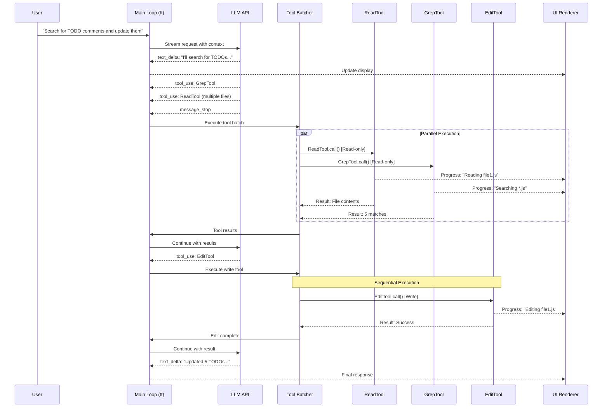
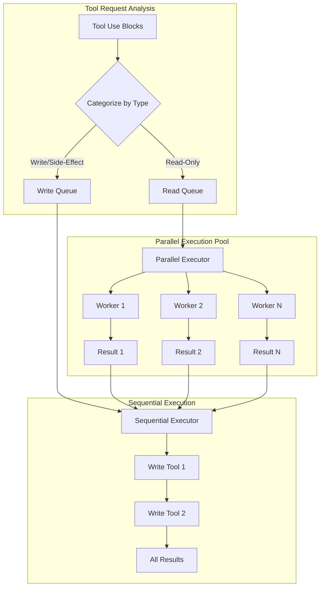
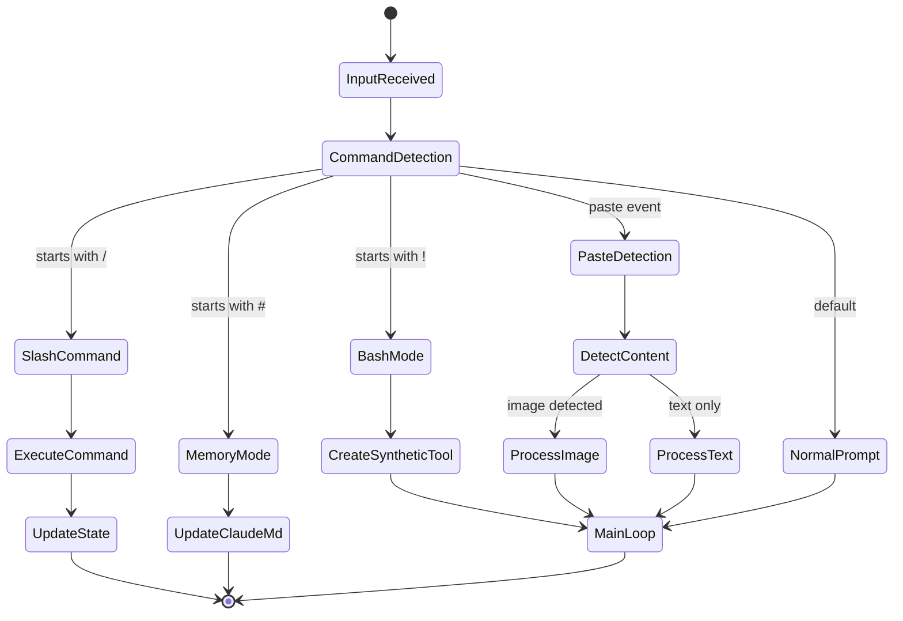
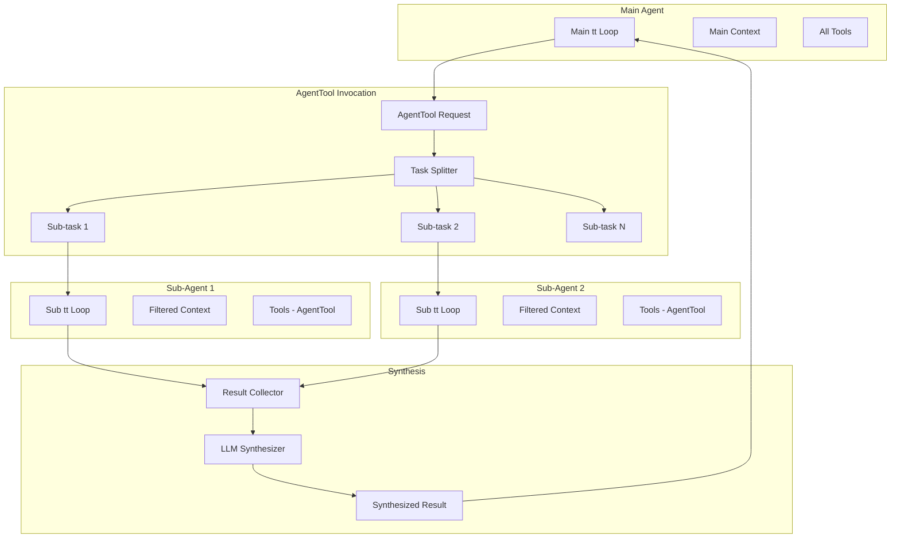

## The Main Conversation Loop: A Streaming State Machine

The heart of Claude Code is the `tt` async generator function—a sophisticated state machine that orchestrates the entire conversation flow. Let's examine its actual structure:

```tsx
// Reconstructed main loop signature with timing annotations
async function* tt(
  currentMessages: CliMessage[],         // Full history - Memory: O(conversation_length)
  baseSystemPromptString: string,        // Static prompt - ~2KB
  currentGitContext: GitContext,         // Git state - ~1-5KB typically
  currentClaudeMdContents: ClaudeMdContent[], // Project context - ~5-50KB
  permissionGranterFn: PermissionGranter, // Permission callback
  toolUseContext: ToolUseContext,         // Shared context - ~10KB
  activeStreamingToolUse?: ToolUseBlock,  // Resume state
  loopState: {
    turnId: string,        // UUID for this turn
    turnCounter: number,   // Recursion depth
    compacted?: boolean,   // Was history compressed?
    isResuming?: boolean   // Resuming from save?
  }
): AsyncGenerator<CliMessage, void, void> {
  // ┌─ PHASE 1: Context Preparation [~50-200ms]
  // ├─ PHASE 2: Auto-compaction Check [~0-3000ms if triggered]
  // ├─ PHASE 3: System Prompt Assembly [~10-50ms]
  // ├─ PHASE 4: LLM Stream Processing [~2000-10000ms]
  // ├─ PHASE 5: Tool Execution [~100-30000ms per tool]
  // └─ PHASE 6: Recursion or Completion [~0ms]
}

```

### Phase 1: Context Window Management

The first critical decision in the control flow is whether the conversation needs compaction:

```tsx
// Auto-compaction logic (inferred implementation)
class ContextCompactionController {
  private static readonly COMPACTION_THRESHOLDS = {
    tokenCount: 100_000,      // Aggressive token limit
    messageCount: 200,        // Message count fallback
    costThreshold: 5.00       // Cost-based trigger
  };

  static async shouldCompact(
    messages: CliMessage[],
    model: string
  ): Promise<boolean> {
    // Fast path: check message count first
    if (messages.length < 50) return false;

    // Expensive path: count tokens
    const tokenCount = await this.estimateTokens(messages, model);

    return tokenCount > this.COMPACTION_THRESHOLDS.tokenCount ||
           messages.length > this.COMPACTION_THRESHOLDS.messageCount;
  }

  static async compact(
    messages: CliMessage[],
    context: ToolUseContext
  ): Promise<CompactionResult> {
    // Phase 1: Identify messages to preserve
    const preserve = this.identifyPreservedMessages(messages);

    // Phase 2: Generate summary via LLM
    const summary = await this.generateSummary(
      messages.filter(m => !preserve.has(m.uuid)),
      context
    );

    // Phase 3: Reconstruct message history
    return {
      messages: [
        this.createSummaryMessage(summary),
        ...messages.filter(m => preserve.has(m.uuid))
      ],
      tokensaved: this.calculateSavings(messages, summary)
    };
  }
}

```

**Performance Characteristics**:

- Token counting: O(n) where n is total message content length
- Summary generation: One additional LLM call (~2-3s)
- Memory impact: Temporarily doubles message storage during compaction

### Phase 2: Dynamic System Prompt Assembly

The system prompt assembly reveals a sophisticated caching and composition strategy:

```tsx
// System prompt composition pipeline
class SystemPromptAssembler {
  private static cache = new Map<string, {
    content: string,
    hash: string,
    expiry: number
  }>();

  static async assemble(
    basePrompt: string,
    claudeMd: ClaudeMdContent[],
    gitContext: GitContext,
    tools: ToolDefinition[],
    model: string
  ): Promise<string | ContentBlock[]> {
    // Parallel fetch of dynamic components
    const [
      claudeMdSection,
      gitSection,
      directorySection,
      toolSection
    ] = await Promise.all([
      this.formatClaudeMd(claudeMd),
      this.formatGitContext(gitContext),
      this.getDirectoryStructure(),
      this.formatToolDefinitions(tools)
    ]);

    // Model-specific adaptations
    const modelSection = this.getModelAdaptations(model);

    // Compose with smart truncation
    return this.compose({
      base: basePrompt,           // Priority 1
      model: modelSection,        // Priority 2
      claudeMd: claudeMdSection,  // Priority 3
      git: gitSection,           // Priority 4
      directory: directorySection, // Priority 5
      tools: toolSection         // Priority 6
    });
  }

  private static getModelAdaptations(model: string): string {
    // Model-specific prompt engineering
    const adaptations = {
      'claude-3-opus': {
        style: 'detailed',
        instructions: 'Think step by step. Show your reasoning.',
        tokenBudget: 0.3  // 30% of context for reasoning
      },
      'claude-3-sonnet': {
        style: 'balanced',
        instructions: 'Be concise but thorough.',
        tokenBudget: 0.2
      },
      'claude-3-haiku': {
        style: 'brief',
        instructions: 'Get to the point quickly.',
        tokenBudget: 0.1
      }
    };

    const config = adaptations[model] || adaptations['claude-3-sonnet'];
    return this.formatModelInstructions(config);
  }
}

```

### Phase 3: The Streaming State Machine

The LLM streaming phase implements a complex event-driven state machine:

```tsx
// Stream event processing state machine
class StreamEventProcessor {
  private state: {
    phase: 'idle' | 'message_start' | 'content' | 'tool_input' | 'complete';
    currentMessage: Partial<CliMessage>;
    contentBlocks: ContentBlock[];
    activeToolInput?: {
      toolId: string;
      buffer: string;
      parser: StreamingToolInputParser;
    };
    metrics: {
      firstTokenLatency?: number;
      tokensPerSecond: number[];
    };
  };

  async *processStream(
    stream: AsyncIterable<StreamEvent>
  ): AsyncGenerator<UIEvent | CliMessage> {
    for await (const event of stream) {
      switch (event.type) {
        case 'message_start':
          this.state.phase = 'message_start';
          this.state.metrics.firstTokenLatency = Date.now() - startTime;
          yield { type: 'ui_state', data: { status: 'assistant_responding' } };
          break;

        case 'content_block_start':
          yield* this.handleContentBlockStart(event);
          break;

        case 'content_block_delta':
          yield* this.handleContentBlockDelta(event);
          break;

        case 'content_block_stop':
          yield* this.handleContentBlockStop(event);
          break;

        case 'message_stop':
          yield* this.finalizeMessage(event);
          break;

        case 'error':
          yield* this.handleError(event);
          break;
      }
    }
  }

  private async *handleContentBlockDelta(
    event: ContentBlockDeltaEvent
  ): AsyncGenerator<UIEvent> {
    const block = this.state.contentBlocks[event.index];

    switch (event.delta.type) {
      case 'text_delta':
        // Direct UI update for text
        block.text += event.delta.text;
        yield {
          type: 'ui_text_delta',
          data: {
            text: event.delta.text,
            blockIndex: event.index
          }
        };
        break;

      case 'input_json_delta':
        // Accumulate JSON for tool input
        if (this.state.activeToolInput) {
          this.state.activeToolInput.buffer += event.delta.partial_json;

          // Try parsing at strategic points
          if (event.delta.partial_json.includes('}') ||
              event.delta.partial_json.includes(']')) {
            const result = this.state.activeToolInput.parser.addChunk(
              event.delta.partial_json
            );

            if (result.complete) {
              block.input = result.value;
              yield {
                type: 'ui_tool_preview',
                data: {
                  toolId: this.state.activeToolInput.toolId,
                  input: result.value
                }
              };
            }
          }
        }
        break;
    }
  }
}

```

### Phase 4: The Tool Execution Pipeline

The tool execution system implements a sophisticated parallel/sequential execution strategy:



```tsx
// The parallel execution orchestrator
class ToolExecutionOrchestrator {
  private static readonly CONCURRENCY_LIMIT = 10;

  static async *executeToolBatch(
    toolUses: ToolUseBlock[],
    context: ToolUseContext,
    permissionFn: PermissionGranter
  ): AsyncGenerator<CliMessage> {
    // Phase 1: Categorize tools
    const { readOnly, writeTools } = this.categorizeTools(toolUses);

    // Phase 2: Execute read-only tools in parallel
    if (readOnly.length > 0) {
      yield* this.executeParallel(readOnly, context, permissionFn);
    }

    // Phase 3: Execute write tools sequentially
    for (const tool of writeTools) {
      yield* this.executeSequential(tool, context, permissionFn);
    }
  }

  private static async *executeParallel(
    tools: ToolUseBlock[],
    context: ToolUseContext,
    permissionFn: PermissionGranter
  ): AsyncGenerator<CliMessage> {
    const executions = tools.map(tool =>
      this.createToolExecution(tool, context, permissionFn)
    );

    // Custom parallel map with backpressure
    yield* parallelMap(executions, this.CONCURRENCY_LIMIT);
  }
}

// The parallelMap implementation
async function* parallelMap<T>(
  generators: AsyncGenerator<T>[],
  concurrency: number
): AsyncGenerator<T> {
  const executing = new Set<Promise<IteratorResult<T>>>();
  const pending = [...generators];

  // Fill initial slots
  while (executing.size < concurrency && pending.length > 0) {
    const gen = pending.shift()!;
    executing.add(gen.next());
  }

  while (executing.size > 0) {
    // Race for next completion
    const result = await Promise.race(executing);
    executing.delete(result as any);

    if (!result.done) {
      // Yield the value
      yield result.value;

      // Continue this generator
      const nextPromise = result.generator.next();
      executing.add(nextPromise);
    }

    // Fill empty slot if available
    if (executing.size < concurrency && pending.length > 0) {
      const gen = pending.shift()!;
      executing.add(gen.next());
    }
  }
}

```

**Execution Timing Analysis**:

| Tool Type | Concurrency | Typical Latency | Bottleneck |
| --- | --- | --- | --- |
| ReadTool | Parallel (10) | 10-50ms | Disk I/O |
| GrepTool | Parallel (10) | 100-500ms | CPU regex |
| WebFetchTool | Parallel (3) | 500-3000ms | Network |
| EditTool | Sequential | 20-100ms | Validation |
| BashTool | Sequential | 50-10000ms | Process exec |
| AgentTool | Parallel (5) | 2000-20000ms | Sub-LLM calls |

### Phase 5: Permission Control Flow

The permission system implements a multi-level decision tree:

```tsx
// Permission decision flow
class PermissionController {
  static async checkPermission(
    tool: ToolDefinition,
    input: any,
    context: ToolPermissionContext
  ): Promise<PermissionDecision> {
    // Level 1: Check explicit deny rules (highest priority)
    const denyRule = this.findMatchingRule(
      tool,
      input,
      context.alwaysDenyRules
    );
    if (denyRule) {
      return { behavior: 'deny', reason: denyRule };
    }

    // Level 2: Check mode overrides
    if (context.mode === 'bypassPermissions') {
      return { behavior: 'allow', reason: 'bypass_mode' };
    }

    if (context.mode === 'acceptEdits' &&
        this.isEditTool(tool) &&
        this.isPathSafe(input.path)) {
      return { behavior: 'allow', reason: 'accept_edits_mode' };
    }

    // Level 3: Check explicit allow rules
    const allowRule = this.findMatchingRule(
      tool,
      input,
      context.alwaysAllowRules
    );
    if (allowRule) {
      return { behavior: 'allow', reason: allowRule };
    }

    // Level 4: Interactive prompt
    return {
      behavior: 'ask',
      suggestions: this.generateRuleSuggestions(tool, input)
    };
  }

  private static findMatchingRule(
    tool: ToolDefinition,
    input: any,
    rules: Record<PermissionRuleScope, string[]>
  ): string | null {
    // Priority order: cliArg > localSettings > projectSettings > ...
    const scopes: PermissionRuleScope[] = [
      'cliArg', 'localSettings', 'projectSettings',
      'policySettings', 'userSettings'
    ];

    for (const scope of scopes) {
      const scopeRules = rules[scope] || [];
      for (const rule of scopeRules) {
        if (this.matchesRule(tool, input, rule)) {
          return `${scope}:${rule}`;
        }
      }
    }

    return null;
  }
}

```

### Phase 6: Recursive Turn Management

The control flow implements tail recursion for multi-turn interactions:

```tsx
// Recursion control and state management
class TurnController {
  static async *manageTurn(
    messages: CliMessage[],
    toolResults: CliMessage[],
    context: FullContext,
    loopState: LoopState
  ): AsyncGenerator<CliMessage> {
    // Check recursion depth
    if (loopState.turnCounter >= 10) {
      yield this.createSystemMessage(
        "Maximum conversation depth reached. Please start a new query."
      );
      return;
    }

    // Prepare next turn state
    const nextState = {
      ...loopState,
      turnCounter: loopState.turnCounter + 1,
      compacted: false  // Reset compaction flag
    };

    // Merge messages for next turn
    const nextMessages = [
      ...messages,
      ...toolResults.sort(this.sortByToolRequestOrder)
    ];

    // Tail recursion
    yield* tt(
      nextMessages,
      context.basePrompt,
      context.gitContext,
      context.claudeMd,
      context.permissionFn,
      context.toolContext,
      undefined,  // No active streaming tool
      nextState
    );
  }
}

```

## Advanced Control Flow Patterns

### 1. Input Router State Machine

The input processing implements a sophisticated routing system:



```tsx
// Input router implementation
class InputRouter {
  static async routeInput(
    input: string,
    context: AppContext
  ): Promise<RouterAction> {
    // Command detection with priority
    const matchers: [RegExp, InputHandler][] = [
      [/^\\/(\\w+)(.*)/, this.handleSlashCommand],
      [/^!(.+)/, this.handleBashMode],
      [/^#(.+)/, this.handleMemoryMode],
      [/^```[\\s\\S]+```$/, this.handleCodeBlock],
    ];

    for (const [pattern, handler] of matchers) {
      const match = input.match(pattern);
      if (match) {
        return handler(match, context);
      }
    }

    // Default: normal prompt
    return {
      type: 'prompt',
      message: this.createUserMessage(input)
    };
  }

  private static handleBashMode(
    match: RegExpMatchArray,
    context: AppContext
  ): RouterAction {
    const command = match[1];

    // Create synthetic assistant message with tool use
    const syntheticMessages = [
      {
        type: 'user',
        message: {
          role: 'user',
          content: `Run this command: ${command}`
        }
      },
      {
        type: 'assistant',
        message: {
          role: 'assistant',
          content: [
            {
              type: 'text',
              text: 'I\\'ll run that command for you.'
            },
            {
              type: 'tool_use',
              id: `bash_${Date.now()}`,
              name: 'BashTool',
              input: { command, sandbox: false }
            }
          ]
        }
      }
    ];

    return {
      type: 'synthetic_conversation',
      messages: syntheticMessages
    };
  }
}

```

### 2. Stream Backpressure Management

The streaming system implements sophisticated backpressure handling:

```tsx
// Backpressure control for streaming
class StreamBackpressureController {
  private buffer: Array<StreamEvent> = [];
  private pressure = {
    current: 0,
    threshold: 1000,  // Max buffered events
    paused: false
  };

  async *controlledStream(
    source: AsyncIterable<StreamEvent>
  ): AsyncGenerator<StreamEvent> {
    const iterator = source[Symbol.asyncIterator]();

    while (true) {
      // Check pressure
      if (this.pressure.current > this.pressure.threshold) {
        this.pressure.paused = true;
        await this.waitForDrain();
      }

      const { done, value } = await iterator.next();
      if (done) break;

      // Buffer management
      if (this.shouldBuffer(value)) {
        this.buffer.push(value);
        this.pressure.current++;
      } else {
        // Yield immediately for high-priority events
        yield value;
      }

      // Drain buffer periodically
      if (this.buffer.length > 0 && !this.pressure.paused) {
        yield* this.drainBuffer();
      }
    }

    // Final drain
    yield* this.drainBuffer();
  }

  private shouldBuffer(event: StreamEvent): boolean {
    // Don't buffer tool results or errors
    return event.type === 'content_block_delta' &&
           event.delta.type === 'text_delta';
  }
}

```

### 3. AgentTool Hierarchical Control Flow

The AgentTool implements a fascinating parent-child control structure:



```tsx
// AgentTool hierarchical execution
class AgentToolExecutor {
  static async *execute(
    input: AgentToolInput,
    context: ToolUseContext,
    parentMessage: CliMessage
  ): AsyncGenerator<ToolProgress | ToolResult> {
    // Phase 1: Task analysis
    const subtasks = this.analyzeTask(input.prompt);

    // Phase 2: Spawn sub-agents
    const subAgentPromises = subtasks.map(async (task, index) => {
      // Create isolated context
      const subContext = {
        ...context,
        tools: context.tools.filter(t => t.name !== 'AgentTool'),
        abortController: this.createLinkedAbort(context.abortController),
        options: {
          ...context.options,
          maxThinkingTokens: this.calculateTokenBudget(input.prompt)
        }
      };

      // Run sub-agent
      return this.runSubAgent(task, subContext, index);
    });

    // Phase 3: Parallel execution with progress
    const results: SubAgentResult[] = [];
    for await (const update of this.trackProgress(subAgentPromises)) {
      if (update.type === 'progress') {
        yield {
          type: 'progress',
          toolUseID: parentMessage.id,
          data: update
        };
      } else {
        results.push(update.result);
      }
    }

    // Phase 4: Synthesis
    const synthesized = await this.synthesizeResults(results, input);

    yield {
      type: 'result',
      data: synthesized
    };
  }

  private static async synthesizeResults(
    results: SubAgentResult[],
    input: AgentToolInput
  ): Promise<string> {
    if (results.length === 1) {
      return results[0].content;
    }

    // Multi-result synthesis via LLM
    const synthesisPrompt = `
      Synthesize these ${results.length} findings into a cohesive response:
      ${results.map((r, i) => `Finding ${i+1}:\\n${r.content}`).join('\\n\\n')}

      Original task: ${input.prompt}
    `;

    const synthesizer = new SubAgentExecutor({
      prompt: synthesisPrompt,
      model: input.model || 'claude-3-haiku',  // Fast model for synthesis
      isSynthesis: true
    });

    return synthesizer.run();
  }
}

```

### 4. Error Recovery Control Flow

The system implements sophisticated error recovery strategies:

```tsx
// Error recovery state machine
class ErrorRecoveryController {
  private static recoveryStrategies = {
    'rate_limit': this.handleRateLimit,
    'context_overflow': this.handleContextOverflow,
    'tool_error': this.handleToolError,
    'network_error': this.handleNetworkError,
    'permission_denied': this.handlePermissionDenied
  };

  static async *handleError(
    error: any,
    context: ErrorContext
  ): AsyncGenerator<CliMessage> {
    const errorType = this.classifyError(error);
    const strategy = this.recoveryStrategies[errorType];

    if (strategy) {
      yield* strategy(error, context);
    } else {
      // Generic error handling
      yield this.createErrorMessage(error);
    }
  }

  private static async *handleContextOverflow(
    error: ContextOverflowError,
    context: ErrorContext
  ): AsyncGenerator<CliMessage> {
    // Strategy 1: Try reducing max_tokens
    if (error.details.requested_tokens > 4096) {
      yield this.createSystemMessage("Reducing response size...");

      const retry = await this.retryWithReducedTokens(
        context.request,
        Math.floor(error.details.requested_tokens * 0.7)
      );

      if (retry.success) {
        yield* retry.response;
        return;
      }
    }

    // Strategy 2: Force compaction
    yield this.createSystemMessage("Compacting conversation history...");
    const compacted = await this.forceCompaction(context.messages);

    // Retry with compacted history
    yield* this.retryWithMessages(compacted, context);
  }

  private static async *handleRateLimit(
    error: RateLimitError,
    context: ErrorContext
  ): AsyncGenerator<CliMessage> {
    // Multi-provider fallback
    const providers = ['anthropic', 'bedrock', 'vertex'];
    const current = context.provider;
    const alternatives = providers.filter(p => p !== current);

    for (const provider of alternatives) {
      yield this.createSystemMessage(
        `Rate limited on ${current}, trying ${provider}...`
      );

      try {
        const result = await this.retryWithProvider(
          context.request,
          provider
        );
        yield* result;
        return;
      } catch (e) {
        continue;
      }
    }

    // All providers exhausted
    yield this.createErrorMessage(
      "All providers are rate limited. Please try again later."
    );
  }
}

```

## Performance Profiling Points

The control flow includes strategic profiling points:

```tsx
// Performance measurement integration
class PerformanceProfiler {
  private static spans = new Map<string, PerformanceSpan>();

  static instrument<T extends AsyncGenerator>(
    name: string,
    generator: T
  ): T {
    return (async function* () {
      const span = tracer.startSpan(name);
      const start = performance.now();

      try {
        let itemCount = 0;
        for await (const item of generator) {
          itemCount++;

          // Measure inter-yield time
          if (itemCount > 1) {
            span.addEvent('yield', {
              'yield.latency': performance.now() - lastYield
            });
          }

          yield item;
          lastYield = performance.now();
        }

        span.setAttributes({
          'generator.yield_count': itemCount,
          'generator.total_time': performance.now() - start
        });
      } finally {
        span.end();
      }
    })() as T;
  }
}

```