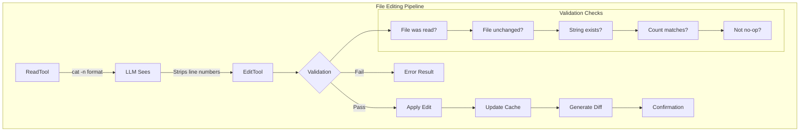

## The File Editing Pipeline Architecture

File editing in Claude Code isn't just about changing text—it's a carefully orchestrated pipeline designed to handle the complexities of AI-assisted code modification:

```tsx
class FileEditingPipeline {
  // The four-phase editing cycle
  static async executeEdit(
    tool: EditTool,
    input: EditInput,
    context: ToolContext
  ): Promise<EditResult> {
    // Phase 1: Validation
    const validation = await this.validateEdit(input, context);
    if (!validation.valid) {
      return { success: false, error: validation.error };
    }

    // Phase 2: Preparation
    const prepared = await this.prepareEdit(input, validation.fileState);

    // Phase 3: Application
    const result = await this.applyEdit(prepared);

    // Phase 4: Verification
    const verified = await this.verifyEdit(result, input);

    return verified;
  }

  // The state tracking system
  private static fileStates = new Map<string, FileState>();

  interface FileState {
    content: string;
    hash: string;
    mtime: number;
    encoding: BufferEncoding;
    lineEndings: '\\n' | '\\r\\n' | '\\r';
    isBinary: boolean;
    size: number;
  }
}

```

**Why Multiple Tools Instead of One Universal Editor?**

| Tool | Purpose | Guarantees | Failure Mode |
| --- | --- | --- | --- |
| `EditTool` | Single string replacement | Exact match count | Fails if occurrence ≠ expected |
| `MultiEditTool` | Sequential edits | Atomic batch | Fails if any edit invalid |
| `WriteTool` | Full replacement | Complete overwrite | Fails if not read first |
| `NotebookEditTool` | Cell operations | Structure preserved | Fails if cell missing |

Each tool provides specific guarantees that a universal editor couldn't maintain while remaining LLM-friendly.

## The Line Number Problem: A Deceptively Complex Challenge

The most critical challenge in file editing is the line number prefix problem:

```tsx
// What the LLM sees from ReadTool:
const readOutput = `
1	function hello() {
2	  console.log('Hello, world!');
3	}
`;

// What the LLM might incorrectly try to edit:
const wrongOldString = "2	  console.log('Hello, world!');";  // WRONG - includes line number

// What it should use:
const correctOldString = "  console.log('Hello, world!');";  // CORRECT - no line number

```

The line number stripping logic:

```tsx
class LineNumberHandler {
  // The LLM receives extensive instructions about this
  static readonly LINE_NUMBER_PATTERN = /^\\d+\\t/;

  static stripLineNumbers(content: string): string {
    return content
      .split('\\n')
      .map(line => line.replace(this.LINE_NUMBER_PATTERN, ''))
      .join('\\n');
  }

  // But the real challenge is ensuring the LLM does this
  static validateOldString(
    oldString: string,
    fileContent: string
  ): ValidationResult {
    // Check 1: Does oldString contain line number prefix?
    if (this.LINE_NUMBER_PATTERN.test(oldString)) {
      return {
        valid: false,
        error: 'old_string appears to contain line number prefix. ' +
               'Remove the number and tab at the start.',
        suggestion: oldString.replace(this.LINE_NUMBER_PATTERN, '')
      };
    }

    // Check 2: Does the string exist in the file?
    const occurrences = this.countOccurrences(fileContent, oldString);
    if (occurrences === 0) {
      // Try to detect if it's a line number issue
      const possibleLineNumber = oldString.match(/^(\\d+)\\t/);
      if (possibleLineNumber) {
        const lineNum = parseInt(possibleLineNumber[1]);
        const actualLine = this.getLine(fileContent, lineNum);
        return {
          valid: false,
          error: `String not found. Did you include line number ${lineNum}?`,
          suggestion: actualLine
        };
      }
    }

    return { valid: true, occurrences };
  }
}

```

## EditTool: Surgical Precision in String Replacement

The EditTool implements exact string matching with zero ambiguity:

```tsx
class EditToolImplementation {
  static async executeEdit(
    input: EditInput,
    context: ToolContext
  ): Promise<EditResult> {
    const { file_path, old_string, new_string, expected_replacements = 1 } = input;

    // Step 1: Retrieve cached file state
    const cachedFile = context.readFileState.get(file_path);
    if (!cachedFile) {
      throw new Error(
        'File must be read with ReadFileTool before editing. ' +
        'This ensures you have the current file content.'
      );
    }

    // Step 2: Verify file hasn't changed externally
    const currentStats = await fs.stat(file_path);
    if (currentStats.mtimeMs !== cachedFile.timestamp) {
      throw new Error(
        'File has been modified externally since last read. ' +
        'Please read the file again to see current content.'
      );
    }

    // Step 3: Validate the edit
    const validation = this.validateEdit(
      old_string,
      new_string,
      cachedFile.content,
      expected_replacements
    );

    if (!validation.valid) {
      throw new Error(validation.error);
    }

    // Step 4: Apply the replacement
    const newContent = this.performReplacement(
      cachedFile.content,
      old_string,
      new_string,
      expected_replacements
    );

    // Step 5: Generate diff for verification
    const diff = this.generateDiff(
      cachedFile.content,
      newContent,
      file_path
    );

    // Step 6: Write with same encoding/line endings
    await this.writeFilePreservingFormat(
      file_path,
      newContent,
      cachedFile
    );

    // Step 7: Update cache
    context.readFileState.set(file_path, {
      content: newContent,
      timestamp: Date.now()
    });

    // Step 8: Generate context snippet
    const snippet = this.generateContextSnippet(
      newContent,
      new_string,
      5 // lines of context
    );

    return {
      success: true,
      diff,
      snippet,
      replacements: expected_replacements
    };
  }

  private static validateEdit(
    oldString: string,
    newString: string,
    fileContent: string,
    expectedReplacements: number
  ): EditValidation {
    // No-op check
    if (oldString === newString) {
      return {
        valid: false,
        error: 'old_string and new_string are identical. No changes would be made.'
      };
    }

    // Empty old_string special case (insertion)
    if (oldString === '') {
      return {
        valid: false,
        error: 'Empty old_string not allowed. Use WriteTool for new files.'
      };
    }

    // Count occurrences with exact string matching
    const occurrences = this.countExactOccurrences(fileContent, oldString);

    if (occurrences === 0) {
      return {
        valid: false,
        error: 'old_string not found in file. Ensure exact match including whitespace.',
        suggestion: this.findSimilarStrings(fileContent, oldString)
      };
    }

    if (occurrences !== expectedReplacements) {
      return {
        valid: false,
        error: `Expected ${expectedReplacements} replacement(s) but found ${occurrences} occurrence(s). ` +
               `Set expected_replacements to ${occurrences} or refine old_string.`
      };
    }

    return { valid: true };
  }

  private static countExactOccurrences(
    content: string,
    searchString: string
  ): number {
    // Escape special regex characters for exact matching
    const escaped = searchString.replace(/[.*+?^${}()|[\\]\\\\]/g, '\\\\$&');
    const regex = new RegExp(escaped, 'g');
    return (content.match(regex) || []).length;
  }

  private static performReplacement(
    content: string,
    oldString: string,
    newString: string,
    limit: number
  ): string {
    // Character escaping for special replacement patterns
    const escapeReplacement = (str: string) => {
      return str
        .replace(/\\$/g, '$$$$')  // $ -> $$
        .replace(/\\n/g, '\\n')    // Preserve newlines
        .replace(/\\r/g, '\\r');   // Preserve carriage returns
    };

    const escapedNew = escapeReplacement(newString);

    let result = content;
    let count = 0;
    let lastIndex = 0;

    // Manual replacement to respect limit
    while (count < limit) {
      const index = result.indexOf(oldString, lastIndex);
      if (index === -1) break;

      result = result.slice(0, index) +
               newString +  // Use original, not escaped
               result.slice(index + oldString.length);

      lastIndex = index + newString.length;
      count++;
    }

    return result;
  }

  private static generateDiff(
    oldContent: string,
    newContent: string,
    filePath: string
  ): string {
    // Use unified diff format
    const diff = createUnifiedDiff(
      filePath,
      filePath,
      oldContent,
      newContent,
      'before edit',
      'after edit',
      { context: 3 }
    );

    return diff;
  }
}

```

**Why `expected_replacements` Matters**:

```tsx
// Scenario: Multiple occurrences
const fileContent = `
function processUser(user) {
  console.log(user);
  return user;
}
`;

// Without expected_replacements:
edit({
  old_string: "user",
  new_string: "userData"
});
// Result: ALL occurrences replaced (function parameter too!)

// With expected_replacements:
edit({
  old_string: "user",
  new_string: "userData",
  expected_replacements: 2  // Only the uses, not parameter
});
// Result: Fails - forces more specific old_string

```

## MultiEditTool: Atomic Sequential Operations

MultiEditTool solves the complex problem of multiple related edits:

```tsx
class MultiEditToolImplementation {
  static async executeMultiEdit(
    input: MultiEditInput,
    context: ToolContext
  ): Promise<MultiEditResult> {
    const { file_path, edits } = input;

    // Load file once
    const cachedFile = context.readFileState.get(file_path);
    if (!cachedFile) {
      throw new Error('File must be read before editing');
    }

    // Validate all edits before applying any
    const validationResult = this.validateAllEdits(
      edits,
      cachedFile.content
    );

    if (!validationResult.valid) {
      throw new Error(validationResult.error);
    }

    // Apply edits sequentially to working copy
    let workingContent = cachedFile.content;
    const appliedEdits: AppliedEdit[] = [];

    for (let i = 0; i < edits.length; i++) {
      const edit = edits[i];

      try {
        // Validate this edit against current working content
        const validation = this.validateSingleEdit(
          edit,
          workingContent,
          i
        );

        if (!validation.valid) {
          throw new Error(
            `Edit ${i + 1} failed: ${validation.error}`
          );
        }

        // Apply edit
        const beforeEdit = workingContent;
        workingContent = this.applyEdit(
          workingContent,
          edit
        );

        appliedEdits.push({
          index: i,
          edit,
          diff: this.generateEditDiff(beforeEdit, workingContent),
          summary: this.summarizeEdit(edit)
        });

      } catch (error) {
        // Atomic failure - no changes written
        throw new Error(
          `MultiEdit aborted at edit ${i + 1}/${edits.length}: ${error.message}`
        );
      }
    }

    // All edits validated and applied - write once
    await this.writeFilePreservingFormat(
      file_path,
      workingContent,
      cachedFile
    );

    // Update cache
    context.readFileState.set(file_path, {
      content: workingContent,
      timestamp: Date.now()
    });

    return {
      success: true,
      editsApplied: appliedEdits,
      totalDiff: this.generateDiff(
        cachedFile.content,
        workingContent,
        file_path
      )
    };
  }

  private static validateAllEdits(
    edits: Edit[],
    originalContent: string
  ): ValidationResult {
    // Check for empty edits array
    if (edits.length === 0) {
      return {
        valid: false,
        error: 'No edits provided'
      };
    }

    // Detect potential conflicts
    const conflicts = this.detectEditConflicts(edits, originalContent);
    if (conflicts.length > 0) {
      return {
        valid: false,
        error: 'Edit conflicts detected:\\n' +
               conflicts.map(c => c.description).join('\\n')
      };
    }

    // Simulate all edits to ensure they work
    let simulatedContent = originalContent;
    for (let i = 0; i < edits.length; i++) {
      const edit = edits[i];
      const occurrences = this.countOccurrences(
        simulatedContent,
        edit.old_string
      );

      if (occurrences === 0) {
        return {
          valid: false,
          error: `Edit ${i + 1}: old_string not found. ` +
                 `Previous edits may have removed it.`
        };
      }

      if (occurrences !== (edit.expected_replacements || 1)) {
        return {
          valid: false,
          error: `Edit ${i + 1}: Expected ${edit.expected_replacements || 1} ` +
                 `replacements but found ${occurrences}`
        };
      }

      // Apply to simulation
      simulatedContent = this.applyEdit(simulatedContent, edit);
    }

    return { valid: true };
  }

  private static detectEditConflicts(
    edits: Edit[],
    content: string
  ): EditConflict[] {
    const conflicts: EditConflict[] = [];

    for (let i = 0; i < edits.length - 1; i++) {
      for (let j = i + 1; j < edits.length; j++) {
        const edit1 = edits[i];
        const edit2 = edits[j];

        // Conflict Type 1: Later edit modifies earlier edit's result
        if (edit2.old_string.includes(edit1.new_string)) {
          conflicts.push({
            type: 'dependency',
            edits: [i, j],
            description: `Edit ${j + 1} depends on result of edit ${i + 1}`
          });
        }

        // Conflict Type 2: Overlapping replacements
        if (this.editsOverlap(edit1, edit2, content)) {
          conflicts.push({
            type: 'overlap',
            edits: [i, j],
            description: `Edits ${i + 1} and ${j + 1} affect overlapping text`
          });
        }

        // Conflict Type 3: Same target, different replacements
        if (edit1.old_string === edit2.old_string &&
            edit1.new_string !== edit2.new_string) {
          conflicts.push({
            type: 'contradiction',
            edits: [i, j],
            description: `Edits ${i + 1} and ${j + 1} replace same text differently`
          });
        }
      }
    }

    return conflicts;
  }

  private static editsOverlap(
    edit1: Edit,
    edit2: Edit,
    content: string
  ): boolean {
    // Find positions of all occurrences
    const positions1 = this.findAllPositions(content, edit1.old_string);
    const positions2 = this.findAllPositions(content, edit2.old_string);

    // Check if any positions overlap
    for (const pos1 of positions1) {
      const end1 = pos1 + edit1.old_string.length;

      for (const pos2 of positions2) {
        const end2 = pos2 + edit2.old_string.length;

        // Check for overlap
        if (pos1 < end2 && pos2 < end1) {
          return true;
        }
      }
    }

    return false;
  }
}

```

**Conflict Detection in Action**:

```tsx
// Example: Dependent edits
const edits = [
  {
    old_string: "console.log",
    new_string: "logger.info"
  },
  {
    old_string: "logger.info('test')",  // Depends on first edit!
    new_string: "logger.debug('test')"
  }
];
// Result: Conflict detected - Edit 2 depends on Edit 1

// Example: Safe sequential edits
const safeEdits = [
  {
    old_string: "var x",
    new_string: "let x"
  },
  {
    old_string: "var y",
    new_string: "let y"
  }
];
// Result: No conflicts - independent changes

```

## WriteTool: Full File Operations

WriteTool handles complete file creation or replacement:

```tsx
class WriteToolImplementation {
  static async executeWrite(
    input: WriteInput,
    context: ToolContext
  ): Promise<WriteResult> {
    const { file_path, content } = input;

    // Check if file exists
    const exists = await fs.access(file_path).then(() => true).catch(() => false);

    if (exists) {
      // Existing file - must have been read
      const cachedFile = context.readFileState.get(file_path);
      if (!cachedFile) {
        throw new Error(
          'Existing file must be read with ReadFileTool before overwriting. ' +
          'This prevents accidental data loss.'
        );
      }

      // Verify not externally modified
      const stats = await fs.stat(file_path);
      if (stats.mtimeMs !== cachedFile.timestamp) {
        throw new Error(
          'File has been modified externally. ' +
          'Read the file again to see current content before overwriting.'
        );
      }
    }

    // Documentation file restriction
    if (this.isDocumentationFile(file_path) && !context.explicitlyAllowed) {
      throw new Error(
        'Creating documentation files (*.md, README) requires explicit user request. ' +
        'Focus on code implementation unless specifically asked for docs.'
      );
    }

    // Prepare write operation
    const writeData = await this.prepareWriteData(
      content,
      exists ? context.readFileState.get(file_path) : null
    );

    // Ensure directory exists
    const dir = path.dirname(file_path);
    await fs.mkdir(dir, { recursive: true });

    // Write file
    await fs.writeFile(file_path, writeData.content, {
      encoding: writeData.encoding,
      mode: writeData.mode
    });

    // Update cache
    context.readFileState.set(file_path, {
      content: content,
      timestamp: Date.now()
    });

    // Generate result
    if (exists) {
      const snippet = this.generateContextSnippet(content, null, 10);
      return {
        success: true,
        action: 'updated',
        snippet
      };
    } else {
      return {
        success: true,
        action: 'created',
        path: file_path
      };
    }
  }

  private static async prepareWriteData(
    content: string,
    existingFile: FileState | null
  ): Promise<WriteData> {
    // Detect or preserve line endings
    let lineEnding = '\\n'; // Default to LF

    if (existingFile) {
      // Preserve existing line endings
      lineEnding = existingFile.lineEndings;
    } else if (process.platform === 'win32') {
      // Default to CRLF on Windows for new files
      lineEnding = '\\r\\n';
    }

    // Normalize and then apply correct line endings
    const normalizedContent = content.replace(/\\r\\n|\\r|\\n/g, '\\n');
    const finalContent = normalizedContent.replace(/\\n/g, lineEnding);

    // Detect encoding (simplified - real implementation more complex)
    const encoding = existingFile?.encoding || 'utf8';

    // Preserve file mode if updating
    const mode = existingFile ?
      (await fs.stat(existingFile.path)).mode :
      0o644;

    return {
      content: finalContent,
      encoding,
      mode
    };
  }
}

```

## The Validation Layer: Defense in Depth

Every edit operation goes through multiple validation layers:

```tsx
class FileValidationPipeline {
  static async validateFileOperation(
    operation: FileOperation,
    context: ToolContext
  ): Promise<ValidationResult> {
    // Layer 1: Path validation
    const pathValidation = await this.validatePath(operation.path, context);
    if (!pathValidation.valid) return pathValidation;

    // Layer 2: Permission check
    const permissionCheck = await this.checkPermissions(operation, context);
    if (!permissionCheck.valid) return permissionCheck;

    // Layer 3: File state validation
    const stateValidation = await this.validateFileState(operation, context);
    if (!stateValidation.valid) return stateValidation;

    // Layer 4: Content validation
    const contentValidation = await this.validateContent(operation);
    if (!contentValidation.valid) return contentValidation;

    // Layer 5: Safety checks
    const safetyCheck = await this.performSafetyChecks(operation, context);
    if (!safetyCheck.valid) return safetyCheck;

    return { valid: true };
  }

  private static async validatePath(
    filePath: string,
    context: ToolContext
  ): Promise<ValidationResult> {
    // Absolute path requirement
    if (!path.isAbsolute(filePath)) {
      return {
        valid: false,
        error: 'File path must be absolute',
        suggestion: path.resolve(filePath)
      };
    }

    // Path traversal prevention
    const resolved = path.resolve(filePath);
    const normalized = path.normalize(filePath);

    if (resolved !== normalized) {
      return {
        valid: false,
        error: 'Path contains suspicious traversal patterns'
      };
    }

    // Boundary check
    const projectRoot = context.projectRoot;
    const allowed = [
      projectRoot,
      ...context.additionalWorkingDirectories
    ];

    const isAllowed = allowed.some(dir =>
      resolved.startsWith(path.resolve(dir))
    );

    if (!isAllowed) {
      return {
        valid: false,
        error: 'Path is outside allowed directories',
        allowedDirs: allowed
      };
    }

    // Special file prevention
    const forbidden = [
      /\\.git\\//,
      /node_modules\\//,
      /\\.env$/,
      /\\.ssh\\//,
      /\\.gnupg\\//
    ];

    if (forbidden.some(pattern => pattern.test(resolved))) {
      return {
        valid: false,
        error: 'Operation on sensitive files not allowed'
      };
    }

    return { valid: true };
  }

  private static async validateFileState(
    operation: FileOperation,
    context: ToolContext
  ): Promise<ValidationResult> {
    if (operation.type === 'create') {
      // Check if file already exists
      const exists = await fs.access(operation.path)
        .then(() => true)
        .catch(() => false);

      if (exists && !operation.overwrite) {
        return {
          valid: false,
          error: 'File already exists. Use WriteTool with prior read to overwrite.'
        };
      }
    }

    if (operation.type === 'edit' || operation.type === 'overwrite') {
      const cached = context.readFileState.get(operation.path);

      if (!cached) {
        return {
          valid: false,
          error: 'File must be read before editing'
        };
      }

      // Staleness check
      try {
        const stats = await fs.stat(operation.path);
        if (stats.mtimeMs !== cached.timestamp) {
          const timeDiff = stats.mtimeMs - cached.timestamp;
          return {
            valid: false,
            error: 'File has been modified externally',
            details: {
              cachedTime: new Date(cached.timestamp),
              currentTime: new Date(stats.mtimeMs),
              difference: `${Math.abs(timeDiff)}ms`
            }
          };
        }
      } catch (error) {
        return {
          valid: false,
          error: 'File no longer exists or is inaccessible'
        };
      }
    }

    return { valid: true };
  }
}

```

## Diff Generation & Feedback: Closing the Loop

Every edit produces rich feedback for the LLM:

```tsx
class DiffGenerator {
  static generateEditFeedback(
    operation: EditOperation,
    result: EditResult
  ): EditFeedback {
    const feedback: EditFeedback = {
      summary: this.generateSummary(operation, result),
      diff: this.generateDiff(operation, result),
      snippet: this.generateContextSnippet(operation, result),
      statistics: this.generateStatistics(operation, result)
    };

    return feedback;
  }

  private static generateDiff(
    operation: EditOperation,
    result: EditResult
  ): string {
    const { oldContent, newContent, filePath } = result;

    // Use different diff strategies based on change size
    const changeRatio = this.calculateChangeRatio(oldContent, newContent);

    if (changeRatio < 0.1) {
      // Small change - use unified diff
      return this.generateUnifiedDiff(
        oldContent,
        newContent,
        filePath,
        { context: 5 }
      );
    } else if (changeRatio < 0.5) {
      // Medium change - use word diff
      return this.generateWordDiff(
        oldContent,
        newContent,
        filePath
      );
    } else {
      // Large change - use summary diff
      return this.generateSummaryDiff(
        oldContent,
        newContent,
        filePath
      );
    }
  }

  private static generateContextSnippet(
    operation: EditOperation,
    result: EditResult
  ): string {
    const { newContent, changedRanges } = result;
    const lines = newContent.split('\\n');
    const snippets: string[] = [];

    for (const range of changedRanges) {
      const start = Math.max(0, range.start - 5);
      const end = Math.min(lines.length, range.end + 5);

      const snippet = lines
        .slice(start, end)
        .map((line, idx) => {
          const lineNum = start + idx + 1;
          const isChanged = lineNum >= range.start && lineNum <= range.end;
          const prefix = isChanged ? '>' : ' ';
          return `${prefix} ${lineNum}\\t${line}`;
        })
        .join('\\n');

      snippets.push(snippet);
    }

    // Limit total snippet size
    const combined = snippets.join('\\n...\\n');
    if (combined.length > 1000) {
      return combined.substring(0, 1000) + '\\n... (truncated)';
    }

    return combined;
  }

  private static generateUnifiedDiff(
    oldContent: string,
    newContent: string,
    filePath: string,
    options: DiffOptions
  ): string {
    const oldLines = oldContent.split('\\n');
    const newLines = newContent.split('\\n');

    // Use Myers diff algorithm
    const diff = new MyersDiff(oldLines, newLines);
    const hunks = diff.getHunks(options.context);

    // Format as unified diff
    const header = [
      `--- ${filePath}\\t(before edit)`,
      `+++ ${filePath}\\t(after edit)`,
      ''
    ].join('\\n');

    const formattedHunks = hunks.map(hunk => {
      const range = `@@ -${hunk.oldStart},${hunk.oldLength} ` +
                    `+${hunk.newStart},${hunk.newLength} @@`;

      const lines = hunk.lines.map(line => {
        switch (line.type) {
          case 'unchanged': return ` ${line.content}`;
          case 'deleted': return `-${line.content}`;
          case 'added': return `+${line.content}`;
        }
      });

      return [range, ...lines].join('\\n');
    }).join('\\n');

    return header + formattedHunks;
  }
}

```

## Special Cases & Edge Conditions

File editing must handle numerous edge cases:

```tsx
class EdgeCaseHandlers {
  // Empty file handling
  static handleEmptyFile(
    operation: EditOperation,
    content: string
  ): HandlerResult {
    if (content.trim() === '') {
      if (operation.type === 'edit') {
        return {
          error: 'Cannot edit empty file. Use WriteTool to add content.'
        };
      }

      // Special feedback for ReadTool
      return {
        warning: '<system-reminder>Warning: the file exists but the contents are empty.</system-reminder>'
      };
    }

    return { ok: true };
  }

  // Binary file detection
  static async detectBinaryFile(
    filePath: string,
    content: Buffer
  ): Promise<boolean> {
    // Check for null bytes (common in binary files)
    for (let i = 0; i < Math.min(content.length, 8192); i++) {
      if (content[i] === 0) {
        return true;
      }
    }

    // Check file extension
    const binaryExtensions = [
      '.jpg', '.png', '.gif', '.pdf', '.zip',
      '.exe', '.dll', '.so', '.dylib'
    ];

    const ext = path.extname(filePath).toLowerCase();
    if (binaryExtensions.includes(ext)) {
      return true;
    }

    // Use file magic numbers
    const magicNumbers = {
      'png': [0x89, 0x50, 0x4E, 0x47],
      'jpg': [0xFF, 0xD8, 0xFF],
      'pdf': [0x25, 0x50, 0x44, 0x46],
      'zip': [0x50, 0x4B, 0x03, 0x04]
    };

    for (const [type, magic] of Object.entries(magicNumbers)) {
      if (this.bufferStartsWith(content, magic)) {
        return true;
      }
    }

    return false;
  }

  // Symbolic link handling
  static async handleSymlink(
    filePath: string,
    operation: FileOperation
  ): Promise<SymlinkResult> {
    try {
      const stats = await fs.lstat(filePath);

      if (!stats.isSymbolicLink()) {
        return { isSymlink: false };
      }

      const target = await fs.readlink(filePath);
      const resolvedTarget = path.resolve(path.dirname(filePath), target);

      // Check if target exists
      const targetExists = await fs.access(resolvedTarget)
        .then(() => true)
        .catch(() => false);

      if (!targetExists && operation.type === 'read') {
        return {
          isSymlink: true,
          error: `Broken symlink: points to non-existent ${target}`
        };
      }

      // For edit operations, offer choice
      if (operation.type === 'edit') {
        return {
          isSymlink: true,
          warning: `This is a symlink to ${target}. Edit will modify the target file.`,
          target: resolvedTarget
        };
      }

      return {
        isSymlink: true,
        target: resolvedTarget
      };
    } catch (error) {
      return { isSymlink: false };
    }
  }

  // Encoding detection and handling
  static async detectEncoding(
    filePath: string,
    buffer: Buffer
  ): Promise<EncodingInfo> {
    // Check for BOM
    if (buffer[0] === 0xEF && buffer[1] === 0xBB && buffer[2] === 0xBF) {
      return { encoding: 'utf8', hasBOM: true };
    }

    if (buffer[0] === 0xFF && buffer[1] === 0xFE) {
      return { encoding: 'utf16le', hasBOM: true };
    }

    if (buffer[0] === 0xFE && buffer[1] === 0xFF) {
      return { encoding: 'utf16be', hasBOM: true };
    }

    // Try UTF-8
    try {
      const decoded = buffer.toString('utf8');
      // Check for replacement characters
      if (!decoded.includes('\\ufffd')) {
        return { encoding: 'utf8', hasBOM: false };
      }
    } catch {}

    // Fallback heuristics
    const nullBytes = buffer.filter(b => b === 0).length;
    const highBytes = buffer.filter(b => b > 127).length;

    if (nullBytes > buffer.length * 0.1) {
      return { encoding: 'binary', hasBOM: false };
    }

    if (highBytes < buffer.length * 0.1) {
      return { encoding: 'ascii', hasBOM: false };
    }

    // Default to utf8 with warning
    return {
      encoding: 'utf8',
      hasBOM: false,
      warning: 'Encoding uncertain, assuming UTF-8'
    };
  }
}

```

## Performance Optimizations

File editing at scale requires careful optimization:

```tsx
class FileEditingPerformance {
  // Caching strategy for large files
  private static chunkCache = new Map<string, ChunkedFile>();

  static async readLargeFile(
    filePath: string,
    options: ReadOptions
  ): Promise<FileContent> {
    const stats = await fs.stat(filePath);

    // Use streaming for files over 10MB
    if (stats.size > 10 * 1024 * 1024) {
      return this.streamRead(filePath, options);
    }

    // Use chunk caching for files 1-10MB
    if (stats.size > 1024 * 1024) {
      return this.chunkedRead(filePath, options);
    }

    // Direct read for small files
    return this.directRead(filePath, options);
  }

  private static async chunkedRead(
    filePath: string,
    options: ReadOptions
  ): Promise<FileContent> {
    const cached = this.chunkCache.get(filePath);

    if (cached && cached.mtime === (await fs.stat(filePath)).mtimeMs) {
      // Use cached chunks
      return this.assembleFromChunks(cached, options);
    }

    // Read in chunks
    const chunkSize = 256 * 1024; // 256KB chunks
    const chunks: Buffer[] = [];
    const stream = createReadStream(filePath, {
      highWaterMark: chunkSize
    });

    for await (const chunk of stream) {
      chunks.push(chunk);
    }

    // Cache for future use
    this.chunkCache.set(filePath, {
      chunks,
      mtime: (await fs.stat(filePath)).mtimeMs,
      encoding: 'utf8'
    });

    return this.assembleFromChunks({ chunks }, options);
  }

  // Batch edit preparation
  static prepareBatchEdits(
    edits: Edit[],
    content: string
  ): PreparedBatch {
    // Pre-compute all positions
    const positions = new Map<string, number[]>();

    for (const edit of edits) {
      if (!positions.has(edit.old_string)) {
        positions.set(
          edit.old_string,
          this.findAllPositions(content, edit.old_string)
        );
      }
    }

    // Sort edits by position (reverse order for safe application)
    const sortedEdits = edits
      .map(edit => ({
        edit,
        position: positions.get(edit.old_string)![0]
      }))
      .sort((a, b) => b.position - a.position);

    return {
      edits: sortedEdits,
      positions,
      canApplyInReverse: true
    };
  }

  // Memory-efficient diff generation
  static *generateStreamingDiff(
    oldContent: string,
    newContent: string
  ): Generator<DiffChunk> {
    const oldLines = oldContent.split('\\n');
    const newLines = newContent.split('\\n');

    // Use sliding window for large files
    const windowSize = 1000;
    let oldIndex = 0;
    let newIndex = 0;

    while (oldIndex < oldLines.length || newIndex < newLines.length) {
      const oldWindow = oldLines.slice(oldIndex, oldIndex + windowSize);
      const newWindow = newLines.slice(newIndex, newIndex + windowSize);

      const diff = this.computeWindowDiff(
        oldWindow,
        newWindow,
        oldIndex,
        newIndex
      );

      yield diff;

      oldIndex += diff.oldConsumed;
      newIndex += diff.newConsumed;
    }
  }
}

```

**Performance Characteristics**:

| File Size | Operation | Method | Time | Memory |
| --- | --- | --- | --- | --- |
| <100KB | Read | Direct | <5ms | O(n) |
| 100KB-1MB | Read | Direct | 5-20ms | O(n) |
| 1-10MB | Read | Chunked | 20-100ms | O(chunk) |
| >10MB | Read | Streaming | 100ms+ | O(1) |
| Any | Edit (single) | In-memory | <10ms | O(n) |
| Any | Edit (multi) | Sequential | <50ms | O(n) |
| Any | Write | Direct | <20ms | O(n) |

## Common Failure Patterns & Recovery

Understanding common failures helps build robust editing:

```tsx
class FailureRecovery {
  // External modification conflict
  static async handleExternalModification(
    filePath: string,
    cachedState: FileState,
    operation: EditOperation
  ): Promise<RecoveryStrategy> {
    const currentContent = await fs.readFile(filePath, 'utf8');
    const currentStats = await fs.stat(filePath);

    // Attempt three-way merge
    const mergeResult = await this.attemptThreeWayMerge(
      cachedState.content,    // Base
      operation.newContent,   // Ours
      currentContent         // Theirs
    );

    if (mergeResult.success && !mergeResult.conflicts) {
      return {
        strategy: 'auto_merge',
        content: mergeResult.merged,
        warning: 'File was modified externally. Changes have been merged.'
      };
    }

    // Generate conflict markers
    if (mergeResult.conflicts) {
      return {
        strategy: 'conflict_markers',
        content: mergeResult.conflictMarked,
        error: 'Merge conflicts detected. Manual resolution required.',
        conflicts: mergeResult.conflicts
      };
    }

    // Fallback: Show diff and ask
    return {
      strategy: 'user_decision',
      error: 'File modified externally',
      options: [
        'Overwrite external changes',
        'Abort edit',
        'Read file again'
      ],
      diff: this.generateDiff(cachedState.content, currentContent)
    };
  }

  // Encoding issues
  static async handleEncodingError(
    filePath: string,
    error: Error,
    content: string
  ): Promise<RecoveryStrategy> {
    // Try different encodings
    const encodings = ['utf8', 'latin1', 'utf16le'];

    for (const encoding of encodings) {
      try {
        const buffer = Buffer.from(content, encoding as any);
        await fs.writeFile(filePath + '.test', buffer);
        await fs.unlink(filePath + '.test');

        return {
          strategy: 'alternate_encoding',
          encoding,
          warning: `Using ${encoding} encoding instead of UTF-8`
        };
      } catch {}
    }

    // Binary fallback
    return {
      strategy: 'binary_write',
      warning: 'Treating as binary file',
      content: Buffer.from(content, 'binary')
    };
  }

  // Disk space issues
  static async handleDiskSpaceError(
    filePath: string,
    requiredBytes: number
  ): Promise<RecoveryStrategy> {
    const diskInfo = await this.getDiskInfo(path.dirname(filePath));

    if (diskInfo.available < requiredBytes) {
      // Calculate what can be freed
      const suggestions = await this.analyzeDiskUsage(path.dirname(filePath));

      return {
        strategy: 'free_space',
        error: `Insufficient disk space. Need ${this.formatBytes(requiredBytes)}, ` +
               `have ${this.formatBytes(diskInfo.available)}`,
        suggestions: suggestions.map(s => ({
          path: s.path,
          size: this.formatBytes(s.size),
          type: s.type
        }))
      };
    }

    // Might be quota issue
    return {
      strategy: 'quota_check',
      error: 'Write failed despite apparent free space. Check disk quotas.',
      command: `quota -v ${process.env.USER}`
    };
  }

  // Partial write recovery
  static async recoverPartialWrite(
    filePath: string,
    expectedSize: number
  ): Promise<RecoveryResult> {
    try {
      const stats = await fs.stat(filePath);

      if (stats.size === 0) {
        // Complete failure - check for backup
        const backupPath = filePath + '.backup';
        if (await fs.access(backupPath).then(() => true).catch(() => false)) {
          await fs.rename(backupPath, filePath);
          return {
            recovered: true,
            method: 'backup_restore'
          };
        }
      }

      if (stats.size < expectedSize) {
        // Partial write - check for temporary file
        const tempPath = filePath + '.tmp';
        if (await fs.access(tempPath).then(() => true).catch(() => false)) {
          const tempStats = await fs.stat(tempPath);
          if (tempStats.size === expectedSize) {
            await fs.rename(tempPath, filePath);
            return {
              recovered: true,
              method: 'temp_file_restore'
            };
          }
        }
      }

      return {
        recovered: false,
        partialSize: stats.size,
        expectedSize
      };
    } catch (error) {
      return {
        recovered: false,
        error: error.message
      };
    }
  }
}

```

---