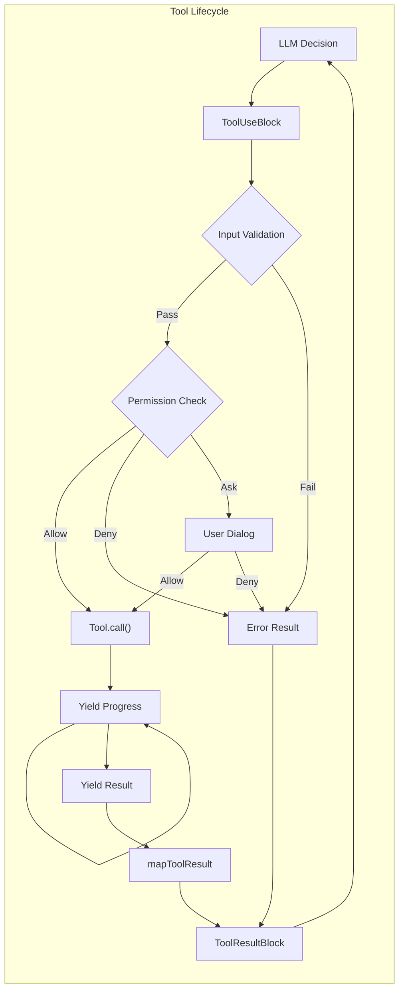

## The Tool Execution Pipeline: Async Generators All The Way Down

The most fascinating aspect of Claude Code's tool system is its use of async generators throughout the execution pipeline. This allows for streaming progress updates while maintaining clean error boundaries:

```tsx
// The core tool execution function (reconstructed)
async function* executeTool(
  toolUse: ToolUseBlock,
  toolDef: ToolDefinition,
  context: ToolUseContext,
  permissionFn: PermissionGranter,
  assistantMessage: CliMessage
): AsyncGenerator<CliMessage, void, void> {
  // Phase 1: Input validation with Zod
  const validationStart = performance.now();
  const validation = toolDef.inputSchema.safeParse(toolUse.input);

  if (!validation.success) {
    // Format Zod errors for LLM consumption
    const errorMessage = formatZodError(validation.error);
    yield createToolResultMessage({
      tool_use_id: toolUse.id,
      content: [{
        type: 'text',
        text: `Input validation failed:\\n${errorMessage}`
      }],
      is_error: true
    });
    return;
  }

  // Phase 2: Permission check
  const permissionResult = await checkToolPermission(
    toolDef,
    validation.data,
    context.getToolPermissionContext(),
    permissionFn
  );

  if (permissionResult.behavior === 'deny') {
    yield createToolResultMessage({
      tool_use_id: toolUse.id,
      content: [{
        type: 'text',
        text: `Permission denied: ${permissionResult.message}`
      }],
      is_error: true
    });
    return;
  }

  if (permissionResult.behavior === 'ask') {
    // Yield UI event for permission dialog
    yield {
      type: 'permission_request',
      toolName: toolDef.name,
      input: validation.data,
      suggestions: permissionResult.ruleSuggestions
    };

    // Wait for user decision (handled by outer loop)
    const decision = await permissionFn(
      toolDef,
      validation.data,
      permissionResult
    );

    if (!decision.allowed) {
      yield createToolResultMessage({
        tool_use_id: toolUse.id,
        content: [{
          type: 'text',
          text: 'Tool execution cancelled by user'
        }],
        is_error: true
      });
      return;
    }
  }

  // Phase 3: Tool execution with progress tracking
  try {
    const executeStart = performance.now();
    let progressCount = 0;
    let finalResult = null;

    // Call the tool's async generator
    for await (const output of toolDef.call(
      validation.data,
      context,
      undefined, // mcpContext - skipping as requested
      assistantMessage
    )) {
      if (output.type === 'progress') {
        progressCount++;
        yield {
          type: 'progress',
          uuid: `progress-${toolUse.id}-${progressCount}`,
          timestamp: new Date().toISOString(),
          progress: {
            toolUseID: toolUse.id,
            data: output.data
          }
        };
      } else if (output.type === 'result') {
        finalResult = output.data;
      }
    }

    // Phase 4: Result transformation
    if (finalResult !== null) {
      const content = toolDef.mapToolResultToToolResultBlockParam(
        finalResult,
        toolUse.id
      );

      yield createToolResultMessage({
        tool_use_id: toolUse.id,
        content: Array.isArray(content) ? content : [content],
        is_error: false,
        executionTime: performance.now() - executeStart
      });
    }
  } catch (error) {
    // Error handling with rich context
    yield createToolResultMessage({
      tool_use_id: toolUse.id,
      content: formatToolError(error, toolDef),
      is_error: true
    });
  }
}

```

**Performance Characteristics**:

- Input validation: O(n) where n is input complexity, typically <1ms
- Permission check: O(rules) + potential user interaction time
- Tool execution: Varies wildly by tool (10ms to 30s)
- Result transformation: O(output size), typically <5ms

## The Shell Parser: Claude Code's Secret Weapon

One of the most innovative components is the custom shell parser that enables passing JavaScript objects through shell commands:

```tsx
// The shell parser implementation (reconstructed from decompilation)
class ShellParser {
  private static OPERATORS = /(\\|\\||&&|;;|\\|&|\\||<|>|>>|&|\\(|\\))/;
  private static SINGLE_QUOTE = /^'([^']*)'$/;
  private static DOUBLE_QUOTE = /^"([^"\\\\]*(\\\\.[^"\\\\]*)*)"$/;

  // The magic: random sentinel for object embedding
  private static SENTINEL = crypto.randomBytes(16).toString('hex');

  static parse(
    command: string,
    env: Record<string, any>,
    opts?: (token: string) => any
  ): ParsedCommand {
    // Phase 1: Variable expansion with object serialization
    const expandedCommand = this.expandVariables(command, env);

    // Phase 2: Tokenization
    const tokens = this.tokenize(expandedCommand);

    // Phase 3: Object rehydration if opts provided
    if (opts && typeof opts === 'function') {
      return tokens.map(token => {
        if (this.isSerializedObject(token)) {
          return this.deserializeObject(token);
        }
        return token;
      });
    }

    return tokens;
  }

  private static expandVariables(
    command: string,
    env: Record<string, any>
  ): string {
    return command.replace(
      /\\$\\{?(\\w+)\\}?/g,
      (match, varName) => {
        const value = env[varName];

        // The innovation: serialize objects with sentinel
        if (typeof value === 'object' && value !== null) {
          return this.SENTINEL + JSON.stringify(value) + this.SENTINEL;
        }

        return String(value || '');
      }
    );
  }

  private static tokenize(command: string): string[] {
    const tokens: string[] = [];
    let current = '';
    let inSingleQuote = false;
    let inDoubleQuote = false;
    let escape = false;

    for (let i = 0; i < command.length; i++) {
      const char = command[i];
      const next = command[i + 1];

      // Handle quotes and escapes
      if (!escape) {
        if (char === "'" && !inDoubleQuote) {
          inSingleQuote = !inSingleQuote;
          current += char;
          continue;
        }
        if (char === '"' && !inSingleQuote) {
          inDoubleQuote = !inDoubleQuote;
          current += char;
          continue;
        }
        if (char === '\\\\') {
          escape = true;
          current += char;
          continue;
        }
      } else {
        escape = false;
        current += char;
        continue;
      }

      // Handle operators when not in quotes
      if (!inSingleQuote && !inDoubleQuote) {
        const remaining = command.slice(i);
        const operatorMatch = remaining.match(/^(\\|\\||&&|;;|\\|&|\\||<|>|>>|&|\\(|\\))/);

        if (operatorMatch) {
          if (current) {
            tokens.push(current);
            current = '';
          }
          tokens.push(operatorMatch[1]);
          i += operatorMatch[1].length - 1;
          continue;
        }

        // Handle whitespace
        if (/\\s/.test(char)) {
          if (current) {
            tokens.push(current);
            current = '';
          }
          continue;
        }
      }

      current += char;
    }

    if (current) {
      tokens.push(current);
    }

    return tokens;
  }

  private static isSerializedObject(token: string): boolean {
    return token.startsWith(this.SENTINEL) &&
           token.endsWith(this.SENTINEL);
  }

  private static deserializeObject(token: string): any {
    const json = token.slice(
      this.SENTINEL.length,
      -this.SENTINEL.length
    );

    try {
      return JSON.parse(json);
    } catch {
      return token; // Fallback to string
    }
  }
}

```

This parser enables commands like:

```bash
# Where $CONFIG is a JavaScript object
mytool --config=$CONFIG --name="test"

# Becomes after parsing with rehydration:
['mytool', '--config', {setting: true, values: [1,2,3]}, '--name', 'test']

```

## Core File Operation Tools

### ReadTool: The Multimodal File Reader

```tsx
// ReadTool implementation (reconstructed)
const ReadToolDefinition: ToolDefinition = {
  name: 'ReadFileTool',
  description: 'Read file contents with line numbers, supporting text and images',

  inputSchema: z.object({
    file_path: z.string().describe('Absolute path to the file'),
    offset: z.number().optional().describe('Starting line number (1-based)'),
    limit: z.number().optional().default(2000).describe('Maximum lines to read')
  }),

  async *call(input, context) {
    const { file_path, offset = 1, limit = 2000 } = input;

    // Progress: Starting read
    yield {
      type: 'progress',
      toolUseID: context.currentToolUseId,
      data: { status: `Reading ${path.basename(file_path)}...` }
    };

    // Check if file exists
    const stats = await fs.stat(file_path).catch(() => null);
    if (!stats) {
      throw new Error(`File not found: ${file_path}`);
    }

    // Detect file type
    const mimeType = await detectMimeType(file_path);

    if (mimeType.startsWith('image/')) {
      // Handle image files
      const imageData = await this.readImage(file_path, context);
      yield { type: 'result', data: imageData };
      return;
    }

    if (file_path.endsWith('.ipynb')) {
      // Handle Jupyter notebooks
      const notebookData = await this.readNotebook(file_path, offset, limit);
      yield { type: 'result', data: notebookData };
      return;
    }

    // Handle text files with streaming
    const content = await this.readTextFile(file_path, offset, limit);

    // Update file cache
    context.readFileState.set(file_path, {
      content: content.fullContent,
      timestamp: stats.mtimeMs
    });

    yield { type: 'result', data: content };
  },

  async readTextFile(filePath: string, offset: number, limit: number) {
    const stream = createReadStream(filePath, { encoding: 'utf8' });
    const lines: string[] = [];
    let lineNumber = 0;
    let truncated = false;

    for await (const chunk of stream) {
      const chunkLines = chunk.split('\\n');

      for (const line of chunkLines) {
        lineNumber++;

        if (lineNumber >= offset && lines.length < limit) {
          // Truncate long lines
          const truncatedLine = line.length > 2000
            ? line.substring(0, 2000) + '... (truncated)'
            : line;

          // Format with line numbers (cat -n style)
          lines.push(`${lineNumber}\\t${truncatedLine}`);
        }

        if (lines.length >= limit) {
          truncated = true;
          stream.destroy();
          break;
        }
      }
    }

    return {
      formattedContent: lines.join('\\n'),
      fullContent: await fs.readFile(filePath, 'utf8'),
      lineCount: lineNumber,
      truncated
    };
  },

  async readImage(filePath: string, context: ToolUseContext) {
    const buffer = await fs.readFile(filePath);
    const metadata = await sharp(buffer).metadata();

    // Resize if too large
    let processedBuffer = buffer;
    if (metadata.width > 1024 || metadata.height > 1024) {
      processedBuffer = await sharp(buffer)
        .resize(1024, 1024, {
          fit: 'inside',
          withoutEnlargement: true
        })
        .toBuffer();
    }

    return {
      type: 'image',
      mimeType: `image/${metadata.format}`,
      base64: processedBuffer.toString('base64'),
      dimensions: {
        original: { width: metadata.width, height: metadata.height },
        processed: { width: 1024, height: 1024 }
      }
    };
  },

  mapToolResultToToolResultBlockParam(result, toolUseId) {
    if (result.type === 'image') {
      return [{
        type: 'image',
        source: {
          type: 'base64',
          media_type: result.mimeType,
          data: result.base64
        }
      }];
    }

    // Empty file handling
    if (!result.formattedContent || result.formattedContent.trim() === '') {
      return [{
        type: 'text',
        text: '<system-reminder>Warning: the file exists but the contents are empty.</system-reminder>'
      }];
    }

    // Normal text result
    return [{
      type: 'text',
      text: result.formattedContent +
            (result.truncated ? '\\n... (content truncated)' : '')
    }];
  },

  isReadOnly: true
};

```

**Performance Profile**:

| File Size | Read Time | Memory Usage | Bottleneck |
| --- | --- | --- | --- |
| <1MB | <10ms | O(file) | Disk I/O |
| 1-10MB | 10-50ms | O(file) | Memory allocation |
| 10-100MB | 50-500ms | O(limit) | Line processing |
| >100MB | 500ms+ | O(limit) | Streaming chunks |

### EditTool: Surgical File Modifications

```tsx
// EditTool implementation with validation pipeline
const EditToolDefinition: ToolDefinition = {
  name: 'EditFileTool',
  description: 'Perform exact string replacement in files with validation',

  inputSchema: z.object({
    file_path: z.string(),
    old_string: z.string().min(1),
    new_string: z.string(),
    expected_replacements: z.number().optional().default(1)
  }),

  async *call(input, context) {
    const { file_path, old_string, new_string, expected_replacements } = input;

    // Validation 1: File was read
    const cachedFile = context.readFileState.get(file_path);
    if (!cachedFile) {
      throw new Error('File must be read with ReadFileTool before editing');
    }

    // Validation 2: File hasn't changed
    const currentStats = await fs.stat(file_path);
    if (currentStats.mtimeMs !== cachedFile.timestamp) {
      throw new Error('File has been modified externally since last read');
    }

    // Validation 3: No-op check
    if (old_string === new_string) {
      throw new Error('old_string and new_string cannot be identical');
    }

    yield {
      type: 'progress',
      toolUseID: context.currentToolUseId,
      data: { status: 'Validating edit...' }
    };

    // Count occurrences
    const occurrences = this.countOccurrences(
      cachedFile.content,
      old_string
    );

    if (occurrences === 0) {
      throw new Error(`old_string not found in file`);
    }

    if (occurrences !== expected_replacements) {
      throw new Error(
        `Expected ${expected_replacements} replacements but found ${occurrences}`
      );
    }

    // Perform replacement
    const newContent = this.performReplacement(
      cachedFile.content,
      old_string,
      new_string,
      expected_replacements
    );

    // Generate diff for preview
    const diff = this.generateDiff(
      cachedFile.content,
      newContent,
      file_path
    );

    yield {
      type: 'progress',
      toolUseID: context.currentToolUseId,
      data: {
        status: 'Applying edit...',
        preview: diff
      }
    };

    // Write file
    await this.writeFileWithBackup(file_path, newContent);

    // Update cache
    context.readFileState.set(file_path, {
      content: newContent,
      timestamp: Date.now()
    });

    // Generate result snippet
    const snippet = this.getContextSnippet(
      newContent,
      new_string,
      5 // lines of context
    );

    yield {
      type: 'result',
      data: {
        success: true,
        diff,
        snippet,
        replacements: expected_replacements
      }
    };
  },

  countOccurrences(content: string, searchString: string): number {
    // Escape special regex characters
    const escaped = searchString.replace(/[.*+?^${}()|[\\]\\\\]/g, '\\\\$&');
    const regex = new RegExp(escaped, 'g');
    return (content.match(regex) || []).length;
  },

  performReplacement(
    content: string,
    oldString: string,
    newString: string,
    limit: number
  ): string {
    // Special handling for certain characters during replacement
    const tempOld = oldString.replace(/\\$/g, '$$$$');
    const tempNew = newString.replace(/\\$/g, '$$$$');

    let result = content;
    let count = 0;
    let lastIndex = 0;

    while (count < limit) {
      const index = result.indexOf(oldString, lastIndex);
      if (index === -1) break;

      result = result.slice(0, index) +
               newString +
               result.slice(index + oldString.length);

      lastIndex = index + newString.length;
      count++;
    }

    return result;
  },

  mapToolResultToToolResultBlockParam(result, toolUseId) {
    return [{
      type: 'text',
      text: `Successfully edited file. ${result.replacements} replacement(s) made.\\n\\n` +
            `Preview of changes:\\n${result.snippet}`
    }];
  },

  isReadOnly: false
};

```

### MultiEditTool: Atomic Sequential Edits

```tsx
// MultiEditTool - Complex sequential edit orchestration
const MultiEditToolDefinition: ToolDefinition = {
  name: 'MultiEditFileTool',
  description: 'Apply multiple edits to a file atomically',

  inputSchema: z.object({
    file_path: z.string(),
    edits: z.array(z.object({
      old_string: z.string(),
      new_string: z.string(),
      expected_replacements: z.number().optional().default(1)
    })).min(1)
  }),

  async *call(input, context) {
    const { file_path, edits } = input;

    // Load file content
    const cachedFile = context.readFileState.get(file_path);
    if (!cachedFile) {
      throw new Error('File must be read before editing');
    }

    yield {
      type: 'progress',
      toolUseID: context.currentToolUseId,
      data: {
        status: `Planning ${edits.length} edits...`,
        editCount: edits.length
      }
    };

    // Simulate all edits to check for conflicts
    let workingContent = cachedFile.content;
    const editResults = [];

    for (let i = 0; i < edits.length; i++) {
      const edit = edits[i];

      yield {
        type: 'progress',
        toolUseID: context.currentToolUseId,
        data: {
          status: `Validating edit ${i + 1}/${edits.length}`,
          currentEdit: i + 1
        }
      };

      // Check if this edit would work
      const occurrences = this.countOccurrences(
        workingContent,
        edit.old_string
      );

      if (occurrences === 0) {
        throw new Error(
          `Edit ${i + 1}: old_string not found. ` +
          `This may be due to previous edits modifying the text.`
        );
      }

      if (occurrences !== edit.expected_replacements) {
        throw new Error(
          `Edit ${i + 1}: Expected ${edit.expected_replacements} ` +
          `replacements but found ${occurrences}`
        );
      }

      // Apply edit to working copy
      workingContent = this.performReplacement(
        workingContent,
        edit.old_string,
        edit.new_string,
        edit.expected_replacements
      );

      editResults.push({
        index: i + 1,
        summary: this.summarizeEdit(edit)
      });
    }

    // All edits validated - now apply atomically
    yield {
      type: 'progress',
      toolUseID: context.currentToolUseId,
      data: { status: 'Applying all edits...' }
    };

    await this.writeFileWithBackup(file_path, workingContent);

    // Update cache
    context.readFileState.set(file_path, {
      content: workingContent,
      timestamp: Date.now()
    });

    yield {
      type: 'result',
      data: {
        success: true,
        editsApplied: editResults,
        finalContent: this.getFileSnippet(workingContent)
      }
    };
  },

  // Conflict detection for edit sequences
  detectEditConflicts(edits: EditSequence[]): ConflictReport {
    const conflicts = [];

    for (let i = 0; i < edits.length - 1; i++) {
      for (let j = i + 1; j < edits.length; j++) {
        // Check if edit j's old_string contains edit i's new_string
        if (edits[j].old_string.includes(edits[i].new_string)) {
          conflicts.push({
            edit1: i,
            edit2: j,
            type: 'dependency',
            message: `Edit ${j+1} depends on result of edit ${i+1}`
          });
        }

        // Check for overlapping regions
        if (this.editsOverlap(edits[i], edits[j])) {
          conflicts.push({
            edit1: i,
            edit2: j,
            type: 'overlap',
            message: `Edits ${i+1} and ${j+1} may affect same region`
          });
        }
      }
    }

    return conflicts;
  },

  isReadOnly: false
};

```

## The BashTool: Power and Responsibility

The BashTool is perhaps the most complex tool, implementing multiple safety layers:

```tsx
// BashTool implementation with sandbox support
const BashToolDefinition: ToolDefinition = {
  name: 'BashTool',
  description: 'Execute shell commands with streaming output',

  inputSchema: z.object({
    command: z.string(),
    timeout: z.number().optional().default(30000),
    description: z.string().optional(),
    sandbox: z.boolean().optional(),
    shellExecutable: z.string().optional()
  }),

  // Complex permission checking for commands
  async checkPermissions(input, context, permContext) {
    const { command, sandbox } = input;

    // Extract command components
    const parsed = ShellParser.parse(command, process.env);
    const baseCommand = parsed[0];

    // Forbidden commands check
    const FORBIDDEN = ['find', 'grep', 'cat', 'head', 'tail', 'ls'];
    if (FORBIDDEN.includes(baseCommand) && !permContext.mode.includes('bypass')) {
      return {
        behavior: 'deny',
        message: `Use dedicated tools instead of ${baseCommand}`
      };
    }

    // Dangerous commands require explicit permission
    const DANGEROUS = ['rm', 'dd', 'mkfs', 'fdisk', 'kill'];
    if (DANGEROUS.some(cmd => command.includes(cmd))) {
      return {
        behavior: 'ask',
        message: 'This command could be dangerous',
        ruleSuggestions: [`BashTool(${baseCommand}/*)`]
      };
    }

    // Sandbox mode analysis
    if (sandbox === true) {
      // Commands that work in sandbox
      const SANDBOX_SAFE = ['echo', 'pwd', 'env', 'date', 'which'];
      if (SANDBOX_SAFE.includes(baseCommand)) {
        return { behavior: 'allow' };
      }
    }

    // Default permission check
    return await super.checkPermissions(input, context, permContext);
  },

  async *call(input, context) {
    const { command, timeout, sandbox = false } = input;

    yield {
      type: 'progress',
      toolUseID: context.currentToolUseId,
      data: {
        status: 'Preparing command execution...',
        command: command.substring(0, 100),
        sandbox
      }
    };

    // Prepare execution environment
    const execOptions = {
      cwd: context.cwd,
      env: { ...process.env, CLAUDE_CODE: 'true' },
      timeout,
      maxBuffer: 10 * 1024 * 1024, // 10MB
      killSignal: 'SIGTERM'
    };

    if (sandbox && process.platform === 'darwin') {
      // macOS sandbox-exec
      const profile = this.generateSandboxProfile();
      const sandboxedCommand = `sandbox-exec -p '${profile}' ${command}`;
      return yield* this.executeCommand(sandboxedCommand, execOptions, context);
    }

    yield* this.executeCommand(command, execOptions, context);
  },

  async *executeCommand(command, options, context) {
    const startTime = Date.now();
    const child = spawn('bash', ['-c', command], options);

    let stdout = '';
    let stderr = '';
    let outputSize = 0;
    const MAX_OUTPUT = 1024 * 1024; // 1MB limit

    // Stream stdout
    child.stdout.on('data', (chunk) => {
      const text = chunk.toString();
      stdout += text;
      outputSize += chunk.length;

      if (outputSize < MAX_OUTPUT) {
        // Yield progress with streaming output
        context.yieldProgress({
          type: 'stdout',
          data: text,
          partial: true
        });
      }
    });

    // Stream stderr
    child.stderr.on('data', (chunk) => {
      const text = chunk.toString();
      stderr += text;
      outputSize += chunk.length;

      if (outputSize < MAX_OUTPUT) {
        context.yieldProgress({
          type: 'stderr',
          data: text,
          partial: true
        });
      }
    });

    // Handle process completion
    const result = await new Promise((resolve, reject) => {
      child.on('error', reject);

      child.on('exit', (code, signal) => {
        resolve({
          exitCode: code,
          signal,
          stdout: stdout.substring(0, MAX_OUTPUT),
          stderr: stderr.substring(0, MAX_OUTPUT),
          truncated: outputSize > MAX_OUTPUT,
          duration: Date.now() - startTime
        });
      });

      // Handle abort signal
      context.abortController.signal.addEventListener('abort', () => {
        child.kill('SIGTERM');
      });
    });

    yield {
      type: 'result',
      data: result
    };
  },

  generateSandboxProfile(): string {
    // Restrictive sandbox profile for macOS
    return `
      (version 1)
      (deny default)
      (allow process-exec (literal "/bin/bash"))
      (allow process-exec (literal "/usr/bin/env"))
      (allow file-read*)
      (deny file-write*)
      (deny network*)
      (allow sysctl-read)
    `;
  },

  // Git workflow automation
  async *handleGitCommit(args, context) {
    // Phase 1: Parallel information gathering
    const [status, diff, log] = await Promise.all([
      this.runCommand('git status --porcelain'),
      this.runCommand('git diff --cached'),
      this.runCommand('git log -5 --oneline')
    ]);

    yield {
      type: 'progress',
      toolUseID: context.currentToolUseId,
      data: {
        status: 'Analyzing changes...',
        files: status.split('\\n').length - 1
      }
    };

    // Phase 2: Generate commit message
    const commitAnalysis = await this.analyzeChangesForCommit(
      status,
      diff,
      context
    );

    // Phase 3: Execute commit with HEREDOC
    const commitCommand = `git commit -m "$(cat <<'EOF'
${commitAnalysis.message}

Co-authored-by: Claude <claude@anthropic.com>
EOF
)"`;

    yield* this.executeCommand(commitCommand, {}, context);
  },

  mapToolResultToToolResultBlockParam(result, toolUseId) {
    const output = [];

    if (result.stdout) {
      output.push(`stdout:\\n${result.stdout}`);
    }

    if (result.stderr) {
      output.push(`stderr:\\n${result.stderr}`);
    }

    output.push(`Exit code: ${result.exitCode}`);

    if (result.truncated) {
      output.push('\\n(Output truncated due to size limits)');
    }

    return [{
      type: 'text',
      text: output.join('\\n\\n')
    }];
  },

  isReadOnly: false
};

```

**Sandbox Mode Decision Tree**:

```
Command Analysis
├─ Is it a read operation? (ls, cat, grep)
│  └─ Yes → sandbox=true ✓
├─ Does it need network? (curl, wget, git)
│  └─ Yes → sandbox=false ✓
├─ Does it write files? (touch, echo >)
│  └─ Yes → sandbox=false ✓
├─ Is it a build command? (npm, make, cargo)
│  └─ Yes → sandbox=false ✓
└─ Default → sandbox=true (safe default)

```

## Search and Discovery Tools

### GrepTool: High-Performance Content Search

```tsx
// GrepTool with optimization strategies
const GrepToolDefinition: ToolDefinition = {
  name: 'GrepTool',
  description: 'Fast regex search across files',

  inputSchema: z.object({
    regex: z.string(),
    path: z.string().optional().default('.'),
    include_pattern: z.string().optional()
  }),

  async *call(input, context) {
    const { regex, path, include_pattern } = input;

    // Validate regex
    try {
      new RegExp(regex);
    } catch (e) {
      throw new Error(`Invalid regex: ${e.message}`);
    }

    yield {
      type: 'progress',
      toolUseID: context.currentToolUseId,
      data: { status: 'Searching files...' }
    };

    // Use ripgrep for performance
    const rgCommand = this.buildRipgrepCommand(regex, path, include_pattern);
    const matches = await this.executeRipgrep(rgCommand);

    // Group by file and limit results
    const fileGroups = this.groupMatchesByFile(matches);
    const topFiles = this.selectTopFiles(fileGroups, 20); // Top 20 files

    yield {
      type: 'result',
      data: {
        matchCount: matches.length,
        fileCount: fileGroups.size,
        files: topFiles
      }
    };
  },

  buildRipgrepCommand(regex: string, path: string, includePattern?: string): string {
    const args = [
      'rg',
      '--files-with-matches',
      '--sort=modified',
      '--max-count=10', // Limit matches per file
      '-e', regex,
      path
    ];

    if (includePattern) {
      args.push('--glob', includePattern);
    }

    // Ignore common non-text files
    const ignorePatterns = [
      '*.jpg', '*.png', '*.gif',
      '*.mp4', '*.mov',
      '*.zip', '*.tar', '*.gz',
      'node_modules', '.git'
    ];

    ignorePatterns.forEach(pattern => {
      args.push('--glob', `!${pattern}`);
    });

    return args.join(' ');
  },

  isReadOnly: true
};

```

### AgentTool: Hierarchical Task Decomposition

```tsx
// AgentTool - The most sophisticated tool
const AgentToolDefinition: ToolDefinition = {
  name: 'AgentTool',
  description: 'Launch sub-agents for complex tasks',

  inputSchema: z.object({
    description: z.string().min(3).max(100),
    prompt: z.string().min(10),
    parallelTasksCount: z.number().optional().default(1).max(5),
    model: z.string().optional()
  }),

  async *call(input, context, mcpContext, assistantMessage) {
    const { prompt, parallelTasksCount, model } = input;

    yield {
      type: 'progress',
      toolUseID: context.currentToolUseId,
      data: {
        status: 'Analyzing task complexity...',
        parallel: parallelTasksCount > 1
      }
    };

    // Prepare sub-agent configuration
    const subAgentConfig = {
      tools: this.filterToolsForSubAgent(context.options.tools),
      model: model || 'claude-3-haiku-20240307', // Fast model default
      maxTokens: this.calculateTokenBudget(prompt),
      systemPrompt: this.buildSubAgentPrompt(prompt)
    };

    // Execute sub-agents
    const results = await this.executeSubAgents(
      prompt,
      parallelTasksCount,
      subAgentConfig,
      context
    );

    // Report progress
    for (const result of results) {
      yield {
        type: 'progress',
        toolUseID: context.currentToolUseId,
        data: {
          status: `Sub-agent ${result.index} complete`,
          tokensUsed: result.usage.total_tokens
        }
      };
    }

    // Synthesis phase
    if (results.length > 1) {
      yield {
        type: 'progress',
        toolUseID: context.currentToolUseId,
        data: { status: 'Synthesizing results...' }
      };

      const synthesized = await this.synthesizeResults(
        results,
        prompt,
        context
      );

      yield { type: 'result', data: synthesized };
    } else {
      yield { type: 'result', data: results[0].content };
    }
  },

  filterToolsForSubAgent(allTools: ToolDefinition[]): ToolDefinition[] {
    // Prevent infinite recursion
    return allTools.filter(tool =>
      tool.name !== 'AgentTool' &&
      tool.name !== 'UpdateTodoTool' // Sub-agents don't manage todos
    );
  },

  async executeSubAgents(
    prompt: string,
    count: number,
    config: SubAgentConfig,
    context: ToolUseContext
  ): Promise<SubAgentResult[]> {
    // Split task if parallel
    const subtasks = count > 1
      ? this.splitTask(prompt, count)
      : [prompt];

    // Create abort controllers linked to parent
    const subControllers = subtasks.map(() =>
      this.createLinkedAbortController(context.abortController)
    );

    // Execute in parallel with concurrency limit
    const executions = subtasks.map((task, index) =>
      this.runSubAgent({
        task,
        index,
        config,
        controller: subControllers[index],
        sharedState: {
          readFileState: context.readFileState, // Shared cache
          permissionContext: context.getToolPermissionContext()
        }
      })
    );

    // Use parallelMap for controlled concurrency
    const results = [];
    for await (const result of parallelMap(executions, 5)) {
      results.push(result);
    }

    return results;
  },

  async synthesizeResults(
    results: SubAgentResult[],
    originalPrompt: string,
    context: ToolUseContext
  ): Promise<string> {
    const synthesisPrompt = `
You are a synthesis agent. Multiple sub-agents have completed investigations.
Synthesize their findings into a single, cohesive response.

Original task: ${originalPrompt}

${results.map((r, i) => `
Sub-agent ${i + 1} findings:
${r.content}

Tokens used: ${r.usage.total_tokens}
Tools used: ${r.toolsUsed.join(', ') || 'None'}
`).join('\\n---\\n')}

Provide a unified response that combines all findings.
    `.trim();

    // Use fast model for synthesis
    const synthesizer = new SubAgentExecutor({
      prompt: synthesisPrompt,
      model: 'claude-3-haiku-20240307',
      isSynthesis: true,
      maxTokens: 2000
    });

    return synthesizer.execute();
  },

  calculateTokenBudget(prompt: string): number {
    // Heuristic: longer prompts get more tokens
    const baseTokens = 2000;
    const promptComplexity = prompt.split(' ').length;
    const multiplier = Math.min(promptComplexity / 50, 3);

    return Math.floor(baseTokens * multiplier);
  },

  mapToolResultToToolResultBlockParam(result, toolUseId) {
    return [{
      type: 'text',
      text: result // Already formatted by synthesis
    }];
  },

  isReadOnly: true // Sub-agents inherit parent permissions
};

```

## Tool Selection & LLM Engineering

The LLM receives extensive instructions for tool usage:

```tsx
// Tool instruction compiler (reconstructed)
class ToolInstructionCompiler {
  static compileSystemPrompt(tools: ToolDefinition[]): string {
    return `
## Available Tools

You have access to the following tools:

${tools.map(tool => `
### ${tool.name}
${tool.description}

${tool.prompt || ''}

Input Schema:
\\`\\`\\`json
${JSON.stringify(tool.inputJSONSchema || zodToJsonSchema(tool.inputSchema), null, 2)}
\\`\\`\\`

${this.getToolSpecificInstructions(tool)}
`).join('\\n---\\n')}

## Tool Usage Guidelines

1. **Batching**: You can call multiple tools in a single response. When multiple independent pieces of information are requested, batch your tool calls together.

2. **Read Before Write**: ALWAYS use ReadFileTool before EditFileTool or WriteFileTool.

3. **Prefer Specialized Tools**:
   - Use GrepTool instead of BashTool with grep
   - Use ReadFileTool instead of BashTool with cat
   - Use GlobTool instead of BashTool with find

4. **Safety First**:
   - Never use BashTool for destructive commands without explicit user request
   - Use sandbox=true for BashTool when possible
   - Validate paths are within project boundaries

5. **Progress Communication**:
   - Tool execution may take time
   - Users see progress updates
   - Be patient with long-running tools

6. **Error Handling**:
   - Tools may fail - have a backup plan
   - Read error messages carefully
   - Suggest fixes based on error details
    `.trim();
  }

  static getToolSpecificInstructions(tool: ToolDefinition): string {
    const instructions = {
      'BashTool': `
CRITICAL:
- Forbidden commands: find, grep, cat, head, tail, ls (use dedicated tools)
- Always use ripgrep (rg) instead of grep
- For git operations, follow the structured workflow
- Set sandbox=false only when necessary
      `,

      'EditFileTool': `
CRITICAL:
- The old_string MUST NOT include line number prefixes from ReadFileTool
- Preserve exact indentation and whitespace
- Verify expected_replacements matches actual occurrences
      `,

      'AgentTool': `
When to use:
- Complex searches across multiple files
- Tasks requiring multiple steps
- Open-ended investigations

When NOT to use:
- Simple file reads (use ReadFileTool)
- Specific pattern searches (use GrepTool)
      `,

      'UpdateTodoTool': `
ALWAYS use this tool when:
- Starting a complex task (3+ steps)
- User provides multiple tasks
- Completing any task

Mark tasks complete IMMEDIATELY after finishing them.
Only have ONE task in_progress at a time.
      `
    };

    return instructions[tool.name] || '';
  }
}

```

## Performance & Safety Patterns

### Tool Performance Characteristics

| Tool | Latency | Memory | CPU | I/O | Parallelizable |
| --- | --- | --- | --- | --- | --- |
| ReadTool | 10-50ms | O(file) | Low | High | ✓ |
| EditTool | 20-100ms | O(file) | Low | Medium | ✗ |
| MultiEditTool | 50-500ms | O(file) | Medium | Medium | ✗ |
| WriteTool | 10-50ms | O(content) | Low | High | ✗ |
| BashTool | 50ms-30s | Variable | Variable | Variable | ✗* |
| GrepTool | 100-500ms | O(matches) | High | High | ✓ |
| GlobTool | 50-200ms | O(files) | Low | Medium | ✓ |
| AgentTool | 2-20s | O(tasks) | Low | Low | ✓ |
| WebFetchTool | 500-3000ms | O(page) | Low | Low | ✓ |
- BashTool parallel execution only safe for read-only commands

### Memory Management Strategies

```tsx
// Tool memory optimization patterns
class ToolMemoryManager {
  // Pattern 1: Streaming for large files
  static async *streamLargeFile(path: string, chunkSize = 64 * 1024) {
    const stream = createReadStream(path, {
      highWaterMark: chunkSize
    });

    for await (const chunk of stream) {
      yield chunk;

      // Allow GC between chunks
      if (global.gc) global.gc();
    }
  }

  // Pattern 2: Weak references for file cache
  private static fileCache = new Map<string, WeakRef<FileContent>>();

  static cacheFile(path: string, content: FileContent) {
    const ref = new WeakRef(content);
    this.fileCache.set(path, ref);

    // Register cleanup
    this.registry.register(content, path);
  }

  // Pattern 3: Result size limits
  static truncateResult(result: string, maxSize = 100_000): string {
    if (result.length <= maxSize) return result;

    return result.substring(0, maxSize) +
           `\\n... (truncated ${result.length - maxSize} characters)`;
  }
}

```

### Path Security Implementation

```tsx
// Path validation for all file operations
class PathSecurityValidator {
  static isPathSafe(
    requestedPath: string,
    context: ToolUseContext
  ): boolean {
    const resolved = path.resolve(requestedPath);

    // Check primary working directory
    const cwd = context.options.cwd || process.cwd();
    if (resolved.startsWith(cwd)) {
      return true;
    }

    // Check additional allowed directories
    const additionalDirs = context
      .getToolPermissionContext()
      .additionalWorkingDirectories;

    for (const dir of additionalDirs) {
      if (resolved.startsWith(dir)) {
        return true;
      }
    }

    // Check against deny patterns
    const DENIED_PATHS = [
      '/etc/passwd',
      '/etc/shadow',
      '~/.ssh/id_rsa',
      '/System', // macOS
      '/Windows/System32' // Windows
    ];

    return !DENIED_PATHS.some(denied =>
      resolved.includes(denied)
    );
  }
}

```