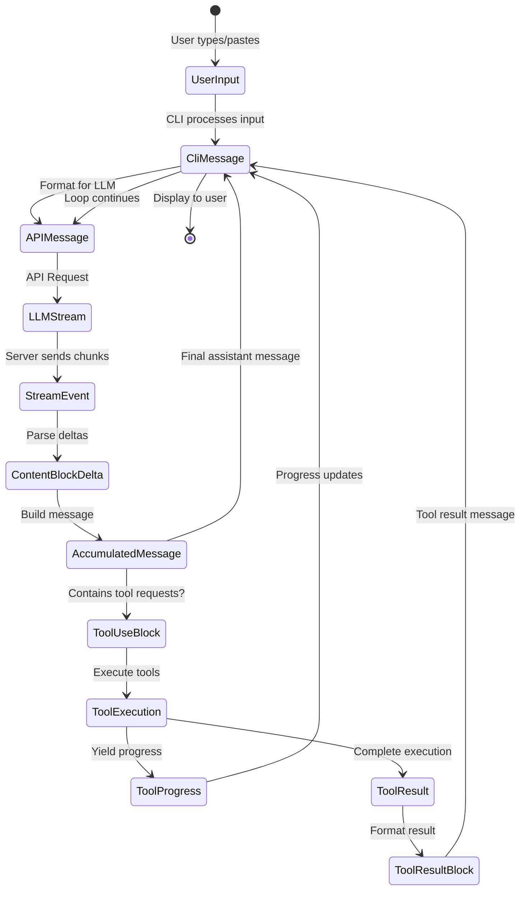
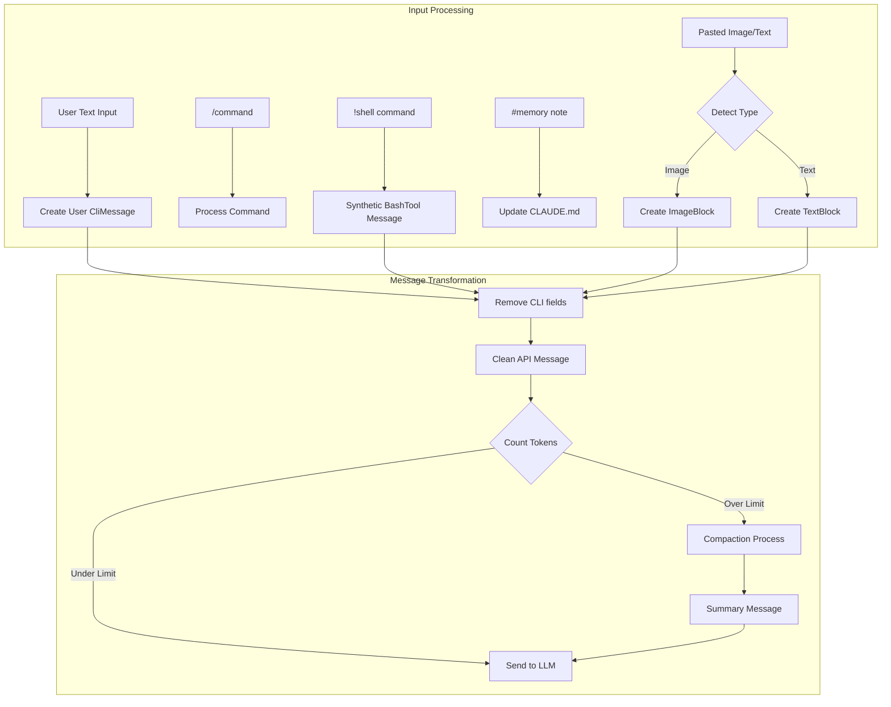
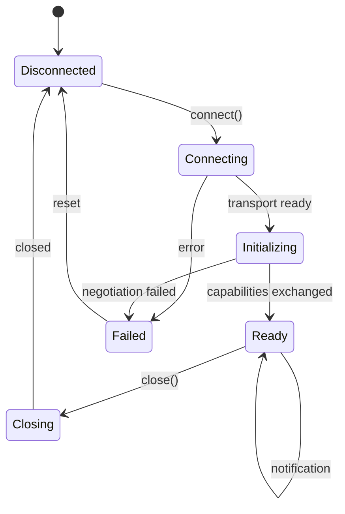

## The Streaming State Machine: How Messages Transform

The most fascinating aspect of Claude Code's data architecture is how it manages the transformation of data through multiple representations while maintaining streaming performance. Let's start with the core innovation:

```tsx
// The dual-representation message system (inferred from analysis)
interface MessageTransformPipeline {
  // Stage 1: CLI Internal Representation
  cliMessage: {
    type: "user" | "assistant" | "attachment" | "progress"
    uuid: string  // CLI-specific tracking
    timestamp: string
    message?: APICompatibleMessage  // Only for user/assistant
    attachment?: AttachmentContent   // Only for attachment
    progress?: ProgressUpdate        // Only for progress
  }

  // Stage 2: API Wire Format
  apiMessage: {
    role: "user" | "assistant"
    content: string | ContentBlock[]
    // No CLI-specific fields
  }

  // Stage 3: Streaming Accumulator
  streamAccumulator: {
    partial: Partial<APIMessage>
    deltas: ContentBlockDelta[]
    buffers: Map<string, string>  // tool_use_id → accumulating JSON
  }
}

```

**Why This Matters**: This three-stage representation allows Claude Code to maintain UI responsiveness while handling complex streaming protocols. The CLI can update progress indicators using `CliMessage` metadata while the actual LLM communication uses a clean `APIMessage` format.

## ContentBlock: The Polymorphic Building Block

Based on decompilation analysis, Claude Code implements a sophisticated type system for content:

```tsx
// The ContentBlock discriminated union (reconstructed)
type ContentBlock =
  | TextBlock
  | ImageBlock
  | ToolUseBlock
  | ToolResultBlock
  | ThinkingBlock
  | DocumentBlock      // Platform-specific
  | VideoBlock         // Platform-specific
  | GuardContentBlock  // Platform-specific
  | ReasoningBlock     // Platform-specific
  | CachePointBlock    // Platform-specific

// Performance annotations based on inferred usage
interface ContentBlockMetrics {
  TextBlock: {
    memorySize: "O(text.length)",
    parseTime: "O(1)",
    serializeTime: "O(n)",
    streamable: true
  },
  ImageBlock: {
    memorySize: "O(1) + external",  // Reference to base64/S3
    parseTime: "O(1)",
    serializeTime: "O(size)" | "O(1) for S3",
    streamable: false
  },
  ToolUseBlock: {
    memorySize: "O(JSON.stringify(input).length)",
    parseTime: "O(n) for JSON parse",
    serializeTime: "O(n)",
    streamable: true  // JSON can stream
  }
}

```

### The Streaming JSON Challenge

One of Claude Code's most clever innovations is handling streaming JSON for tool inputs:

```tsx
// Inferred implementation of streaming JSON parser
class StreamingToolInputParser {
  private buffer: string = '';
  private depth: number = 0;
  private inString: boolean = false;
  private escape: boolean = false;

  addChunk(chunk: string): ParseResult {
    this.buffer += chunk;

    // Track JSON structure depth
    for (const char of chunk) {
      if (!this.inString) {
        if (char === '{' || char === '[') this.depth++;
        else if (char === '}' || char === ']') this.depth--;
      }

      // Track string boundaries
      if (char === '"' && !this.escape) {
        this.inString = !this.inString;
      }
      this.escape = (char === '\\\\' && !this.escape);
    }

    // Attempt parse at depth 0
    if (this.depth === 0 && this.buffer.length > 0) {
      try {
        return { complete: true, value: JSON.parse(this.buffer) };
      } catch (e) {
        // Try auto-closing unclosed strings
        if (this.inString) {
          try {
            return {
              complete: true,
              value: JSON.parse(this.buffer + '"'),
              repaired: true
            };
          } catch {}
        }
        return { complete: false, error: e };
      }
    }

    return { complete: false };
  }
}

```

This parser can handle incremental JSON chunks from the LLM, attempting to parse as soon as the structure appears complete.

## Message Lifecycle: From User Input to LLM and Back



### The CliMessage Structure: More Than Meets the Eye

The `CliMessage` type serves as the central nervous system of the application:

```tsx
interface CliMessage {
  type: "user" | "assistant" | "attachment" | "progress"
  uuid: string
  timestamp: string

  // For user/assistant messages only
  message?: {
    role: "user" | "assistant"
    id?: string                    // LLM-provided ID
    model?: string                 // Which model responded
    stop_reason?: StopReason       // Why generation stopped
    stop_sequence?: string         // Specific stop sequence hit
    usage?: TokenUsage             // Detailed token counts
    content: string | ContentBlock[]
  }

  // CLI-specific metadata
  costUSD?: number               // Calculated cost
  durationMs?: number            // API call duration
  requestId?: string             // For debugging
  isApiErrorMessage?: boolean    // Error display flag
  isMeta?: boolean              // System-generated message

  // Type-specific fields
  attachment?: AttachmentContent
  progress?: {
    toolUseID: string
    parentToolUseID?: string   // For AgentTool sub-tools
    data: any                  // Tool-specific progress
  }
}

// Performance characteristics
interface CliMessagePerformance {
  creation: "O(1)",
  serialization: "O(content size)",
  memoryRetention: "Weak references for large content",
  garbageCollection: "Eligible when removed from history array"
}

```

### Mutation Points and State Transitions

Claude Code carefully controls where data structures can be modified:

```tsx
// Inferred mutation control patterns
class MessageMutationControl {
  // Mutation Point 1: Stream accumulation
  static accumulateStreamDelta(
    message: Partial<CliMessage>,
    delta: ContentBlockDelta
  ): void {
    if (delta.type === 'text_delta') {
      const lastBlock = message.content[message.content.length - 1];
      if (lastBlock.type === 'text') {
        lastBlock.text += delta.text;  // MUTATION
      }
    }
  }

  // Mutation Point 2: Tool result injection
  static injectToolResult(
    history: CliMessage[],
    toolResult: ToolResultBlock
  ): void {
    const newMessage: CliMessage = {
      type: 'user',
      isMeta: true,  // System-generated
      message: {
        role: 'user',
        content: [toolResult]
      },
      // ... other fields
    };
    history.push(newMessage);  // MUTATION
  }

  // Mutation Point 3: Cost calculation
  static updateCostMetadata(
    message: CliMessage,
    usage: TokenUsage
  ): void {
    message.costUSD = calculateCost(usage, message.model);  // MUTATION
    message.durationMs = Date.now() - parseISO(message.timestamp);  // MUTATION
  }
}

```

## The System Prompt: Dynamic Context Assembly

Perhaps the most complex data structure is the dynamically assembled system prompt:

```tsx
// System prompt assembly pipeline (reconstructed)
interface SystemPromptPipeline {
  sources: {
    baseInstructions: string        // Static base
    claudeMdContent: ClaudeMdLayer[] // Hierarchical
    gitContext: GitContextData       // Real-time
    directoryStructure: TreeData     // Cached/fresh
    toolDefinitions: ToolSpec[]      // Available tools
    modelAdaptations: ModelSpecificPrompt // Per-model
  }

  assembly: {
    order: ['base', 'model', 'claude.md', 'git', 'files', 'tools'],
    separators: Map<string, string>,  // Section delimiters
    sizeLimit: number,                // Token budget
    prioritization: 'recency' | 'relevance'
  }
}

// The GitContext structure reveals real-time awareness
interface GitContextData {
  currentBranch: string
  status: {
    modified: string[]
    untracked: string[]
    staged: string[]
  }
  recentCommits: Array<{
    hash: string
    message: string
    author: string
    timestamp: string
  }>
  uncommittedDiff?: string  // Expensive, conditional
}

```

### Memory Layout: [CLAUDE.md](http://claude.md/) Hierarchical Loading

```
Project Root
├── .claude/
│   ├── CLAUDE.md (Local - highest priority)
│   └── settings.json
├── ~/
│   └── .claude/
│       └── CLAUDE.md (User - second priority)
├── <project-root>/
│   └── .claude/
│       └── CLAUDE.md (Project - third priority)
└── /etc/claude-code/
    └── CLAUDE.md (Managed - lowest priority)

```

The loading mechanism implements an efficient merge strategy:

```tsx
// Inferred CLAUDE.md loading algorithm
class ClaudeMdLoader {
  private cache = new Map<string, {content: string, mtime: number}>();

  async loadMerged(): Promise<string> {
    const layers = [
      '/etc/claude-code/CLAUDE.md',      // Managed
      '~/.claude/CLAUDE.md',              // User
      '<project>/.claude/CLAUDE.md',      // Project
      '.claude/CLAUDE.md'                 // Local
    ];

    const contents = await Promise.all(
      layers.map(path => this.loadWithCache(path))
    );

    // Merge with override semantics
    return this.mergeWithOverrides(contents);
  }

  private mergeWithOverrides(contents: string[]): string {
    // Later layers override earlier ones
    // @override directive for explicit overrides
    // @append directive for additions
    // Default: concatenate with separators
  }
}

```

## Tool-Related Data Structures

### ToolDefinition: The Complete Tool Interface

```tsx
interface ToolDefinition {
  // Identity
  name: string
  description: string
  prompt?: string  // Additional LLM instructions

  // Schema (dual representation)
  inputSchema: ZodSchema          // Runtime validation
  inputJSONSchema?: JSONSchema    // LLM communication

  // Execution
  call: AsyncGenerator<ToolProgress | ToolResult, void, void>

  // Permissions
  checkPermissions?: (
    input: any,
    context: ToolUseContext,
    permContext: ToolPermissionContext
  ) => Promise<PermissionDecision>

  // Output formatting
  mapToolResultToToolResultBlockParam: (
    result: any,
    toolUseId: string
  ) => ContentBlock | ContentBlock[]

  // Metadata
  isReadOnly: boolean
  isMcp?: boolean
  isEnabled?: (config: any) => boolean
  getPath?: (input: any) => string | undefined

  // UI
  renderToolUseMessage?: (input: any) => ReactElement
}

// Memory characteristics of tool definitions
interface ToolDefinitionMemory {
  staticSize: "~2KB per tool",
  zodSchema: "Lazy compilation, cached",
  jsonSchema: "Generated once, memoized",
  closures: "Retains context references"
}

```

### The Execution Context: Everything a Tool Needs

```tsx
interface ToolUseContext {
  // Cancellation
  abortController: AbortController

  // File state tracking
  readFileState: Map<string, {
    content: string
    timestamp: number  // mtime
  }>

  // Permission resolution
  getToolPermissionContext: () => ToolPermissionContext

  // Options bag
  options: {
    tools: ToolDefinition[]
    mainLoopModel: string
    debug?: boolean
    verbose?: boolean
    isNonInteractiveSession?: boolean
    maxThinkingTokens?: number
  }

  // MCP connections
  mcpClients?: McpClient[]
}

// The permission context reveals a sophisticated security model
interface ToolPermissionContext {
  mode: "default" | "acceptEdits" | "bypassPermissions"

  additionalWorkingDirectories: Set<string>

  // Hierarchical rule system
  alwaysAllowRules: Record<PermissionRuleScope, string[]>
  alwaysDenyRules: Record<PermissionRuleScope, string[]>
}

type PermissionRuleScope =
  | "cliArg"         // Highest priority
  | "localSettings"
  | "projectSettings"
  | "policySettings"
  | "userSettings"   // Lowest priority

```

## MCP Protocol Structures

The Multi-Cloud/Process protocol reveals a sophisticated RPC system:

```tsx
// JSON-RPC 2.0 with extensions
interface McpMessage {
  jsonrpc: "2.0"
  id?: string | number  // Optional for notifications
}

interface McpRequest extends McpMessage {
  method: string
  params?: unknown
}

interface McpResponse extends McpMessage {
  id: string | number  // Required for responses
  result?: unknown
  error?: {
    code: number
    message: string
    data?: unknown
  }
}

// Capability negotiation structure
interface McpCapabilities {
  experimental?: Record<string, any>

  // Feature flags
  roots?: boolean      // Workspace roots
  sampling?: boolean   // LLM sampling delegation
  prompts?: boolean    // Dynamic prompts
  resources?: boolean  // Resource serving
  tools?: boolean      // Tool exposure
  logging?: boolean    // Log forwarding
}

// The tool specification sent by MCP servers
interface McpToolSpec {
  name: string
  description?: string
  inputSchema: JSONSchema  // Always JSON Schema

  // MCP-specific metadata
  isReadOnly?: boolean
  requiresConfirmation?: boolean
  timeout?: number
  maxRetries?: number
}

```

### MCP State Machine



## Session State: The Global Memory

```tsx
interface SessionState {
  // Identity
  sessionId: string  // UUID v4
  originalCwd: string
  cwd: string  // Can change via bash cd

  // Cost tracking (mutable accumulator)
  totalCostUSD: number
  totalAPIDuration: number
  modelTokens: Record<string, {
    inputTokens: number
    outputTokens: number
    cacheReadInputTokens: number
    cacheCreationInputTokens: number
  }>

  // Model selection
  mainLoopModelOverride?: string
  initialMainLoopModel?: string

  // Activity metrics
  sessionCounter: number
  locCounter: number      // Lines of code
  prCounter: number       // Pull requests
  commitCounter: number   // Git commits

  // State flags
  lastInteractionTime: number
  hasUnknownModelCost: boolean
  maxRateLimitFallbackActive: boolean

  // Available models
  modelStrings: string[]
}

// Session state access pattern (inferred)
class SessionManager {
  private static state: SessionState;  // Singleton

  static update<K extends keyof SessionState>(
    key: K,
    value: SessionState[K]
  ): void {
    this.state[key] = value;
    this.persistToDisk();  // Async, non-blocking
  }

  static increment(metric: keyof SessionState): void {
    if (typeof this.state[metric] === 'number') {
      this.state[metric]++;
    }
  }
}

```

## Bidirectional Streaming Implementation

The platform-level streaming reveals a sophisticated protocol:

```tsx
// Bidirectional streaming payload structures
interface BidirectionalStreamingProtocol {
  // Client → Server
  clientPayload: {
    bytes: string  // Base64 encoded
    encoding: 'base64'

    // Decoded content types
    contentTypes:
      | ContinuedUserInput
      | ToolResultBlock
      | ConversationTurnInput
  }

  // Server → Client
  serverPayload: {
    bytes: string  // Base64 encoded
    encoding: 'base64'

    // Decoded event types
    eventTypes:
      | ContentBlockDeltaEvent
      | ToolUseRequestEvent
      | ErrorEvent
      | MetadataEvent
  }
}

// The streaming state machine for bidirectional flows
class BidirectionalStreamManager {
  private encoder = new TextEncoder();
  private decoder = new TextDecoder();
  private buffer = new Uint8Array(65536);  // 64KB buffer

  async *processStream(stream: ReadableStream) {
    const reader = stream.getReader();
    let partial = '';

    while (true) {
      const { done, value } = await reader.read();
      if (done) break;

      // Decode and split by newlines (SSE format)
      partial += this.decoder.decode(value, { stream: true });
      const lines = partial.split('\\n');
      partial = lines.pop() || '';

      for (const line of lines) {
        if (line.startsWith('data: ')) {
          const payload = JSON.parse(line.slice(6));
          yield this.decodePayload(payload);
        }
      }
    }
  }

  private decodePayload(payload: any) {
    const bytes = Buffer.from(payload.bytes, 'base64');
    // Further decode based on protocol buffers or JSON
    return JSON.parse(bytes.toString());
  }
}

```

## Performance Optimizations in Data Structures

### 1. **String Interning for Common Values**

```tsx
// Inferred string interning pattern
class StringIntern {
  private static pool = new Map<string, string>();

  static intern(str: string): string {
    if (!this.pool.has(str)) {
      this.pool.set(str, str);
    }
    return this.pool.get(str)!;
  }
}

// Usage in message processing
message.type = StringIntern.intern(rawType);  // 'user', 'assistant' etc
message.stop_reason = StringIntern.intern(reason);  // 'end_turn', 'tool_use' etc

```

### 2. **Lazy Content Block Parsing**

```tsx
// Content blocks may use lazy parsing for performance
class LazyContentBlock {
  private _raw: string;
  private _parsed?: any;

  constructor(raw: string) {
    this._raw = raw;
  }

  get content() {
    if (!this._parsed) {
      this._parsed = this.parse(this._raw);
    }
    return this._parsed;
  }

  private parse(raw: string): any {
    // Expensive parsing only when accessed
    return JSON.parse(raw);
  }
}
```

### 3. **ReadFileState Weak References**

```tsx
// File cache with automatic memory management
class ReadFileState {
  private cache = new Map<string, WeakRef<FileContent>>();
  private registry = new FinalizationRegistry((path: string) => {
    this.cache.delete(path);
  });

  set(path: string, content: FileContent) {
    const ref = new WeakRef(content);
    this.cache.set(path, ref);
    this.registry.register(content, path);
  }

  get(path: string): FileContent | undefined {
    const ref = this.cache.get(path);
    if (ref) {
      const content = ref.deref();
      if (!content) {
        this.cache.delete(path);
      }
      return content;
    }
  }
}
```