`*\*` Indicates likely custom/embedded implementation based on decompilation analysis*

## The Unconventional Choices That Define Performance

Claude Code's dependency architecture reveals several fascinating implementation decisions that directly contribute to its renowned performance and reliability. Let's explore the most technically interesting aspects first.

### 🔍 The React-in-Terminal Architecture

```tsx
// The core rendering pipeline appears to implement:
interface CliRenderPipeline {
  react: "^18.2.0",      // Full React reconciler
  ink: "^3.2.0",         // Terminal renderer
  yoga: "^2.0.0-beta.1"  // Flexbox layout engine (WebAssembly)
}

```

**Why This Matters**: Unlike traditional CLI tools that manage state imperatively, Claude Code leverages React's reconciliation algorithm for terminal UI. This means:

- **Virtual DOM in the Terminal**: Every UI update goes through React's diffing algorithm before yoga-layout calculates the optimal terminal character positions
- **Declarative UI State**: Complex UI states (permission dialogs, progress indicators, concurrent tool execution) are managed declaratively
- **Performance**: The yoga-layout WebAssembly module provides sub-millisecond layout calculations even for complex UIs

┌─ **Implementation Insight** ─────────────────────────────────────┐
│ The yoga-layout-prebuilt dependency suggests Claude Code        │
│ pre-compiles layout constraints, trading memory for speed       │
│ during rapid UI updates (e.g., streaming LLM responses)         │
└──────────────────────────────────────────────────────────────────┘

### 🔍 The Streaming Parser Architecture

Based on decompilation analysis, Claude Code appears to embed custom implementations of critical parsers:

```tsx
// Inferred parser capabilities from dependency analysis
const CUSTOM_PARSERS = {
  'shell-parse': {
    features: [
      'JSON object embedding via sentinel strings',
      'Recursive command substitution',
      'Environment variable expansion with type preservation'
    ],
    performance: 'O(n) with single-pass tokenization'
  },
  'fast-xml-parser': {
    features: [
      'Streaming XML parsing for tool calls',
      'Partial document recovery',
      'Custom entity handling for LLM outputs'
    ],
    performance: 'Constant memory usage regardless of document size'
  }
}

```

**The Shell Parser's Secret Weapon**:

```jsx
// Conceptual implementation based on analysis
function parseShellWithObjects(cmd, env) {
  const SENTINEL = crypto.randomBytes(16).toString('hex');

  // Phase 1: Object serialization
  const processedEnv = Object.entries(env).reduce((acc, [key, val]) => {
    if (typeof val === 'object') {
      acc[key] = SENTINEL + JSON.stringify(val) + SENTINEL;
    } else {
      acc[key] = val;
    }
    return acc;
  }, {});

  // Phase 2: Standard shell parsing with sentinel preservation
  const tokens = shellParse(cmd, processedEnv);

  // Phase 3: Object rehydration
  return tokens.map(token => {
    if (token.match(new RegExp(`^${SENTINEL}.*${SENTINEL}$`))) {
      return JSON.parse(token.slice(SENTINEL.length, -SENTINEL.length));
    }
    return token;
  });
}

```

This allows Claude Code to pass complex configuration objects through shell commands—a capability not found in standard shell parsers.

### 🔍 The Multi-Platform LLM Abstraction Layer

The dependency structure reveals a sophisticated multi-vendor approach:

| Platform | Primary SDK | Streaming | Specialized Features |
| --- | --- | --- | --- |
| Anthropic | Native SDK | ✓ Full SSE | Thinking blocks, cache control |
| AWS Bedrock | @aws-sdk/client-bedrock-runtime | ✓ Custom adapter | Cross-region failover, SigV4 auth |
| Google Vertex | google-auth-library + custom | ✓ Via adapter | Automatic token refresh |

**Implementation Pattern**:

```tsx
// Inferred factory pattern from dependencies
class LLMClientFactory {
  static create(provider: string): StreamingLLMClient {
    switch(provider) {
      case 'anthropic':
        return new AnthropicStreamAdapter();
      case 'bedrock':
        return new BedrockStreamAdapter(
          new BedrockRuntimeClient(),
          new SigV4Signer()
        );
      case 'vertex':
        return new VertexStreamAdapter(
          new GoogleAuth(),
          new CustomHTTPClient()
        );
    }
  }
}

```

### 🔍 The Telemetry Triple-Stack

Claude Code implements a comprehensive observability strategy using three complementary systems:

```
┌─ Error Tracking ──────────┐  ┌─ Metrics ─────────────┐  ┌─ Feature Flags ────┐
│ @sentry/node             │  │ @opentelemetry/api    │  │ statsig-node      │
│ ├─ ANR detection         │  │ ├─ Custom spans       │  │ ├─ A/B testing    │
│ ├─ Error boundaries      │  │ ├─ Token counters     │  │ ├─ Gradual rollout│
│ └─ Performance profiling │  │ └─ Latency histograms │  │ └─ Dynamic config │
└───────────────────────────┘  └───────────────────────┘  └───────────────────┘
           ↓                              ↓                          ↓
        Debugging                    Optimization              Experimentation

```

**The ANR Detection Innovation** (inferred from Sentry integration patterns):

```tsx
// Application Not Responding detection for Node.js
class ANRDetector {
  private worker: Worker;
  private heartbeatInterval = 50; // ms

  constructor() {
    // Spawn a worker thread that expects heartbeats
    this.worker = new Worker(`
      let lastPing = Date.now();
      setInterval(() => {
        if (Date.now() - lastPing > 5000) {
          parentPort.postMessage({
            type: 'anr',
            stack: getMainThreadStack() // Via inspector protocol
          });
        }
      }, 100);
    `, { eval: true });

    // Main thread sends heartbeats
    setInterval(() => {
      this.worker.postMessage({ type: 'ping' });
    }, this.heartbeatInterval);
  }
}

```

This allows Claude Code to detect and report when the main event loop is blocked—critical for identifying performance issues in production.

### 🔍 Data Transformation Pipeline

The data processing dependencies form a sophisticated pipeline:

```mermaid
graph LR
    subgraph Input
        UserText[User Text]
        WebContent[Web Content]
        Images[Images]
        JSON[JSON Data]
    end

    subgraph Transform
        UserText --> Zod{Zod Validation}
        WebContent --> Marked[Markdown Parser]
        WebContent --> Turndown[HTML→MD]
        Images --> Sharp[Image Processor]
        JSON --> Zod
    end

    subgraph Output
        Zod --> ValidatedData[Type-Safe Data]
        Marked --> MarkdownAST[Markdown AST]
        Turndown --> MarkdownText[Markdown Text]
        Sharp --> OptimizedImage[Resized/Compressed]
    end

    ValidatedData --> LLM[To LLM]
    MarkdownAST --> LLM
    MarkdownText --> LLM
    OptimizedImage --> LLM

```



**Sharp Configuration** (inferred from common patterns):

```jsx
const imageProcessor = sharp(inputBuffer)
  .resize(1024, 1024, {
    fit: 'inside',
    withoutEnlargement: true
  })
  .jpeg({
    quality: 85,
    progressive: true // Better for streaming
  });

```

### 🔍 The MCP Transport Layer

The Multi-Cloud/Process architecture uses a fascinating abstraction:

```tsx
// Transport abstraction pattern
interface MCPTransport {
  stdio: 'cross-spawn',     // Local process communication
  websocket: 'ws',          // Real-time bidirectional
  sse: 'eventsource'        // Server-sent events
}

// Capability negotiation appears to follow:
class MCPClient {
  async initialize() {
    const capabilities = await this.transport.request('initialize', {
      capabilities: {
        tools: true,
        resources: true,
        prompts: true,
        logging: { level: 'info' }
      }
    });

    // Dynamic feature detection
    this.features = this.negotiateFeatures(capabilities);
  }
}

```

## Dependency Categories Deep Dive

### Core CLI Framework (15+ packages)

The CLI framework dependencies reveal a sophisticated approach to terminal UI:

| Package | Version* | Purpose | Technical Insight |
| --- | --- | --- | --- |
| `ink` | ^3.2.0 | React renderer for CLI | Custom reconciler implementation |
| `react` | ^18.2.0 | UI component model | Full concurrent features enabled |
| `yoga-layout-prebuilt` | ^1.10.0 | Flexbox layout | WebAssembly for performance |
| `commander` | ^9.0.0 | Argument parsing | Extended with custom option types |
| `chalk` | ^4.1.2 | Terminal styling | Template literal API utilized |
| `cli-highlight` | ^2.1.11 | Syntax highlighting | Custom language definitions added |
| `strip-ansi` | ^6.0.1 | ANSI code removal | Used in text measurement |
| `string-width` | ^4.2.3 | Unicode width calc | Full emoji support |
| `wrap-ansi` | ^7.0.0 | Text wrapping | Preserves ANSI styling |
| `cli-spinners` | ^2.7.0 | Loading animations | Custom spinner definitions |

*Versions inferred from ecosystem compatibility analysis*

**Performance Optimization Pattern**:

```jsx
// String width calculation with caching
const widthCache = new Map();
function getCachedWidth(str) {
  if (!widthCache.has(str)) {
    widthCache.set(str, stringWidth(str));
  }
  return widthCache.get(str);
}

```

### LLM Integration Stack (5+ packages)

The LLM integration reveals a multi-provider strategy with sophisticated fallback:

```
┌─ Provider Selection Logic ─────────────────────────────┐
│ 1. Check API key availability                          │
│ 2. Evaluate rate limits across providers               │
│ 3. Consider feature requirements (streaming, tools)    │
│ 4. Apply cost optimization rules                       │
│ 5. Fallback chain: Anthropic → Bedrock → Vertex        │
└────────────────────────────────────────────────────────┘

```

**AWS SDK Components** (inferred from @aws-sdk/* patterns):

- `@aws-sdk/client-bedrock-runtime`: Primary Bedrock client
- `@aws-sdk/signature-v4`: Request signing
- `@aws-sdk/middleware-retry`: Intelligent retry logic
- `@aws-sdk/smithy-client`: Protocol implementation
- `@aws-sdk/types`: Shared type definitions

### Data Processing & Validation (8+ packages)

```tsx
// Zod schema compilation pattern (inferred)
const COMPILED_SCHEMAS = new Map();

function getCompiledSchema(schema: ZodSchema) {
  const key = schema._def.shape; // Simplified
  if (!COMPILED_SCHEMAS.has(key)) {
    COMPILED_SCHEMAS.set(key, {
      validator: schema.parse.bind(schema),
      jsonSchema: zodToJsonSchema(schema),
      tsType: zodToTs(schema)
    });
  }
  return COMPILED_SCHEMAS.get(key);
}

```

**Transformation Pipeline Performance**:

| Operation | Library | Performance | Memory |
| --- | --- | --- | --- |
| Markdown→AST | marked | O(n) | Streaming capable |
| HTML→Markdown | turndown | O(n) | DOM size limited |
| Image resize | sharp | O(1)* | Native memory |
| JSON validation | zod | O(n) | Fail-fast |
| Text diff | diff | O(n²) | Myers algorithm |
- With hardware acceleration

### File System Intelligence (6+ packages)

The file system dependencies implement a sophisticated filtering pipeline:


**Pattern Matching Optimization**:

```jsx
// Compiled pattern caching (inferred)
class PatternMatcher {
  private compiledPatterns = new LRUCache(1000);

  match(pattern, path) {
    let compiled = this.compiledPatterns.get(pattern);
    if (!compiled) {
      compiled = picomatch(pattern, {
        bash: true,
        dot: true,
        nobrace: false
      });
      this.compiledPatterns.set(pattern, compiled);
    }
    return compiled(path);
  }
}

```

### Telemetry & Observability (4+ packages)

The telemetry stack implements defense-in-depth monitoring:

**Sentry Integration Layers**:

1. **Error Boundary**: React error boundaries for UI crashes
2. **Global Handler**: Process-level uncaught exceptions
3. **Promise Rejection**: Unhandled promise tracking
4. **ANR Detection**: Custom worker-thread monitoring
5. **Performance**: Transaction and span tracking

**OpenTelemetry Instrumentation**:

```tsx
// Custom span creation for tool execution
function instrumentToolExecution(tool: Tool) {
  return async function*(...args) {
    const span = tracer.startSpan(`tool.${tool.name}`, {
      attributes: {
        'tool.name': tool.name,
        'tool.readonly': tool.isReadOnly,
        'tool.input.size': JSON.stringify(args[0]).length
      }
    });

    try {
      yield* tool.call(...args);
    } finally {
      span.end();
    }
  };
}

```

**Statsig Feature Flag Patterns**:

```jsx
// Gradual rollout configuration (inferred)
const FEATURE_FLAGS = {
  'unified_read_tool': {
    rollout: 0.5,
    overrides: { internal: 1.0 }
  },
  'parallel_tool_execution': {
    rollout: 1.0,
    conditions: [
      { type: 'user_tier', operator: 'in', values: ['pro', 'enterprise'] }
    ]
  },
  'sandbox_bash_default': {
    rollout: 0.1,
    sticky: true // Consistent per user
  }
};

```

## Hidden Gems: The Specialized Dependencies

### XML Parsing for LLM Communication

The embedded `fast-xml-parser` appears to be customized for LLM response parsing:

```jsx
// Inferred XML parser configuration
const llmXmlParser = new XMLParser({
  ignoreAttributes: true,
  parseTagValue: false, // Keep as strings
  trimValues: true,
  parseTrueNumberOnly: false,

  // Custom tag processors
  tagValueProcessor: (tagName, tagValue) => {
    if (tagName === 'tool_input') {
      // Parse JSON content within XML
      try {
        return JSON.parse(tagValue);
      } catch {
        return { error: 'Invalid JSON in tool_input', raw: tagValue };
      }
    }
    return tagValue;
  }
});

```

### The plist Parser Mystery

The inclusion of `plist` (Apple Property List parser) suggests macOS-specific optimizations:

```jsx
// Possible use cases (inferred)
async function loadMacOSConfig() {
  const config = await plist.parse(
    await fs.readFile('~/Library/Preferences/com.anthropic.claude-code.plist')
  );

  return {
    apiKeys: config.APIKeys, // Stored in Keychain reference
    sandboxProfiles: config.SandboxProfiles,
    ideIntegrations: config.IDEIntegrations
  };
}

```

### Cross-Platform Process Spawning

The `cross-spawn` dependency handles platform differences:

```jsx
// MCP server launching pattern
function launchMCPServer(config) {
  const spawn = require('cross-spawn');

  const child = spawn(config.command, config.args, {
    stdio: ['pipe', 'pipe', 'pipe'],
    env: {
      ...process.env,
      MCP_VERSION: '1.0',
      // Windows: Handles .cmd/.bat properly
      // Unix: Preserves shebangs
    },
    shell: false, // Security: avoid shell injection
    windowsHide: true // No console window on Windows
  });

  return new MCPStdioTransport(child);
}

```

## Dependency Security Considerations

Based on the dependency analysis, several security patterns emerge:

**1. Input Validation Layer**:

```
User Input → Zod Schema → Validated Data → Tool Execution
     ↓
  Rejected

```

**2. Sandboxing Dependencies**:

- No `child_process` direct usage (uses `cross-spawn`)
- No `eval` usage (except controlled worker threads)
- No dynamic `require` patterns detected

**3. Secret Management**:

```jsx
// Inferred pattern from absence of secret-storage deps
class SecretManager {
  async getAPIKey(provider) {
    if (process.platform === 'darwin') {
      // Use native Keychain via N-API
      return await keychain.getPassword('claude-code', provider);
    } else {
      // Fallback to environment variables
      return process.env[`${provider.toUpperCase()}_API_KEY`];
    }
  }
}

```

## Performance Implications of Dependency Choices

### Memory Management Strategy

The dependency selection reveals a careful memory management approach:

| Component | Strategy | Implementation |
| --- | --- | --- |
| File Reading | Streaming | `glob.stream`, chunked reads |
| Image Processing | Native | `sharp` with libvips (off-heap) |
| XML Parsing | SAX-style | Event-based, constant memory |
| Pattern Matching | Compiled | Pre-compiled regex patterns |
| UI Rendering | Virtual DOM | Minimal terminal updates |

### Startup Time Optimization

Dependencies are structured for lazy loading:

```jsx
// Inferred lazy loading pattern
const LAZY_DEPS = {
  'sharp': () => require('sharp'),
  '@aws-sdk/client-bedrock-runtime': () => require('@aws-sdk/client-bedrock-runtime'),
  'google-auth-library': () => require('google-auth-library')
};

function getLazyDep(name) {
  if (!LAZY_DEPS[name]._cached) {
    LAZY_DEPS[name]._cached = LAZY_DEPS[name]();
  }
  return LAZY_DEPS[name]._cached;
}
```

---

*This dependency analysis is based on decompilation and reverse engineering. Actual implementation details may vary. The patterns and insights presented represent inferred architectural decisions based on observable behavior and common practices in the Node.js ecosystem.*