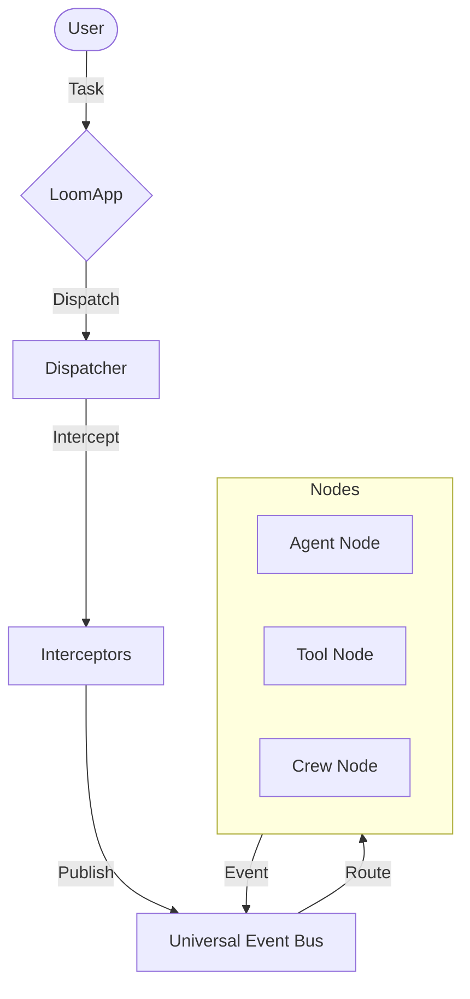

# Getting Started with Loom

Welcome to Loom, a **Protocol-First, Fractal, Memory-Aware AI Agent Framework**.

Loom is designed for building robust, long-running, and intelligent agent systems that can scale from simple scripts to distributed swarms.

## High-Level Architecture



## Prerequisites

- **Python 3.9+**: Loom leverages modern Python features.
- Basic understanding of **`asyncio`**: Loom is fully asynchronous.

## Installation

```bash
pip install loom-agent
```

## Next Steps

1. **[Quickstart](quickstart.md)**: Build your first "Hello World" agent in 5 minutes.
2. **[Core Concepts](../02_core_concepts/index.md)**: Understand how Loom works under the hood.
