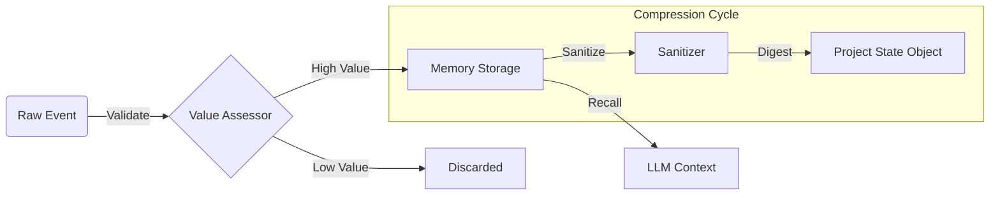

# Metabolic Memory System

Loom introduces a biological metaphor for memory management called **Metabolic Memory**. Traditional agents append history until the context window overflows. Loom **digests** information.

## The Problem
Context windows are expensive and finite. "Rolling windows" lose critical early context. "Summarization" loses specific details.

## The Solution: Metabolism



Information flows through three stages:

### 1. Ingestion (Validation)
Before information enters memory, it is assessed for value.
- **Validators**: `LLMValueAssessor` or `HeuristicValueAssessor` score incoming observations.
- Low-value noise is discarded immediately.
- *Example*: An agent trying 5 different search queries. Only the successful query and result are retained; the failed attempts are discarded or summarized as "Tried X, Y, Z without success."

### 2. Digestion (Sanitization)
As information moves from a child node (e.g., a Tool or Sub-Agent) to a parent, it is sanitized.
- **Sanitizers**: `BubbleUpSanitizer` extracts high-level signals (Success/Fail/Key Insight) and strips verbose logs.
- This prevents "pollution" of the supervisor's context.

### 3. Assimilation (PSO)
Short-term episodes are consolidated into a **Project State Object (PSO)**.
- The PSO is a structured JSON object representing the *current state of the world* (e.g., `{"files_created": ["a.py"], "status": "testing"}`).
- The Agent sees the PSO + Recent History, ensuring it stays grounded in the big picture without needing the entire history log.

## Usage
By default, `AgentNode` uses `MetabolicMemory`. You can configure its strictness:

```python
from loom.builtin.memory import MetabolicMemory

memory = MetabolicMemory(
    validator=MyStrictValidator(),
    sanitizer=CompressiveSanitizer()
)
```
