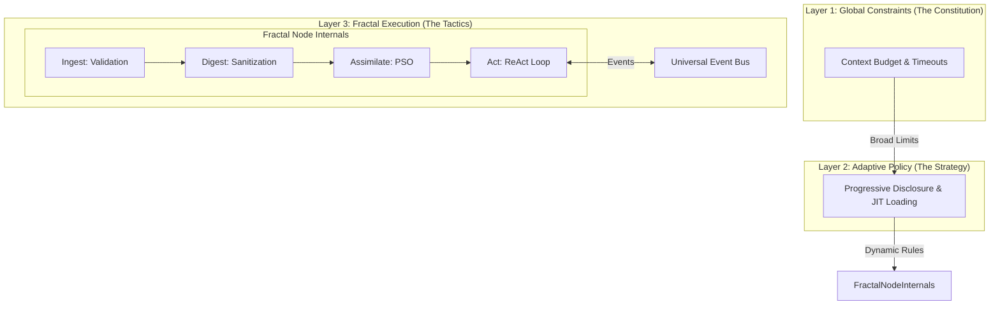

# Design Philosophy: Controlled Fractal & Protocol-First

The design of the Loom Framework is grounded in a deep synthesis of **Fractal Theory**, **Cybernetics**, and **Anthropic's core insights on AI Agents**.

Our goal is to resolve the central tension in AI Agent systems: **How do we maintain control and determinism while pursuing high degrees of freedom and adaptability?**

## I. Architectural Theory: Controlled Fractal

We believe that a perfect intelligent system is a dialectical unity of **Control within Self-Organization** and **Self-Organization within a Framework of Control**.

### 1. The Core Tension
-   **Fractal Theory (Liberty)**: Emphasizes self-similarity, recursion, and emergence. Agents can contain Agents, forming infinitely complex networks. This brings immense flexibility but carries the risk of **loss of control**.
-   **Cybernetics (Order)**: Emphasizes state, feedback, and constraints. It guarantees system stability through deterministic rules. This brings reliability but can lead to **rigidity**.

Loom's solution is the **"Controlled Fractal"**: Allowing infinite local fractal growth under strict global constraints.

### 2. The Architecture

Loom implements this philosophy through a **Three-Layer Regulation Architecture**.

*   **Layer 1: Global Constraints (The Constitution)**
    *   **Context Budget**: A hard limit (e.g., 200k tokens) that no agent or swarm can exceed.
    *   **Timeout**: Strict temporal boundaries to prevent infinite stalls.
    *   *Philosophy*: Like physics in the real world, these are immutable laws that define the "Possible Space."

*   **Layer 2: Adaptive Policy (The Strategy)**
    *   **Progressive Disclosure**: Skills and information are loaded in layers (Metadata -> Content -> Files) only when needed.
    *   **JIT Loading**: Context is fetched Just-In-Time, not pre-loaded.
    *   *Philosophy*: Like Doasium's "Wu Wei," this maximizes efficiency by doing only what is necessary within the constraints.

*   **Layer 3: Fractal Execution (The Tactics)**
    *   **Fractal Nodes**: Every component (Agent, Tool, Crew) is a Node. They can be composed recursively.
    *   **Self-Organization**: Nodes dynamically route tasks and form teams based on the task at hand.
    *   *Philosophy*: The realm of emergence, where complex intelligence arises from simple interactions.

---

## II. Implementation Principle: Protocol-First

To support this theory, we chose the **Protocol-First** path for engineering implementation. This is the biggest difference between Loom and traditional frameworks.

### 1. Behavior over Inheritance
Traditional inheritance-based programming leads to brittle hierarchies. Loom uses Python's `typing.Protocol` to define **contracts of behavior**.

This aligns perfectly with **Fractal Theory**: as long as an object behaves like a Node (adheres to `NodeProtocol`), it *is* a Node, regardless of whether it is a simple function or a complex distributed Swarm.

### 2. Core Protocols
*   **`NodeProtocol`**: The universal interface (`process`, `call`). It erases the distinction between "Tool" and "Agent" at the network layer.
*   **`MemoryStrategy`**: Defines cognitive state. It allows swapping the biological **Metabolic Memory** for a mechanical Vector Store if needed.
*   **`TransportProtocol`**: Defines communication. It allows the system to scale from a single process to a global cluster without code changes.

---

## III. Biological Metaphor: Metabolic Memory

Traditional RAG (Retrieval-Augmented Generation) focuses on "Retrieval," while Loom focuses on **"Metabolism."**

*   **Ingestion**: Validators filter out low-value information before it enters the system.
*   **Digestion**: Sanitizers clean, compress, and extract signal from noise as information moves up the hierarchy.
*   **Assimilation**: Intelligent Agents solidify short-term episodes into a **PSO (Project State Object)**, representing "Long-Term Cognition."

This mechanism solves the **finite Context Window** problem not by simple truncation, but through a biological-like information processing lifecycle.

---

## IV. The Ultimate Formula

Loom's design philosophy can be summarized as:

$$ \text{Intelligence} = \text{Emergence} \times \text{Control} $$
$$ \text{Intelligence} = (\text{Free Exploration} \times \text{Boundary Constraints}) $$

We are dedicated to providing the most robust **Boundary Constraints** (Layer 1) so that your Agents can engage in the wildest **Free Exploration** (Layer 3) within them.
