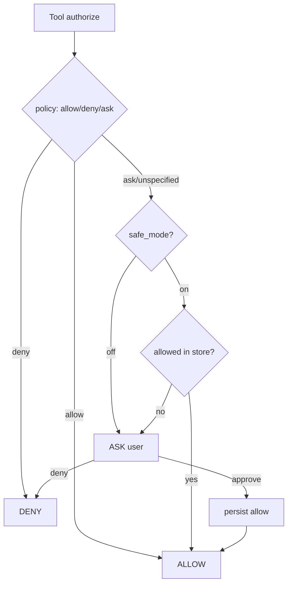

Loom 权限系统（安全模式 + 持久化授权）

Loom 提供“框架化”的权限能力，帮助你以最小改动获得可控的工具执行安全性。

核心能力
- 安全模式（safe_mode）：开启后，未知工具默认不放行，走“询问-批准-持久化”的流程。
- 持久化授权（PermissionStore）：把已批准的工具加入允许列表，存储于 `~/.loom/config.json`。
- 策略优先：显式 `permission_policy` 的 `allow/deny/ask` 优先于安全模式（更强显式覆盖）。

使用方式

```python
from loom import agent

# 询问回调（返回 True 表示允许并持久化；False 拒绝）

def ask_handler(tool_name: str, args: dict) -> bool:
    print(f"[ask] 是否允许执行工具: {tool_name}({args}) ? [y/N]")
    return input().strip().lower().startswith("y")

app = agent(
    provider="openai",
    model="gpt-4o",
    tools=[...],
    safe_mode=True,           # 开启安全模式
    ask_handler=ask_handler,  # 用户确认回调
)
```

- 第一次遇到某工具，会调用 `ask_handler`。若用户同意，工具名将写入 `~/.loom/config.json` 的 `allowed_tools` 列表，并从此自动放行。
- 若你提供了 `permission_policy={"write_file": "deny"}` 等策略，则该策略优先：
  - `deny` 始终拒绝
  - `allow` 直接放行
 - `ask` 依旧走询问流程（同上）

配置文件结构

路径：`~/.loom/config.json`

```json
{
  "allowed_tools": ["*", "read_file", "grep", "write_file"]
}
```

- `"*"` 表示放行所有工具（仅建议在受控环境中使用）。
- 你也可以手动移除条目来收紧权限。

设计原则
- 默认兼容：不启用 `safe_mode` 时，保持“默认允许”的原行为。
- 框架优先：能力内置为 PermissionManager 的通用实现，上层按需开启即可。
- 可演进：未来可在特定工具中扩展更细粒度的权限粒度（如命令前缀、路径范围等）。

权限流程（Mermaid）


