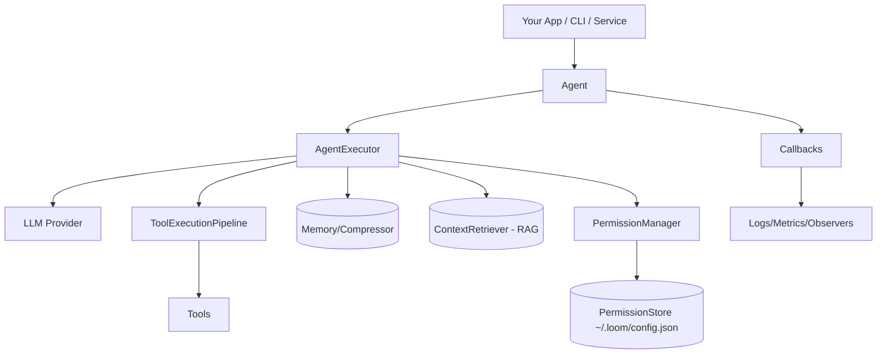
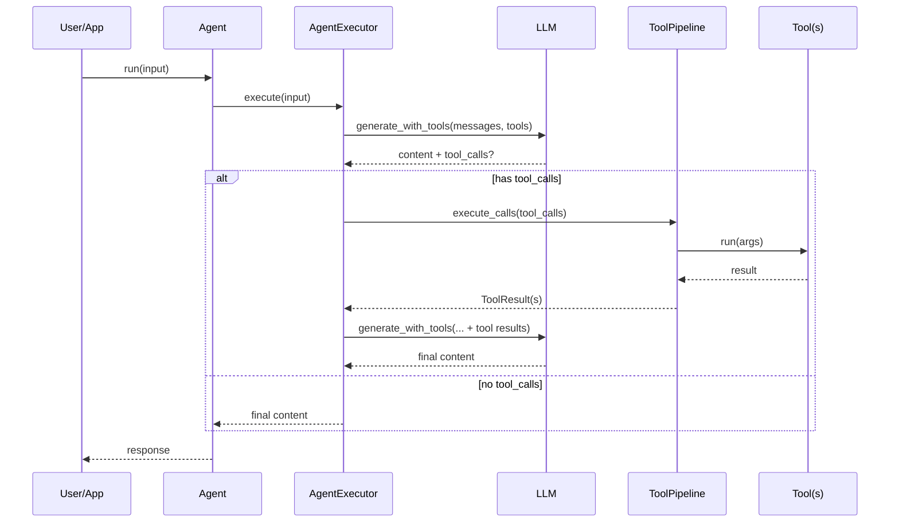
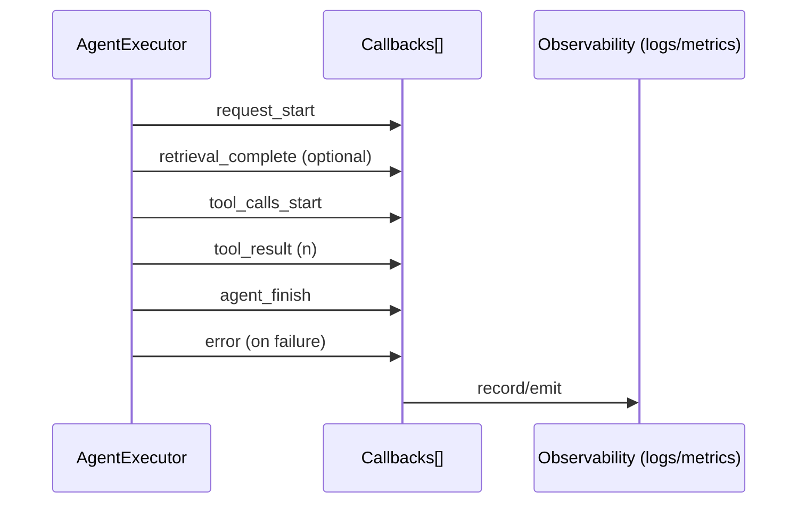
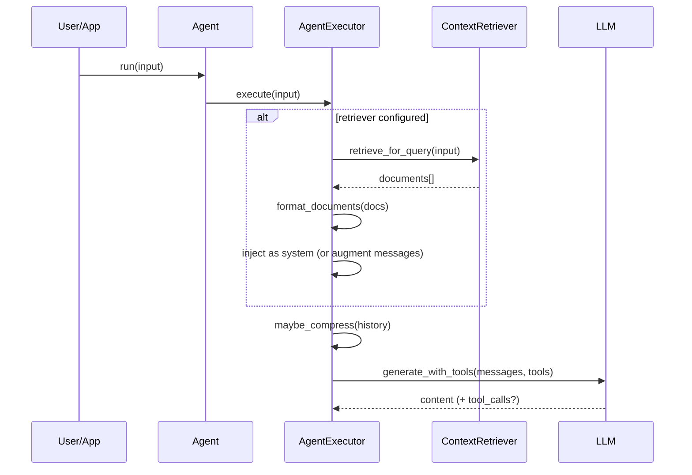
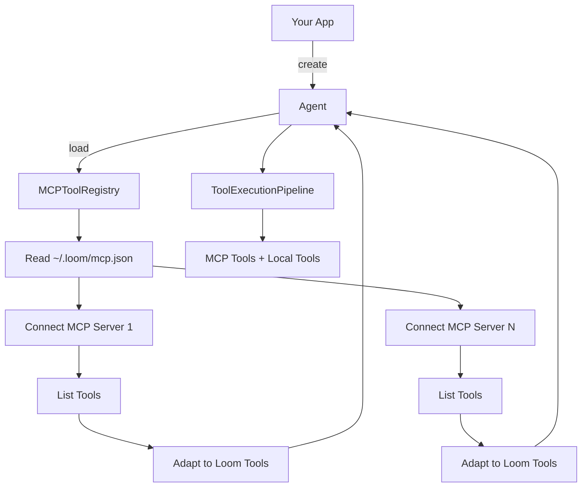

Loom 框架系统化指南（概念、教程、参考）

目标与理念
- 框架优先：以代码注册与组合的方式构建 Agent 系统，保持类型安全与可维护性。
- 渐进式复杂：最小示例开箱即用，按需引入工具、安全、子 Agent、RAG/MCP、回调与指标。
- 可替换与可观察：LLM、工具、权限、回调均为可插拔组件，统一事件流便于调试与监控。

架构总览
- 交互层：你的应用（CLI/服务/Notebook）持有一个或多个 `Agent` 实例。
- 执行层：`AgentExecutor` 管理消息、LLM 调用与工具调用回路（ReAct 风格）。
- 工具层：`ToolExecutionPipeline` 负责验证、授权、调度与格式化工具结果。
- 安全层：`PermissionManager` 与 `PermissionStore` 实现策略 + 安全模式 + 持久化授权。
- 可观测：`Callbacks` 统一发出 `request_start/tool_calls_start/tool_result/agent_finish/error` 等事件。

核心概念与模块
- Agent（对外入口）
  - 文件：loom/components/agent.py:1
  - 作用：组合 LLM、工具、权限、回调与高级选项（RAG、压缩）。
- AgentExecutor（主循环）
  - 文件：loom/core/agent_executor.py:1
  - 作用：按需注入系统提示、管理消息历史、调用 LLM（含工具）、执行工具、流式输出。
- 工具 Tool
  - 接口：loom/interfaces/tool.py:1
  - 创建：使用 `@loom.tool` 装饰器（loom/tooling.py:11）或继承 `BaseTool`。
- 工具流水线 ToolExecutionPipeline
  - 文件：loom/core/tool_pipeline.py:1
  - 阶段：Discover → Validate → Authorize → Execute → Format。
- 权限 PermissionManager / PermissionStore
  - 文件：loom/core/permissions.py:1，loom/core/permission_store.py:1
  - 策略（allow/deny/ask） + 安全模式（safe_mode） + 持久化授权（~/.loom/config.json）。
- LLM 工厂与配置
  - 文件：loom/llm/config.py:93，loom/llm/factory.py:70，loom/builtin/llms/openai.py:1
  - 支持 OpenAI/Anthropic/Cohere/Azure/OpenAI 兼容/自定义/本地（部分需按需实现或扩展）。
- 回调与事件流
  - 规范：docs/CALLBACKS_SPEC.md:3
  - 订阅执行阶段，汇总日志/指标，进行外部观测或控制。
- 子 Agent / 程序化 Agent Packs
  - 注册：loom/agents/registry.py:1（AgentSpec/注册/查询）
  - 引用：loom/agents/refs.py:1（agent_ref/model_ref）
  - 任务工具：loom/builtin/tools/task.py:1（`run` 与 `run_ref`）。
- RAG / MCP（可选）
  - RAG：在 AgentExecutor 中通过 `context_retriever` 注入文档（loom/core/agent_executor.py:25）。
  - MCP：最小客户端与工具适配（loom/mcp/registry.py:11，loom/mcp/tool_adapter.py:11）。

安装与环境
- 通过 Poetry 或 pip 安装本仓库；Provider 相关 API Key 通过环境变量配置。
- 环境变量：
  - LOOM_PROVIDER / LOOM_MODEL
  - OPENAI_API_KEY / OPENAI_BASE_URL
  - ANTHROPIC_API_KEY / COHERE_API_KEY / AZURE_OPENAI_API_KEY / AZURE_OPENAI_ENDPOINT

快速开始
```python
import asyncio
from loom import agent

async def main():
    bot = agent(provider="openai", model="gpt-4o")
    print(await bot.run("Give me one sentence"))

asyncio.run(main())
```

使用工具
```python
from loom import agent
from loom.builtin.tools import ReadFileTool, WriteFileTool, GlobTool, GrepTool

bot = agent(
    provider="openai", model="gpt-4o",
    tools=[ReadFileTool(), WriteFileTool(), GlobTool(), GrepTool()],
)
```

自定义工具（@tool）
```python
from loom import tool

@tool(name="add", description="Add two integers")
def add(a: int, b: int) -> int:
    return a + b

bot = agent(provider="openai", model="gpt-4o", tools=[add()])
```

流式输出与回调
```python
async for ev in bot.stream("Tell me a joke"):
    if ev.type == "text_delta":
        print(ev.content, end="")
```
- 回调：实现 `on_event(self, event_type: str, payload: dict)`，并在创建 Agent 时传入 `callbacks=[cb]`。

权限与安全模式（框架能力）
```python
def ask(tool_name: str, args: dict) -> bool:
    print(f"[ask] {tool_name}({args}) ? [y/N]")
    return input().strip().lower().startswith("y")

bot = agent(
    provider="openai", model="gpt-4o",
    tools=[...],
    safe_mode=True,
    ask_handler=ask,
)
```
- 策略优先：`permission_policy` 的 allow/deny/ask 优先于安全模式。
- 持久化授权：首次批准自动写入 `~/.loom/config.json` → `allowed_tools`。

子 Agent 与 Task 工具（程序化 Agent Packs）
```python
from loom import AgentSpec, register_agent, agent, agent_ref, model_ref
from loom.builtin.tools.task import TaskTool

register_agent(AgentSpec(
    agent_type="code-explorer",
    description="Broad code search and structure understanding",
    tools=["glob","grep","read_file"],
    model_name="gpt-4o",
    system_instructions="You are a code exploration agent...",
))

def make_subagent(max_iterations: int = 20, **kwargs):
    return agent(
        provider="openai",
        model=kwargs.get("model_name", "gpt-4o"),
        tools=[...],
        max_iterations=max_iterations,
        system_instructions=kwargs.get("system_instructions"),
        permission_policy=kwargs.get("permission_policy"),
    )

task = TaskTool(agent_factory=make_subagent)
main = agent(provider="openai", model="gpt-4o", tools=[task])

# 引用式调用（框架化）
out = await task.run_ref(
    description="Explore repo",
    prompt="List Python files",
    agent=agent_ref("code-explorer"),
    model=model_ref("gpt-4o"),
)
```
- 行为：注入 system prompt、应用工具白名单（默认 deny，白名单 allow）、可选择覆盖模型。
- 兼容：若未注册也可回退到文件式 packs（`~/.loom/agents` / `.claude/agents`）。

RAG 集成（可选）
- 在 `AgentExecutor` 中传入 `context_retriever`，于系统提示前注入检索文档，见 loom/core/agent_executor.py:25。
- 模式：注入为 `system` 或拼接到用户消息前；可统计检索次数与文档数量。

MCP 集成（可选）
- 使用 `MCPToolRegistry` 连接本地 MCP server 并加载工具（loom/mcp/registry.py:11）。
- 将加载到的 MCP 工具包装为 Loom 工具（loom/mcp/tool_adapter.py:11），并添加到 `tools` 列表。

高级主题
- 自定义 LLM Provider
  - 实现 `BaseLLM`（参考 OpenAI 实现：loom/builtin/llms/openai.py:1），并在 `LLMFactory` 注册。
- 自定义 Memory/Compressor
  - 实现接口（loom/interfaces/memory.py / loom/interfaces/compressor.py），并传入 Agent。
- 并发与调度
  - `ToolExecutionPipeline` 使用 `Scheduler` 执行工具（loom/core/tool_pipeline.py:1）。
- 错误与重试
  - 工具阶段化处理时，验证失败抛出 `ToolValidationError`，权限失败抛出 `PermissionDeniedError`。

配置与环境变量
- 统一通过 `LLMConfig/LLMFactory` 创建 provider 对象（loom/llm/config.py:93, loom/llm/factory.py:70）。
- `agent_from_env()` 支持通过 `LOOM_PROVIDER/LOOM_MODEL` 与各 provider API Key 直接构造。

最佳实践
- 组织内定义标准 AgentSpec，以引用（`run_ref` + `agent_ref()`）驱动子 Agent 调用，避免字符串散落。
- 对危险工具在安全模式下启用询问与持久化；或通过 `permission_policy` 显式 deny。
- 使用回调记录 `request_start/agent_finish/error` 等关键事件，形成统一观测面板（日志/指标）。

常见问题（FAQ）
- ImportError: No module named 'loom' → 在仓库根目录执行 `pip install -e .` 或 `poetry install`。
- 工具未放行 → 检查 `safe_mode` 与 `~/.loom/config.json` 的 `allowed_tools`，或配置 `permission_policy`。
- OpenAI/Anthropic 错误 → 检查 API Key 与 base_url（见环境变量章节）。

可视化（Mermaid）

系统架构概览



Agent 执行主循环（含工具调用）



工具流水线阶段（验证/授权/调度）


权限与安全模式（策略优先 + 持久化授权）

```mermaid
flowchart TD
    S[Start authorize(tool,args)] --> P{Policy action?}
    P -->|allow| AL[ALLOW]
    P -->|deny| DN[DENY]
    P -->|ask/unspecified| SM{safe_mode?}
    SM -->|off| ASK[ASK user]
    SM -->|on| ST{in PermissionStore?}
    ST -->|yes| AL
    ST -->|no| ASK
    ASK -->|user approves| SAVE[persist allow -> store]
    SAVE --> AL
    ASK -->|user denies| DN
```

回调与事件流



RAG 注入路径（系统提示/上下文压缩）



MCP 集成流程（发现/适配/使用）


