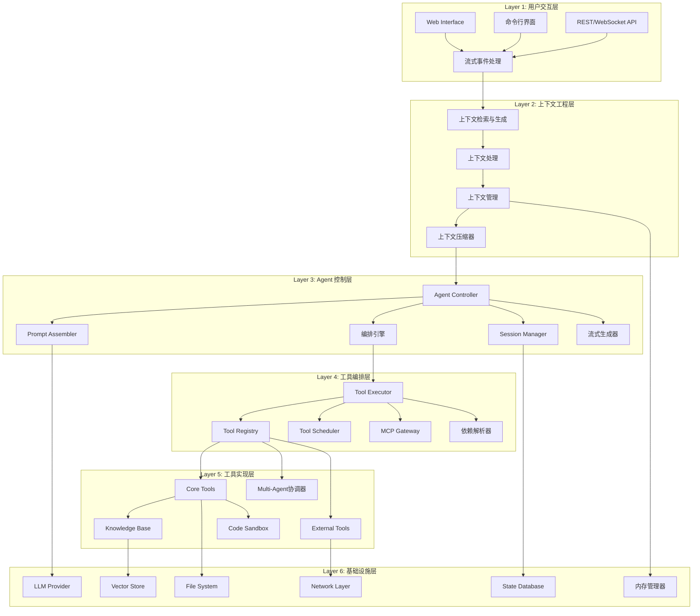

# Lexicon Agent: 系统设计与开发指南 v2.0

## 1. 执行摘要

Lexicon (/ˈlɛksɪkɒn/) 是下一代自主式智能助理框架，专为处理复杂、多步骤任务而设计。通过融合自主决策、工具驱动架构和流式用户体验，Lexicon 旨在成为生产级 AI Agent 系统的标杆。

### 核心价值主张
- **自主性 (Autonomy)**: 具备独立规划、执行和自我纠错的能力
- **工具驱动 (Tool-Driven)**: 所有外部交互都通过类型安全的工具接口实现
- **流式体验 (Streaming First)**: 实时反馈思考过程和执行状态
- **模块化设计**: 高度解耦的架构支持快速扩展和维护
- **生产就绪**: 内置错误恢复、状态管理和性能优化

## 2. 系统架构设计

### 2.1 上下文工程驱动的分层架构

基于上下文工程理论和Claude Code的先进设计模式，Lexicon Agent采用六层架构设计，每层都围绕上下文的获取、处理和管理进行优化：



### 2.2 上下文工程核心架构

上下文工程构成Lexicon Agent的理论基础，通过三个基本组件解决大语言模型中信息管理的核心挑战：

#### 2.2.1 上下文检索与生成 (Context Retrieval & Generation)
**核心职责**: 通过提示工程、外部知识检索和动态上下文组装获取适当的上下文信息

```python
class ContextRetrievalEngine:
    def __init__(self):
        self.prompt_engineer = PromptEngineer()
        self.knowledge_retriever = KnowledgeRetriever()
        self.context_assembler = DynamicContextAssembler()
        self.retrieval_strategies = {
            'semantic_search': SemanticSearchStrategy(),
            'temporal_context': TemporalContextStrategy(),
            'task_specific': TaskSpecificStrategy(),
            'multi_modal': MultiModalStrategy()
        }
    
    async def retrieve_context(self, 
                              query: str, 
                              session_state: SessionState,
                              task_context: TaskContext) -> ContextPackage:
        
        # 1. 意图识别和上下文需求分析
        intent = await self.prompt_engineer.analyze_intent(query)
        context_requirements = self._determine_context_needs(intent, task_context)
        
        # 2. 多策略并行检索
        retrieval_tasks = []
        for strategy_name in context_requirements.strategies:
            strategy = self.retrieval_strategies[strategy_name]
            task = strategy.retrieve(query, session_state, context_requirements)
            retrieval_tasks.append(task)
        
        # 3. 动态上下文组装
        retrieved_contexts = await asyncio.gather(*retrieval_tasks)
        assembled_context = await self.context_assembler.assemble(
            retrieved_contexts, context_requirements
        )
        
        return ContextPackage(
            primary_context=assembled_context,
            metadata=context_requirements,
            retrieval_metrics=self._calculate_metrics(retrieved_contexts)
        )
```

#### 2.2.2 上下文处理 (Context Processing)
**核心职责**: 通过长序列处理、自我优化机制和结构化数据集成变换和优化获取的信息

```python
class ContextProcessor:
    def __init__(self):
        self.sequence_processor = LongSequenceProcessor()
        self.self_optimizer = SelfOptimizationEngine()
        self.data_integrator = StructuredDataIntegrator()
        self.normalization_engine = NormalizationEngine()
    
    async def process_context(self, 
                             context_package: ContextPackage,
                             processing_constraints: ProcessingConstraints) -> ProcessedContext:
        
        # 1. 长序列智能处理 (受Claude Code启发)
        processed_sequences = await self.sequence_processor.process(
            context_package.primary_context,
            max_length=processing_constraints.max_tokens,
            preserve_structure=True
        )
        
        # 2. 结构化数据集成
        integrated_data = await self.data_integrator.integrate(
            processed_sequences,
            context_package.metadata.data_sources
        )
        
        # 3. 自我优化机制
        optimized_context = await self.self_optimizer.optimize(
            integrated_data,
            optimization_goals=processing_constraints.goals,
            feedback_loop=True
        )
        
        # 4. 上下文标准化 (类似normalizeToSize算法)
        normalized_context = await self.normalization_engine.normalize(
            optimized_context,
            target_size=processing_constraints.target_size,
            preserve_priority=True
        )
        
        return ProcessedContext(
            content=normalized_context,
            processing_metadata=self._generate_metadata(processed_sequences),
            optimization_trace=self.self_optimizer.get_trace()
        )

class LongSequenceProcessor:
    """长序列处理器，实现类似Claude Code的智能截断"""
    
    async def process(self, sequences: List[ContextSequence], 
                     max_length: int, preserve_structure: bool = True) -> List[ProcessedSequence]:
        
        processed = []
        for sequence in sequences:
            if len(sequence.tokens) <= max_length:
                processed.append(ProcessedSequence.from_sequence(sequence))
                continue
            
            # 智能截断策略 (基于Claude Code的normalizeToSize思想)
            if preserve_structure:
                truncated = await self._structure_aware_truncation(sequence, max_length)
            else:
                truncated = await self._priority_based_truncation(sequence, max_length)
            
            processed.append(truncated)
        
        return processed
```

#### 2.2.3 上下文管理 (Context Management)
**核心职责**: 通过解决基本约束、实施复杂的内存层次结构和开发压缩技术高效组织和利用上下文信息

```python
class ContextManager:
    def __init__(self):
        self.constraint_resolver = ConstraintResolver()
        self.memory_hierarchy = MemoryHierarchy()
        self.compression_engine = CompressionEngine()
        self.context_cache = ContextCache()
        
    async def manage_context(self, 
                           processed_context: ProcessedContext,
                           session_constraints: SessionConstraints) -> ManagedContext:
        
        # 1. 基本约束解决
        resolved_constraints = await self.constraint_resolver.resolve(
            processed_context,
            session_constraints
        )
        
        # 2. 内存层次结构管理
        memory_allocation = await self.memory_hierarchy.allocate(
            processed_context,
            allocation_strategy=resolved_constraints.memory_strategy
        )
        
        # 3. 智能压缩 (受Claude Code弱引用机制启发)
        compressed_context = await self.compression_engine.compress(
            processed_context,
            compression_level=resolved_constraints.compression_level,
            preserve_semantics=True
        )
        
        # 4. 上下文缓存管理
        cache_entry = await self.context_cache.store(
            compressed_context,
            cache_policy=resolved_constraints.cache_policy
        )
        
        return ManagedContext(
            active_context=compressed_context,
            memory_footprint=memory_allocation,
            cache_reference=cache_entry,
            management_metadata=resolved_constraints
        )

class MemoryHierarchy:
    """多层内存管理，类似Claude Code的弱引用系统"""
    
    def __init__(self):
        self.hot_memory = {}  # 频繁访问的上下文
        self.warm_memory = WeakValueDictionary()  # 中等频率访问
        self.cold_storage = PersistentStorage()  # 长期存储
        self.gc_registry = FinalizationRegistry()
    
    async def allocate(self, context: ProcessedContext, 
                      allocation_strategy: AllocationStrategy) -> MemoryAllocation:
        
        allocation = MemoryAllocation()
        
        # 根据访问模式和重要性分配到不同层次
        if allocation_strategy.priority == 'high':
            self.hot_memory[context.id] = context
            allocation.tier = 'hot'
        elif allocation_strategy.priority == 'medium':
            weak_ref = weakref.ref(context, self._cleanup_callback)
            self.warm_memory[context.id] = weak_ref
            allocation.tier = 'warm'
        else:
            await self.cold_storage.store(context.id, context)
            allocation.tier = 'cold'
        
        # 注册垃圾回收回调
        self.gc_registry.register(context, context.id)
        
        return allocation
```

### 2.3 编排机制 (Orchestration Mechanisms)

编排机制构成多智能体系统的关键协调基础设施，管理智能体选择、上下文分布和交互流程控制：

```python
class OrchestrationEngine:
    """编排引擎，实现多智能体协调"""
    
    def __init__(self):
        self.agent_selector = AgentSelector()
        self.context_distributor = ContextDistributor() 
        self.interaction_controller = InteractionController()
        self.orchestration_strategies = {
            'prior': PriorOrchestrationStrategy(),    # 先验编排
            'posterior': PosteriorOrchestrationStrategy(),  # 后验编排
            'functional': FunctionalOrchestrationStrategy(),  # 基于功能的编排
            'component': ComponentOrchestrationStrategy(),   # 基于组件的编排
            'puppeteer': PuppeteerOrchestrationStrategy()   # 木偶师风格编排
        }
    
    async def orchestrate(self, 
                         user_input: UserInput,
                         available_agents: List[Agent],
                         context: OrchestrationContext) -> OrchestrationResult:
        
        # 1. 意图识别和策略选择
        intent = await self._analyze_intent(user_input)
        strategy = self._select_orchestration_strategy(intent, context)
        
        # 2. 智能体选择和上下文分布
        selected_agents = await self.agent_selector.select(
            available_agents, intent, strategy
        )
        
        distributed_context = await self.context_distributor.distribute(
            context, selected_agents, strategy
        )
        
        # 3. 交互流程控制
        orchestration_flow = await self.interaction_controller.create_flow(
            selected_agents, distributed_context, strategy
        )
        
        # 4. 执行编排策略
        result = await strategy.execute(orchestration_flow)
        
        return OrchestrationResult(
            primary_result=result,
            participating_agents=selected_agents,
            context_usage=distributed_context,
            orchestration_metadata=strategy.get_metadata()
        )
```

### 2.4 核心组件详解

#### Agent Controller (agent.py)
**职责**: Agent 的核心大脑，实现六阶段流式生成循环，整合上下文工程和编排机制

**核心特性** (受Claude Code的`tt`函数启发):
- 六阶段异步生成器主循环
- 上下文工程驱动的智能处理
- 基于副作用的工具分类和并行执行
- 自动上下文压缩和恢复机制
- 多智能体编排协调

**核心接口**:
```python
class AgentController:
    """
    六阶段流式生成器，类似Claude Code的tt函数
    Phase 1: 上下文检索与生成
    Phase 2: 上下文处理与优化  
    Phase 3: LLM流式响应处理
    Phase 4: 工具调用编排与执行
    Phase 5: 结果聚合与上下文更新
    Phase 6: 递归循环控制
    """
    
    def __init__(self, 
                 context_engine: ContextRetrievalEngine,
                 context_processor: ContextProcessor,
                 context_manager: ContextManager,
                 orchestration_engine: OrchestrationEngine,
                 streaming_generator: StreamingGenerator):
        self.context_engine = context_engine
        self.context_processor = context_processor
        self.context_manager = context_manager
        self.orchestration_engine = orchestration_engine
        self.streaming_generator = streaming_generator
        self.conversation_state = ConversationState()
        
    async def stream_run(self, 
                        user_message: str,
                        session_context: SessionContext) -> AsyncIterator[AgentEvent]:
        """
        六阶段流式主循环
        """
        turn_id = self._generate_turn_id()
        
        # Phase 1: 上下文检索与生成
        yield AgentEvent(type='thinking', content='分析需求并检索相关上下文...')
        
        context_package = await self.context_engine.retrieve_context(
            query=user_message,
            session_state=session_context.session_state,
            task_context=session_context.task_context
        )
        
        # Phase 2: 上下文处理与优化
        yield AgentEvent(type='context_processing', content='处理和优化上下文信息...')
        
        processed_context = await self.context_processor.process_context(
            context_package=context_package,
            processing_constraints=session_context.constraints
        )
        
        managed_context = await self.context_manager.manage_context(
            processed_context=processed_context,
            session_constraints=session_context.constraints
        )
        
        # Phase 3: LLM流式响应处理
        yield AgentEvent(type='llm_streaming', content='开始LLM流式响应...')
        
        llm_stream = self.streaming_generator.stream_response(
            user_message=user_message,
            context=managed_context,
            available_tools=session_context.available_tools
        )
        
        tool_calls = []
        accumulated_response = ""
        
        async for stream_event in llm_stream:
            if stream_event.type == 'text_delta':
                accumulated_response += stream_event.content
                yield AgentEvent(type='response_delta', content=stream_event.content)
            elif stream_event.type == 'tool_call':
                tool_calls.append(stream_event.content)
                yield AgentEvent(type='tool_call_detected', content=stream_event.content)
        
        # Phase 4: 工具调用编排与执行 (如果需要)
        if tool_calls:
            yield AgentEvent(type='tool_orchestration', content='编排和执行工具调用...')
            
            # 智能工具分类和编排 (受Claude Code启发)
            orchestrated_execution = await self.orchestration_engine.orchestrate_tools(
                tool_calls=tool_calls,
                context=managed_context,
                execution_strategy='smart_parallel'  # 只读并行，写入串行
            )
            
            async for execution_event in orchestrated_execution:
                yield execution_event
        
        # Phase 5: 结果聚合与上下文更新
        yield AgentEvent(type='context_update', content='更新对话上下文...')
        
        # 更新对话状态
        await self.conversation_state.update(
            turn_id=turn_id,
            user_message=user_message,
            assistant_response=accumulated_response,
            tool_results=[event.content for event in tool_calls],
            context_usage=managed_context.memory_footprint
        )
        
        # Phase 6: 递归循环控制
        # 检查是否需要继续处理
        if self._should_continue_processing(accumulated_response, tool_calls):
            # 递归调用以处理后续轮次
            async for recursive_event in self.stream_run(
                user_message="继续处理上述任务",
                session_context=session_context
            ):
                yield recursive_event
        else:
            yield AgentEvent(type='turn_complete', content='本轮对话完成')

    async def handle_tool_calls(self, 
                               calls: List[ToolCall],
                               context: ManagedContext) -> AsyncIterator[ToolResult]:
        """
        智能工具调用处理，实现类似Claude Code的并行/串行策略
        """
        # 工具分类 (受Claude Code启发)
        safe_tools = []  # 只读，无副作用
        cautious_tools = []  # 有限副作用，可并行
        exclusive_tools = []  # 需要独占执行
        
        for call in calls:
            tool_safety = self._classify_tool_safety(call.tool_name)
            if tool_safety == ToolSafetyLevel.SAFE:
                safe_tools.append(call)
            elif tool_safety == ToolSafetyLevel.CAUTIOUS:
                cautious_tools.append(call)
            else:
                exclusive_tools.append(call)
        
        # 并行执行安全工具
        if safe_tools:
            async for result in self._execute_parallel_tools(safe_tools, context):
                yield result
        
        # 谨慎执行中等风险工具
        if cautious_tools:
            async for result in self._execute_cautious_tools(cautious_tools, context):
                yield result
        
        # 串行执行独占工具
        for call in exclusive_tools:
            result = await self._execute_single_tool(call, context)
            yield result

    async def recover_from_error(self, 
                                error: AgentError,
                                context: ErrorContext) -> RecoveryAction:
        """
        多层错误恢复机制，集成上下文重建
        """
        # 1. 尝试上下文恢复
        if isinstance(error, ContextError):
            recovered_context = await self.context_manager.recover_context(
                error.context_id, error.corruption_type
            )
            if recovered_context:
                return RecoveryAction.CONTEXT_RECOVERED(recovered_context)
        
        # 2. 尝试自动重试
        if error.retry_count < 3 and self._is_retryable_error(error):
            return RecoveryAction.RETRY_WITH_BACKOFF(
                delay=2 ** error.retry_count
            )
        
        # 3. LLM辅助恢复
        recovery_prompt = await self._generate_recovery_prompt(error, context)
        return RecoveryAction.LLM_ASSISTED_RECOVERY(recovery_prompt)
```

#### Session Manager (session.py)

**职责**: 管理上下文感知的会话状态和环境适应系统

**上下文管理与环境适应特性**:

- **全局状态维护**: 支持多智能体系统的操作模式多样性
- **会话边界定义**: 基于会话的上下文优化和协作范围控制  
- **事件驱动协调**: 智能体动态进入和退出机制
- **上下文适应性**: 根据任务需求动态调整通信模式和角色分配

**状态层次架构**:

- **瞬时状态**: 当前请求的临时变量和即时上下文
- **会话状态**: 单次对话的持续状态和上下文记忆
- **用户状态**: 跨会话的用户偏好、历史模式和个性化配置
- **全局状态**: 系统级配置、智能体池状态和跨会话协作上下文

**实现细节**:

```python
class SessionManager:
    """
    上下文感知的会话管理器，实现环境适应和智能体协调
    """
    
    def __init__(self):
        # 多层次状态管理 (受Claude Code启发)
        self.working_memory: ContextAwareMemory = ContextAwareMemory()
        self.user_preferences: UserPreferences = UserPreferences()
        self.conversation_context: ConversationContext = ConversationContext()
        self.global_context: GlobalContext = GlobalContext()
        
        # 上下文管理组件
        self.context_tracker = ContextTracker()
        self.environment_adapter = EnvironmentAdapter()
        self.collaboration_manager = CollaborationManager()
        
        # 会话边界和协作范围
        self.session_boundaries = SessionBoundaryManager()
        self.collaboration_scope = CollaborationScope()
    
    async def manage_session_context(self, 
                                   session_id: str,
                                   context_requirements: ContextRequirements) -> SessionContext:
        """
        管理会话上下文，支持多智能体协作
        """
        # 1. 恢复或创建会话状态
        session_state = await self._restore_or_create_session(session_id)
        
        # 2. 上下文跟踪和适应
        tracked_context = await self.context_tracker.track_session_evolution(
            session_state, context_requirements
        )
        
        # 3. 环境适应性调整
        adapted_environment = await self.environment_adapter.adapt_to_context(
            tracked_context, session_state.environment_state
        )
        
        # 4. 协作范围设定
        collaboration_context = await self.collaboration_manager.establish_scope(
            session_state, adapted_environment, context_requirements
        )
        
        return SessionContext(
            session_state=session_state,
            tracked_context=tracked_context,
            environment=adapted_environment,
            collaboration=collaboration_context
        )
    
    async def handle_agent_coordination(self, 
                                      participating_agents: List[Agent],
                                      coordination_event: CoordinationEvent) -> CoordinationResult:
        """
        处理智能体协调，支持动态进入和退出
        """
        # 事件驱动的协调机制
        if coordination_event.type == 'agent_join':
            return await self._handle_agent_join(coordination_event.agent, participating_agents)
        elif coordination_event.type == 'agent_leave':
            return await self._handle_agent_leave(coordination_event.agent, participating_agents)
        elif coordination_event.type == 'context_share':
            return await self._handle_context_sharing(coordination_event, participating_agents)
        elif coordination_event.type == 'task_handoff':
            return await self._handle_task_handoff(coordination_event, participating_agents)
    
    async def adapt_communication_patterns(self, 
                                         context_requirements: ContextRequirements,
                                         current_agents: List[Agent]) -> CommunicationPattern:
        """
        根据上下文需求调整通信模式和智能体角色
        """
        # 分析当前上下文和任务复杂度
        complexity_analysis = await self.environment_adapter.analyze_task_complexity(
            context_requirements
        )
        
        # 根据复杂度选择通信模式
        if complexity_analysis.requires_decomposition:
            pattern = await self._create_hierarchical_pattern(current_agents, complexity_analysis)
        elif complexity_analysis.requires_parallel_processing:
            pattern = await self._create_parallel_pattern(current_agents, complexity_analysis)
        else:
            pattern = await self._create_sequential_pattern(current_agents, complexity_analysis)
        
        return pattern
    
    async def maintain_global_state(self, 
                                  system_events: List[SystemEvent]) -> GlobalStateUpdate:
        """
        维护全局状态，确保跨智能体的一致性
        """
        # 处理系统级事件
        for event in system_events:
            await self.global_context.process_event(event)
        
        # 更新智能体池状态
        agent_pool_update = await self.global_context.update_agent_pool_state()
        
        # 同步跨会话协作上下文
        cross_session_sync = await self.global_context.sync_cross_session_context()
        
        return GlobalStateUpdate(
            agent_pool=agent_pool_update,
            cross_session_context=cross_session_sync,
            system_metrics=self.global_context.get_system_metrics()
        )
    
    async def persist_state(self, session_context: SessionContext) -> None:
        """持久化会话状态，包括上下文记忆"""
        await self.working_memory.persist(session_context)
        await self.conversation_context.persist(session_context.tracked_context)
        
    async def restore_state(self, session_id: str) -> SessionContext:
        """恢复会话状态，重建上下文记忆"""
        restored_memory = await self.working_memory.restore(session_id)
        restored_context = await self.conversation_context.restore(session_id)
        
        return SessionContext.from_restored_state(restored_memory, restored_context)
    
    def get_context_for_prompt(self, 
                              session_context: SessionContext,
                              prompt_requirements: PromptRequirements) -> Dict[str, Any]:
        """
        为提示生成获取优化的上下文信息
        """
        # 基于重要性和相关性筛选上下文
        relevant_context = self.context_tracker.filter_relevant_context(
            session_context.tracked_context,
            prompt_requirements
        )
        
        # 应用上下文压缩策略
        compressed_context = self.environment_adapter.compress_context_for_prompt(
            relevant_context,
            prompt_requirements.max_tokens
        )
        
        return {
            'session_memory': compressed_context.session_memory,
            'user_preferences': compressed_context.user_preferences,
            'collaboration_context': compressed_context.collaboration_context,
            'environment_state': compressed_context.environment_state
        }

class ContextTracker:
    """上下文跟踪器，监控会话演进和上下文变化"""
    
    async def track_session_evolution(self, 
                                    session_state: SessionState,
                                    requirements: ContextRequirements) -> TrackedContext:
        """跟踪会话演进，识别上下文模式"""
        
        # 分析对话模式和主题演进
        conversation_patterns = await self._analyze_conversation_patterns(session_state)
        
        # 跟踪用户意图变化
        intent_evolution = await self._track_intent_evolution(session_state)
        
        # 监控上下文相关性变化
        relevance_dynamics = await self._monitor_relevance_dynamics(
            session_state, requirements
        )
        
        return TrackedContext(
            patterns=conversation_patterns,
            intent_evolution=intent_evolution,
            relevance_dynamics=relevance_dynamics,
            tracking_metadata=self._generate_tracking_metadata()
        )

class EnvironmentAdapter:
    """环境适应器，根据上下文动态调整系统行为"""
    
    async def adapt_to_context(self, 
                             tracked_context: TrackedContext,
                             current_environment: EnvironmentState) -> AdaptedEnvironment:
        """
        基于跟踪的上下文调整环境配置
        """
        # 分析环境适应需求
        adaptation_needs = await self._analyze_adaptation_needs(
            tracked_context, current_environment
        )
        
        # 调整智能体行为策略
        agent_behavior_config = await self._adapt_agent_behaviors(adaptation_needs)
        
        # 优化资源分配
        resource_allocation = await self._optimize_resource_allocation(adaptation_needs)
        
        # 调整通信协议
        communication_config = await self._adapt_communication_protocols(adaptation_needs)
        
        return AdaptedEnvironment(
            agent_behaviors=agent_behavior_config,
            resource_allocation=resource_allocation,
            communication=communication_config,
            adaptation_metadata=adaptation_needs
        )
```

#### Tool Executor (tool_executor.py)
**职责**: 智能化的工具调用编排和执行

**执行策略**:
- **并行执行**: 只读工具的并发调用
- **串行执行**: 写入工具的顺序执行
- **依赖解析**: 基于数据依赖的智能调度
- **资源管理**: 基于工具资源需求的负载均衡

**高级特性**:
```python
class ToolExecutor:
    async def execute_batch(self, calls: List[ToolCall]) -> List[ToolResult]:
        # 智能分析工具依赖关系
        dependency_graph = self._analyze_dependencies(calls)
        
        # 基于依赖图进行并行/串行执行
        return await self._execute_with_dependencies(dependency_graph)
    
    def _classify_tool_safety(self, tool: Tool) -> ToolSafetyLevel:
        # SAFE: 只读，无副作用
        # CAUTIOUS: 有限副作用，可并行
        # EXCLUSIVE: 需要独占执行
```

## 3. 工具系统设计

### 3.1 统一工具接口

所有工具都实现标准的 `Tool` 基类：

```python
from abc import ABC, abstractmethod
from typing import Any, Dict, Optional
import pydantic

class Tool(ABC):
    name: str
    description: str
    input_schema: Type[pydantic.BaseModel]
    safety_level: ToolSafetyLevel = ToolSafetyLevel.CAUTIOUS
    resource_requirements: ResourceRequirements = ResourceRequirements()
    
    @abstractmethod
    async def execute(self, input_data: pydantic.BaseModel) -> ToolResult:
        pass
    
    def can_run_parallel_with(self, other: 'Tool') -> bool:
        return self.safety_level == ToolSafetyLevel.SAFE and \
               not self.resource_requirements.conflicts_with(other.resource_requirements)
```

### 3.2 核心工具集

#### 知识库工具 (KnowledgeBaseTool)
采用统一接口设计，通过 action 参数区分操作：

```python
class KnowledgeBaseInput(pydantic.BaseModel):
    action: Literal["create", "add", "search", "list", "delete"] = \
        pydantic.Field(..., description="操作类型")
    kb_name: str = pydantic.Field(..., description="知识库名称")
    
    # 条件字段，根据 action 的不同而变化
    text: Optional[str] = pydantic.Field(None, description="添加的文本内容")
    query: Optional[str] = pydantic.Field(None, description="搜索查询")
    metadata: Optional[Dict[str, Any]] = pydantic.Field(None, description="元数据")
    top_k: int = pydantic.Field(5, description="返回结果数量")
    similarity_threshold: float = pydantic.Field(0.7, description="相似度阈值")

    @pydantic.root_validator
    def validate_action_requirements(cls, values):
        action = values.get('action')
        if action == 'add' and not values.get('text'):
            raise ValueError("action='add' requires 'text' field")
        elif action == 'search' and not values.get('query'):
            raise ValueError("action='search' requires 'query' field")
        return values
```

#### 文件系统工具
```python
class FileSystemTool(Tool):
    name = "file_system"
    safety_level = ToolSafetyLevel.CAUTIOUS  # 可能有写操作
    
    async def execute(self, input_data: FileSystemInput) -> ToolResult:
        action = input_data.action
        
        if action in ['read', 'list', 'stat']:
            # 只读操作，标记为安全并行
            self.safety_level = ToolSafetyLevel.SAFE
            
        handlers = {
            'read': self._read_file,
            'write': self._write_file,
            'append': self._append_file,
            'delete': self._delete_file,
            'list': self._list_directory,
            'stat': self._get_file_stats
        }
        
        return await handlers[action](input_data)
```

#### 代码执行工具 (CodeInterpreter)
```python
class CodeInterpreter(Tool):
    name = "code_interpreter"
    safety_level = ToolSafetyLevel.EXCLUSIVE  # 需要独占执行
    resource_requirements = ResourceRequirements(
        cpu_intensive=True,
        memory_mb=512,
        timeout_seconds=30
    )
    
    async def execute(self, input_data: CodeExecutionInput) -> ToolResult:
        # 使用 Docker 容器隔离执行
        container_config = {
            'image': 'lexicon-python-sandbox',
            'memory': '512m',
            'cpu_quota': 50000,  # 0.5 CPU
            'network_mode': 'none',  # 无网络访问
            'volumes': {
                self.workspace_dir: '/workspace'
            }
        }
        
        return await self._execute_in_container(input_data.code, container_config)
```

### 3.3 MCP (Multi-Process Communication) 外部工具协议

为支持外部工具集成，我们定义了基于 JSON-RPC 的 MCP 协议：

```python
class MCPProtocol:
    """MCP 协议实现"""
    
    async def initialize(self, capabilities: Dict[str, Any]) -> Dict[str, Any]:
        """协商能力和版本"""
        
    async def list_tools(self) -> List[ToolSchema]:
        """获取外部进程提供的工具列表"""
        
    async def execute_tool(self, tool_name: str, input_data: Dict[str, Any]) -> Dict[str, Any]:
        """执行外部工具"""
        
    async def shutdown(self) -> None:
        """优雅关闭连接"""

class MCPGateway:
    """MCP 网关，管理所有外部工具进程"""
    
    def __init__(self):
        self.processes: Dict[str, MCPProcess] = {}
        self.tool_registry: Dict[str, MCPTool] = {}
    
    async def register_external_tool_process(self, process_config: ProcessConfig):
        """注册外部工具进程"""
        
    async def execute_external_tool(self, tool_name: str, input_data: Any) -> ToolResult:
        """执行外部工具并处理结果"""
```

## 4. 高级功能设计

### 4.1 智能提示工程

#### 动态提示组装
```python
class PromptAssembler:
    def __init__(self):
        self.base_prompt_template: str = self._load_base_template()
        self.context_providers: List[ContextProvider] = []
    
    def assemble_prompt(self, 
                       user_message: str, 
                       conversation_history: List[Message],
                       available_tools: List[Tool],
                       session_context: Dict[str, Any]) -> str:
        
        # 1. 基础系统提示
        base_prompt = self.base_prompt_template
        
        # 2. 动态上下文注入
        dynamic_context = self._gather_dynamic_context(session_context)
        
        # 3. 工具定义注入
        tool_definitions = self._format_tool_definitions(available_tools)
        
        # 4. 对话历史优化
        optimized_history = self._optimize_conversation_history(conversation_history)
        
        # 5. 组装最终提示
        return self._combine_prompt_sections(
            base_prompt, dynamic_context, tool_definitions, 
            optimized_history, user_message
        )

    def _optimize_conversation_history(self, history: List[Message]) -> List[Message]:
        """智能优化对话历史，平衡上下文和token限制"""
        # 保留最近的消息
        # 总结较老的消息
        # 保留重要的工具调用和结果
```

#### 上下文窗口管理
```python
class ContextWindowManager:
    def __init__(self, max_tokens: int = 100000):
        self.max_tokens = max_tokens
        self.token_counter = TokenCounter()
    
    def optimize_context(self, 
                        messages: List[Message],
                        tools: List[Tool],
                        system_prompt: str) -> Tuple[List[Message], List[Tool]]:
        
        # 计算固定成本
        fixed_cost = self.token_counter.count(system_prompt)
        tool_cost = sum(self.token_counter.count(tool.get_definition()) for tool in tools)
        
        available_tokens = self.max_tokens - fixed_cost - tool_cost - 1000  # 保留响应空间
        
        # 优化消息历史
        optimized_messages = self._optimize_messages(messages, available_tokens)
        
        return optimized_messages, tools
    
    def _optimize_messages(self, messages: List[Message], available_tokens: int) -> List[Message]:
        """使用重要性评分和滑动窗口优化消息"""
        # 1. 计算每条消息的重要性分数
        # 2. 保证最近的消息优先级
        # 3. 智能总结较老的消息
        # 4. 保留关键的工具调用上下文
```

### 4.2 错误恢复与韧性

#### 多层错误恢复机制
```python
class ErrorRecoveryManager:
    def __init__(self):
        self.recovery_strategies: Dict[Type[Exception], RecoveryStrategy] = {
            FileNotFoundError: FileNotFoundRecovery(),
            PermissionError: PermissionErrorRecovery(),
            APIError: APIErrorRecovery(),
            ToolExecutionError: ToolExecutionRecovery(),
            LLMError: LLMErrorRecovery()
        }
    
    async def recover_from_error(self, 
                               error: Exception, 
                               context: ErrorContext) -> RecoveryAction:
        
        error_type = type(error)
        strategy = self.recovery_strategies.get(error_type, GenericRecovery())
        
        # 尝试自动恢复
        auto_recovery = await strategy.attempt_auto_recovery(error, context)
        if auto_recovery.success:
            return auto_recovery
        
        # 如果自动恢复失败，生成 LLM 恢复提示
        llm_recovery_prompt = strategy.generate_recovery_prompt(error, context)
        return RecoveryAction.LLM_RETRY_WITH_PROMPT(llm_recovery_prompt)

class FileNotFoundRecovery(RecoveryStrategy):
    async def attempt_auto_recovery(self, 
                                  error: FileNotFoundError, 
                                  context: ErrorContext) -> RecoveryResult:
        
        # 1. 尝试查找相似文件名
        similar_files = await self._find_similar_files(error.filename, context.working_directory)
        
        # 2. 检查是否是路径问题
        if await self._check_path_variants(error.filename):
            return RecoveryResult.SUCCESS_WITH_CORRECTION(corrected_path)
        
        # 3. 返回候选建议给 LLM
        return RecoveryResult.FAILED_WITH_SUGGESTIONS(similar_files)
```

#### 电路熔断器模式
```python
class CircuitBreaker:
    """为外部服务调用实现电路熔断器模式"""
    
    def __init__(self, failure_threshold: int = 5, recovery_timeout: int = 60):
        self.failure_threshold = failure_threshold
        self.recovery_timeout = recovery_timeout
        self.failure_count = 0
        self.last_failure_time = None
        self.state = CircuitState.CLOSED
    
    async def call(self, func: Callable, *args, **kwargs):
        if self.state == CircuitState.OPEN:
            if time.time() - self.last_failure_time > self.recovery_timeout:
                self.state = CircuitState.HALF_OPEN
            else:
                raise CircuitOpenError("Service temporarily unavailable")
        
        try:
            result = await func(*args, **kwargs)
            self._reset()
            return result
        except Exception as e:
            self._record_failure()
            raise e
    
    def _record_failure(self):
        self.failure_count += 1
        self.last_failure_time = time.time()
        if self.failure_count >= self.failure_threshold:
            self.state = CircuitState.OPEN
```

### 4.3 性能优化

#### 工具调用优化
```python
class ToolScheduler:
    """智能工具调度器，优化工具执行顺序和并行度"""
    
    def __init__(self):
        self.dependency_analyzer = DependencyAnalyzer()
        self.resource_manager = ResourceManager()
    
    async def optimize_execution_plan(self, 
                                    tool_calls: List[ToolCall]) -> ExecutionPlan:
        
        # 1. 分析数据依赖
        dependency_graph = self.dependency_analyzer.analyze(tool_calls)
        
        # 2. 资源冲突检测
        resource_conflicts = self.resource_manager.detect_conflicts(tool_calls)
        
        # 3. 生成执行计划
        execution_phases = self._generate_execution_phases(
            dependency_graph, resource_conflicts
        )
        
        return ExecutionPlan(phases=execution_phases)
    
    def _generate_execution_phases(self, 
                                 dependencies: DependencyGraph,
                                 conflicts: ResourceConflicts) -> List[ExecutionPhase]:
        """生成分阶段执行计划，最大化并行度"""
        phases = []
        remaining_calls = set(dependencies.nodes)
        
        while remaining_calls:
            # 找到当前可以执行的工具（依赖已满足）
            ready_calls = self._find_ready_calls(remaining_calls, dependencies)
            
            # 基于资源冲突进行分组
            parallel_groups = self._group_by_compatibility(ready_calls, conflicts)
            
            # 创建执行阶段
            phase = ExecutionPhase(parallel_groups)
            phases.append(phase)
            
            remaining_calls -= ready_calls
        
        return phases
```

#### 缓存策略
```python
class IntelligentCache:
    """智能缓存系统，缓存工具执行结果"""
    
    def __init__(self):
        self.cache_store = {}
        self.cache_policies: Dict[str, CachePolicy] = {}
    
    def get_cache_key(self, tool_name: str, input_data: Any) -> str:
        """生成稳定的缓存键"""
        input_hash = hashlib.sha256(
            json.dumps(input_data, sort_keys=True).encode()
        ).hexdigest()[:16]
        return f"{tool_name}:{input_hash}"
    
    async def get_or_execute(self, 
                           tool: Tool, 
                           input_data: Any) -> ToolResult:
        
        cache_key = self.get_cache_key(tool.name, input_data)
        policy = self.cache_policies.get(tool.name, DefaultCachePolicy())
        
        # 检查缓存
        if cached_result := self.cache_store.get(cache_key):
            if not policy.is_expired(cached_result):
                return cached_result.result
        
        # 执行工具
        result = await tool.execute(input_data)
        
        # 缓存结果（如果工具支持缓存）
        if policy.should_cache(result):
            self.cache_store[cache_key] = CachedResult(
                result=result,
                timestamp=time.time(),
                ttl=policy.get_ttl(tool.name)
            )
        
        return result
```

## 5. 监控与可观测性

### 5.1 结构化日志
```python
class StructuredLogger:
    def __init__(self, session_id: str):
        self.session_id = session_id
        self.logger = structlog.get_logger("lexicon")
    
    def log_agent_event(self, event_type: str, **kwargs):
        self.logger.info(
            "agent_event",
            session_id=self.session_id,
            event_type=event_type,
            timestamp=time.time(),
            **kwargs
        )
    
    def log_tool_execution(self, tool_name: str, duration: float, success: bool, **kwargs):
        self.logger.info(
            "tool_execution",
            session_id=self.session_id,
            tool_name=tool_name,
            duration_ms=duration * 1000,
            success=success,
            **kwargs
        )
```

### 5.2 性能指标收集
```python
class MetricsCollector:
    def __init__(self):
        self.metrics = defaultdict(list)
    
    def record_response_time(self, operation: str, duration: float):
        self.metrics[f"{operation}_response_time"].append(duration)
    
    def record_token_usage(self, prompt_tokens: int, completion_tokens: int):
        self.metrics["prompt_tokens"].append(prompt_tokens)
        self.metrics["completion_tokens"].append(completion_tokens)
    
    def record_tool_success_rate(self, tool_name: str, success: bool):
        self.metrics[f"{tool_name}_success_rate"].append(1 if success else 0)
    
    def get_summary(self) -> Dict[str, Any]:
        summary = {}
        for metric_name, values in self.metrics.items():
            if values:
                summary[metric_name] = {
                    "count": len(values),
                    "mean": statistics.mean(values),
                    "median": statistics.median(values),
                    "p95": numpy.percentile(values, 95),
                    "min": min(values),
                    "max": max(values)
                }
        return summary
```

## 6. 部署与运维

### 6.1 Docker 化部署
```dockerfile
# Dockerfile
FROM python:3.11-slim

# 安装系统依赖
RUN apt-get update && apt-get install -y \
    docker.io \
    git \
    && rm -rf /var/lib/apt/lists/*

# 创建应用目录
WORKDIR /app

# 复制依赖文件
COPY requirements.txt .
RUN pip install -r requirements.txt

# 复制应用代码
COPY . .

# 创建非特权用户
RUN useradd -m -u 1000 lexicon
USER lexicon

# 暴露端口
EXPOSE 8000

# 启动命令
CMD ["python", "-m", "lexicon", "--host", "0.0.0.0", "--port", "8000"]
```

### 6.2 配置管理
```python
# config.py
from pydantic import BaseSettings, Field
from typing import Dict, Any, Optional

class LexiconConfig(BaseSettings):
    # 基础配置
    log_level: str = Field("INFO", env="LOG_LEVEL")
    session_timeout: int = Field(3600, env="SESSION_TIMEOUT")
    
    # LLM 配置
    llm_provider: str = Field("anthropic", env="LLM_PROVIDER")
    llm_model: str = Field("claude-3-sonnet-20240229", env="LLM_MODEL")
    llm_api_key: str = Field(..., env="LLM_API_KEY")
    llm_max_tokens: int = Field(100000, env="LLM_MAX_TOKENS")
    
    # 工具配置
    enable_code_interpreter: bool = Field(True, env="ENABLE_CODE_INTERPRETER")
    code_execution_timeout: int = Field(30, env="CODE_EXECUTION_TIMEOUT")
    docker_image: str = Field("lexicon-sandbox", env="DOCKER_IMAGE")
    
    # 知识库配置
    vector_store_provider: str = Field("chroma", env="VECTOR_STORE_PROVIDER")
    embedding_model: str = Field("text-embedding-3-small", env="EMBEDDING_MODEL")
    
    # 缓存配置
    cache_enabled: bool = Field(True, env="CACHE_ENABLED")
    cache_ttl: int = Field(300, env="CACHE_TTL")
    
    # 安全配置
    api_key_required: bool = Field(False, env="API_KEY_REQUIRED")
    rate_limit_per_minute: int = Field(60, env="RATE_LIMIT_PER_MINUTE")
    
    class Config:
        env_file = ".env"
        case_sensitive = False

# 全局配置实例
config = LexiconConfig()
```

## 7. 开发和测试指南

### 7.1 开发环境设置
```bash
# 克隆仓库
git clone https://github.com/your-org/lexicon-agent.git
cd lexicon-agent

# 创建虚拟环境
python -m venv venv
source venv/bin/activate  # Linux/Mac
# venv\Scripts\activate  # Windows

# 安装依赖
pip install -r requirements.txt
pip install -r requirements-dev.txt

# 设置环境变量
cp .env.example .env
# 编辑 .env 文件，填入必要的 API 密钥

# 运行测试
pytest

# 启动开发服务器
python -m lexicon --debug
```

### 7.2 测试策略
```python
# tests/test_agent_core.py
import pytest
from unittest.mock import AsyncMock, Mock
from lexicon.agent import AgentController
from lexicon.tools import Tool, ToolResult

class MockTool(Tool):
    name = "mock_tool"
    description = "A mock tool for testing"
    
    async def execute(self, input_data):
        return ToolResult(success=True, data={"result": "mock result"})

@pytest.fixture
async def agent_controller():
    mock_llm = AsyncMock()
    mock_session_manager = Mock()
    mock_tool_executor = AsyncMock()
    
    return AgentController(
        llm_provider=mock_llm,
        session_manager=mock_session_manager,
        tool_executor=mock_tool_executor
    )

@pytest.mark.asyncio
async def test_agent_stream_run(agent_controller):
    # 设置 mock 响应
    agent_controller.llm_provider.stream_chat.return_value = async_mock_stream([
        {"type": "thinking", "content": "I need to help the user"},
        {"type": "tool_call", "name": "mock_tool", "input": {}},
        {"type": "text", "content": "Task completed!"}
    ])
    
    # 执行测试
    events = []
    async for event in agent_controller.stream_run("Help me with something"):
        events.append(event)
    
    # 验证结果
    assert len(events) >= 3
    assert events[0].type == "thinking"
    assert events[-1].type == "response"
```

### 7.3 集成测试
```python
# tests/integration/test_knowledge_base_workflow.py
@pytest.mark.integration
@pytest.mark.asyncio
async def test_knowledge_base_workflow():
    """测试完整的知识库工作流程"""
    
    # 创建 Agent 实例
    agent = create_test_agent()
    
    # 步骤 1: 创建知识库
    events = []
    async for event in agent.stream_run("创建一个名为'test_kb'的知识库"):
        events.append(event)
    
    assert any("知识库创建成功" in str(event) for event in events)
    
    # 步骤 2: 添加文档
    async for event in agent.stream_run("将文件 'sample.txt' 添加到 'test_kb' 知识库"):
        pass
    
    # 步骤 3: 搜索验证
    search_events = []
    async for event in agent.stream_run("在 'test_kb' 中搜索关于 'Python' 的信息"):
        search_events.append(event)
    
    # 验证搜索结果
    assert any("找到相关信息" in str(event) for event in search_events)
```

## 8. 未来路线图

### Phase 1: 核心功能 (已完成)
- ✅ 基础 Agent 循环
- ✅ 工具系统框架
- ✅ 知识库集成
- ✅ 流式响应

### Phase 2: 高级功能 (进行中)
- 🔄 代码执行沙箱
- 🔄 错误恢复机制
- 🔄 性能优化
- 🔄 MCP 外部工具协议

### Phase 3: 企业级特性 (计划中)
- 📅 多 Agent 协作框架
- 📅 更高级的推理能力
- 📅 自动化测试和部署
- 📅 企业级安全和合规

### Phase 4: 生态系统建设 (规划中)
- 📅 工具市场和插件生态
- 📅 可视化 Agent 构建器
- 📅 多语言 SDK 支持
- 📅 云原生部署解决方案

## 9. 最佳实践与设计原则

### 9.1 代码组织原则

#### 单一职责原则
每个组件都应该有明确、单一的职责：

```python
# ❌ 错误示例：职责混乱
class AgentController:
    def __init__(self):
        self.llm_client = LLMClient()
        self.file_handler = FileHandler()  # 不应该直接处理文件
        self.db_connection = Database()    # 不应该直接连接数据库

# ✅ 正确示例：职责清晰
class AgentController:
    def __init__(self, 
                 llm_provider: LLMProvider,
                 tool_executor: ToolExecutor,
                 session_manager: SessionManager):
        self.llm_provider = llm_provider
        self.tool_executor = tool_executor
        self.session_manager = session_manager
```

#### 依赖注入模式
```python
# dependency_container.py
class DependencyContainer:
    """依赖注入容器"""
    
    def __init__(self):
        self._services = {}
        self._singletons = {}
    
    def register(self, interface: Type, implementation: Type, singleton: bool = False):
        self._services[interface] = (implementation, singleton)
    
    def get(self, interface: Type):
        if interface in self._singletons:
            return self._singletons[interface]
        
        implementation, is_singleton = self._services[interface]
        instance = implementation()
        
        if is_singleton:
            self._singletons[interface] = instance
        
        return instance

# 使用示例
container = DependencyContainer()
container.register(LLMProvider, AnthropicProvider, singleton=True)
container.register(VectorStore, ChromaVectorStore, singleton=True)

agent = AgentController(
    llm_provider=container.get(LLMProvider),
    vector_store=container.get(VectorStore)
)
```

### 9.2 异步编程最佳实践

#### 资源管理
```python
class ResourceManager:
    """管理异步资源的生命周期"""
    
    def __init__(self):
        self._resources: List[AsyncContextManager] = []
    
    async def __aenter__(self):
        return self
    
    async def __aexit__(self, exc_type, exc_val, exc_tb):
        # 逆序关闭资源
        for resource in reversed(self._resources):
            try:
                await resource.__aexit__(None, None, None)
            except Exception as e:
                logger.error(f"Error closing resource: {e}")
    
    def add_resource(self, resource: AsyncContextManager):
        self._resources.append(resource)

# 使用示例
async def create_agent_session():
    async with ResourceManager() as rm:
        # 数据库连接
        db_connection = await create_db_connection()
        rm.add_resource(db_connection)
        
        # LLM 客户端
        llm_client = await create_llm_client()
        rm.add_resource(llm_client)
        
        # Agent 实例
        agent = AgentController(db_connection, llm_client)
        return agent
```

#### 并发控制
```python
class ConcurrencyController:
    """控制并发执行的工具调用"""
    
    def __init__(self, max_concurrent_tools: int = 5):
        self.semaphore = asyncio.Semaphore(max_concurrent_tools)
        self.active_calls: Dict[str, asyncio.Task] = {}
    
    async def execute_with_concurrency_limit(self, 
                                           tool_calls: List[ToolCall]) -> List[ToolResult]:
        """执行工具调用，控制并发数量"""
        
        async def execute_single_call(call: ToolCall) -> ToolResult:
            async with self.semaphore:
                tool = self.tool_registry.get(call.name)
                return await tool.execute(call.input)
        
        # 创建任务
        tasks = [execute_single_call(call) for call in tool_calls]
        
        # 等待所有任务完成
        results = await asyncio.gather(*tasks, return_exceptions=True)
        
        # 处理异常
        processed_results = []
        for i, result in enumerate(results):
            if isinstance(result, Exception):
                processed_results.append(ToolResult(
                    success=False,
                    error=str(result),
                    tool_name=tool_calls[i].name
                ))
            else:
                processed_results.append(result)
        
        return processed_results
```

### 9.3 错误处理策略

#### 分层错误处理
```python
class ErrorContext:
    """错误上下文，包含恢复所需的信息"""
    
    def __init__(self):
        self.tool_name: Optional[str] = None
        self.input_data: Optional[Any] = None
        self.session_state: Optional[Dict[str, Any]] = None
        self.retry_count: int = 0
        self.max_retries: int = 3

class ErrorHandler:
    """分层错误处理器"""
    
    async def handle_tool_error(self, 
                               error: Exception, 
                               context: ErrorContext) -> ErrorHandlingResult:
        """处理工具执行错误"""
        
        # 第一层：自动重试
        if context.retry_count < context.max_retries and self._is_retryable_error(error):
            return ErrorHandlingResult.RETRY
        
        # 第二层：自动修复
        auto_fix = await self._attempt_auto_fix(error, context)
        if auto_fix.success:
            return ErrorHandlingResult.FIXED(auto_fix.corrected_input)
        
        # 第三层：LLM 协助恢复
        recovery_prompt = self._generate_recovery_prompt(error, context)
        return ErrorHandlingResult.LLM_RECOVERY(recovery_prompt)
    
    def _is_retryable_error(self, error: Exception) -> bool:
        """判断错误是否可重试"""
        retryable_errors = (
            ConnectionError,
            TimeoutError,
            APITemporarilyUnavailableError
        )
        return isinstance(error, retryable_errors)
    
    async def _attempt_auto_fix(self, 
                              error: Exception, 
                              context: ErrorContext) -> AutoFixResult:
        """尝试自动修复错误"""
        
        if isinstance(error, FileNotFoundError):
            # 尝试查找相似文件
            similar_files = await self._find_similar_files(
                error.filename, context.session_state.get('working_directory')
            )
            if len(similar_files) == 1:
                return AutoFixResult.SUCCESS(corrected_path=similar_files[0])
        
        elif isinstance(error, PermissionError):
            # 尝试使用 sudo 或提示用户
            return AutoFixResult.SUCCESS(use_elevated_permissions=True)
        
        return AutoFixResult.FAILED
```

### 9.4 安全性设计

#### 输入验证和净化
```python
class InputValidator:
    """输入验证器，防止注入攻击"""
    
    def __init__(self):
        self.dangerous_patterns = [
            r'rm\s+-rf\s+/',           # 危险的删除命令
            r'sudo\s+',                # sudo 命令
            r'>\s*/dev/',              # 重定向到系统设备
            r'\|\s*nc\s+',             # netcat 管道
            r'curl.*\|\s*sh',          # 下载并执行脚本
        ]
    
    def validate_command_input(self, command: str) -> ValidationResult:
        """验证命令输入"""
        
        for pattern in self.dangerous_patterns:
            if re.search(pattern, command, re.IGNORECASE):
                return ValidationResult.REJECTED(
                    reason=f"Potentially dangerous pattern detected: {pattern}"
                )
        
        return ValidationResult.APPROVED
    
    def sanitize_file_path(self, path: str) -> str:
        """净化文件路径，防止目录遍历攻击"""
        
        # 移除相对路径组件
        clean_path = os.path.normpath(path)
        
        # 防止访问上级目录
        if '..' in clean_path or clean_path.startswith('/'):
            raise SecurityError(f"Invalid file path: {path}")
        
        return clean_path

class SecurityManager:
    """安全管理器"""
    
    def __init__(self):
        self.input_validator = InputValidator()
        self.access_controller = AccessController()
    
    async def authorize_tool_execution(self, 
                                     tool_name: str, 
                                     input_data: Any,
                                     user_context: UserContext) -> bool:
        """授权工具执行"""
        
        # 检查用户权限
        if not self.access_controller.has_permission(user_context, tool_name):
            return False
        
        # 验证输入
        validation_result = self.input_validator.validate_input(tool_name, input_data)
        if not validation_result.approved:
            logger.warning(f"Input validation failed: {validation_result.reason}")
            return False
        
        return True
```

#### 沙箱安全配置
```python
class SandboxConfig:
    """沙箱安全配置"""
    
    @staticmethod
    def get_secure_docker_config() -> Dict[str, Any]:
        return {
            # 基础安全设置
            'user': '1000:1000',  # 非 root 用户
            'read_only': True,     # 只读文件系统
            'no_new_privileges': True,
            
            # 网络限制
            'network_mode': 'none',
            
            # 资源限制
            'mem_limit': '512m',
            'cpus': '0.5',
            'pids_limit': 100,
            
            # 文件系统限制
            'volumes': {
                '/tmp': {
                    'bind': '/tmp',
                    'mode': 'rw',
                    'size': '100m'
                },
                '/workspace': {
                    'bind': '/workspace',
                    'mode': 'rw',
                    'size': '1g'
                }
            },
            
            # 能力限制
            'cap_drop': ['ALL'],
            'cap_add': [],  # 不添加任何特殊能力
            
            # 安全选项
            'security_opt': ['no-new-privileges:true'],
            
            # 环境变量限制
            'environment': {
                'HOME': '/workspace',
                'PATH': '/usr/local/bin:/usr/bin:/bin',
                'PYTHONPATH': '/workspace'
            }
        }

class DockerSandbox:
    """Docker 沙箱执行器"""
    
    def __init__(self):
        self.docker_client = docker.from_env()
        self.config = SandboxConfig.get_secure_docker_config()
    
    async def execute_code(self, 
                          code: str, 
                          language: str = 'python',
                          timeout: int = 30) -> ExecutionResult:
        """在安全沙箱中执行代码"""
        
        # 选择合适的镜像
        image = self._get_secure_image(language)
        
        # 准备执行环境
        work_dir = self._prepare_workspace(code)
        
        try:
            container = self.docker_client.containers.run(
                image=image,
                command=self._get_execution_command(language),
                volumes={work_dir: {'bind': '/workspace', 'mode': 'rw'}},
                timeout=timeout,
                detach=False,
                remove=True,
                **self.config
            )
            
            return ExecutionResult(
                success=True,
                output=container.decode('utf-8'),
                exit_code=0
            )
            
        except docker.errors.ContainerError as e:
            return ExecutionResult(
                success=False,
                error=e.stderr.decode('utf-8'),
                exit_code=e.exit_status
            )
        
        except Exception as e:
            return ExecutionResult(
                success=False,
                error=str(e),
                exit_code=-1
            )
        
        finally:
            # 清理工作目录
            shutil.rmtree(work_dir, ignore_errors=True)
```

## 10. API 文档和接口规范

### 10.1 REST API 接口
```python
# api/routes.py
from fastapi import FastAPI, HTTPException, Depends, WebSocket
from fastapi.security import HTTPBearer, HTTPAuthorizationCredentials
from pydantic import BaseModel
from typing import List, Optional, AsyncIterator

app = FastAPI(title="Lexicon Agent API", version="2.0.0")
security = HTTPBearer()

class ChatRequest(BaseModel):
    message: str
    session_id: Optional[str] = None
    context: Optional[Dict[str, Any]] = None

class ChatResponse(BaseModel):
    session_id: str
    response: str
    tool_calls: List[Dict[str, Any]] = []
    metadata: Dict[str, Any] = {}

class StreamEvent(BaseModel):
    type: str  # "thinking", "tool_call", "tool_result", "response"
    content: Any
    timestamp: float

@app.post("/api/v1/chat", response_model=ChatResponse)
async def chat_endpoint(
    request: ChatRequest,
    credentials: HTTPAuthorizationCredentials = Depends(security)
):
    """同步聊天接口"""
    
    # 验证 API 密钥
    if not await validate_api_key(credentials.credentials):
        raise HTTPException(status_code=401, detail="Invalid API key")
    
    # 创建或恢复会话
    session = await get_or_create_session(request.session_id)
    
    # 执行 Agent
    agent = AgentController(session=session)
    response = await agent.execute_sync(request.message)
    
    return ChatResponse(
        session_id=session.id,
        response=response.content,
        tool_calls=response.tool_calls,
        metadata=response.metadata
    )

@app.websocket("/api/v1/chat/stream")
async def chat_stream_endpoint(websocket: WebSocket):
    """流式聊天接口"""
    
    await websocket.accept()
    
    try:
        # 接收初始消息
        initial_message = await websocket.receive_json()
        
        # 验证权限
        if not await validate_websocket_auth(initial_message.get('auth_token')):
            await websocket.close(code=1008, reason="Authentication failed")
            return
        
        # 创建会话
        session = await get_or_create_session(initial_message.get('session_id'))
        agent = AgentController(session=session)
        
        # 开始流式处理
        async for event in agent.stream_run(initial_message['message']):
            await websocket.send_json({
                "type": event.type,
                "content": event.content,
                "timestamp": event.timestamp
            })
        
    except WebSocketDisconnect:
        logger.info("WebSocket disconnected")
    except Exception as e:
        logger.error(f"WebSocket error: {e}")
        await websocket.close(code=1011, reason="Internal error")

@app.get("/api/v1/tools")
async def list_tools(
    credentials: HTTPAuthorizationCredentials = Depends(security)
) -> List[Dict[str, Any]]:
    """列出所有可用工具"""
    
    tool_registry = get_tool_registry()
    return [
        {
            "name": tool.name,
            "description": tool.description,
            "input_schema": tool.input_schema.schema(),
            "safety_level": tool.safety_level.value
        }
        for tool in tool_registry.get_all_tools()
    ]

@app.post("/api/v1/knowledge-base/{kb_name}/search")
async def search_knowledge_base(
    kb_name: str,
    query: str,
    top_k: int = 5,
    credentials: HTTPAuthorizationCredentials = Depends(security)
):
    """搜索知识库"""
    
    kb_manager = get_knowledge_base_manager()
    results = await kb_manager.search_kb(
        kb_name=kb_name,
        query=query,
        top_k=top_k
    )
    
    return {"results": results}
```

### 10.2 WebSocket 事件规范
```typescript
// WebSocket 事件类型定义 (TypeScript)
interface BaseEvent {
    type: string;
    timestamp: number;
    session_id: string;
}

interface ThinkingEvent extends BaseEvent {
    type: "thinking";
    content: string;
}

interface ToolCallEvent extends BaseEvent {
    type: "tool_call";
    content: {
        tool_name: string;
        input_data: any;
        call_id: string;
    };
}

interface ToolResultEvent extends BaseEvent {
    type: "tool_result";
    content: {
        call_id: string;
        success: boolean;
        result?: any;
        error?: string;
        duration_ms: number;
    };
}

interface ResponseEvent extends BaseEvent {
    type: "response";
    content: string;
    final: boolean;
}

interface ErrorEvent extends BaseEvent {
    type: "error";
    content: {
        error_type: string;
        message: string;
        recoverable: boolean;
    };
}

type AgentEvent = ThinkingEvent | ToolCallEvent | ToolResultEvent | ResponseEvent | ErrorEvent;
```

### 10.3 SDK 示例
```python
# lexicon_sdk.py - Python SDK
import asyncio
import websockets
import json
from typing import AsyncIterator, Optional, Dict, Any

class LexiconClient:
    """Lexicon Agent Python SDK"""
    
    def __init__(self, base_url: str, api_key: str):
        self.base_url = base_url.rstrip('/')
        self.api_key = api_key
        self.session = aiohttp.ClientSession(
            headers={"Authorization": f"Bearer {api_key}"}
        )
    
    async def chat(self, 
                   message: str, 
                   session_id: Optional[str] = None,
                   context: Optional[Dict[str, Any]] = None) -> Dict[str, Any]:
        """发送聊天消息并等待完整响应"""
        
        url = f"{self.base_url}/api/v1/chat"
        payload = {
            "message": message,
            "session_id": session_id,
            "context": context
        }
        
        async with self.session.post(url, json=payload) as response:
            if response.status != 200:
                raise LexiconAPIError(f"API error: {response.status}")
            
            return await response.json()
    
    async def stream_chat(self, 
                         message: str,
                         session_id: Optional[str] = None) -> AsyncIterator[Dict[str, Any]]:
        """流式聊天，逐步返回事件"""
        
        url = f"{self.base_url.replace('http', 'ws')}/api/v1/chat/stream"
        
        async with websockets.connect(url) as websocket:
            # 发送初始消息
            await websocket.send(json.dumps({
                "message": message,
                "session_id": session_id,
                "auth_token": self.api_key
            }))
            
            # 接收流式响应
            async for raw_message in websocket:
                event = json.loads(raw_message)
                yield event
    
    async def list_tools(self) -> List[Dict[str, Any]]:
        """获取可用工具列表"""
        
        url = f"{self.base_url}/api/v1/tools"
        async with self.session.get(url) as response:
            return await response.json()
    
    async def search_knowledge_base(self,
                                  kb_name: str,
                                  query: str,
                                  top_k: int = 5) -> Dict[str, Any]:
        """搜索知识库"""
        
        url = f"{self.base_url}/api/v1/knowledge-base/{kb_name}/search"
        params = {"query": query, "top_k": top_k}
        
        async with self.session.post(url, params=params) as response:
            return await response.json()
    
    async def close(self):
        """关闭客户端连接"""
        await self.session.close()

# 使用示例
async def example_usage():
    client = LexiconClient("http://localhost:8000", "your-api-key")
    
    try:
        # 同步聊天
        response = await client.chat("帮我分析这个项目的代码结构")
        print(f"Response: {response['response']}")
        
        # 流式聊天
        print("Streaming response:")
        async for event in client.stream_chat("创建一个知识库并添加文档"):
            if event['type'] == 'thinking':
                print(f"🤔 {event['content']}")
            elif event['type'] == 'tool_call':
                print(f"🔧 Calling {event['content']['tool_name']}")
            elif event['type'] == 'response':
                print(f"💬 {event['content']}")
    
    finally:
        await client.close()

if __name__ == "__main__":
    asyncio.run(example_usage())
```

## 11. 性能基准和优化目标

### 11.1 性能指标定义
```python
# performance/metrics.py
from dataclasses import dataclass
from typing import Dict, List, Optional
import time
import psutil
import asyncio

@dataclass
class PerformanceMetrics:
    """性能指标数据类"""
    
    # 响应时间指标 (毫秒)
    first_token_latency: float  # 首个 token 响应时间
    total_response_time: float  # 总响应时间
    tool_execution_time: float  # 工具执行总时间
    
    # 吞吐量指标
    tokens_per_second: float    # token 生成速率
    requests_per_second: float  # 请求处理速率
    
    # 资源使用指标
    cpu_usage_percent: float    # CPU 使用率
    memory_usage_mb: float      # 内存使用量
    disk_io_mb: float          # 磁盘 I/O
    
    # 工具执行统计
    tool_success_rate: float    # 工具执行成功率
    parallel_tool_efficiency: float  # 并行执行效率
    
    # 错误率指标
    error_rate: float          # 总体错误率
    retry_rate: float          # 重试率

class PerformanceBenchmark:
    """性能基准测试"""
    
    def __init__(self):
        self.results: List[PerformanceMetrics] = []
    
    async def run_benchmark_suite(self) -> Dict[str, PerformanceMetrics]:
        """运行完整的性能基准测试"""
        
        benchmarks = {
            "simple_query": self.benchmark_simple_query,
            "complex_workflow": self.benchmark_complex_workflow,
            "concurrent_requests": self.benchmark_concurrent_requests,
            "tool_heavy_task": self.benchmark_tool_heavy_task,
            "knowledge_base_operations": self.benchmark_kb_operations,
        }
        
        results = {}
        for name, benchmark_func in benchmarks.items():
            print(f"Running benchmark: {name}")
            results[name] = await benchmark_func()
            print(f"✓ {name} completed")
        
        return results
    
    async def benchmark_simple_query(self) -> PerformanceMetrics:
        """基准测试：简单查询"""
        
        start_time = time.time()
        start_memory = psutil.Process().memory_info().rss / 1024 / 1024
        
        agent = create_test_agent()
        
        # 记录首个 token 时间
        first_token_time = None
        token_count = 0
        
        async for event in agent.stream_run("Hello, how are you?"):
            if first_token_time is None:
                first_token_time = time.time()
            if event.type == 'response':
                token_count += len(event.content.split())
        
        end_time = time.time()
        end_memory = psutil.Process().memory_info().rss / 1024 / 1024
        
        return PerformanceMetrics(
            first_token_latency=(first_token_time - start_time) * 1000,
            total_response_time=(end_time - start_time) * 1000,
            tool_execution_time=0,  # 没有工具调用
            tokens_per_second=token_count / (end_time - start_time),
            requests_per_second=1 / (end_time - start_time),
            cpu_usage_percent=psutil.cpu_percent(),
            memory_usage_mb=end_memory - start_memory,
            disk_io_mb=0,
            tool_success_rate=1.0,
            parallel_tool_efficiency=1.0,
            error_rate=0.0,
            retry_rate=0.0
        )
```

### 11.2 性能目标
| 指标类别 | 指标名称 | 目标值 | 说明 |
|---------|----------|--------|------|
| 响应时间 | 首个 Token 延迟 | < 200ms | 用户感知的响应速度 |
| | 简单查询总时间 | < 2s | 无工具调用的查询 |
| | 复杂工作流时间 | < 30s | 包含多个工具调用 |
| 吞吐量 | Token 生成速率 | > 100 tokens/s | 流式响应速度 |
| | 并发请求数 | > 50 req/s | 单实例处理能力 |
| 资源使用 | 内存占用 | < 1GB | 单会话峰值内存 |
| | CPU 使用率 | < 70% | 平均 CPU 占用 |
| 可靠性 | 工具成功率 | > 95% | 工具执行成功率 |
| | 系统错误率 | < 1% | 总体系统错误率 |

### 11.3 性能优化策略
```python
# performance/optimizer.py
class PerformanceOptimizer:
    """性能优化器"""
    
    def __init__(self, agent_controller: AgentController):
        self.agent = agent_controller
        self.cache = LRUCache(maxsize=1000)
        self.request_deduplicator = RequestDeduplicator()
    
    async def optimize_tool_execution(self, tool_calls: List[ToolCall]) -> List[ToolCall]:
        """优化工具执行顺序"""
        
        # 1. 缓存检查
        cached_calls = []
        uncached_calls = []
        
        for call in tool_calls:
            cache_key = self._get_cache_key(call)
            if cached_result := self.cache.get(cache_key):
                cached_calls.append((call, cached_result))
            else:
                uncached_calls.append(call)
        
        # 2. 依赖分析和重排序
        optimized_calls = self._optimize_execution_order(uncached_calls)
        
        # 3. 批量执行优化
        batched_calls = self._create_execution_batches(optimized_calls)
        
        return batched_calls
    
    def _optimize_execution_order(self, calls: List[ToolCall]) -> List[ToolCall]:
        """基于依赖关系优化执行顺序"""
        
        # 创建依赖图
        dependency_graph = {}
        for call in calls:
            deps = self._analyze_dependencies(call, calls)
            dependency_graph[call.id] = deps
        
        # 拓扑排序
        sorted_calls = self._topological_sort(calls, dependency_graph)
        
        return sorted_calls
    
    def _create_execution_batches(self, calls: List[ToolCall]) -> List[List[ToolCall]]:
        """创建并行执行批次"""
        
        batches = []
        current_batch = []
        
        for call in calls:
            if self._can_run_parallel(call, current_batch):
                current_batch.append(call)
            else:
                if current_batch:
                    batches.append(current_batch)
                current_batch = [call]
        
        if current_batch:
            batches.append(current_batch)
        
        return batches

class RequestDeduplicator:
    """请求去重器，避免重复计算 (受Claude Code启发)"""
    
    def __init__(self):
        self.pending_requests: Dict[str, asyncio.Future] = {}
        self.cleanup_threshold = 100  # 清理阈值
    
    async def deduplicate_request(self, request_key: str, request_func: Callable) -> Any:
        """去重执行请求"""
        
        if request_key in self.pending_requests:
            # 等待正在进行的相同请求
            return await self.pending_requests[request_key]
        
        # 创建新的请求
        future = asyncio.create_task(request_func())
        self.pending_requests[request_key] = future
        
        try:
            result = await future
            return result
        finally:
            # 清理已完成的请求
            self.pending_requests.pop(request_key, None)
            
            # 定期清理
            if len(self.pending_requests) > self.cleanup_threshold:
                await self._cleanup_completed_requests()
    
    async def _cleanup_completed_requests(self):
        """清理已完成的请求"""
        completed_keys = []
        for key, future in self.pending_requests.items():
            if future.done():
                completed_keys.append(key)
        
        for key in completed_keys:
            self.pending_requests.pop(key, None)

class AdvancedCacheStrategy:
    """高级缓存策略，类似Claude Code的智能缓存"""
    
    def __init__(self):
        self.hot_cache = {}  # 热缓存 - 频繁访问
        self.warm_cache = WeakValueDictionary()  # 温缓存 - 中等频率
        self.cold_storage = {}  # 冷存储 - 低频率访问
        self.access_patterns = defaultdict(list)  # 访问模式跟踪
        self.cache_metrics = CacheMetrics()
    
    def get_cache_strategy(self, tool_name: str, input_data: Any) -> CacheStrategy:
        """基于工具类型和访问模式确定缓存策略"""
        
        # 分析访问模式
        access_pattern = self.access_patterns[tool_name]
        
        if len(access_pattern) > 10:
            # 高频访问工具
            if self._is_deterministic_tool(tool_name):
                return CacheStrategy.HOT_CACHE
            else:
                return CacheStrategy.WARM_CACHE
        elif self._is_expensive_tool(tool_name):
            # 昂贵操作优先缓存
            return CacheStrategy.WARM_CACHE
        else:
            # 低频操作冷存储
            return CacheStrategy.COLD_STORAGE
    
    async def store_with_strategy(self, 
                                cache_key: str, 
                                result: Any, 
                                strategy: CacheStrategy,
                                ttl: Optional[int] = None) -> bool:
        """基于策略存储缓存"""
        
        self.cache_metrics.record_store(strategy)
        
        if strategy == CacheStrategy.HOT_CACHE:
            self.hot_cache[cache_key] = CachedResult(
                result=result,
                timestamp=time.time(),
                ttl=ttl or 300,  # 5分钟
                access_count=1
            )
        elif strategy == CacheStrategy.WARM_CACHE:
            weak_ref = weakref.ref(result)
            self.warm_cache[cache_key] = CachedResult(
                result=weak_ref,
                timestamp=time.time(),
                ttl=ttl or 900,  # 15分钟
                access_count=1
            )
        else:  # COLD_STORAGE
            compressed_result = await self._compress_for_storage(result)
            self.cold_storage[cache_key] = compressed_result
        
        return True
    
    async def retrieve_with_strategy(self, cache_key: str) -> Optional[Any]:
        """从多层缓存中检索"""
        
        # 1. 检查热缓存
        if cache_key in self.hot_cache:
            cached = self.hot_cache[cache_key]
            if not self._is_expired(cached):
                cached.access_count += 1
                self.cache_metrics.record_hit(CacheStrategy.HOT_CACHE)
                return cached.result
            else:
                del self.hot_cache[cache_key]
        
        # 2. 检查温缓存
        if cache_key in self.warm_cache:
            cached = self.warm_cache[cache_key]
            if not self._is_expired(cached):
                # 弱引用可能已被回收
                result = cached.result() if hasattr(cached.result, '__call__') else cached.result
                if result is not None:
                    cached.access_count += 1
                    self.cache_metrics.record_hit(CacheStrategy.WARM_CACHE)
                    return result
            del self.warm_cache[cache_key]
        
        # 3. 检查冷存储
        if cache_key in self.cold_storage:
            compressed_result = self.cold_storage[cache_key]
            result = await self._decompress_from_storage(compressed_result)
            self.cache_metrics.record_hit(CacheStrategy.COLD_STORAGE)
            return result
        
        self.cache_metrics.record_miss()
        return None

class IntelligentToolScheduler:
    """智能工具调度器，实现Claude Code风格的优化策略"""
    
    def __init__(self):
        self.dependency_analyzer = DependencyAnalyzer()
        self.resource_manager = ResourceManager()
        self.performance_optimizer = PerformanceOptimizer()
        self.cache_strategy = AdvancedCacheStrategy()
        self.deduplicator = RequestDeduplicator()
    
    async def schedule_tool_execution(self, 
                                    tool_calls: List[ToolCall],
                                    context: ExecutionContext) -> AsyncIterator[ToolResult]:
        """
        智能调度工具执行，集成缓存、去重和并行优化
        """
        # Phase 1: 请求去重和缓存检查
        deduplicated_calls = await self._deduplicate_and_cache_check(tool_calls)
        
        # Phase 2: 依赖分析和排序
        dependency_graph = await self.dependency_analyzer.analyze(deduplicated_calls)
        sorted_calls = self._topological_sort(deduplicated_calls, dependency_graph)
        
        # Phase 3: 资源感知的批次创建
        execution_batches = await self._create_resource_aware_batches(
            sorted_calls, context.resource_constraints
        )
        
        # Phase 4: 分批并行执行
        async for batch_result in self._execute_batches(execution_batches, context):
            yield batch_result
    
    async def _deduplicate_and_cache_check(self, 
                                         tool_calls: List[ToolCall]) -> List[ToolCall]:
        """去重和缓存检查阶段"""
        
        processed_calls = []
        cache_hits = []
        
        for call in tool_calls:
            # 生成请求键
            request_key = self._generate_request_key(call)
            
            # 检查缓存
            cached_result = await self.cache_strategy.retrieve_with_strategy(request_key)
            if cached_result:
                cache_hits.append((call, cached_result))
                continue
            
            # 去重检查
            if not await self._is_duplicate_request(call, processed_calls):
                processed_calls.append(call)
        
        # 立即返回缓存结果
        for call, result in cache_hits:
            yield ToolResult(
                tool_call=call,
                result=result,
                from_cache=True,
                execution_time=0
            )
        
        return processed_calls
    
    async def _create_resource_aware_batches(self, 
                                           sorted_calls: List[ToolCall],
                                           constraints: ResourceConstraints) -> List[ExecutionBatch]:
        """创建资源感知的执行批次"""
        
        batches = []
        current_batch = ExecutionBatch()
        
        for call in sorted_calls:
            tool_requirements = await self._get_tool_requirements(call)
            
            # 检查资源容量
            if current_batch.can_accommodate(tool_requirements, constraints):
                current_batch.add_call(call, tool_requirements)
            else:
                # 当前批次已满，创建新批次
                if current_batch.calls:
                    batches.append(current_batch)
                current_batch = ExecutionBatch()
                current_batch.add_call(call, tool_requirements)
        
        if current_batch.calls:
            batches.append(current_batch)
        
        return batches
    
    async def _execute_batches(self, 
                             batches: List[ExecutionBatch],
                             context: ExecutionContext) -> AsyncIterator[ToolResult]:
        """分批执行工具调用"""
        
        for batch in batches:
            # 并行执行当前批次
            batch_tasks = []
            for call in batch.calls:
                task = self._execute_single_tool_with_monitoring(call, context)
                batch_tasks.append(task)
            
            # 等待批次完成
            batch_results = await asyncio.gather(*batch_tasks, return_exceptions=True)
            
            # 处理结果并缓存
            for call, result in zip(batch.calls, batch_results):
                if isinstance(result, Exception):
                    yield ToolResult(
                        tool_call=call,
                        error=result,
                        execution_time=batch.get_execution_time()
                    )
                else:
                    # 缓存成功结果
                    cache_key = self._generate_request_key(call)
                    cache_strategy = self.cache_strategy.get_cache_strategy(
                        call.tool_name, call.input_data
                    )
                    await self.cache_strategy.store_with_strategy(
                        cache_key, result, cache_strategy
                    )
                    
                    yield ToolResult(
                        tool_call=call,
                        result=result,
                        execution_time=batch.get_execution_time(),
                        cache_strategy=cache_strategy
                    )
    
    async def _execute_single_tool_with_monitoring(self, 
                                                 call: ToolCall,
                                                 context: ExecutionContext) -> Any:
        """监控单个工具执行"""
        
        start_time = time.time()
        
        try:
            # 使用去重器执行
            request_key = self._generate_request_key(call)
            result = await self.deduplicator.deduplicate_request(
                request_key,
                lambda: self._execute_tool_directly(call, context)
            )
            
            execution_time = time.time() - start_time
            
            # 记录性能指标
            await self.performance_optimizer.record_execution_metrics(
                tool_name=call.tool_name,
                execution_time=execution_time,
                success=True,
                context=context
            )
            
            return result
            
        except Exception as e:
            execution_time = time.time() - start_time
            
            # 记录错误指标
            await self.performance_optimizer.record_execution_metrics(
                tool_name=call.tool_name,
                execution_time=execution_time,
                success=False,
                error=e,
                context=context
            )
            
            raise e