# 📚 Loom Agent 文档

**版本**: v0.1.6
**最后更新**: 2025-12-14

欢迎来到 Loom Agent 文档中心！

---

## 🚀 快速导航

<table>
<tr>
<td width="50%">

### 🎯 新用户入门
- [安装指南](./getting-started/installation.md)
- [5分钟快速开始](./getting-started/quickstart.md)
- [创建第一个 Agent](./getting-started/first-agent.md)
- [API 快速参考](./getting-started/quick-reference.md)

</td>
<td width="50%">

### 📖 核心概念
- [SimpleAgent 指南](./guides/agents/simple-agent.md)
- [工具开发](./guides/tools/development.md)
- [Skills 系统](./guides/skills/overview.md)
- [Crew 多代理协作](./guides/patterns/crew.md)

</td>
</tr>
<tr>
<td>

### 🔌 API 参考
- [Agents API](./api/agents.md)
- [Patterns API](./api/patterns.md)
- [Tools API](./api/tools.md)
- [Core API](./api/core.md)

</td>
<td>

### 💡 示例代码
- [基础示例](./examples/basic/)
- [高级示例](./examples/advanced/)
- [集成示例](./examples/integrations/)

</td>
</tr>
</table>

---

## 📂 文档结构

```
docs/
├── getting-started/     # 🚀 快速开始
│   ├── installation.md      # 安装指南
│   ├── quickstart.md        # 5分钟快速开始
│   ├── first-agent.md       # 创建第一个 Agent
│   └── quick-reference.md   # API 快速参考
│
├── guides/              # 📖 使用指南
│   ├── agents/             # Agent 相关
│   │   ├── simple-agent.md     # SimpleAgent 详细指南
│   │   ├── react-agent.md      # ReActAgent 指南
│   │   ├── coding-agent.md     # 代码 Agent 指南
│   │   └── custom-agent.md     # 自定义 Agent
│   │
│   ├── patterns/           # 模式
│   │   ├── crew.md            # Crew 多代理协作
│   │   └── pipeline.md        # Pipeline 模式
│   │
│   ├── skills/             # Skills 系统
│   │   ├── overview.md        # Skills 概述
│   │   ├── creating-skills.md # 创建 Skills
│   │   ├── builtin-skills.md  # 内置 Skills
│   │   └── quick-reference.md # Skills 快速参考
│   │
│   ├── tools/              # 工具系统
│   │   └── development.md     # 工具开发指南
│   │
│   └── advanced/           # 高级主题
│       ├── events.md          # 事件系统
│       ├── hooks.md           # 钩子系统
│       ├── message-protocol.md # 消息协议
│       └── observability.md   # 可观测性
│
├── api/                 # 🔌 API 参考
│   ├── agents.md           # Agents API
│   ├── patterns.md         # Patterns API
│   ├── tools.md            # Tools API
│   └── core.md             # Core API
│
├── examples/            # 💡 示例代码
│   ├── basic/              # 基础示例
│   ├── advanced/           # 高级示例
│   └── integrations/       # 集成示例
│
├── migration/           # 🔄 迁移指南
│   ├── v0.1.md             # 迁移到 v0.1
│   └── v0.1.5.md           # 迁移到 v0.1.5
│
└── architecture/        # 🏛️ 架构文档
    ├── overview.md         # 架构概述
    ├── executor.md         # 执行器设计
    └── troubleshooting.md  # 故障排除
```

---

## 🎯 按需求查找

### 我想...

#### 🆕 开始使用 Loom
→ [安装指南](./getting-started/installation.md) → [5分钟快速开始](./getting-started/quickstart.md)

#### 📝 创建一个简单的 Agent
→ [创建第一个 Agent](./getting-started/first-agent.md)

#### 🔧 给 Agent 添加工具
→ [工具开发指南](./guides/tools/development.md)

#### 🤝 实现多 Agent 协作
→ [Crew 协作指南](./guides/patterns/crew.md)

#### 📦 使用 Skills 系统
→ [Skills 概述](./guides/skills/overview.md) → [创建 Skills](./guides/skills/creating-skills.md)

#### 📊 监控 Agent 执行
→ [事件系统](./guides/advanced/events.md) → [可观测性](./guides/advanced/observability.md)

#### 🏗️ 自定义 Agent 实现
→ [自定义 Agent](./guides/agents/custom-agent.md) → [架构概述](./architecture/overview.md)

#### 🔍 查找特定 API
→ [API 快速参考](./getting-started/quick-reference.md) → [完整 API 文档](./api/)

#### 💡 查看示例代码
→ [示例库](./examples/)

#### 🐛 解决问题
→ [故障排除](./architecture/troubleshooting.md)

---

## 🌟 v0.1.6 亮点

Loom Agent v0.1.6 带来了重大改进：

### 性能提升
- ⚡ **工具并行执行**: 多工具调用性能提升 **3x**
- 📊 **智能去重**: Crew 任务自动去重，减少重复工作

### 可观测性
- 👀 **完整事件系统**: agent/llm/tool 全生命周期事件追踪
- 📈 **Token 统计**: 完整的成本和性能分析

### 新功能
- 🎨 **Skills 系统**: 模块化能力扩展，零侵入集成
- 🧠 **工具启发式**: Agent 更智能地选择工具
- 🛡️ **四层容错**: 自动重试和降级策略

### 智能化
- 🤖 **LLM 评判者**: 质量自动评估
- 🔍 **复杂度分析**: 自动工作量缩放

详见 [CHANGELOG](../CHANGELOG.md)

---

## 📚 学习路径

### 初学者路径 (1-2 周)



1. **第 1-2 天**: [安装](./getting-started/installation.md) + [快速开始](./getting-started/quickstart.md)
2. **第 3-4 天**: [创建 Agent](./getting-started/first-agent.md) + [SimpleAgent 指南](./guides/agents/simple-agent.md)
3. **第 5-7 天**: [工具开发](./guides/tools/development.md) + [基础示例](./examples/basic/)
4. **第 8-10 天**: [事件系统](./guides/advanced/events.md) + 实践项目
5. **第 11-14 天**: [Skills 系统](./guides/skills/overview.md) + 综合应用

### 进阶路径 (2-4 周)

1. **第 1 周**: [Crew 协作](./guides/patterns/crew.md) + [高级示例](./examples/advanced/)
2. **第 2 周**: [自定义 Agent](./guides/agents/custom-agent.md) + [架构理解](./architecture/overview.md)
3. **第 3 周**: [可观测性](./guides/advanced/observability.md) + [钩子系统](./guides/advanced/hooks.md)
4. **第 4 周**: [集成示例](./examples/integrations/) + 生产环境部署

### 专家路径 (持续)

- 深入源码阅读
- 贡献开源项目
- 分享最佳实践
- 参与社区讨论

---

## 🔗 快速链接

### 核心资源
- [GitHub 仓库](https://github.com/kongusen/loom-agent)
- [PyPI 页面](https://pypi.org/project/loom-agent/)
- [变更日志](../CHANGELOG.md)
- [贡献指南](../CONTRIBUTING.md)

### 社区
- [GitHub Issues](https://github.com/kongusen/loom-agent/issues) - 报告问题
- [GitHub Discussions](https://github.com/kongusen/loom-agent/discussions) - 讨论交流
- [示例库](./examples/) - 分享你的示例

### 相关项目
- Skills 目录: [../skills/](../skills/)
- 示例代码: [../examples/](../examples/)

---

## 📖 文档约定

### 代码块格式

```python
# ✅ 完整可运行的示例
import asyncio
from loom import Message, SimpleAgent
from loom.builtin import OpenAILLM

async def main():
    agent = loom.agent(
        name="example",
        llm=OpenAILLM(api_key="...")
    )
    # ...

asyncio.run(main())
```

### 标注说明

- 🚀 新功能 (v0.1.6 新增)
- ⚡ 性能提升
- 🔧 改进
- 🐛 修复
- ⚠️ 注意事项
- 💡 提示
- 📝 示例

---

## 🤝 贡献文档

发现文档问题或想要改进？

1. **报告问题**: 在 [GitHub Issues](https://github.com/kongusen/loom-agent/issues) 提交
2. **提交修改**: Fork 项目，修改后提交 PR
3. **分享示例**: 在 [examples/](./examples/) 添加你的示例

详见 [贡献指南](../CONTRIBUTING.md)

---

## 📮 获取帮助

### 文档相关
- 阅读 [故障排除](./architecture/troubleshooting.md)
- 查看 [API 参考](./api/)
- 浏览 [示例代码](./examples/)

### 技术支持
- 搜索 [GitHub Issues](https://github.com/kongusen/loom-agent/issues)
- 发起 [GitHub Discussion](https://github.com/kongusen/loom-agent/discussions)
- 查看 [FAQ](./architecture/troubleshooting.md#常见问题)

---

## 🗺️ 文档路线图

### 即将推出
- [ ] 视频教程系列
- [ ] 交互式在线示例
- [ ] 更多语言版本
- [ ] 社区最佳实践集

### 计划中
- [ ] 性能优化指南
- [ ] 安全性最佳实践
- [ ] 生产环境部署指南
- [ ] 测试策略文档

---

**开始你的 Loom Agent 之旅！** 🎉

从 [安装指南](./getting-started/installation.md) 或 [5分钟快速开始](./getting-started/quickstart.md) 开始。
