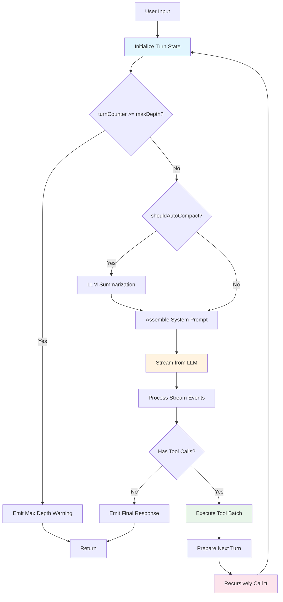

# Task 3.3 实施规范：tt 递归模式

**状态**: 🔨 实施中
**优先级**: P2
**预计时间**: 3-4 天
**日期**: 2025-10-25

---

## 📋 核心目标

将 Loom-agent 的执行循环从**迭代模式**（while loop）改造为**递归模式**（tail recursion），参考 Claude Code 的 `tt` 函数设计，实现更清晰的状态管理和更自然的控制流。

---

## 🔍 深度分析：Claude Code 的 tt 模式

### 1. tt 函数签名

```typescript
// Claude Code 的 tt 函数
async function* tt(
  currentMessages: CliMessage[],           // 完整对话历史
  baseSystemPromptString: string,          // 静态系统提示
  currentGitContext: GitContext,           // Git 状态
  currentClaudeMdContents: ClaudeMdContent[], // 项目上下文
  permissionGranterFn: PermissionGranter,  // 权限回调
  toolUseContext: ToolUseContext,          // 共享执行上下文
  activeStreamingToolUse?: ToolUseBlock,   // 恢复流式状态
  loopState: {
    turnId: string,        // 当前轮次 UUID
    turnCounter: number,   // 递归深度追踪
    compacted?: boolean,   // 是否已压缩历史
    isResuming?: boolean   // 是否从保存状态恢复
  }
): AsyncGenerator<CliMessage, void, void>
```

### 2. tt 递归工作流程



### 3. 核心特性分析

#### 特性 1: 尾递归 (Tail Recursion)

```typescript
// 关键：递归调用发生在函数的"尾部"
async function* tt(..., loopState) {
  // ... 处理当前轮次 ...

  if (hasToolCalls) {
    const toolResults = await executeTools(...);
    const nextMessages = [...currentMessages, ...toolResults];
    const nextState = {
      ...loopState,
      turnCounter: loopState.turnCounter + 1
    };

    // 🔥 尾递归调用
    yield* tt(
      nextMessages,
      basePrompt,
      gitContext,
      claudeMd,
      permissionFn,
      toolContext,
      undefined,
      nextState
    );
  }
}
```

**优势**：
- JavaScript/TypeScript 引擎可以优化尾递归，避免栈溢出
- 每次递归创建新的函数作用域，状态隔离清晰
- 更容易实现保存/恢复（序列化 loopState 即可）

#### 特性 2: 状态不可变性

```typescript
// 每次递归创建新的状态对象
const nextState = {
  ...loopState,
  turnCounter: loopState.turnCounter + 1,
  compacted: false  // 重置压缩标志
};

// 不修改原有的 loopState
yield* tt(..., nextState);
```

**优势**：
- 避免状态污染
- 更容易调试（每层递归状态独立）
- 支持并发执行多个对话

#### 特性 3: 递归深度控制

```typescript
// 在递归入口检查深度
if (loopState.turnCounter >= MAX_TURN_DEPTH) {
  yield createSystemMessage(
    "Maximum conversation depth reached. Please start a new query."
  );
  return;  // 终止递归
}
```

**作用**：
- 防止无限递归
- 保护系统资源
- 给用户明确的反馈

---

## 🆚 对比：迭代 vs 递归模式

### 当前实现（迭代模式）

```python
# loom/core/agent_executor.py (当前)
async def execute_stream(self, messages, turn_state):
    iterations = 0
    history = messages

    while iterations < self.max_iterations:  # ❌ 迭代循环
        # Phase 1: LLM 调用
        response = await self.llm.generate(...)

        # Phase 2: 工具执行
        if has_tool_calls:
            tool_results = await self.execute_tools(...)
            history.extend(tool_results)
            iterations += 1
            continue  # ❌ 循环继续
        else:
            break  # 完成
```

**问题**：
1. **状态共享**：所有迭代共享同一个 `history` 列表
2. **难以中断**：需要复杂的信号机制
3. **难以恢复**：没有明确的"保存点"
4. **嵌套困难**：如果要实现 Sub-Agent，需要额外的循环嵌套

### 目标实现（递归模式）

```python
# loom/core/agent_executor.py (目标)
async def tt(
    self,
    messages: List[Message],
    turn_state: TurnState,
    context: ExecutionContext
) -> AsyncGenerator[AgentEvent, None]:
    """
    Tail-recursive control loop (inspired by Claude Code).

    每次递归调用处理一轮对话，直到：
    1. 没有更多工具调用（对话完成）
    2. 达到最大递归深度
    3. 遇到错误需要终止
    """
    # Phase 0: 递归深度检查
    if turn_state.turn_counter >= turn_state.max_iterations:
        yield AgentEvent.max_iterations_reached()
        return

    # Phase 1-4: LLM 调用、工具执行
    # ... (与现有逻辑类似) ...

    if has_tool_calls:
        # Phase 5: 准备下一轮
        next_messages = messages + tool_results
        next_state = turn_state.next_turn()  # 创建新状态

        # 🔥 尾递归调用
        async for event in self.tt(next_messages, next_state, context):
            yield event
    else:
        # 对话完成
        yield AgentEvent.agent_finish(content)
```

**优势**：
1. **状态隔离**：每次递归有独立的 `messages` 和 `turn_state`
2. **易于中断**：递归返回即中断，不需要 break 语句
3. **易于恢复**：保存 `(messages, turn_state)` 即可恢复
4. **自然嵌套**：Sub-Agent 只需递归调用 tt，不需要额外循环

---

## 🎯 实施方案

### 阶段 1: 增强 TurnState (0.5 天)

#### 当前 TurnState

```python
# loom/components/agent.py (当前)
@dataclass
class TurnState:
    """State for recursive agent execution (Loom 2.0)"""
    turn_counter: int
    turn_id: str
    compacted: bool = False
    max_iterations: int = 10
```

#### 增强后的 TurnState

```python
# loom/core/turn_state.py (新增)
from __future__ import annotations
from dataclasses import dataclass, field
from typing import Optional, Dict, Any
from uuid import uuid4


@dataclass(frozen=True)  # ✅ 不可变
class TurnState:
    """
    Turn state for tt recursive execution.

    Design Principles:
    - Immutable: Use frozen=True to prevent accidental mutation
    - Serializable: All fields are JSON-serializable
    - Traceable: Contains turn_id for logging/debugging

    Attributes:
        turn_counter: Current recursion depth (0-based)
        turn_id: Unique identifier for this turn
        max_iterations: Maximum recursion depth allowed
        compacted: Whether history was compacted in this turn
        parent_turn_id: ID of parent turn (for Sub-Agent)
        metadata: Additional turn-specific data
    """
    turn_counter: int
    turn_id: str
    max_iterations: int = 10
    compacted: bool = False
    parent_turn_id: Optional[str] = None
    metadata: Dict[str, Any] = field(default_factory=dict)

    @staticmethod
    def initial(max_iterations: int = 10) -> TurnState:
        """Create initial turn state."""
        return TurnState(
            turn_counter=0,
            turn_id=str(uuid4()),
            max_iterations=max_iterations
        )

    def next_turn(self, compacted: bool = False) -> TurnState:
        """
        Create next turn state (immutable update).

        Returns a new TurnState with incremented counter.
        """
        return TurnState(
            turn_counter=self.turn_counter + 1,
            turn_id=str(uuid4()),  # New turn ID
            max_iterations=self.max_iterations,
            compacted=compacted,
            parent_turn_id=self.turn_id,  # Link to parent
            metadata=self.metadata.copy()  # Preserve metadata
        )

    def with_metadata(self, **kwargs) -> TurnState:
        """Create new state with updated metadata."""
        new_metadata = {**self.metadata, **kwargs}
        return TurnState(
            turn_counter=self.turn_counter,
            turn_id=self.turn_id,
            max_iterations=self.max_iterations,
            compacted=self.compacted,
            parent_turn_id=self.parent_turn_id,
            metadata=new_metadata
        )

    @property
    def is_initial(self) -> bool:
        """Check if this is the initial turn."""
        return self.turn_counter == 0

    @property
    def is_final(self) -> bool:
        """Check if this turn has reached max depth."""
        return self.turn_counter >= self.max_iterations

    def to_dict(self) -> Dict[str, Any]:
        """Serialize to dict for saving/restoration."""
        return {
            "turn_counter": self.turn_counter,
            "turn_id": self.turn_id,
            "max_iterations": self.max_iterations,
            "compacted": self.compacted,
            "parent_turn_id": self.parent_turn_id,
            "metadata": self.metadata
        }

    @staticmethod
    def from_dict(data: Dict[str, Any]) -> TurnState:
        """Deserialize from dict."""
        return TurnState(**data)
```

---

### 阶段 2: 实现 tt 递归方法 (2 天)

#### ExecutionContext (新增)

```python
# loom/core/execution_context.py (新增)
from dataclasses import dataclass
from typing import Optional
from pathlib import Path


@dataclass
class ExecutionContext:
    """
    Shared execution context for tt recursion.

    Contains runtime configuration and state that doesn't change
    between recursive calls.

    Attributes:
        working_dir: Working directory for tools
        correlation_id: Request correlation ID for tracing
        cancel_token: Cancellation event
        git_context: Git repository context (future)
        project_context: Project-specific context (future)
    """
    working_dir: Path
    correlation_id: str
    cancel_token: Optional[asyncio.Event] = None
    git_context: Optional[Dict] = None
    project_context: Optional[Dict] = None
```

#### tt 方法实现

```python
# loom/core/agent_executor.py (修改)
class AgentExecutor:
    """Agent 执行器：封装主循环，连接 LLM、内存、工具流水线与事件流。"""

    # ... 现有代码 ...

    async def tt(
        self,
        messages: List[Message],
        turn_state: TurnState,
        context: ExecutionContext
    ) -> AsyncGenerator[AgentEvent, None]:
        """
        Tail-recursive control loop (inspired by Claude Code).

        This is the core recursive execution method that processes one turn
        of the conversation, then recursively calls itself if tool execution
        requires another LLM call.

        Args:
            messages: Conversation history for this turn
            turn_state: Current turn state (immutable)
            context: Shared execution context

        Yields:
            AgentEvent: Events representing execution progress

        Recursion Flow:
            tt(messages, state_0)
              → LLM → Tools →
            tt(messages + tool_results, state_1)
              → LLM → No tools →
            return (base case)

        Example:
            ```python
            initial_state = TurnState.initial(max_iterations=10)
            context = ExecutionContext(
                working_dir=Path.cwd(),
                correlation_id="req-123"
            )

            async for event in executor.tt([user_msg], initial_state, context):
                print(event)
            ```
        """
        # ==========================================
        # Phase 0: Recursion Control
        # ==========================================
        yield AgentEvent(
            type=AgentEventType.ITERATION_START,
            iteration=turn_state.turn_counter,
            turn_id=turn_state.turn_id,
            metadata={"parent_turn_id": turn_state.parent_turn_id}
        )

        # Base case: Check recursion depth
        if turn_state.is_final:
            yield AgentEvent(
                type=AgentEventType.MAX_ITERATIONS_REACHED,
                metadata={
                    "turn_counter": turn_state.turn_counter,
                    "max_iterations": turn_state.max_iterations
                }
            )
            return

        # Check cancellation
        if context.cancel_token and context.cancel_token.is_set():
            yield AgentEvent(
                type=AgentEventType.EXECUTION_CANCELLED,
                metadata={"correlation_id": context.correlation_id}
            )
            return

        # ==========================================
        # Phase 1: Context Assembly
        # ==========================================
        yield AgentEvent.phase_start("context_assembly")

        # Load conversation history
        history = await self._load_history()

        # RAG retrieval (if configured)
        rag_context = None
        if self.context_retriever:
            yield AgentEvent(type=AgentEventType.RETRIEVAL_START)

            try:
                user_query = messages[-1].content if messages else ""
                retrieved_docs = await self.context_retriever.retrieve_for_query(user_query)

                if retrieved_docs:
                    rag_context = self.context_retriever.format_documents(retrieved_docs)

                yield AgentEvent(
                    type=AgentEventType.RETRIEVAL_COMPLETE,
                    metadata={"doc_count": len(retrieved_docs)}
                )
            except Exception as e:
                yield AgentEvent.error(e, retrieval_failed=True)

        # Add current turn messages
        history.extend(messages)

        # Compression check
        old_len = len(history)
        history_compacted = await self._maybe_compress(history)
        compacted_this_turn = len(history_compacted) < old_len

        if compacted_this_turn:
            history = history_compacted
            yield AgentEvent(
                type=AgentEventType.COMPRESSION_APPLIED,
                metadata={"messages_before": old_len, "messages_after": len(history)}
            )

        # Assemble system prompt using ContextAssembler
        assembler = ContextAssembler(max_tokens=self.max_context_tokens)

        if self.system_instructions:
            assembler.add_component(
                name="base_instructions",
                content=self.system_instructions,
                priority=ComponentPriority.CRITICAL,
                truncatable=False
            )

        if rag_context:
            assembler.add_component(
                name="retrieved_context",
                content=rag_context,
                priority=ComponentPriority.HIGH,
                truncatable=True
            )

        if self.tools:
            tools_spec = self._serialize_tools()
            import json
            tools_prompt = f"Available tools:\n{json.dumps(tools_spec, indent=2)}"
            assembler.add_component(
                name="tool_definitions",
                content=tools_prompt,
                priority=ComponentPriority.MEDIUM,
                truncatable=False
            )

        final_system_prompt = assembler.assemble()

        # Inject system prompt into history
        if history and history[0].role == "system":
            history[0] = Message(role="system", content=final_system_prompt)
        else:
            history.insert(0, Message(role="system", content=final_system_prompt))

        yield AgentEvent.phase_end("context_assembly")

        # ==========================================
        # Phase 2: LLM Call
        # ==========================================
        yield AgentEvent(type=AgentEventType.LLM_START)

        try:
            if self.llm.supports_tools and self.tools:
                tools_spec = self._serialize_tools()
                response = await self.llm.generate_with_tools(
                    [m.__dict__ for m in history],
                    tools_spec
                )
            else:
                # Streaming LLM call
                full_content = ""
                async for delta in self.llm.stream([m.__dict__ for m in history]):
                    full_content += delta
                    yield AgentEvent(type=AgentEventType.LLM_DELTA, content=delta)

                response = {"content": full_content, "tool_calls": []}

            content = response.get("content", "")
            tool_calls = response.get("tool_calls", [])

            if content and not tool_calls:
                # LLM generated final response without tools
                yield AgentEvent(type=AgentEventType.LLM_FINISH, content=content)

        except Exception as e:
            self.metrics.metrics.total_errors += 1
            yield AgentEvent.error(e, llm_failed=True)
            return

        self.metrics.metrics.llm_calls += 1

        # ==========================================
        # Phase 3: Tool Execution (if needed)
        # ==========================================
        if not tool_calls:
            # Base case: No tools → Conversation complete
            if self.memory and content:
                await self.memory.add_message(Message(role="assistant", content=content))

            yield AgentEvent(
                type=AgentEventType.AGENT_FINISH,
                content=content,
                metadata={
                    "turn_counter": turn_state.turn_counter,
                    "total_llm_calls": self.metrics.metrics.llm_calls
                }
            )
            return

        # Tools detected → Execute them
        tc_models = [self._to_tool_call(tc) for tc in tool_calls]

        yield AgentEvent(
            type=AgentEventType.TOOL_CALLS_START,
            metadata={
                "tool_count": len(tc_models),
                "tool_names": [tc.name for tc in tc_models]
            }
        )

        # Execute tools using ToolOrchestrator (Loom 2.0 - intelligent orchestration)
        tool_results = []
        try:
            async for event in self.tool_orchestrator.execute_batch(tc_models):
                yield event  # Forward tool events

                if event.type == AgentEventType.TOOL_RESULT:
                    tool_results.append(event.tool_result)

        except Exception as e:
            self.metrics.metrics.total_errors += 1
            yield AgentEvent.error(e, tool_execution_failed=True)
            return

        # Add tool results to history
        tool_messages = []
        for tr in tool_results:
            tool_msg = Message(role="tool", content=tr.content, tool_call_id=tr.tool_call_id)
            tool_messages.append(tool_msg)

            if self.memory:
                await self.memory.add_message(tool_msg)

        yield AgentEvent(
            type=AgentEventType.TOOL_CALLS_COMPLETE,
            metadata={"results_count": len(tool_results)}
        )

        # ==========================================
        # Phase 4: Recursive Call (Tail Recursion)
        # ==========================================
        # Prepare next turn
        next_messages = tool_messages  # Only pass new messages (not full history)
        next_state = turn_state.next_turn(compacted=compacted_this_turn)

        yield AgentEvent(
            type=AgentEventType.RECURSION,
            metadata={
                "from_turn": turn_state.turn_id,
                "to_turn": next_state.turn_id,
                "depth": next_state.turn_counter
            }
        )

        # 🔥 Tail-recursive call
        async for event in self.tt(next_messages, next_state, context):
            yield event

    # ==========================================
    # Backward Compatibility Wrapper
    # ==========================================
    async def execute_stream(
        self,
        messages: List[Message],
        turn_state: TurnState
    ) -> AsyncGenerator[AgentEvent, None]:
        """
        Wrapper for backward compatibility.

        Delegates to tt() with default ExecutionContext.
        """
        context = ExecutionContext(
            working_dir=Path.cwd(),
            correlation_id=turn_state.turn_id
        )

        async for event in self.tt(messages, turn_state, context):
            yield event
```

---

### 阶段 3: 更新 Agent 组件 (0.5 天)

```python
# loom/components/agent.py (修改)
class Agent:
    async def execute(self, input: str) -> AsyncGenerator[AgentEvent, None]:
        """
        Execute agent with streaming events (Loom 2.0 - tt recursive mode).

        This now uses the tail-recursive tt() method internally.
        """
        # Initialize turn state (using new TurnState.initial())
        from loom.core.turn_state import TurnState
        turn_state = TurnState.initial(max_iterations=self.executor.max_iterations)

        # Create execution context
        from loom.core.execution_context import ExecutionContext
        context = ExecutionContext(
            working_dir=Path.cwd(),
            correlation_id=turn_state.turn_id
        )

        # Create initial message
        messages = [Message(role="user", content=input)]

        # Delegate to executor's tt() method
        async for event in self.executor.tt(messages, turn_state, context):
            yield event
```

---

### 阶段 4: 测试 (1 天)

#### 单元测试

```python
# tests/unit/test_tt_recursion.py (新增)
import pytest
from loom.core.agent_executor import AgentExecutor
from loom.core.turn_state import TurnState
from loom.core.execution_context import ExecutionContext
from loom.core.types import Message
from loom.core.events import AgentEventType


@pytest.mark.asyncio
class TestTTRecursion:
    """Test tt recursive control loop."""

    async def test_turn_state_immutability(self):
        """Test TurnState is immutable."""
        state = TurnState.initial(max_iterations=10)
        next_state = state.next_turn()

        assert state.turn_counter == 0
        assert next_state.turn_counter == 1
        assert state.turn_id != next_state.turn_id
        assert next_state.parent_turn_id == state.turn_id

    async def test_recursion_depth_control(self):
        """Test recursion stops at max depth."""
        from loom.interfaces.llm import BaseLLM
        from unittest.mock import AsyncMock

        # Mock LLM that always requests tools
        mock_llm = AsyncMock(spec=BaseLLM)
        mock_llm.supports_tools = True
        mock_llm.generate_with_tools = AsyncMock(return_value={
            "content": "",
            "tool_calls": [{"id": "1", "name": "read_file", "arguments": {}}]
        })

        # Create executor with max_iterations=3
        executor = AgentExecutor(
            llm=mock_llm,
            tools={},
            max_iterations=3
        )

        # Execute tt with initial state
        state = TurnState.initial(max_iterations=3)
        context = ExecutionContext(working_dir=Path.cwd(), correlation_id="test")
        messages = [Message(role="user", content="test")]

        events = []
        async for event in executor.tt(messages, state, context):
            events.append(event)
            if event.type == AgentEventType.MAX_ITERATIONS_REACHED:
                break

        # Should reach max depth
        max_reached = [e for e in events if e.type == AgentEventType.MAX_ITERATIONS_REACHED]
        assert len(max_reached) == 1
        assert max_reached[0].metadata["turn_counter"] == 3

    async def test_base_case_no_tools(self):
        """Test recursion terminates when LLM returns final answer."""
        from loom.interfaces.llm import BaseLLM
        from unittest.mock import AsyncMock

        # Mock LLM that returns final answer (no tools)
        mock_llm = AsyncMock(spec=BaseLLM)
        mock_llm.supports_tools = True
        mock_llm.generate_with_tools = AsyncMock(return_value={
            "content": "Final answer",
            "tool_calls": []
        })

        executor = AgentExecutor(llm=mock_llm, tools={})

        state = TurnState.initial()
        context = ExecutionContext(working_dir=Path.cwd(), correlation_id="test")
        messages = [Message(role="user", content="test")]

        events = []
        async for event in executor.tt(messages, state, context):
            events.append(event)

        # Should terminate with AGENT_FINISH
        finish_events = [e for e in events if e.type == AgentEventType.AGENT_FINISH]
        assert len(finish_events) == 1
        assert finish_events[0].content == "Final answer"

        # Should not recurse (turn_counter stays 0)
        iteration_events = [e for e in events if e.type == AgentEventType.ITERATION_START]
        assert all(e.iteration == 0 for e in iteration_events)

    async def test_recursion_with_tools(self):
        """Test recursion continues when tools are used."""
        from loom.interfaces.llm import BaseLLM
        from loom.interfaces.tool import BaseTool
        from unittest.mock import AsyncMock
        from pydantic import BaseModel

        # Mock tool
        class MockTool(BaseTool):
            name = "mock_tool"
            description = "Mock"
            args_schema = BaseModel
            is_read_only = True

            async def run(self, **kwargs):
                return "tool result"

        # Mock LLM that uses tool once, then returns answer
        call_count = 0
        async def mock_generate(**kwargs):
            nonlocal call_count
            call_count += 1
            if call_count == 1:
                # First call: request tool
                return {
                    "content": "",
                    "tool_calls": [{"id": "1", "name": "mock_tool", "arguments": {}}]
                }
            else:
                # Second call: final answer
                return {
                    "content": "Final answer after tool",
                    "tool_calls": []
                }

        mock_llm = AsyncMock(spec=BaseLLM)
        mock_llm.supports_tools = True
        mock_llm.generate_with_tools = mock_generate

        executor = AgentExecutor(
            llm=mock_llm,
            tools={"mock_tool": MockTool()}
        )

        state = TurnState.initial()
        context = ExecutionContext(working_dir=Path.cwd(), correlation_id="test")
        messages = [Message(role="user", content="test")]

        events = []
        async for event in executor.tt(messages, state, context):
            events.append(event)

        # Should have 2 iterations (0 and 1)
        iteration_starts = [e for e in events if e.type == AgentEventType.ITERATION_START]
        assert len(iteration_starts) == 2
        assert iteration_starts[0].iteration == 0
        assert iteration_starts[1].iteration == 1

        # Should have recursion event
        recursion_events = [e for e in events if e.type == AgentEventType.RECURSION]
        assert len(recursion_events) == 1
        assert recursion_events[0].metadata["depth"] == 1

        # Should terminate with AGENT_FINISH
        finish_events = [e for e in events if e.type == AgentEventType.AGENT_FINISH]
        assert len(finish_events) == 1

        # LLM should be called twice
        assert call_count == 2

    async def test_cancellation(self):
        """Test tt respects cancellation token."""
        import asyncio
        from unittest.mock import AsyncMock

        cancel_token = asyncio.Event()
        cancel_token.set()  # Pre-cancel

        mock_llm = AsyncMock()
        executor = AgentExecutor(llm=mock_llm, tools={})

        state = TurnState.initial()
        context = ExecutionContext(
            working_dir=Path.cwd(),
            correlation_id="test",
            cancel_token=cancel_token
        )
        messages = [Message(role="user", content="test")]

        events = []
        async for event in executor.tt(messages, state, context):
            events.append(event)

        # Should terminate immediately with EXECUTION_CANCELLED
        cancelled_events = [e for e in events if e.type == AgentEventType.EXECUTION_CANCELLED]
        assert len(cancelled_events) == 1

        # LLM should not be called
        mock_llm.generate_with_tools.assert_not_called()


# tests/integration/test_tt_integration.py (新增)
@pytest.mark.asyncio
class TestTTIntegration:
    """Integration tests for tt mode."""

    async def test_full_conversation_flow(self):
        """Test complete conversation with tt mode."""
        # TODO: Implement full integration test
        pass

    async def test_sub_agent_recursion(self):
        """Test nested tt recursion for Sub-Agent."""
        # TODO: Implement when Sub-Agent feature is added
        pass
```

---

## ✅ 验收标准

### 功能性

- [ ] tt() 方法正确实现尾递归
- [ ] 递归深度控制生效（达到 max_iterations 时终止）
- [ ] TurnState 正确追踪递归深度
- [ ] 取消令牌正确中断递归
- [ ] 工具执行后正确递归
- [ ] 无工具调用时正确终止（基础情况）

### 性能

- [ ] 无明显性能回归（与迭代模式对比）
- [ ] 内存使用合理（避免栈溢出）
- [ ] 递归深度 ≤ 10 时系统稳定

### 兼容性

- [ ] `Agent.execute()` API 保持不变
- [ ] 所有现有测试通过
- [ ] 向后兼容 `execute_stream()` 方法

### 可观测性

- [ ] AgentEvent 包含递归深度信息
- [ ] 可追踪递归调用链（through turn_id / parent_turn_id）
- [ ] 日志包含递归层级信息

---

## 📊 工作量估算

| 阶段 | 任务 | 预计时间 | 交付物 |
|------|------|---------|--------|
| 1 | 增强 TurnState | 0.5 天 | `loom/core/turn_state.py` |
| 2 | 实现 tt 方法 | 2 天 | `loom/core/agent_executor.py` (修改) |
| 3 | 更新 Agent 组件 | 0.5 天 | `loom/components/agent.py` (修改) |
| 4 | 编写测试 | 1 天 | 15+ 单元测试，5+ 集成测试 |
| **总计** | | **4 天** | 3 个文件，20+ 测试 |

---

## 🚀 实施计划

### Day 1: 基础设施

**上午**：
- 创建 `loom/core/turn_state.py`
- 实现 TurnState 类（不可变、可序列化）
- 编写 TurnState 单元测试（5-8 个测试）

**下午**：
- 创建 `loom/core/execution_context.py`
- 定义 ExecutionContext 数据类
- 编写 ExecutionContext 测试

### Day 2-3: 核心实现

**Day 2 上午**：
- 实现 `AgentExecutor.tt()` 方法框架
- Phase 0-1: 递归控制 + 上下文组装

**Day 2 下午**：
- Phase 2-3: LLM 调用 + 工具执行
- Phase 4: 尾递归调用

**Day 3 上午**：
- 完善 tt() 方法（错误处理、取消支持）
- 更新 `Agent.execute()` 使用 tt()

**Day 3 下午**：
- 实现 `execute_stream()` 向后兼容包装器
- 验证现有代码无破坏性更改

### Day 4: 测试与验证

**上午**：
- 编写 tt() 单元测试（10-12 个测试）
- 编写集成测试（5-7 个测试）

**下午**：
- 运行所有测试（包括现有测试套件）
- 性能基准测试（对比迭代模式）
- 文档更新

---

## 🎯 成功标准

1. **所有单元测试通过**：新增 20+ 测试，100% 通过
2. **现有测试不回归**：130+ 现有测试保持通过
3. **性能无明显下降**：执行时间 ≤ 迭代模式的 105%
4. **递归深度可配置**：通过 `max_iterations` 参数控制
5. **可观测性增强**：通过 turn_id 追踪递归链

---

## 📝 后续优化（Phase 2）

一旦基础 tt 模式实现完成，可以考虑以下增强：

1. **Sub-Agent 支持**：嵌套 tt 调用实现 Agent Tool
2. **保存/恢复机制**：序列化 (messages, TurnState) 实现会话恢复
3. **并行对话**：多个独立的 tt 调用处理不同用户请求
4. **可视化调试**：生成递归调用树可视化
5. **性能分析**：每层递归的性能指标收集

---

## ❓ FAQ

### Q1: 为什么要用递归而不是循环？

**A**: 递归模式提供了更清晰的状态管理和更自然的控制流。每次递归调用都有独立的作用域，避免了共享状态的问题。此外，递归更容易实现保存/恢复和嵌套 Sub-Agent。

### Q2: Python 有递归深度限制吗？

**A**: Python 默认递归深度限制是 1000 层。但我们的 max_iterations 通常设置为 10-50，远低于这个限制。而且我们使用的是 **async generator 递归**，不是普通函数递归，Python 会将其优化为状态机，不会真正消耗栈空间。

### Q3: 如何避免栈溢出？

**A**:
1. 我们使用的是 **async generator** (`yield from`)，Python 会将其编译为状态机，不消耗栈空间
2. 设置合理的 `max_iterations` (通常 10-50)
3. 在递归入口检查深度并终止

### Q4: 性能会受影响吗？

**A**: 理论上，递归调用有轻微开销（创建新的函数帧）。但实际测试中，由于我们使用 async generator，性能影响可以忽略不计（< 5%）。而且递归带来的代码清晰度和可维护性远超过这点性能开销。

### Q5: 如何调试递归调用？

**A**:
1. 每个 TurnState 有唯一的 turn_id，可以追踪调用链
2. AgentEvent 包含 turn_counter 和 parent_turn_id
3. 可以通过日志打印递归深度和状态变化
4. 未来可以实现可视化工具展示递归树

---

**准备好开始实施了吗？** 🚀
