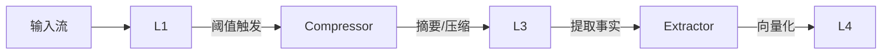

# Loom 记忆系统详解

> **核心概念** - 深入了解 Loom 如何像人类一样管理短期和长期记忆。

## 记忆分层模型 (Memory Tiers)

Loom 采用四级记忆结构，模拟人类大脑的记忆处理过程。

### 1. L1 Raw IO Buffer (感知缓冲区)
最底层的原始输入输出记录。

- **功能**：完整记录所有原始的用户输入和 Agent 输出。
- **特点**：不做任何处理，保留原汁原味的信息。
- **存储**：内存环形缓冲区 (Circular Buffer)。
- **策略**：**LRU/LFU 驱逐**。当缓冲区满时，根据"重要性权重"和"最近访问时间"综合评分，驱逐价值最低的内容。

### 2. L2 Working Memory (工作记忆)
当前正在进行的任务上下文。

- **功能**：存储即时任务所需的上下文，包括 Planning、Thought、Tool Calls。
- **特点**：高频读写，随任务结束而清空或归档。
- **动态预算**：基于任务复杂度自动调整 Token 预算。

### 3. L3 Session History (情景记忆)
跨越时间段的会话记忆。

- **来源**：由 L1 和 L2 的内容经过**压缩**后沉淀而来。
- **形式**：
    - **摘要 (Summary)**：由于上下文窗口限制，原始对话被 LLM 压缩成摘要。
    - **片段 (Snippets)**：关键信息的保留。
- **持久性**：在一次完整的会话 (Session) 中保持存在。

### 4. L4 Global Knowledge (语义记忆)
永久性的知识和事实存储。

- **来源**：从 L2/L3 中**提取 (Extract)** 出且具有长期价值的信息。
- **内容**：
    - **用户画像**：用户的偏好、习惯。
    - **事实知识**：项目背景、业务规则。
    - **世界知识**：通过工具获取的外部通用知识。
- **技术实现**：
    - **向量存储**：使用 Vector Store (Qdrant/Chroma) 存储 Embedding。
    - **语义检索**：支持 Top-K 语义相似度搜索。

---

## 记忆压缩与流转 (Compression & Flow)

为了在有限的 Context Window 下保持无限的记忆能力，Loom 引入了智能压缩引擎。



### 1. L1 → L3：智能压缩
当 L1 缓冲区达到 Token 阈值（默认 4000 tokens）时，触发压缩：

- **LLM 摘要**：调用 LLM 生成简洁的对话摘要。
- **规则降级**：如果 LLM 调用失败，使用启发式规则截断旧消息。
- **系统通知**：向 Context注入 `📦 History compacted` 标记，告知 Agent 记忆已压缩。

### 2. L2/L3 → L4：知识提取
不仅仅是存储文本，更是提取知识：

- **提取器 (Extractor)**：分析对话，识别出具有长期价值的“事实” (Facts)。
- **重要性过滤**：对提取的事实打分 (0-1)，仅保留 Score > 0.8 的高价值事实。
- **自动向量化**：
    - **Embedding**：使用 OpenAI/HuggingFace 模型将文本转为向量。
    - **索引**：存入向量数据库，建立索引。

---

## 配置与使用

LoomMemory 支持完全的配置驱动。

### 基础配置
```python
from loom.memory.config import MemoryConfig, VectorStoreConfig

config = MemoryConfig(
    # L1 缓冲区大小
    l1_size=50,
    
    # 自动向量化 L4 内容
    auto_vectorize_l4=True,
    
    # 向量存储配置
    vector_store=VectorStoreConfig(
        provider="qdrant",
        provider_config={
            "url": "http://localhost:6333",
            "collection_name": "loom_memories"
        }
    )
)
```

### 初始化
```python
from loom.memory.core import LoomMemory

memory = LoomMemory(node_id="agent-01", config=config)
```

### 手动操作（高级）
虽然大部分流转是自动的，开发者也可以通过 API 干预：

```python
# 手动添加一条 L4 知识
await memory.add(MemoryUnit(
    content="用户喜欢使用 Python 编写测试用例",
    tier=MemoryTier.L4_GLOBAL,
    type=MemoryType.FACT
))

# 语义搜索
results = await memory.query(MemoryQuery(
    query_text="用户的编程偏好",
    tiers=[MemoryTier.L4_GLOBAL],
    top_k=3
))
```

## 监控与可视化

Loom 提供了 `MemoryVisualizer` 工具，可以直观地查看当前记忆状态，包括各层级大小、压缩率和向量分布。

```bash
# 示例输出
╔══════════════════════════════════════════╗
║          LOOM MEMORY STATUS              ║
╠══════════════════════════════════════════╣
║ L1 Buffer: 45/50 items                   ║
║ L3 Summary: 2 active summaries           ║
║ L4 Knowledge: 156 vectors                ║
╚══════════════════════════════════════════╝
```
