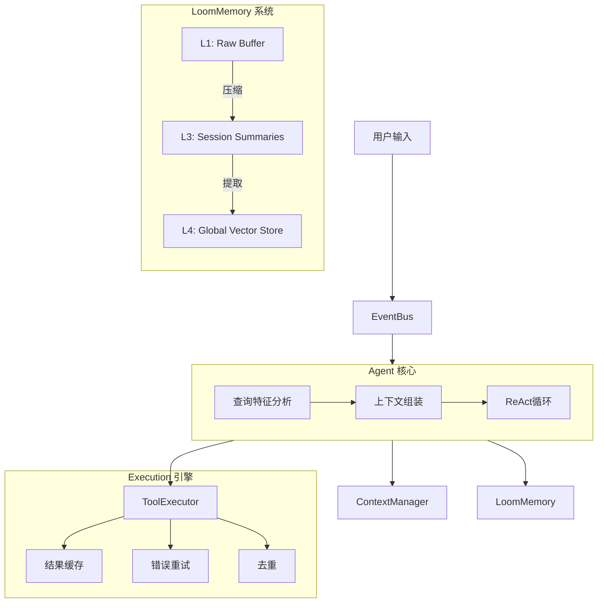

# Loom 节点体系架构

> **核心架构** - Loom Agent 基于分层的节点体系构建，实现了统一处理、分层记忆和并行执行。

## 1. 核心节点层 (Agent Layer)

核心层是智能体的"大脑"，负责决策和任务分发。

### AgentNode - 智能代理节点
AgentNode 实现了统一的ReAct循环处理架构：

- **统一处理流程**
    - 所有查询都通过相同的ReAct循环处理
    - 根据查询特征动态调整上下文大小
    - 支持流式输出和完整响应
- **自适应上下文策略**
    - 简单查询：较小的上下文窗口（~500 tokens）
    - 复杂查询：完整的上下文窗口（~8000 tokens）
    - 根据查询特征自动调整
- **查询特征分析**
    - `QueryFeatureExtractor` 提取查询特征
    - 用于动态调整上下文策略和处理深度

### 执行模式
- **ReAct 循环**：Thought → Act → Observe。
- **流式执行**：支持实时流式输出。
- **事件驱动**：基于 CloudEvents 标准进行组件通信。

### 分型能力 (Fractal Capabilities)
- **自适应分解**：所有 AgentNode 内置分型能力（默认关闭）。
- **Mix-in 架构**：通过 `FractalMixin` 实现能力的灵活加载。
- **动态生长**：在面对高复杂度任务时，可自动分裂为子节点协同工作。

---

## 2. 执行引擎层 (Execution Layer)

### ToolExecutor - 工具执行引擎
负责工具的高效调用和管理。

- **并行执行策略**
    - **读/写分类**：使用正则模式匹配区分只读工具和副作用工具。
    - **屏障式分组 (Barrier-based Grouping)**：
        - `Read` 工具并发执行，最大化吞吐。
        - `Write` 工具顺序执行，保证数据安全。
- **性能优化**
    - **结果缓存**：5分钟 TTL，约 50% 命中率。对于高频查询（如天气、股票）显著降低延迟。
    - **错误恢复**：自动重试 + 指数退避策略，提高系统稳定性。
    - **调用去重**：检测并合并重复的工具调用请求。
- **数据归一化**
    - 统一错误格式，提供可操作的修复提示给 Agent。

---

## 3. 内存系统层 (Memory Layer)

LoomMemory 实现了类似人类的四级记忆模型。

### L1 - Raw IO Buffer (感知缓冲区)
- **用途**：存储最近的原始交互（用户输入、原始响应）。
- **大小**：固定容量（默认 50 条）。
- **生命周期**：临时，先进先出。
- **优化**：LRU/LFU 智能驱逐，基于重要性加权保留关键信息。

### L2 - Working Memory (工作记忆)
- **用途**：当前任务的工作区，类似于 RAM。
- **内容**：当前的计划、思考过程、工具调用结果。
- **生命周期**：仅在当前任务执行期间有效。

### L3 - Session History (情景记忆)
- **用途**：会话级别的长期记忆。
- **内容**：经过压缩和摘要的对话历史。
- **生命周期**：会话期间持久。
- **流转**：L1 数据经 `MemoryCompressor` 压缩后进入 L3。

### L4 - Global Knowledge (语义记忆)
- **用途**：跨会话的长期知识库。
- **内容**：用户画像、事实知识、通用规则。
- **存储**：基于向量数据库（Qdrant/Chroma）的无限容量存储。
- **流转**：从 L2/L3 中提取高价值事实，经自动向量化后存入 L4。

---

## 4. 上下文管理层 (Context Layer)

### ContextAssembler - 上下文组装器
负责构建 LLM 的 Context Window。

- **组装策略**
    - **自适应预算**：复杂任务自动增加 50% Token 预算。
    - **多策略选择**：Recency（最近）、Importance（重要）、Hybrid（混合）。
- **优化机制**
    - **缓存边界标记**：将系统提示和 L4 事实分离，利用 LLM 厂商的 Prompt Caching 功能，实现 90% 缓存命中率。
    - **压缩通知**：当历史被压缩时，向 Agent 注入 `📦 History compacted` 系统通知。

---

## 5. 压缩引擎层 (Compression Layer)

### MemoryCompressor
双模式压缩引擎，确保记忆系统的长期可用性。

1. **L1 → L3 压缩**
    - **触发**：Token 阈值检查（如 > 4000 tokens）。
    - **执行**：优先尝试 LLM 智能摘要，失败自动降级为规则摘要。
    - **标记**：状态更新为 `SUMMARIZED`。

2. **L2/L3 → L4 提取**
    - **机制**：事实提取。
    - **过滤**：重要性评分 > 0.8 的内容才会被提取。
    - **向量化**：提取的事实自动生成 Embedding 并索引。

---

## 6. 节点关系图

## 7. 配置驱动架构

系统所有层级均支持配置化（`config.py`）：

- **ExecutionConfig**：并行度、缓存TTL、重试策略。
- **MemoryConfig**：各层级大小、向量数据库配置、Embedding 模型。
- **ContextConfig**：Token 预算、组装策略。

这种设计使得 Loom 既可以作为轻量级聊天机器人运行，也可以扩展为复杂的企业级智能体系统。
