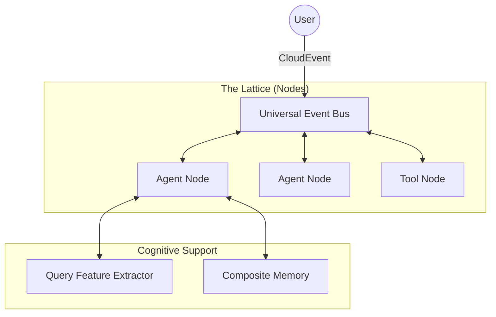

# Architecture Overview

> **Map** - High-level navigation of the Loom system.

## The Big Picture

Loom is a **Fractal, Event-Driven** system. It does not look like a traditional hierarchical program. Instead, it looks like a network of independent nodes communicating over a shared bus.



## Core Mechanisms

Loom is built on four fundamental pillars. Click each to explore the deep-dive documentation.

### 1. [Adaptive Processing Architecture](dual-system.md)
*   **What**: Agents adapt processing strategy based on query complexity: Fast response vs. Deep reasoning.
*   **Why**: To balance speed/cost with accuracy/depth.
*   **Key Components**: `QueryFeatureExtractor`, `Fast Mode (Stream)`, `Deep Mode (Reason)`.

### 2. [Sentient Memory (L1-L4)](memory.md)
*   **What**: A biological memory hierarchy (Reaction -> Working -> Episodic -> Semantic).
*   **Why**: So agents remember you forever (Semantic) but don't get confused by noise (Metabolism).
*   **Key Components**: `CompositeMemory`, `Qdrant`, `ContextCompressor`.

### 3. [Fractal Nodes & Agents](agent-node.md)
*   **What**: Everything is a Node. Agents can contain Agents (infinite recursion).
*   **Why**: To solve complex problems by breaking them down into self-similar sub-problems.
*   **Key Components**: `AgentNode`, `NodeProtocol`, `FractalOrchestrator`, `Patterns`.

### 4. [Protocol-First & Event Bus](protocol.md)
*   **What**: Communication via standardized schemas (CloudEvents), not hard-coded method calls.
*   **Why**: For extreme decoupling, observability, and distributed capabilities.
*   **Key Components**: `CloudEvents`, `UniversalEventBus`, `MCP`.

## Directory Structure

*   `loom/kernel`: The core engines (Bus, Dispatcher).
*   `loom/node`: The entities (Agent, Tool, Crew).
*   `loom/memory`: The storage systems.
*   `loom/cognition`: The brains (Feature Extractor, Classifier).
*   `loom/protocol`: The data contracts.

loom-agent 是一个基于事件驱动的 Agent 框架，采用分形（Fractal）设计理念，所有组件都遵循统一的协议。

## 核心设计原则

### 1. 事件驱动架构

所有组件通过事件进行通信，而不是直接调用：

```
Agent A → Event Bus → Agent B
```

**优势**：
- **解耦**：组件之间无直接依赖
- **可观测**：所有交互都可以被监控
- **可扩展**：易于添加拦截器和中间件
- **分布式**：支持跨进程、跨机器部署

### 2. 分形设计（Fractal Design）

所有组件都是 Node，遵循相同的接口：

```
Node (基类)
├── AgentNode (Agent)
├── ToolNode (工具)
├── CrewNode (团队)
```

**特点**：
- **统一接口**：所有 Node 都实现 `process()` 方法
- **递归组合**：Crew 可以包含 Agent，也可以包含其他 Crew
- **自相似性**：在不同层级使用相同的模式

## 双系统架构（Dual-Process Architecture）

loom-agent 借鉴认知心理学的双系统理论，实现了两个并行的处理系统，并通过**自动路由机制**智能选择合适的系统。

### 自动路由机制（v0.4+）

系统会根据查询特征自动选择处理路径：

```
用户输入 → QueryClassifier → 路由决策
                              ↓
                    ┌─────────┴─────────┐
                    ↓                   ↓
                System 1            System 2
              (快速响应)          (深度推理)
                    ↓                   ↓
            置信度评估 ←─ 低置信度 ─┘
                    ↓
              最终输出
```

**路由特征**：
- 查询长度（短查询 → System 1）
- 代码检测（包含代码 → System 2）
- 多步骤识别（多步骤 → System 2）
- 自定义规则（关键词、正则匹配）

**置信度回退**：
- System 1 响应会被评估置信度
- 低置信度自动回退到 System 2
- 确保响应质量

### System 1：快速响应系统

**特点**：快速、直觉、流式输出

```
用户输入 → EventBus → Agent → LLM Stream → StreamChunks → 实时输出
```

**实现机制**：
- 使用流式 API（`stream_chat()`）
- 最小上下文（500 tokens）
- 提供即时反馈和响应

**适用场景**：
- 简单对话
- 快速问答
- 实时反馈

### System 2：深度推理系统

**特点**：深度、理性、完整上下文

```
用户输入 → EventBus → Agent → 完整上下文 → 深度推理 → 详细输出
```

**实现机制**：
- 使用完整上下文（8000+ tokens）
- 深度分析和推理
- 返回详细结果

**适用场景**：
- 复杂推理
- 多步骤规划
- 深度分析

## 模块分层架构

loom-agent 采用清晰的分层架构，每层职责明确：

```
┌─────────────────────────────────────┐
│         Node Layer (节点层)          │
│   AgentNode, ToolNode, CrewNode     │
└──────────────┬──────────────────────┘
               ↓
┌─────────────────────────────────────┐
│      Cognition Layer (认知层)       │
│   Router, Classifier, Confidence    │
└──────────────┬──────────────────────┘
               ↓
┌─────────────────────────────────────┐
│       Memory Layer (记忆层)         │
│   LoomMemory, Context, Strategy     │
└──────────────┬──────────────────────┘
               ↓
┌─────────────────────────────────────┐
│      Protocol Layer (协议层)        │
│   CloudEvents, MCP, Delegation      │
└─────────────────────────────────────┘
```

### Protocol 层（协议层）

定义跨模块的接口契约和标准化消息格式：

**核心协议**：
- `CloudEvents`: 事件格式标准
- `MCP`: Model Context Protocol（工具定义）
- `Delegation`: Fractal 架构委托协议
- `MemoryOperations`: Memory 系统接口契约

**职责**：
- 统一消息格式
- 定义接口契约
- 支持协议扩展

### Cognition 层（认知层）

负责智能路由和决策：

**核心组件**：
- `QueryClassifier`: 查询分类器（识别查询特征）
- `AdaptiveRouter`: 自适应路由器（System 1/2 选择）
- `ConfidenceEstimator`: 置信度评估器（回退决策）
- `QueryFeatureExtractor`: 特征提取器（统一特征提取）

**职责**：
- 自动路由决策
- 置信度评估
- 特征提取和分析

### Memory 层（记忆层）

管理上下文和记忆：

**核心组件**：
- `LoomMemory`: 4层分层存储（L1/L2/L3/L4）
- `ContextManager`: 上下文管理器
- `ContextAssembler`: 上下文组装器
- `CurationStrategy`: 策展策略（System1/System2 专用）

**职责**：
- 分层记忆存储
- 上下文策展
- Token 预算管理
- 异步查询和检索

## 核心组件

### Dispatcher（调度器）

事件调度的核心，负责：
- 管理事件总线（EventBus）
- 路由事件到正确的 Node
- 处理拦截器（Interceptors）

### EventBus（事件总线）

发布-订阅模式的实现：
- Node 订阅特定主题的事件
- 发布事件到订阅者
- 支持异步事件传递

### Node（节点）

所有组件的基类：
- `node_id`：唯一标识符
- `source_uri`：事件源 URI
- `process(event)`：处理事件的核心方法
- `call(target, data)`：调用其他 Node

### AgentNode（Agent 节点）

具有 LLM 能力的智能节点：
- 调用 LLM 生成响应
- 管理工具调用
- 维护对话记忆

### ToolNode（工具节点）

封装具体功能的节点：
- 执行特定任务（计算、文件操作等）
- 提供工具定义（Tool Definition）
- 返回执行结果

### CrewNode（团队节点）

编排多个节点的协作：
- 管理 Agent 列表
- 实现协作模式（sequential, parallel）
- 聚合执行结果

## 事件流程

### 基本调用流程

```
1. 用户调用 → app.run(agent, task)
2. 创建请求事件 → CloudEvent(type="node.request")
3. 发布到事件总线 → EventBus.publish()
4. Agent 接收事件 → agent.process(event)
5. Agent 处理任务 → LLM 调用 + 工具调用
6. 返回响应事件 → CloudEvent(type="node.response")
7. 用户接收结果 ← 返回响应数据
```

### 工具调用流程

当 Agent 需要使用工具时：

```
1. LLM 返回工具调用请求
2. Agent 通过事件总线调用 Tool
3. Tool 执行并返回结果
4. Agent 将结果传回 LLM
5. LLM 生成最终响应
```

## 协议设计

### CloudEvents 标准

loom-agent 使用 CloudEvents 作为事件格式：

```python
{
    "specversion": "1.0",
    "type": "node.request",
    "source": "/node/agent-1",
    "id": "unique-event-id",
    "datacontenttype": "application/json",
    "data": {
        "task": "用户任务"
    }
}
```

**优势**：
- **标准化**：遵循 CNCF CloudEvents 规范
- **互操作性**：易于与其他系统集成
- **可追踪**：支持分布式追踪（traceparent）

### 协议优先（Protocol-First）

所有组件都实现 `NodeProtocol` 接口：

```python
class NodeProtocol(Protocol):
    node_id: str
    source_uri: str

    async def process(self, event: CloudEvent) -> Any:
        ...
```

这确保了组件的可替换性和可测试性。

## 总结

loom-agent 的架构设计体现了以下特点：

1. **事件驱动**：解耦组件，提高可观测性
2. **分形设计**：统一接口，递归组合
3. **协议优先**：标准化通信，易于集成
4. **简单优雅**：最小化复杂度，最大化灵活性

## 相关文档

- [认知动力学](cognitive-dynamics.md) - 理解 Agent 的认知过程
- [设计哲学](design-philosophy.md) - 深入了解设计理念
