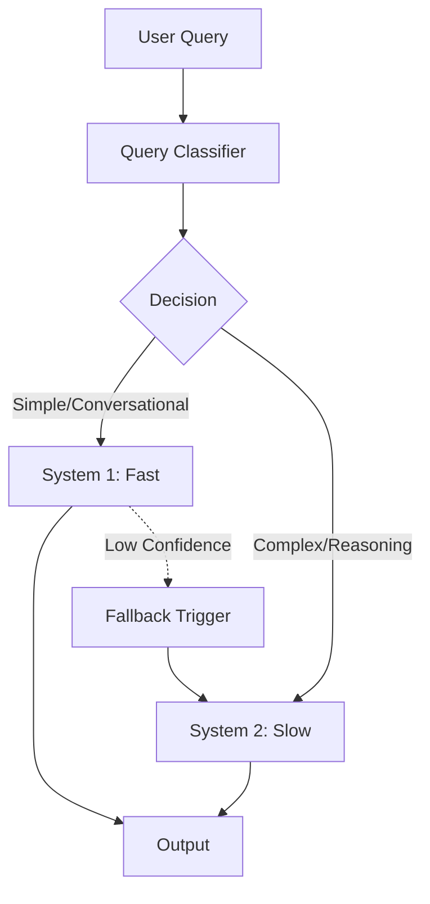

# Dual-Process Architecture (System 1 & System 2)

Loom implements a **Dual-Process Cognitive Architecture**, inspired by Daniel Kahneman's *Thinking, Fast and Slow*. This mechanism allows agents to switch between fast, intuitive responses and slow, deliberate reasoning based on the complexity of the task.

## The Cognitive Switch

At the core of this system is the **Cognitive Router**, a component that analyzes incoming queries and decides which processing path to take.



### Routing Logic

The router evaluates several signals to make a decision:

1.  **Complexity Score**: Derived from query length, structural complexity, and instruction depth.
2.  **Code Detection**: Presence of code capability requests usually triggers System 2.
3.  **Multi-step Indicators**: Words implying planning (e.g., "first... then...", "plan", "research") favor System 2.

## System 1: Fast Response (Intuition)

**System 1** is designed for speed, fluidity, and conversational flow.

*   **Model**: Typically uses lighter, faster models (or optimized prompts).
*   **Context**: Uses a limited "Working Memory" context (L1/L2) to reduce latency and noise.
*   **Streaming**: Responses are streamed immediately to the user.
*   **Use Cases**:
    *   Chit-chat ("How are you?")
    *   Simple factual queries ("What is the capital of France?")
    *   Clarifications.

### Confidence Monitor
System 1 is fast but prone to hallucination on complex tasks. The **Confidence Monitor** runs in parallel or post-generation. If the confidence score of a System 1 response drops below a threshold (e.g., 0.6), the system automatically triggers a **System 2 Fallback**, invisibly to the user, ensuring reliability.

## System 2: Slow Thinking (Reasoning)

**System 2** is designed for deep reasoning, planning, and execution.

*   **Model**: Uses high-capacity reasoning models.
*   **Context**: Accesses full context, including L3 (Episodic) and L4 (Semantic) memory.
*   **Capabilities**:
    *   **Chain of Thought (CoT)**: Explicit reasoning steps.
    *   **Tool Use**: Access to external tools (Search, Code Execution).
    *   **Recursion**: Can spawn sub-agents to handle sub-tasks.
*   **Use Cases**:
    *   "Write a Python script to scrape this website."
    *   "Analyze the market trends for the last 5 years."
    *   "Plan a travel itinerary."

## Cognitive Config

You can configure the behavior of the dual system via `AdpativeRouterConfig`:

```python
from loom.cognition import AdaptiveRouter, RouterConfig

config = RouterConfig(
    default_mode="balanced",  # 'fast', 'balanced', 'deep'
    code_trigger=True,        # Force System 2 for code
    min_confidence=0.7        # Threshold for fallback
)
```
