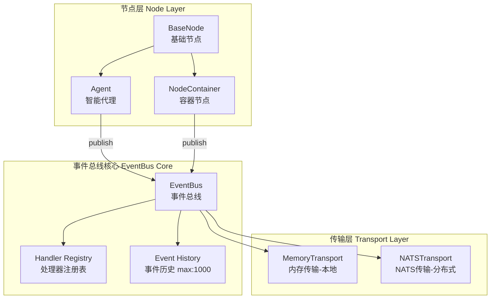
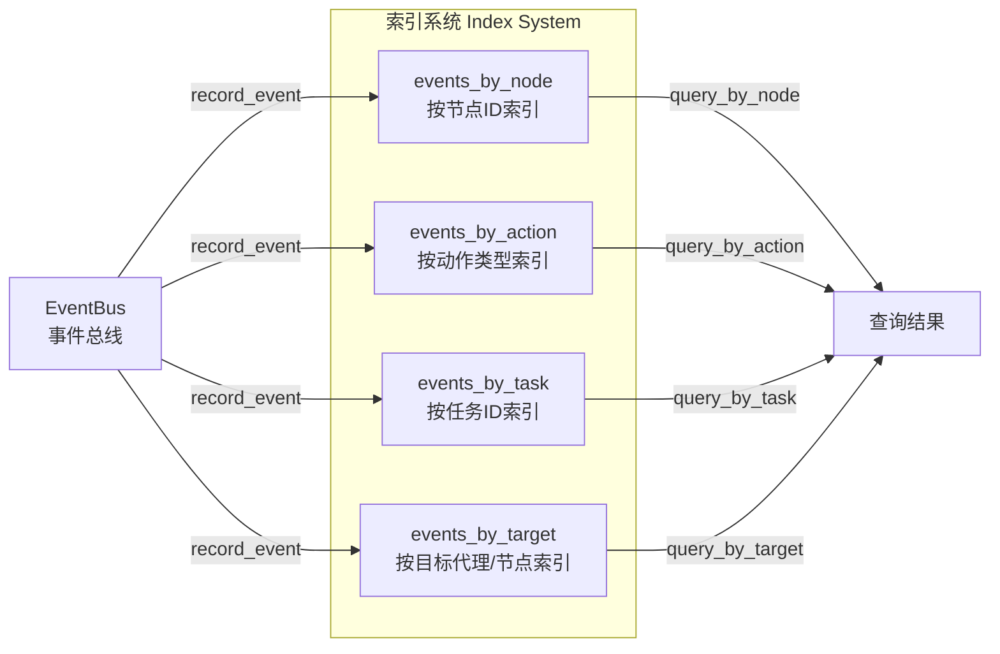
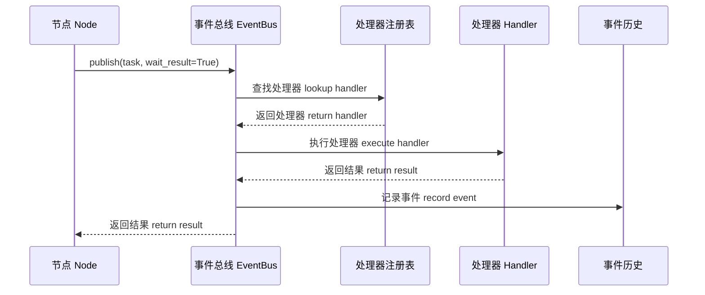
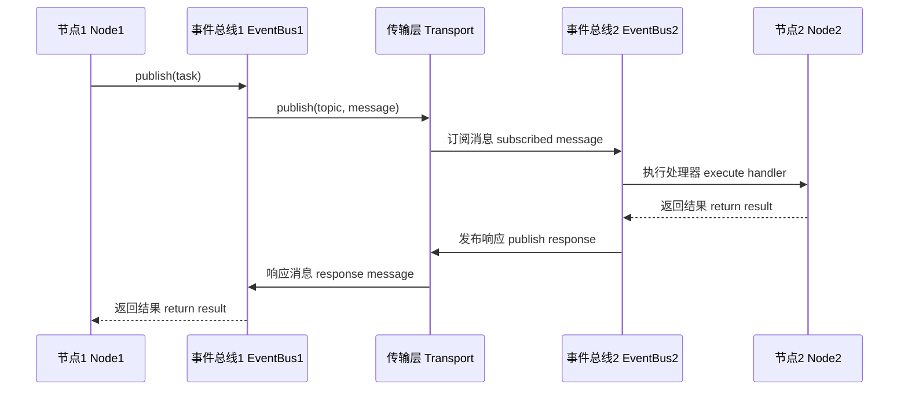
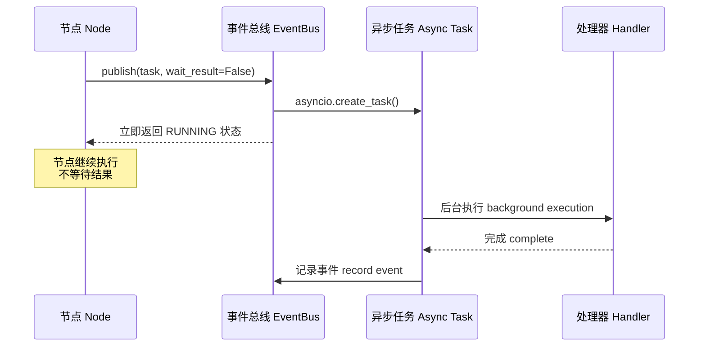
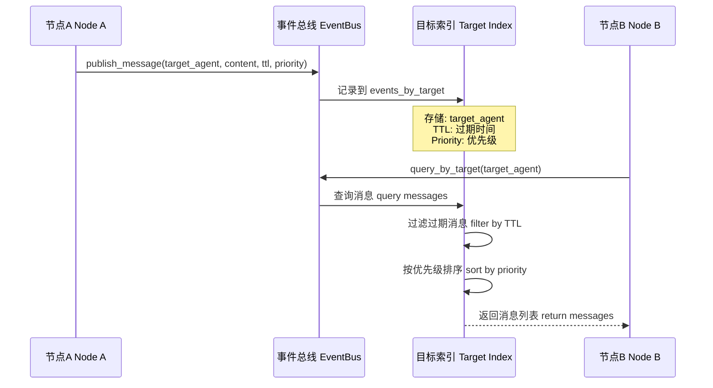
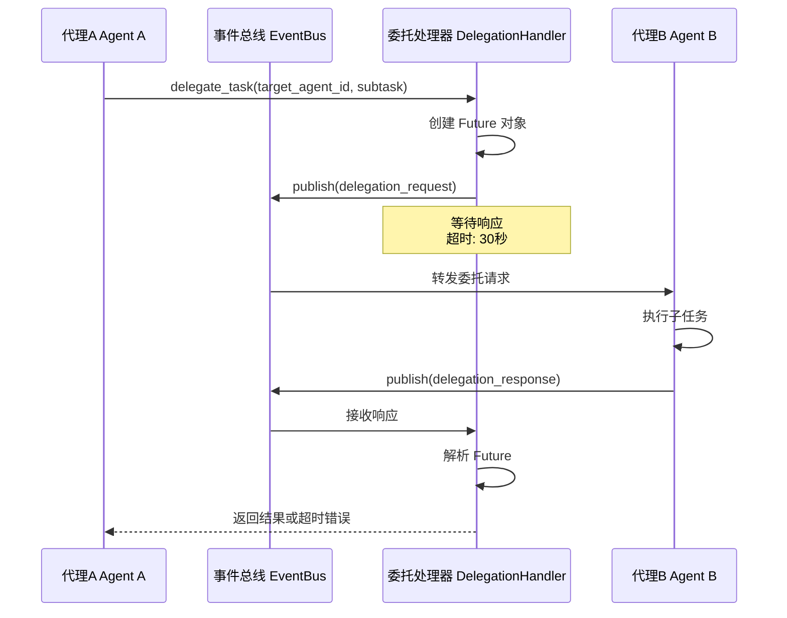
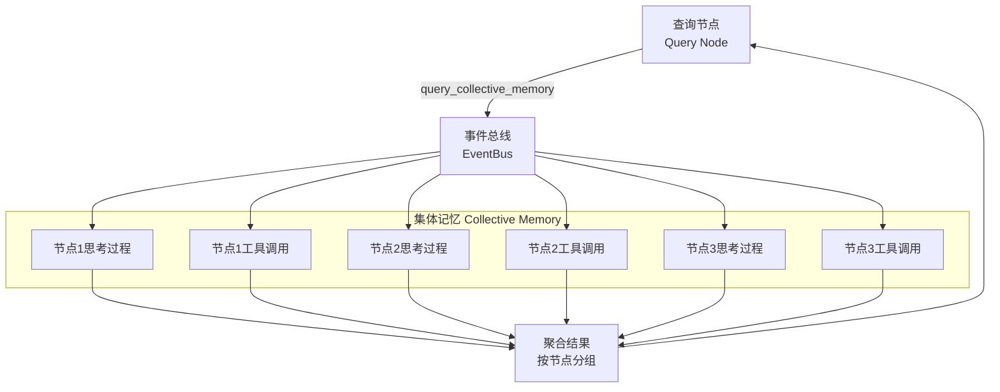
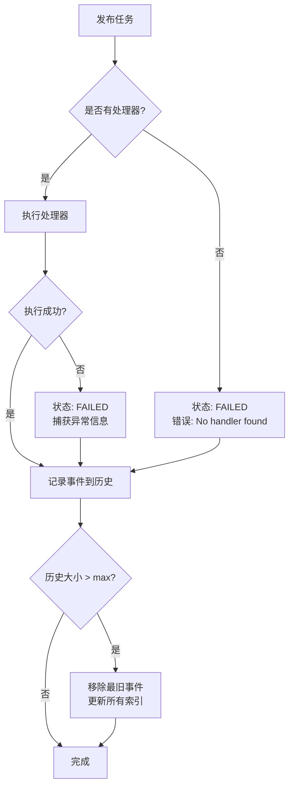

# Event System (The Nervous System)

Loom is an **Event-Driven System**. If the Fractal Architecture is the skeletal structure, the Event System is the nervous system that connects everything.

## Axiom 2: Event Sovereignty

The second axiom of Loom states: **"All communication must happen via Tasks (Events)."**

This means there are no backdoor function calls between isolated agents. Every interaction—requests, responses, signals, errors—is encapsulated in a standardized event object.

## Type-Safe Routing

In earlier versions, Loom relied on string-based routing, which was prone to errors (typos, schema mismatches). The current version introduces a **Type-Safe Event Bus**.

### 1. Task Actions
Instead of magic strings, we use Enums (`loom.events.actions`) to define all possible operations:

```python
from loom.events.actions import TaskAction

# Good: Type-safe
event_bus.publish(action=TaskAction.EXECUTE, payload=task)

# Bad: String typo
event_bus.publish(action="executes", ...) # Error
```

Supported Action Categories:
- **`TaskAction`**: `EXECUTE`, `CANCEL`, `QUERY`
- **`MemoryAction`**: `READ`, `WRITE`, `SYNC`
- **`AgentAction`**: `START`, `STOP`, `HEARTBEAT`

### 2. Protocol-based Handlers
Event handlers are now defined by a strict Protocol, ensuring that any function registered to handle an event matches the expected signature.

```python
class TaskHandler(Protocol):
    async def __call__(self, task: Task) -> Task:
        ...
```

## CloudEvents Standard

Loom strictly adheres to the **CNCF CloudEvents 1.0** specification. This ensures interoperability with external tools, monitoring systems, and other microservices.

### Event Structure
Every event in Loom contains:
- `id`: Unique identifier.
- `source`: URI of the sender (e.g., `node://agent-1`).
- `type`: The kind of event (e.g., `com.loom.task.created`).
- `data`: The payload (the task details, result, etc.).

## The Universal Bus

All events flow through a **Universal Event Bus**. This architecture decouples senders from receivers, allowing for:

1.  **Observability**: A monitoring tool can subscribe to the bus and see "thoughts" flowing in real-time.
2.  **Replayability**: Events can be logged and replayed for debugging or training.
3.  **Distribution**: Events can be routed over HTTP, WebSocket, or MQTT, allowing nodes to live on different physical machines.

---

## 消息传递机制架构图 (Message Passing Architecture)

本节展示基于 EventBus 的完整消息传递机制，包括所有设计场景。

### 1. 核心架构图 (Core Architecture)

整体架构展示了节点层、事件总线核心和传输层的关系：



### 2. 多索引系统 (Multi-Index System)

EventBus 使用多索引系统实现高效的事件查询：



### 3. 消息传递场景 (Message Passing Scenarios)

#### 场景 1: 本地执行 (Local Execution)

同步等待模式，适用于需要立即获取结果的场景：



#### 场景 2: 分布式执行 (Distributed Execution)

跨机器的消息传递，通过传输层实现：



#### 场景 3: Fire-and-Forget 模式

异步非阻塞模式，适用于不需要等待结果的场景：



#### 场景 4: 点对点消息传递 (Point-to-Point Messaging)

带优先级和 TTL 的定向消息传递：



#### 场景 5: 任务委托 (Task Delegation)

代理间的任务委托，带超时机制：



### 4. 查询模式 (Query Patterns)

#### 集体记忆查询 (Collective Memory Query)

节点可以查询其他节点的思考过程和工具调用，形成"集体无意识"：



### 5. 错误处理与边界情况 (Error Handling & Edge Cases)

#### 错误处理流程



#### 边界情况处理

| 边界情况 | 处理策略 |
|---------|---------|
| **无处理器** | 状态设为 FAILED，记录错误信息 |
| **处理器异常** | 捕获异常，状态设为 FAILED，记录错误详情 |
| **Fire-and-Forget 异常** | 使用 `contextlib.suppress` 抑制异常，不影响调用方 |
| **历史大小超限** | 移除最旧事件，更新所有索引，防止内存膨胀 |
| **TTL 过期消息** | 查询时过滤，基于 UTC 时间检查 |
| **委托超时** | 默认 30 秒超时，返回错误信息，清理待处理请求 |
| **容器递归深度** | 跟踪 `_container_depth`，默认最大深度 100，防止栈溢出 |
| **优先级消息排序** | 先按优先级 (0-1，高优先)，再按时间戳 (新优先) |

### 6. 关键特性总结 (Key Features)

#### 核心能力

1. **类型安全路由** - 使用枚举而非字符串，避免拼写错误
2. **多索引系统** - 支持按节点、动作、任务、目标多维度查询
3. **双模式发布** - 同步等待 vs 异步非阻塞
4. **分布式支持** - 通过传输层抽象支持本地和分布式部署
5. **点对点消息** - 带 TTL 和优先级的定向消息传递
6. **任务委托** - 代理间异步任务委托，带超时保护
7. **集体记忆** - 跨节点的思考过程和工具调用共享
8. **事件历史** - 完整的事件记录，支持回放和调试
9. **CloudEvents 标准** - 符合 CNCF CloudEvents 1.0 规范
10. **流式转换** - 支持 SSE 格式的实时事件流

#### 动作类型参考 (Action Types Reference)

**TaskAction** (任务动作):
- `EXECUTE` - 执行任务
- `CANCEL` - 取消任务
- `QUERY` - 查询任务状态
- `STREAM` - 流式任务执行

**MemoryAction** (内存动作):
- `READ` - 读取内存
- `WRITE` - 写入内存
- `SEARCH` - 搜索内存
- `SYNC` - 同步内存

**AgentAction** (代理动作):
- `START` - 启动代理
- `STOP` - 停止代理
- `STATUS` - 查询代理状态
- `HEARTBEAT` - 代理心跳

**Node-Specific Actions** (节点特定动作):
- `node.thinking` - 思考过程事件
- `node.tool_call` - 工具调用事件
- `node.tool_result` - 工具执行结果
- `node.message` - 点对点消息
- `node.start` - 任务开始事件
- `node.complete` - 任务完成事件
- `node.error` - 错误事件
- `node.planning` - 规划阶段事件
- `node.tool_call_request` - 工具调用审批钩子
- `node.delegation_request` - 委托请求

### 7. 使用示例 (Usage Examples)

#### 基本发布订阅

```python
from loom.events import EventBus, Task
from loom.events.actions import TaskAction

# 创建事件总线
event_bus = EventBus()

# 注册处理器
async def handle_task(task: Task) -> Task:
    # 处理任务逻辑
    task.status = "completed"
    return task

event_bus.register_handler(TaskAction.EXECUTE, handle_task)

# 发布任务 (同步等待)
task = Task(action=TaskAction.EXECUTE, data={"input": "test"})
result = await event_bus.publish(task, wait_result=True)

# 发布任务 (异步非阻塞)
result = await event_bus.publish(task, wait_result=False)
```

#### 点对点消息传递

```python
# 节点 A 发送消息给节点 B
await node_a.publish_message(
    target_agent="agent-b",
    content="Hello from A",
    priority=0.8,
    ttl_seconds=60
)

# 节点 B 查询消息
messages = event_bus.query_by_target(
    target_agent="agent-b",
    limit=10
)
```

#### 查询集体记忆

```python
# 查询所有节点的思考过程和工具调用/结果
collective_memory = event_bus.get_collective_memory(
    action_types=["node.thinking", "node.tool_call", "node.tool_result"],
    limit=100
)

# 结果按节点分组
for node_id, events in collective_memory.items():
    print(f"Node {node_id}: {len(events)} events")
```

---

**相关文档**:
- [Fractal Architecture](./fractal-architecture.md) - 分形架构设计
- [Memory System](../features/memory-system.md) - 内存系统
- [Orchestration](../features/orchestration.md) - 编排系统
