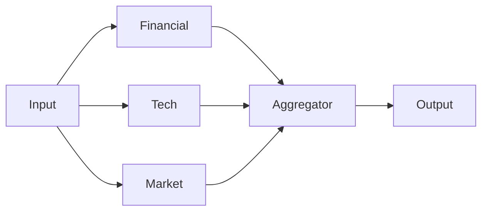

# Composition Patterns

Loom provides three powerful primitives to compose generic Runnables (Agents, Tools, or Chains) into complex workflows.

## 1. Sequence (`Sequence`)
Executes components linearly. The output of one step becomes the input of the next.

```python
from loom.patterns import Sequence

# A linear chain: Researcher -> Writer
chain = Sequence([researcher_agent, writer_agent])

result = await chain.invoke("Topic: AI Agents")
```

**Flow**: `Input` -> `Researcher` -> `Writer` -> `Output`

## 2. Group (`Group`)
Executes components in parallel. Ideally suited for "Mixture of Experts" or independent tasks.

```python
from loom.patterns import Group

# Run 3 analysts in parallel
team = Group(
    Runnables=[analyst_financial, analyst_tech, analyst_market],
    aggregator=summary_agent # Optional: Summarizes the 3 outputs
)

result = await team.invoke("Analyze NVDA")
```

**Flow**:


## 3. Router (`Router`)
Conditional branching. Routes input to ONE of several paths based on logic.

```python
from loom.patterns import Router

def router_logic(input_text: str) -> str:
    if "def " in input_text or "class " in input_text:
        return "coder"
    else:
        return "chat"

router = Router(
    routes={
        "coder": coder_agent,
        "chat": chat_agent
    },
    selector=router_logic
)

await router.invoke("def hello(): ...") # Goes to coder
```

## 4. Nesting
Because all patterns are `Runnables`, you can nest them arbitrarily!

```python
# A complex workflow
workflow = Sequence([
    planner_agent,      # Step 1: Plan
    Group([             # Step 2: Execute parallel subtasks
        coder_agent,
        tester_agent
    ]),
    reviewer_agent      # Step 3: Review
])
```
