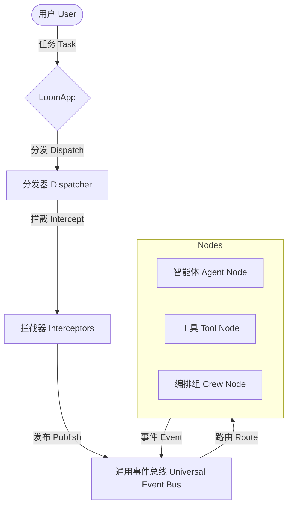

# 快速入门 Loom

欢迎来到 Loom —— 一个**协议优先、分形架构、具备记忆能力的 AI Agent 框架**。

Loom 专为构建健壮、长运行且智能的 Agent 系统而设计，无论是简单的脚本还是分布式的智能体集群 (Swarm) 都能轻松驾驭。

## 高层架构 (High-Level Architecture)



## 前置要求 (Prerequisites)

- **Python 3.9+**: Loom 利用了现代 Python 的特性。
- **`asyncio` 基础**: Loom 是完全异步的框架。

## 安装 (Installation)

```bash
pip install loom-agent
```

## 下一步 (Next Steps)

1. **[快速上手 (Quickstart)](quickstart.md)**: 5 分钟内构建你的第一个 "Hello World" Agent。
2. **[核心概念](../02_core_concepts/index.md)**: 深入了解 Loom 的底层原理。
