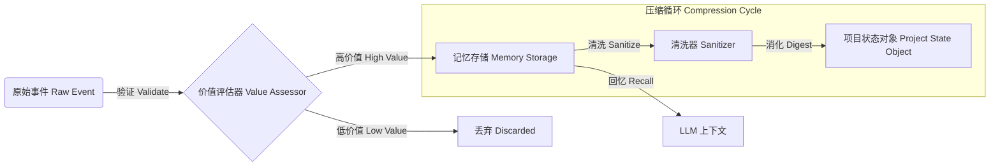

# 新陈代谢记忆系统 (Metabolic Memory)

Loom 引入了一种受生物学启发的记忆管理机制，称为 **新陈代谢记忆 (Metabolic Memory)**。传统的 Agent 只是简单地追加历史记录，直到上下文窗口溢出；而 Loom 则**消化 (Digests)** 信息。

## 问题 (The Problem)
上下文窗口 (Context Window) 是昂贵且有限的。"滚动窗口"会丢失关键的早期背景。"摘要"会丢失具体的细节。

## 解决方案：新陈代谢 (The Solution: Metabolism)



信息流经三个阶段：

### 1. 摄入 (Ingestion / Validation)
在信息进入记忆之前，首先评估其价值。
- **Validators**: `LLMValueAssessor` 或 `HeuristicValueAssessor` 对传入的观察结果进行打分。
- 低价值的噪音会被立即丢弃。
- *例子*：一个 Agent 尝试了 5 个不同的搜索查询。只有成功的查询和结果被保留；失败的尝试被丢弃，或者被概括为"尝试了 X, Y, Z 但未成功"。

### 2. 消化 (Digestion / Sanitization)
当信息从子节点（如 Tool 或子 Agent）流向父节点时，它会被清洗。
- **Sanitizers**: `BubbleUpSanitizer` 提取高层信号（成功/失败/关键洞察）并剥离冗长的日志。
- 这防止了"污染"上级主管 (Supervisor) 的上下文。

### 3. 同化 (Assimilation / PSO)
短期的片段被固化为 **项目状态对象 (PSO, Project State Object)**。
- PSO 是一个结构化的 JSON 对象，代表**世界的当前状态**（例如 `{"files_created": ["a.py"], "status": "testing"}`）。
- Agent 看到的是 PSO + 近期历史，确保它既能把握大局，又不需要读取完整的历史日志。

## 使用方法 (Usage)

默认情况下，`AgentNode` 使用 `MetabolicMemory`。你可以配置其严格程度：

```python
from loom.builtin.memory import MetabolicMemory

memory = MetabolicMemory(
    validator=MyStrictValidator(),  # 自定义验证器
    sanitizer=CompressiveSanitizer() # 自定义清洗器
)
```
