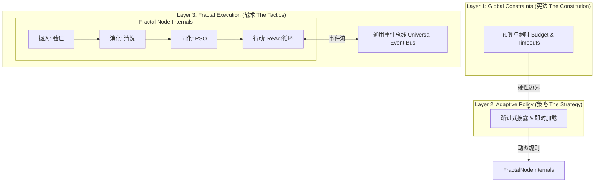

# 设计哲学：受控分形与协议优先

Loom 框架的设计并非凭空而来，而是基于对**分形论 (Fractal Theory)**、**控制论 (Cybernetics)** 以及 **Anthropic 关于 AI Agent 核心洞察**的深度思考。

我们的目标是解决 AI Agent 系统中的核心矛盾：**如何在追求高自由度与自适应性的同时，保持系统的可控性与确定性？**

## 一、核心理论：受控分形 (Controlled Fractal)

我们认为，完美的智能系统是**自组织的边界内控制**与**控制的框架内自组织**的辩证统一。

### 1. 核心张力
- **分形论 (自由 Liberty)**: 强调自相似性、递归和涌现。Agent 可以包含 Agent，形成无限复杂的网络。这带来了极大的灵活性，但也伴随着**失控**的风险。
- **控制论 (秩序 Order)**: 强调状态、反馈和约束。通过确定的规则保证系统的稳定性。这带来了可靠性，但也可能导致**僵化**。

Loom 提出的解决方案是 **"受控分形" (Controlled Fractal)**：在严格的全局约束下，允许局部的无限分形生长。

### 2. 三层架构

Loom 通过三层调控架构来实现这一哲学：

*   **Layer 1: 全局约束 (Constitution)**
    *   **Context Budget**: 硬性代币限制（如 200k tokens），任何 Agent 或集群都不可突破。
    *   **Timeout**: 严格的时间边界，防止系统无限死锁。

*   **Layer 2: 自适应策略 (Strategy)**
    *   **Progressive Disclosure**: 技能和信息分层加载（元数据 -> 内容 -> 文件），仅在需要时加载。
    *   **JIT Loading**: 上下文即时获取 (Just-In-Time)，而非预加载。

*   **Layer 3: 分形执行 (Tactics)**
    *   **Fractal Nodes**: 每个组件（Agent, Tool, Crew）都是节点，可递归组合。
    *   **Self-Organization**: 节点根据任务动态路由和组建团队。

---

## 二、实现原则：协议优先 (Protocol-First)

为了支撑上述理论，我们在工程实现上选择了 **Protocol-First** 的路径。

### 1. 行为优于继承
传统的继承式编程导致脆弱的层级依赖。Loom 使用 Python 的 `typing.Protocol` 来定义**行为的契约**。

这与**分形论**不谋而合：只要一个对象表现得像个 Node（遵守 `NodeProtocol`），它就是个 Node，无论它内部是一个简单的函数，还是一个复杂的分布式集群。

## 三、终极公式

Loom 的设计哲学可以总结为：

$$ \text{Intelligence} = \text{Emergence} \times \text{Control} $$
$$ \text{智能} = (\text{自由探索} \times \text{约束边界}) $$

我们致力于提供最坚固的**约束边界**，以便你的 Agent 能在其中进行最狂野的**自由探索**。
