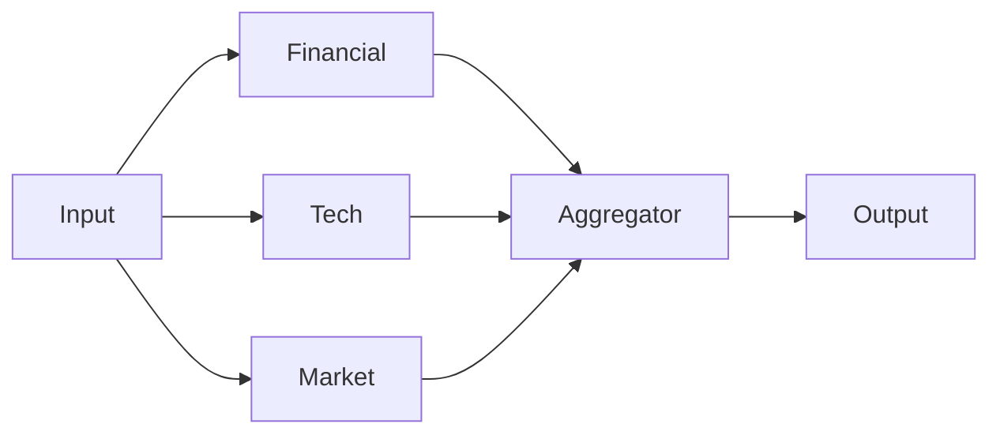

# 组合模式指南 (Composition Patterns)

Loom 提供了三种强大的原语，用于将通用的 Runnable（如 Agent、Tools 或 Chain）组合成复杂的业务流。

## 1. 串行 (Sequence)
线性执行组件。上一步的输出成为下一步的输入。

```python
from loom.patterns import Sequence

# 线性链: 研究员 -> 作家
chain = Sequence([researcher_agent, writer_agent])

result = await chain.invoke("主题: AI Agent")
```

**流程**: `Input` -> `Researcher` -> `Writer` -> `Output`

## 2. 并行组 (Group)
并行执行组件。非常适合 "专家混合 (MoE)" 或独立子任务。

```python
from loom.patterns import Group

# 并行运行 3 个分析师
team = Group(
    Runnables=[analyst_financial, analyst_tech, analyst_market],
    aggregator=summary_agent # 可选: 汇总 3 个结果
)

result = await team.invoke("分析 NVDA")
```

**流程**:


## 3. 路由 (Router)
条件分支。基于逻辑将输入路由到多条路径中的一条。

```python
from loom.patterns import Router

def router_logic(input_text: str) -> str:
    if "def " in input_text or "class " in input_text:
        return "coder"
    else:
        return "chat"

router = Router(
    routes={
        "coder": coder_agent,
        "chat": chat_agent
    },
    selector=router_logic
)

await router.invoke("def hello(): ...") # 进入 coder
```

## 4. 嵌套 (Nesting)
由于所有模式本身也是 `Runnable`，您可以任意嵌套它们！

```python
# 一个复杂的工作流
workflow = Sequence([
    planner_agent,      # 第一步: 规划
    Group([             # 第二步: 并行执行子任务
        coder_agent,
        tester_agent
    ]),
    reviewer_agent      # 第三步: 审查
])
```
