# hernss Agent 框架研发指南

> 基于公理系统 v2.0 × Claude Code 工程实践的六维度架构规范
>
> 核心立场：**Harness 是舞台，不是演员。L\* 完全自主，Ψ 拥有否决权但不替模型做决策。**

---

## 目录

1. [唯一公理与架构全貌](#1-唯一公理与架构全貌)
2. [维度一：上下文控制](#2-维度一上下文控制)
3. [维度二：运行时控制](#3-维度二运行时控制)
4. [维度三：CLI 工具系统](#4-维度三cli-工具系统)
5. [维度四：多 Agent 协作](#5-维度四多-agent-协作)
6. [维度五：Skill / Plugin / MCP 生态](#6-维度五skill--plugin--mcp-生态)
7. [维度六：安全管理](#7-维度六安全管理)
8. [研发优先级与实施路线](#8-研发优先级与实施路线)
9. [设计原则速查表](#9-设计原则速查表)
10. [开放问题](#10-开放问题)
11. [Agent Runtime Framework：面向开发者的编排与运行时接口](#11-agent-runtime-framework面向开发者的编排与运行时接口)
12. [Claude Code 可借鉴的工程实践](#12-claude-code-可借鉴的工程实践)

---

## 1. 唯一公理与架构全貌

### 1.1 唯一公理

```
A = ⟨C, M, L*, H_b, S, Ψ⟩

C    Context     当前 token 窗口，Agent 的唯一感知界面
M    Memory      M = (M_s, M_f, M_w)，会话内 / 文件系统 / 模型权重
L*   Loop        (Reason → Act → Observe → Δ)*，Agent 主执行闭环
H_b  Heartbeat   与 L* 并行运行的独立感知层，主动监控外部变化并注入事件
S    Skill       渐进式披露的工具/MCP 集合，按需加载进 C
Ψ    Harness     构建环境与边界，拥有否决权，不替模型做决策
```

> **v2.0 → v2.1 关键修订：** v2.0 将心跳内化于 Δ，但这导致 Agent 在长时间 Act（等待 shell、网络、子 Agent）期间完全丧失外部感知能力。H_b 作为独立元素回归，与 L\* 并行运行，解决"等待盲区"问题。

**核心关系：**

```
Agent = Model ∘ Ψ
```

Ψ 的职责边界：

| 可以做 ✓ | 不可以做 ✗ |
|---|---|
| 设计 C_system 初始结构 | 在运行时覆盖 LLM 的续写/拆解判断 |
| 提供工具和场景包 (S, Σ) | 设置任意的中间阈值规则 |
| 设置物理约束 (ρ=1.0, d_max) | 替 LLM 做语义层面的决策 |
| 配置 H_b 心跳策略（间隔、监控源、中断条件） | 让 H_b 替 LLM 做响应决策 |
| 拥有否决权（安全阀，不轻易使用） | — |

### 1.2 六维度总览

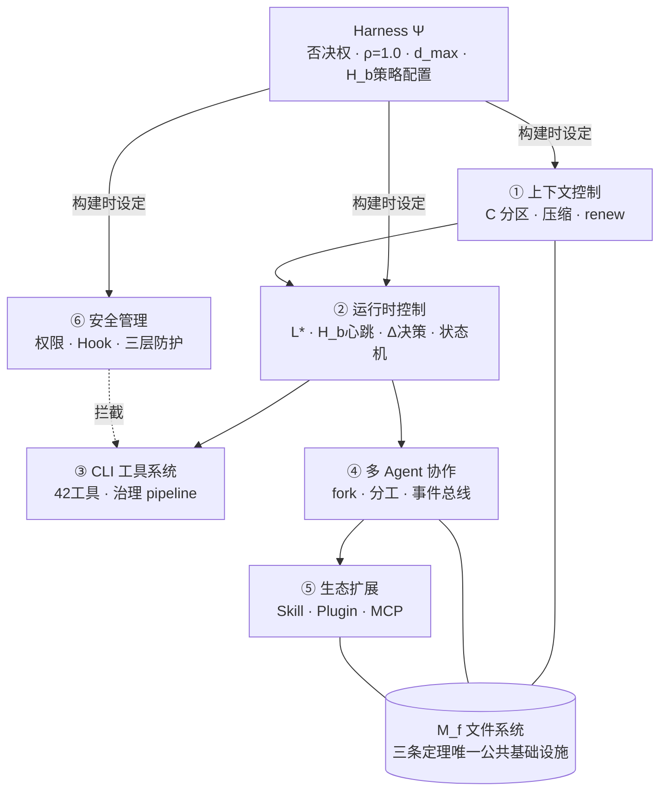

### 1.3 三条派生定理

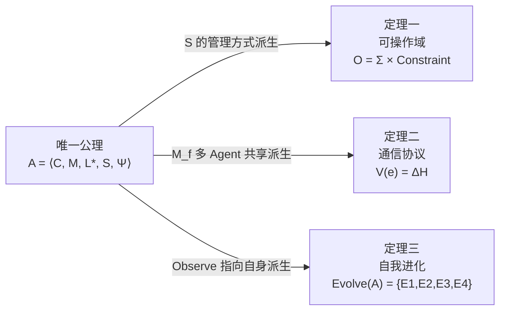

---

## 2. 维度一：上下文控制

> **核心主张：C 是 Agent 的唯一感知界面。管理 C 就是管理 Agent 的认知。**

### 2.1 上下文分区

```
C = C_system ⊕ C_memory ⊕ C_skill ⊕ C_history ⊕ C_working

保护优先级：C_system > C_working > C_memory > C_skill > C_history
```

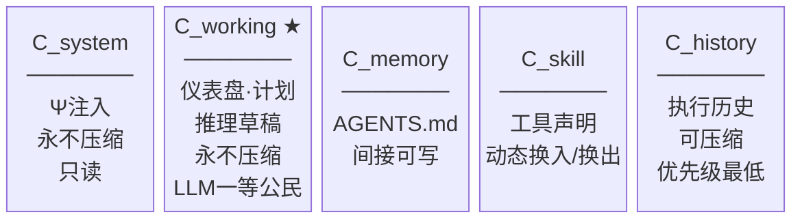

### 2.2 C_working 认知界面（永不压缩）

```python
C_working = {
    "dashboard": {
        "ρ":             # 当前上下文压力 = token数 / W_max
        "token_budget":  # 剩余 token 预算（用户指定目标，如 "20+500k"）
        "goal_progress": # 任务完成度 LLM 自评（自由文本）
        "error_count":   # 最近 N 步的错误计数
        "depth":         # 当前 Sub-Agent 递归深度
        "last_hb_ts":    # 最后一次心跳时间戳
        "interrupt_requested": False,  # H_b 请求中断标志（控制态）
    },
    "plan": [           # 当前执行计划（Todo list）
        ...
    ],
    "event_surface": {  # 外部变化的认知界面，而非原始日志
        "pending_events": [],          # 尚未被 Δ 明确处置的事件
        "active_risks": [],            # 已处置但仍约束当前 plan 的风险/约束
        "recent_event_decisions": [],  # 最近几轮对事件的处置摘要，避免重复思考
    },
    "knowledge_surface": {  # 外部知识的证据界面，而非长期记忆
        "active_questions": [],   # 当前任务中需要外部知识回答的问题
        "evidence_packs": [],     # 面向当前 goal 整理后的证据包
        "citations": [],          # 当前轮次可引用的来源索引
    },
    "scratchpad": ...   # 短期工作记忆 / 推理草稿
}
```

**关键设计原则：** `C_working` 不是运行时日志，而是 LLM 的工作记忆。信任 LLM 的判断力，前提是让它始终看到低歧义、面向决策的界面。

其中：

- `dashboard` 承载状态指标，不承载原始事件。
- `plan` 是与 `dashboard` 平级的一等认知对象，而不是仪表盘的附属字段。
- `event_surface` 只保留当前决策真正需要的外部变化表示，不等于完整事件账本。
- `knowledge_surface` 只保留当前任务所需的外部证据表示，不等于知识库本身。
- 原始事件日志应落在 `M_f` / runtime journal；`C_working` 只保留投影后的工作集。
- 外部知识源、检索索引、原始文档应位于 `M_f` / MCP / 外部系统，不能直接等同于模型记忆。

**Token Budget 系统：** 当 token_budget 接近耗尽时，系统注入 nudge message 提醒 LLM 尽快完成任务。参考实现：`src/query/tokenBudget.ts`。

### 2.3 四道压缩机制（按 token 压力渐进触发）

**关键原则：每轮只触发一种压缩，按优先级递增。**

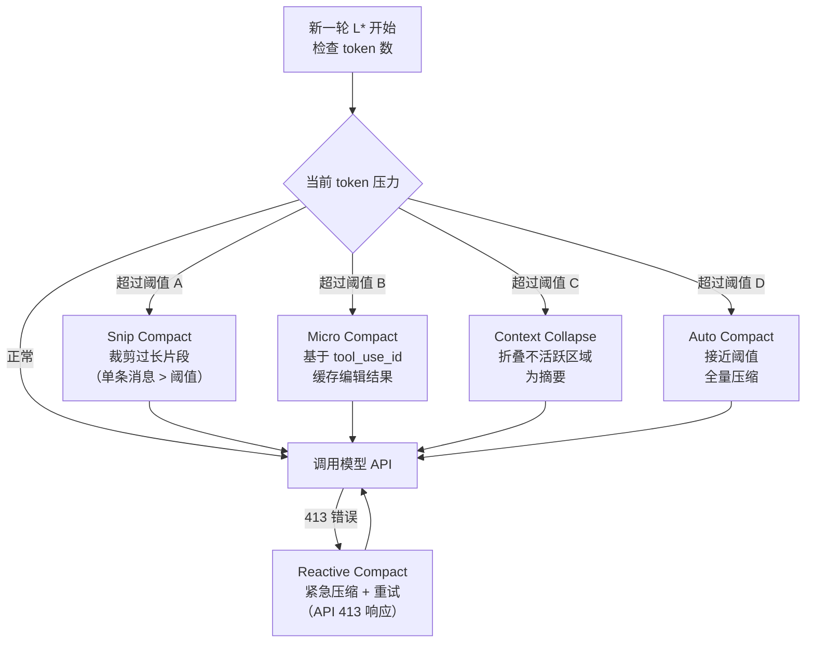

**压缩触发阈值：** A < B < C < D，每轮只执行一种压缩策略，避免过度压缩。参考实现：`src/services/compact/`（11 个文件）。

### 2.4 renew：上下文磁盘换页

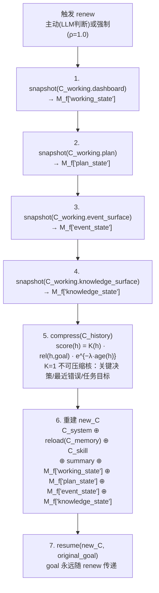

**renew 与 H_b 的一致性语义：**

- `renew` 迁移的是当前决策前提，而不是原始事件日志全集。
- `pending_events` 必须跨 `renew` 完整继承；允许变更表示形式，但不允许丢失事件身份。
- `active_risks` 必须保留，因为它们仍然约束 `plan`。
- `recent_event_decisions` 可以截断为最近窗口，避免占用过多 token。
- `knowledge_surface` 中未消费的 `active_questions` 与仍被 `plan` 依赖的 `evidence_packs` 必须跨 `renew` 保留。
- 证据包允许重新摘要、重排和去重，但不能丢失 citation 身份和来源边界。
- `critical` 事件优先级高于 `renew`：若触发 Ψ 硬中断，应先进入 Observe，再决定是否 renew。
- “永不压缩”应理解为**语义不可静默丢失**，不等于 raw payload 必须原样常驻 `C_working`。

### 2.5 Prompt Cache 经济学

```
System Prompt 结构：

┌──────────────────────────────────────────┐
│  静态部分（可缓存）                        │
│  · 身份定位                               │
│  · 系统运行规范                            │
│  · 行为规范                               │
│  · 工具使用语法                            │
│  · 语气风格                               │
├──────────────────────────────────────────┤  ← SYSTEM_PROMPT_DYNAMIC_BOUNDARY
│  动态部分（按会话状态注入）                 │
│  · Session guidance（当前启用工具）         │
│  · Memory (AGENTS.md)                    │
│  · 环境信息 (OS/shell/cwd)                │
│  · MCP server instructions               │
│  · Token budget 说明                      │
└──────────────────────────────────────────┘
```

**研发规则：** 不要在 boundary 之前放任何会变化的内容，否则破坏 cache 前缀匹配，显著增加 API 成本。

---

## 3. 维度二：运行时控制

> **核心主张：L\* 是主执行闭环，H_b 是与之并行的独立感知层。L\* 负责推进任务，H_b 负责监控外部变化并在必要时注入中断。唯二硬约束是 ρ=1.0 和 d_max，H_b 的中断条件由 Ψ 在构建时配置，响应决策仍由 LLM 做出。**

### 3.1 L\* 主循环状态机

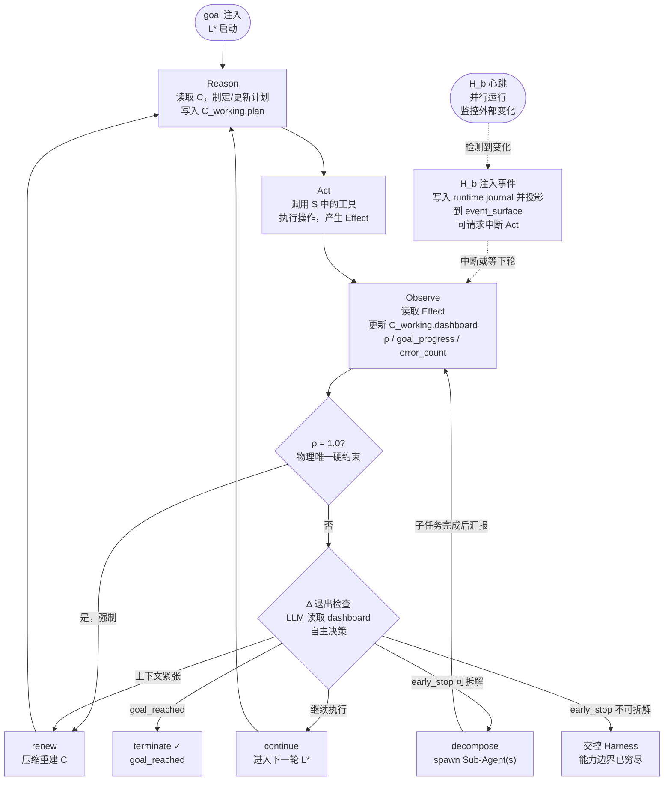

### 3.2 H_b：独立心跳感知层（设计目标）

> **⚠️ 实现状态：这是 hernss 框架的设计目标。Claude Code 当前通过 Hook 系统部分实现类似功能，但没有独立的并行心跳线程。**

> **H_b 解决的核心问题：L\* 在执行长时间 Act（等待 shell 命令、网络请求、子 Agent 完成）期间，Δ 不会被触发，Agent 进入感知盲区。外部环境可能在这段时间发生关键变化，Agent 却无从感知。**

#### 3.2.1 H_b 与 L\* 的并行关系

```
L*  ──────[Reason]──────[Act 等待中...]──────[Observe]──────[Δ]──────▶
               ↑                ↑                   ↑
H_b  ─[tick]──[tick]──[tick]──[tick]──[tick]──[tick]──[tick]──[tick]──▶
               |                |
               └─ 无变化，静默    └─ 检测到变化 → 注入事件 → [可选：中断 Act]
```

H_b 独立于 L\* 的节奏运行。L\* 可能在一次 Act 里阻塞数分钟，H_b 每隔固定间隔（T_hb，由 Ψ 配置）执行一次感知检查，不受 L\* 阻塞影响。

#### 3.2.2 H_b 感知检查流程

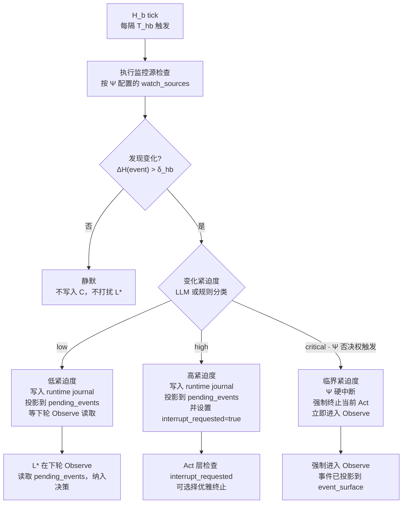

#### 3.2.3 监控源（watch_sources）

Ψ 在构建时配置 H_b 监控哪些外部源。监控源是可插拔的：

| 监控源类型 | 典型场景 | 检测方式 |
|---|---|---|
| 文件系统变化 | 依赖文件被外部修改、新文件出现 | inotify / fs.watch / hash 比对 |
| 进程状态 | 子进程崩溃、PID 消失、退出码 | `/proc/{pid}/status` / waitpid |
| 网络端点 | 服务宕机、API 限流、延迟突升 | HTTP 健康检查 / TCP ping |
| M_f 事件总线 | 其他 Agent 发布的高优先级事件 | 监听 M_f 特定路径 |
| 系统资源 | 内存耗尽、磁盘满、CPU 过载 | `/proc/meminfo` / df / top |
| 外部信号 | 用户中断、Harness 指令、定时器到期 | SIGINT / SIGUSR1 / cron |
| 环境变量 | 配置热更新、feature flag 变更 | 定期 re-read |

```python
# Ψ 构建时配置示例
heartbeat_config = {
    "T_hb": 5,                    # 心跳间隔（秒），Ψ 设定
    "δ_hb": 0.1,                  # 最小信息熵增量，低于此静默
    "watch_sources": [
        {"type": "filesystem",   "paths": ["./src", "./config"], "method": "hash"},
        {"type": "process",      "pid_file": ".agent.pid"},
        {"type": "mf_events",    "topics": ["urgent", "system"]},
        {"type": "resource",     "thresholds": {"memory_pct": 90, "disk_pct": 95}},
        {"type": "external_signal"},
    ],
    "interrupt_policy": {
        "low":      "queue",      # 投影到 pending_events，等下轮 Observe
        "high":     "request",    # 投影到 pending_events，并请求中断
        "critical": "force",      # Ψ 硬中断，不经 LLM
    }
}
```

#### 3.2.4 C_working 扩展：event_surface 认知界面

H_b 的感知结果不应直接以“原始事件队列”的形态长期驻留在 `C_working`。更稳定的做法是：

- 原始事件先进入 `M_f` / runtime journal，作为 source of truth。
- `C_working` 只保留面向 LLM 的投影视图，即 `event_surface`。
- `event_surface` 按“决策阶段”组织，而不是按“采集顺序”组织。

```python
C_working = {
    "dashboard": {
        "ρ": 0.62,
        "goal_progress": "构建链路已跑通，正在验证输出",
        "error_count": 0,
        "depth": 1,
        "interrupt_requested": False,
        "last_hb_ts": "2024-01-01T00:00:05Z",
    },
    "plan": [
        "等待 make build 完成",
        "检查编译产物",
        "整理结论"
    ],
    "event_surface": {
        "pending_events": [
            {
                "event_id": "evt_fs_017",
                "source": "filesystem",
                "summary": "src/config.py 被外部进程修改",
                "urgency": "high",
                "ΔH": 0.73,
                "observed_at": "2024-01-01T00:00:05Z",
                "fingerprint": "sha256:abcd..."
            }
        ],
        "active_risks": [
            {
                "risk_id": "risk_build_invalidated",
                "summary": "当前编译结果可能因源码变动失效",
                "derived_from": ["evt_fs_017"],
                "impact": "plan step 1 可能无效"
            }
        ],
        "recent_event_decisions": [
            {
                "event_id": "evt_api_011",
                "decision": "defer",
                "summary": "API 限流事件已延后到当前 shell 退出后处理"
            }
        ]
    }
}
```

**结构解释：**

- `pending_events`：尚未被 Δ 明确处置的事件，只保留当前必须决策的变化。
- `active_risks`：已经决策过，但仍然约束 `plan` 的持续性风险。
- `recent_event_decisions`：最近几轮对事件的处置摘要，防止 LLM 在短窗口内重复思考同一事件。
- `interrupt_requested` / `last_hb_ts` 属于控制态，不属于语义事件本身。

#### 3.2.5 事件生命周期与确认语义

H_b 与 L\* 的配合需要显式的事件状态机，而不是“读完队列就清空”的弱语义：

```text
detected     -> H_b 检测到变化，生成 event_id，写入 runtime journal
projected    -> 事件被投影进 C_working.event_surface.pending_events
acknowledged -> LLM 在 Observe -> Δ 中给出显式 disposition，并写回系统状态
resolved     -> disposition 对应的动作完成，事件不再约束当前 plan
archived     -> 从 C_working 工作集移出，仅保留账本 / 历史摘要
```

**acknowledged 的定义：**

> `acknowledged(event_i)` 指 LLM 在某一轮 `Observe → Δ` 中，针对 `event_i` 生成了显式处置结论，并将该结论写入系统状态；它表示“已决策”，不表示“已解决”。

因此：

- “事件进入 `pending_events`”不算 ack。
- “H_b 将事件标成 `high`/`critical`”不算 ack。
- “LLM 看到了事件，但没有留下显式 disposition”不算 ack。
- `ignore / defer / replan / decompose / handoff_to_harness / terminate_current_act` 都可以是合法的 ack disposition。

#### 3.2.6 L\* 对 H_b 事件的响应语义

H_b 注入事件后，L\* 在进入 Observe 时读取 `pending_events + active_risks`，将其与工具执行结果一起纳入 Δ：

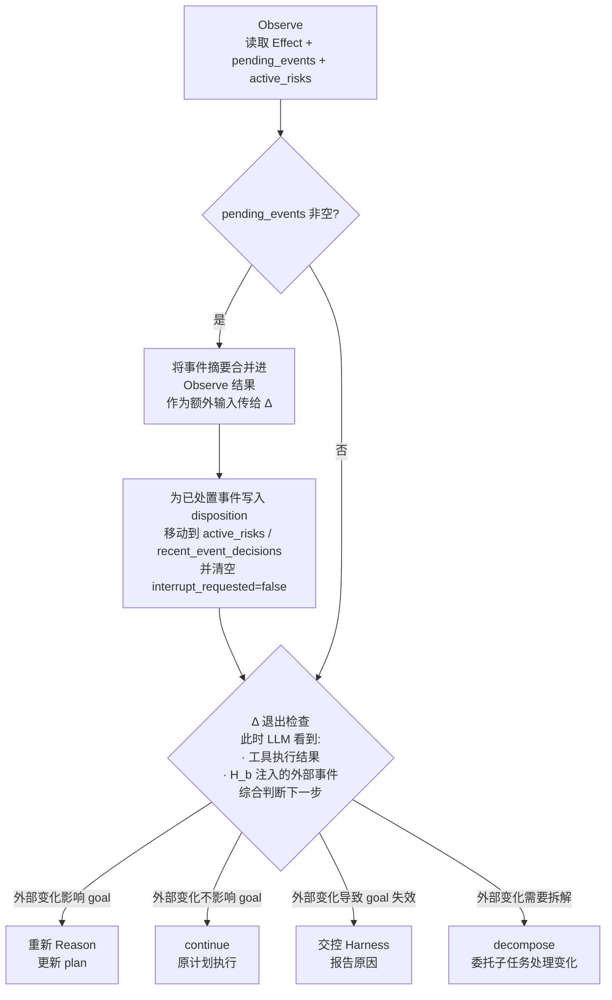

**关键语义：**

- `pending_events` 只承载“尚未决策”的变化。
- 一旦事件被 ack，它就不应继续以 `pending` 身份反复进入 prompt。
- 已 ack 但未 resolved 的事件，应沉淀为 `active_risks` 或直接反映到 `plan`。
- ack 必须绑定稳定 `event_id` / `fingerprint`，否则跨 `renew` 无法避免重复处理。

#### 3.2.7 H_b 的设计约束

```
Ψ 可以配置 ✓：
  T_hb（心跳间隔）
  watch_sources（监控源列表）
  δ_hb（最小信息熵阈值，低于此静默）
  interrupt_policy（低/高/临界的处理策略）
  critical 条件（触发 Ψ 硬中断的规则）

Ψ 不可以做 ✗：
  替 LLM 决定如何响应事件（响应决策在 Δ，由 LLM 做）
  将 H_b 用于监控 LLM 的推理质量（那是 Δ 的职责）
  让 H_b 直接修改 goal（goal 只能由 LLM 在 Reason 中更新）

H_b 自身不做语义判断：
  H_b 的紧迫度分类可以是规则（resource 超阈值 → critical）
  也可以调用轻量分类器
  但 "这个事件对我的 goal 意味着什么" 的判断，永远留给 Δ 层的 LLM
```

#### 3.2.8 典型场景示例

**场景 A：长时间编译任务中依赖文件被修改**

```
t=0s    L* 启动 Act：执行 make build（预计 3 分钟）
t=5s    H_b tick：检查文件系统，无变化，静默
t=10s   H_b tick：检查文件系统，无变化，静默
t=47s   H_b tick：发现 src/utils.py 被外部进程修改（ΔH=0.81 > δ_hb）
        → 紧迫度分类：high（正在编译中修改源文件）
        → 写入 runtime journal，并投影到 pending_events
        → 设置 interrupt_requested=true
t=47s   Act 层检查到 interrupt_requested=true
        → 优雅终止 make build（发送 SIGTERM）
        → 进入 Observe
t=48s   Observe 读取 pending_events：src/utils.py 在编译中被修改
        → Δ：LLM ack 该事件，判断需要重新 Reason，更新 plan
        → 该事件从 pending_events 转入 active_risks
        → 新 plan：先检查修改内容，再决定是否重启编译
```

**场景 B：子 Agent 执行期间系统内存耗尽**

```
t=0s    L* 启动 Act：spawn 大型分析 Sub-Agent
t=30s   H_b tick：检查系统资源，memory_pct=91% > 阈值 90%
        → 紧迫度分类：critical（资源告警）
        → Ψ 硬中断触发（不等 LLM，立即强制 Observe）
        → 事件写入 runtime journal，并投影到 pending_events
t=30s   强制进入 Observe
        → Δ：LLM 看到内存告警
        → 决策：terminate Sub-Agent，清理资源，等待内存恢复后重试
        → 风险沉淀为 active_risks，直到资源恢复
```

**场景 C：等待外部 API 期间收到用户中断信号**

```
t=0s    L* 启动 Act：调用慢速外部 API（超时设置 60s）
t=12s   H_b tick：检测到 SIGINT（用户 Ctrl+C）
        → 紧迫度分类：critical
        → Ψ 硬中断，强制进入 Observe
        → 事件写入 pending_events：{"source": "external_signal", "signal": "SIGINT"}
t=12s   Observe → Δ：LLM 判断 goal_reached=false，交控 Harness
        → Harness 收到"用户请求中断"的结构化报告
```

### 3.3 L\* + H_b 完整并发架构

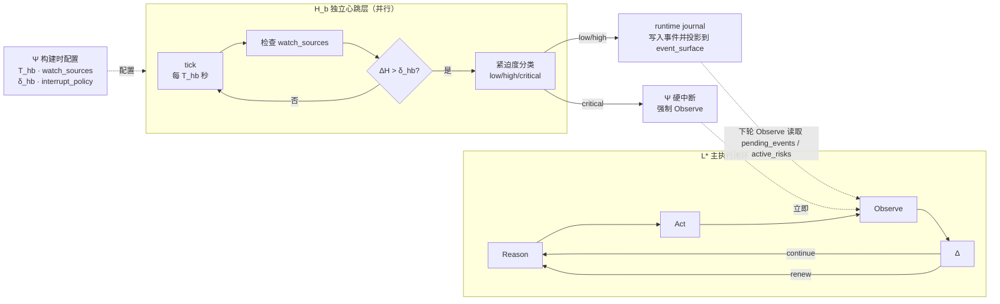

### 3.4 Δ 决策语义（含 H_b 扩展）

```
Δ（每轮 Observe 后执行）：

物理层（规则，不过 LLM）：
  ρ = 1.0           →  强制 renew（唯一的上下文硬约束）
  H_b critical 中断 →  强制进入 Observe（Ψ 否决权，不经 LLM）

语义层（全部交 LLM，基于 dashboard + plan + event_surface）：
  goal_reached = true
            →  terminate ✓

  pending_events 非空（H_b 注入了待处置的外部变化）
            →  LLM 读取 pending_events，评估对 goal 的影响
               · 影响 goal → ack + 重新 Reason，更新 plan
               · 不影响 goal → ack + continue，写入 recent_event_decisions
               · goal 失效 → ack + 交控 Harness

  active_risks 非空（已处置但仍约束计划）
            →  LLM 在后续轮次持续考虑这些约束
               · 风险消除 → 标记 resolved，移出 event_surface
               · 风险仍在 → 保留并继续影响 plan

  LLM 判断上下文紧张（ρ 高但未到 1.0）
            →  主动 renew

  LLM 判断任务可以继续
            →  continue

  early_stop AND 任务可拆解
            →  decompose，spawn Sub-Agent(s)
               depth++，检查 depth < d_max

  early_stop AND 任务不可拆解
            →  交控 Harness，报告能力边界
```

**关键重定义：early_stop 不是失败信号，而是能力边界声明。**  
模型在说："此任务超出我当前 L\* 在当前 C 下能处理的范围。"正确响应是拆解，不是强迫重试。

### 3.5 工程实现：query.ts 状态机 + H_b 并发线程

查询主循环使用 `while(true)` + state 对象替代递归，防止长会话爆栈。9 个 continue 点对应 9 种状态转移原因：

| continue 点 | hernss 映射 |
|---|---|
| next_turn（工具调用完成） | L* 下一轮 Reason |
| reactive_compact 重试 | ρ 压力下的 renew |
| max_output_tokens 恢复 | Act 层分块输出 |
| stop_hook 阻断 | Δ 语义层外部注入 |
| token_budget 继续 | dashboard.goal_progress 驱动 |
| **hb_interrupt（H_b 中断）** | **H_b 注入 critical 事件，强制 Observe** |
| **hb_event（H_b 低优先级事件）** | **pending_events 非空，下轮 Observe 读取** |

**Streaming API Response：** 模型通过流式 API 返回响应，用户可以实时看到输出。工具调用仍然是串行执行（除非 `isConcurrencySafe=true`）。参考实现：`src/services/tools/StreamingToolExecutor.ts`。

**H_b 工程实现（设计目标）：** H_b 作为独立 async 任务（Node.js setInterval / Python asyncio 协程）与 L* 主循环并发运行。通过共享的 state 对象（线程安全的 event journal / event_surface 投影 + interrupt_requested 标志）与 L* 通信，不直接调用 LLM，不阻塞主循环。

**Claude Code 当前实现：** 通过 Hook 系统（PreToolUse/PostToolUse）实现部分外部感知能力，但在长时间 Act 期间仍存在感知盲区。

---

## 4. 维度三：CLI 工具系统

> **核心主张：工具系统的核心不是"有哪些工具"，而是治理流水线。O_A = Σ_A × Constraint_A。**

维度三和前两维的关系可以概括成一句话：

- 维度一决定 LLM 看到了什么。
- 维度二决定 LLM 何时做决策。
- 维度三决定 LLM 决策以后，行动怎样以受控方式落地。

因此，工具系统不应被理解成“给模型更多按钮”，而应被理解成“把外部世界包装成一组带边界、带成本、带审计的可操作接口”。如果前两维在塑造 Agent 的认知，那么维度三就是在塑造 Agent 的可操作域。

### 4.1 Tool 接口设计（fail-closed 原则）

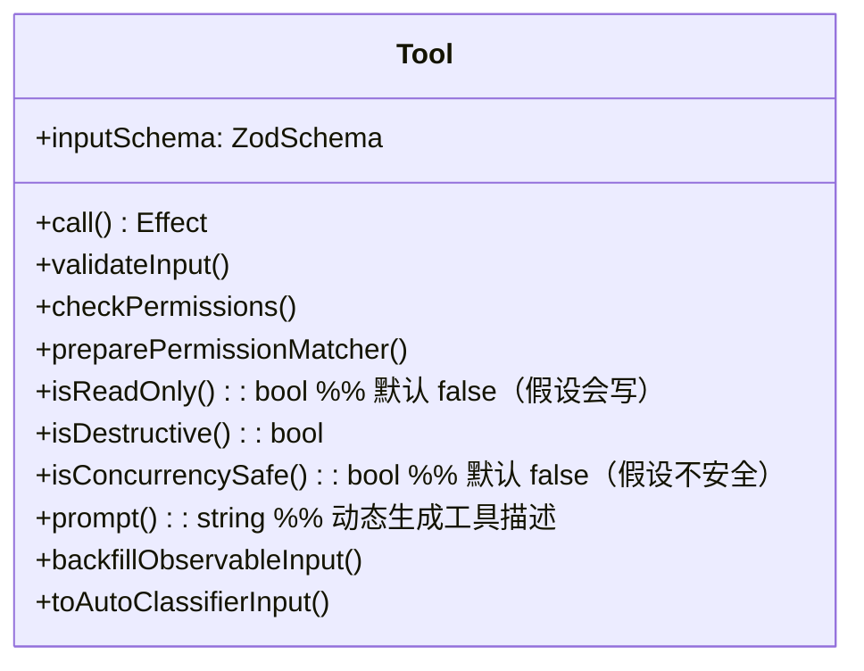

**fail-closed 设计原则：** 忘了声明就按最严格处理。

```
isReadOnly 默认 false        → 走更严格的权限检查
isConcurrencySafe 默认 false → 串行执行，避免竞争
checkPermissions 默认 allow  → 交给通用权限系统处理
```

**系统性理解：**

- `Tool` 接口不是一个技术壳，而是能力声明。
- 每个字段都在回答一个运行时问题：能不能调、是否可并发、是否可读、是否需要额外说明。
- fail-closed 的意义不是“保守”，而是让新增能力的默认成本高于默认风险，避免工具生态扩张后出现隐性越权。

如果把维度一里的 `Skill` 注入、维度二里的 `Act` 执行都考虑进来，`Tool` 接口其实承担了三重职责：

1. 给模型一个可调用的动作名字。
2. 给治理层一个可检查、可拒绝、可串联 Hook 的边界。
3. 给系统一个可观测、可审计、可回放的 effect 生成器。

因此，hernss 里“新增一个工具”从来不是注册一个函数，而是在扩展 `O_A` 的同时扩展风险面。

### 4.2 工具分类（场景库 Σ）

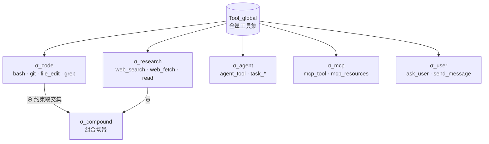

**场景组合规则：**

```
σ_compound = σ_a ⊕ σ_b
  tools       = σ_a.tools ∪ σ_b.tools
  constraints = σ_a.constraints ∩ σ_b.constraints   ← 取更严约束
  verify_hook = σ_b.verify_hook ∘ σ_a.verify_hook   ← 串联验证
```

**系统性理解：**

- `Σ` 不是工具目录，而是任务场景的投影。
- 模型真正感知到的不是“系统总共有多少工具”，而是“当前任务允许我调用哪一小组工具，以及这些工具受哪些约束”。
- 场景组合时对约束取交集，本质上是在防止“能力组合”演化成“约束绕过”。

这和维度一的按需注入原则是同一逻辑：不是把所有能力常驻在 `C`，而是在当前 goal 下只暴露最相关、最可控的一组动作。否则一旦工具集过大，模型会在推理时承担额外选择成本，治理层也会承担额外风险面。

### 4.3 工具执行治理 Pipeline（14 步）

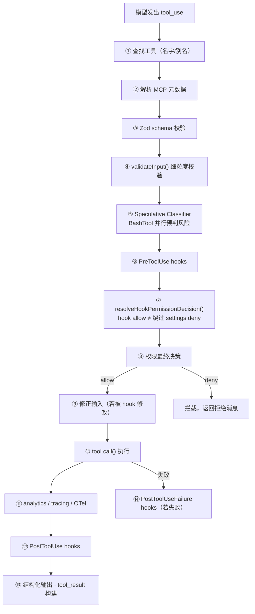

**为什么 14 步不能被随意折叠：**

- P1-P4 是“我到底在执行什么”的定义阶段，负责消除输入和工具语义的歧义。
- P5-P8 是“我被不被允许执行”的治理阶段，负责把风险判断、Hook 策略、权限规则合成最终许可。
- P9-P14 是“我怎样执行、怎样留下结果、怎样留下审计痕迹”的落地阶段。

把这三段混在一起，最常见的退化就是：

- 一边校验一边执行，导致拒绝逻辑没有完整上下文；
- Hook 修改输入后未重新纳入权限判断；
- tool result 只返回给模型，不进入 tracing / transcript / analytics。

从六维联动看，Pipeline 的价值在于把 `Act` 从“模型一句话触发一个副作用”改造成“模型提议一个动作，系统经过多层治理后才生成 effect”。这正是 hernss 与普通 agent 脚本的分水岭。

### 4.4 外部知识检索治理链（RAG as Evidence）

在 hernss 里，外部知识使用不应被建模为“给模型再塞一份记忆”，而应被建模为一条受控的证据获取流水线：

```text
Knowledge = Source × Retriever × Reranker × EvidencePack × Citation
```

其核心语义是：

- `Source`：知识来自哪里，决定权限、可信度、时效性边界。
- `Retriever`：如何召回候选片段，解决“找得到”。
- `Reranker`：如何按当前 goal 重排，解决“现在最该看什么”。
- `EvidencePack`：怎样把候选结果整理成可进入 `C_working` 的证据包。
- `Citation`：怎样让被采用的知识仍然带着来源身份，避免“证据失忆”。

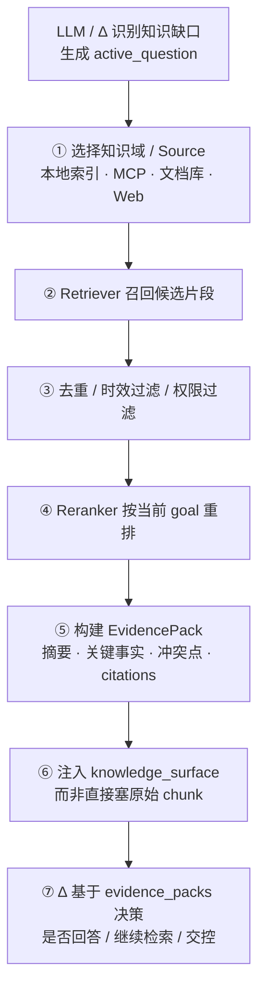

**关键原则：**

- RAG 在 hernss 中是 evidence mechanism，不是 memory mechanism。
- 原始文档、chunk 和向量索引不直接进入 `C`；进入 `C` 的只能是面向当前 goal 整理过的 `evidence_pack`。
- 检索命中不等于事实成立；只有带来源和边界的证据，才有资格进入当前决策界面。
- 模型输出时必须区分三种内容：检索到的事实、基于事实的推断、模型原有常识。

**典型反模式：**

- 直接把 top-k chunk 整包塞进 prompt
- 把向量相似度当作真实性判断
- 不带 citation 就把外部内容写进结论
- 把一次检索结果长期当作稳定 memory
- 不受权限和域边界控制地跨知识库检索

---

## 5. 维度四：多 Agent 协作

> **核心主张：把角色拆开。实现者 ≠ 验证者，探索者 ≠ 执行者。同一个 Agent 既实现又验证，天然倾向于觉得自己做得没问题。**

如果说维度三在解决“单个 Agent 如何安全行动”，那维度四解决的就是“多个 Agent 如何在不相互污染的前提下分工”。它不是并发优化功能，而是认知分工机制。

多 Agent 的根问题不是“能不能并行”，而是：

- 哪些任务应该拆给不同认知角色？
- 拆分后公共事实通过什么介质共享？
- 拆分后责任边界和终止条件怎样定义？

### 5.1 内建 Agent 角色矩阵

| Agent | 工具权限 | 模型 | 核心职责 |
|---|---|---|---|
| General Agent | 全量 | 主模型 | 通用任务执行 |
| Explore Agent | Glob/Grep/FileRead/只读Bash | Haiku（更快） | 纯只读代码探索 |
| Plan Agent | 无执行工具 | 主模型 | 纯规划，不执行 |
| Verification Agent | 无 edit/write | 主模型 | 对抗性验证，try to break |
| Guide Agent | 只读 | Haiku | 使用指导 |

### 5.1.1 Verification Agent 的四大反模式

Verification Agent 的 prompt（约 130 行）必须明确禁止以下逃避验证的行为：

**反模式 1：Verification Avoidance（只看代码不检查）**
- ✗ "代码看起来是对的" → ✓ 必须实际运行验证
- ✗ "实现者的测试已经通过了" → ✓ 验证者自己跑测试

**反模式 2：被前 80% 迷惑（忽略 20% 问题）**
- ✗ "大部分功能正常" → ✓ 必须检查边界条件和错误处理
- ✗ "主要路径没问题" → ✓ 必须测试异常路径

**反模式 3：前端改动不启动验证**
- ✗ "UI 代码改了，应该没问题" → ✓ 必须启动 dev server 实际查看
- ✗ "样式调整，不需要运行" → ✓ 必须在浏览器中验证

**反模式 4：数据库迁移不实际运行**
- ✗ "迁移脚本看起来正确" → ✓ 必须实际运行 up/down 验证
- ✗ "SQL 语法没问题" → ✓ 必须测试回滚能力

**验证输出格式：** 必须给出明确的 PASS / FAIL / PARTIAL 判定，附带具体的验证步骤和结果。

**系统性理解：**

Verification Agent 的存在，本质上是在制度层面制造“敌意视角”。它与主 Agent 的差异不在于模型是否更聪明，而在于 prompt、工具权限和成功标准都不同。

因此，Verification Agent 不应该被当成“多跑一遍主流程”，而应该被定义成：

- 输入：主 Agent 的结论或产物；
- 目标：寻找可证伪点，而不是延续实现思路；
- 输出：结构化 verdict，而不是宽泛建议。

### 5.2 多 Agent 调度拓扑

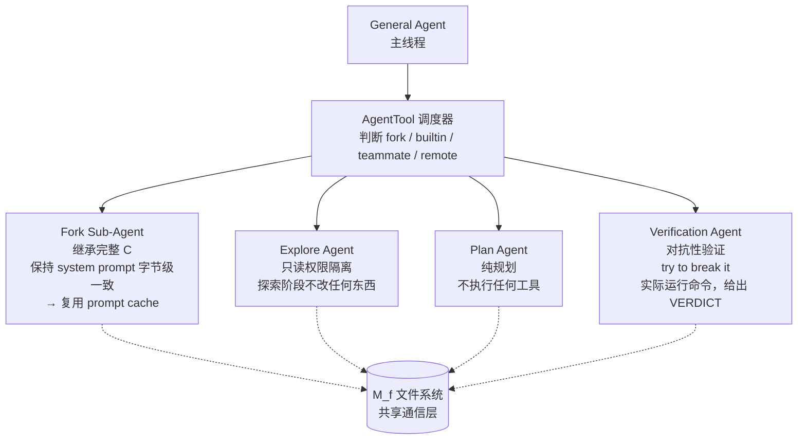

**拓扑语义：**

- `Fork` 适合上下文强耦合、子任务需要继承完整背景的场景。
- `Explore` 适合读多写少、信息搜集与主执行可并行的场景。
- `Plan` 适合把“推理”和“行动”分离，降低主线程执行期的认知负担。
- `Verification` 适合在主线程已形成一个候选结论后，从相反方向施压。

调度器的价值不在“会起多少 Agent”，而在“是否知道什么时候不该起 Agent”。如果子任务无法形成清晰边界，盲目 fork 只会把维度一的上下文问题复制成多个小上下文问题。

### 5.3 Sub-Agent 递归终止保证

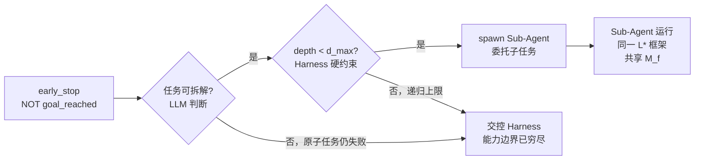

**终止性不是实现细节，而是框架公理的延伸：**

- `early_stop` 必须被解释为能力边界声明，而不是失败重试信号。
- `d_max` 的作用是防止“把不会做的事情递归地交给更多自己”。
- 一旦超过 `d_max` 仍不能继续，系统应回到 Harness，而不是继续伪装自主。

这和维度二里 `Δ` 的语义是一致的：Agent 可以继续、可以 renew、可以拆解，也必须允许自己在能力边界处停下来。

### 5.4 定理二：通信协议（V(e) = ΔH）

多 Agent 通信通过 M_f 文件系统（事件总线）进行，信息价值由信息熵增量决定：

```
V(e) = ΔH(e) = H(Ω) − H(Ω | e)

Event e = ⟨id, sender, topic, payload, ΔH, priority, ts⟩

三条操作公理：
T2.1  publish(e) 当且仅当 ΔH(e) > δ_min         发布门控
T2.2  H(payload) > ε → compress，保持 ΔH ≈ 不变  发布前压缩
T2.3  任务难(H_task高) ≠ 事件重要(ΔH高)           复杂度隔离
```

**系统性理解：**

- 多 Agent 通信共享的不是“思考过程”，而是“对他人有增量价值的结构化事实”。
- `ΔH` 约束发布门槛，本质上是在抑制噪声广播。
- 这与维度二中的 `H_b` 完全同构：无论是来自外部世界的事件，还是来自其他 Agent 的消息，进入主 Agent 的标准都应该是“是否改变决策前提”。

### 5.5 Fork path 的 cache 优化

```
Fork Sub-Agent 时：
  ✓ 继承主线程 system prompt（字节级一致）
  ✓ 继承完整对话上下文
  ✓ 继承工具集
  ✗ 不换模型（换模型会改变 system prompt 里的模型描述字段，破坏 cache 前缀）

结果：Fork 子任务可以复用主线程的 prompt cache，显著降低 API 成本。
```

**这里的核心 tradeoff：**

- cache 优化偏向“相同模型 + 相同 system prompt + 相同结构”；
- 角色最优化偏向“不同 Agent 用不同模型、不同能力集”；
- 二者天然有张力，因此 cache 不是绝对原则，而是调度成本的一部分。

也就是说，Fork path 的正确语义不是“永远不换模型”，而是“默认优先保住共享前缀，除非角色收益明显高于 cache 损失”。

### 5.6 Sub-Agent 生命周期

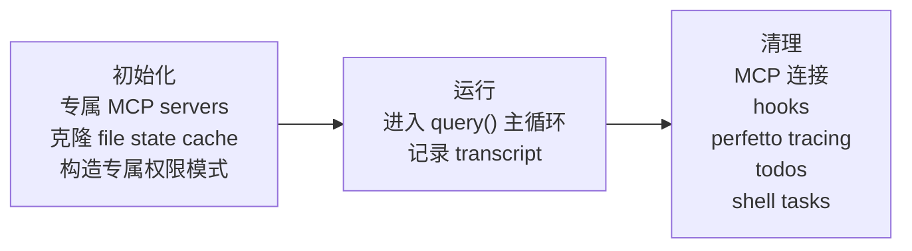

**生命周期的产品化含义：**

- `init` 不是简单构造对象，而是在复制一个受控运行沙盒。
- `run` 不是只跑 query，而是持续产生 transcript、tool traces、事件与可能的副作用。
- `cleanup` 不是尾声，而是防止多 Agent 体系在第二天失控的关键步骤。

很多多 Agent 系统的问题不出在“不会启动”，而出在“停不干净”。hernss 把 cleanup 单独拉出来，是在承认资源回收本身就是协作语义的一部分。

---

## 6. 维度五：Skill / Plugin / MCP 生态

> **核心主张：生态的关键不是接了多少插件，而是模型感知到自己当前有哪些扩展能力。**

维度五不该被理解成“外挂市场”。它解决的是一个更根本的问题：

当系统能力越来越多时，模型怎样在不被能力洪水淹没的前提下，仍然准确感知自己现在能做什么、该怎么做、何时不该做。

所以这一维的核心不是扩展数量，而是扩展进入 `C` 的方式。

### 6.1 生态层次结构

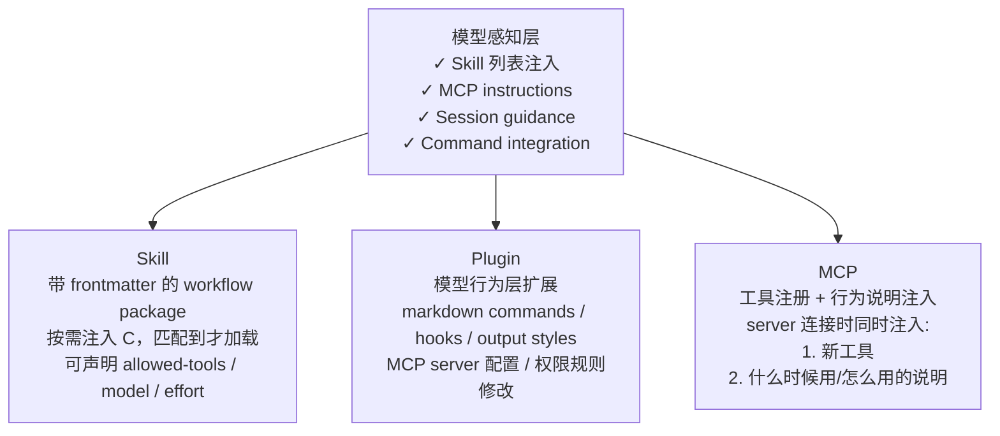

**三者边界：**

- `Skill` 更像带工作流说明的能力包，主要改变“做事方法”。
- `Plugin` 更像系统行为扩展，主要改变“宿主如何组织能力、输出和 Hook”。
- `MCP` 更像外部能力连接器，主要改变“系统可调用的工具集及其说明”。

如果边界不清，就会出现两个常见退化：

1. 把所有操作说明都塞进 Skill，导致工具生态和行为生态耦合。
2. 把 MCP 只当工具来源，忽略 instructions 注入，结果模型有能力但没有使用语义。

### 6.1.1 MCP 的双重价值

**MCP 的核心价值不是工具本身，而是 instructions 注入：**

当 MCP server 连接时，系统同时完成两件事：
1. **工具注册**：通过 MCP 协议注册新工具到 Agent 的工具集
2. **行为说明注入**：通过 server 的 `instructions` 字段注入到 system prompt

这让模型"感知到"自己有了新能力，并知道：
- 什么时候该用这个工具（触发场景）
- 怎么用（参数格式、最佳实践）
- 什么时候不该用（边界条件、限制）

**示例：**
```json
{
  "mcpServers": {
    "filesystem": {
      "command": "npx",
      "args": ["-y", "@modelcontextprotocol/server-filesystem", "/path/to/allowed"],
      "instructions": "Use this server to read/write files in /path/to/allowed. Always check file existence before reading. Use relative paths when possible."
    }
  }
}
```

instructions 会被注入到 system prompt 的动态部分（SYSTEM_PROMPT_DYNAMIC_BOUNDARY 之后），让模型在每次推理时都能看到这些使用指南。

**系统性理解：**

MCP 的难点从来不是“连上 server”，而是“让模型形成正确的能力心智模型”。因此工具注册和 instructions 注入必须被视为一个原子动作：只有两者同时完成，扩展能力才真正进入 Agent 的可操作域。

### 6.1.2 外部知识使用机制（RAG as Evidence, not Memory）

hernss 应补一个明确的外部知识使用机制，但不应把它写成“接一个向量库”这么窄的能力点。更准确的定义是：

> 外部知识系统是 Agent 的证据供应层，而不是第二套模型记忆。

因此，RAG 在 hernss 中的定位应是：

- 属于生态层能力，因为它依赖外部知识源、检索器、重排器、MCP server 或专用 Skill。
- 服务于维度一，因为它最终要进入 `knowledge_surface`，成为 LLM 当前可见的证据界面。
- 受制于维度三，因为检索、抓取、重排、引用都应通过治理后的工具链执行。
- 受制于维度六，因为知识域、可信级别、引用责任与越权访问都属于制度边界。

可采用如下抽象：

```text
K_ext = ⟨source_registry, retriever, reranker, evidence_builder, citation_policy⟩
```

其中：

- `source_registry`：声明允许使用的知识域，如本地文档、MCP 知识库、组织 wiki、外部 Web。
- `retriever`：负责召回候选证据。
- `reranker`：负责按当前 goal、plan、active_question 重排。
- `evidence_builder`：负责把候选结果压成 `evidence_pack`。
- `citation_policy`：负责定义哪些来源必须显式引用、哪些只能摘要、哪些不能直接暴露原文。

**hernss 的知识使用原则：**

1. 外部知识不直接进入 `M`，否则“检索结果”和“长期记忆”会混淆。
2. 外部知识只有在当前任务形成明确知识缺口时才被检索。
3. 进入 `C_working` 的是证据包，而不是原始知识库内容。
4. 证据包必须带来源、时间、域、可信度与引用边界。
5. 若多个来源冲突，冲突本身也应进入 `knowledge_surface`，而不是提前被系统抹平。

**建议的数据形态：**

```python
knowledge_surface = {
    "active_questions": [
        "当前 API 限流规则是否已在 2026-04 更新？"
    ],
    "evidence_packs": [
        {
            "question_id": "q_01",
            "summary": "官方文档在 2026-03-20 更新了限流策略",
            "key_facts": [
                "...",
                "..."
            ],
            "conflicts": [],
            "citations": ["doc_17", "doc_23"],
            "confidence": 0.82,
            "freshness": "2026-03-20"
        }
    ],
    "citations": [
        {
            "citation_id": "doc_17",
            "source": "official_docs",
            "uri": "...",
            "retrieved_at": "...",
            "trust_tier": "high"
        }
    ]
}
```

这样设计的好处是：

- 它与 `event_surface` 同构，都是“外部输入的认知投影”；
- 它避免把检索系统误建模为隐式 memory；
- 它让引用责任、知识时效和来源冲突都变成可见对象，而不是模型的隐式负担。

### 6.2 定理三：自我进化（Evolve(A)）

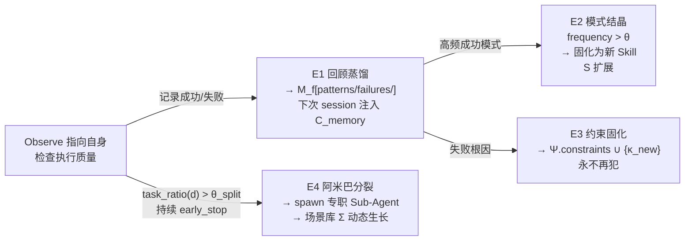

**E3 棘轮风险：** 约束只增不减可能导致能力退化。建议定期执行约束审计——检查过时或相互矛盾的约束。

**系统性理解：**

`Evolve(A)` 的四个方向里，E1/E2 偏向能力积累，E3 偏向风险沉淀，E4 偏向角色分化。它们如果缺少平衡，会把系统推向不同的坏方向：

- 只有 E2，没有 E3：会越来越会做事，但同样错误会反复出现。
- 只有 E3，没有审计：会越来越谨慎，最后能力萎缩。
- 只有 E4，没有通信协议：会从单体混乱变成分布式混乱。

因此，自我进化不是“让系统自动长东西”，而是让能力、约束和结构同时演化。

### 6.3 Skill 按需注入原则

```
✗ 错误做法：启动时把所有 Skill 塞进 C
✓ 正确做法：只有匹配到当前任务的 Skill 才注入

判断匹配：
  · 关键词匹配（任务描述 vs Skill 元数据）
  · 用户显式调用 Skill tool
  · 模型自主触发 skill discovery

注入后：模型必须调用 Skill tool 执行，不能只提到而不执行。
```

**与维度一的耦合：**

- Skill 注入本质上是对 `C_skill` 的预算分配。
- 注入过多会直接挤压 `C_working` 和 `C_history` 的有效空间。
- 注入过少则会让模型在本应借助外部流程时退回裸推理。

所以按需注入不是优化项，而是维持上下文质量的必要条件。

---

## 7. 维度六：安全管理

> **核心主张：三层防护互不绕过。Hook 的 allow 不能绕过 settings 的 deny。强大但受控。**

维度六不是附着在工具系统外面的一层“审查器”，而是所有可操作能力的制度边界。它和维度三共同定义 `Act`，和维度二共同定义“什么时候必须打断”，和维度一共同决定“哪些风险信息必须进入 C”。

### 7.1 三层防护架构

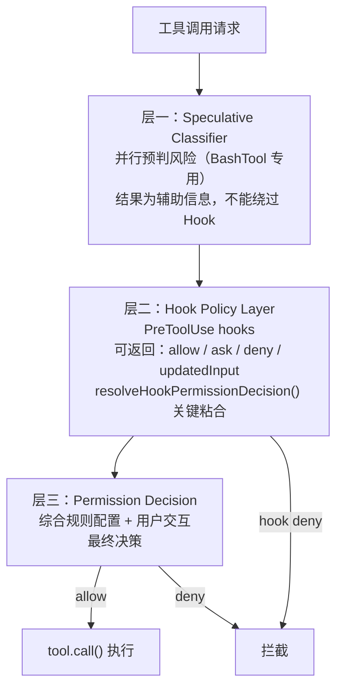

**三层的职责分离：**

- 层一回答“这看起来危险吗”，给的是风险信号，不是最终许可。
- 层二回答“策略上我希望怎样处理”，给的是 Hook 意志，不是最终主权。
- 层三回答“在当前 settings / mode / 用户交互前提下，最终能不能执行”，给的是制度化裁决。

只有这三层都保持边界，系统才能既灵活又不自相矛盾。

### 7.2 resolveHookPermissionDecision 关键规则

```
Hook allow + 工具要求用户交互 + Hook 没提供 updatedInput
    → 仍然走 canUseTool（不能绕过）

Hook allow + settings 里有 deny 规则
    → deny 规则生效（Hook 不能绕过 settings）

Hook allow + settings 里有 ask 规则
    → 仍要弹窗（用户确认不可省略）

Hook deny
    → 直接生效

Hook ask
    → 作为 forceDecision 传给权限弹窗
```

**这组规则的本质：**

它们在解决“局部优化不能越过全局制度”的问题。Hook 看到的是局部上下文，settings 持有的是长期策略，用户确认持有的是最终主权。三者都重要，但优先级必须稳定，否则系统在复杂场景下会变得不可预测。

### 7.3 权限模式

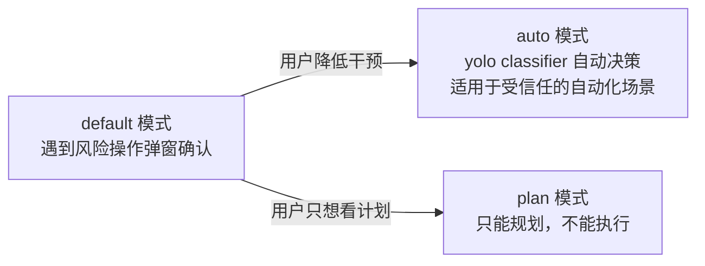

**模式不是 UX 开关，而是治理合同：**

- `default` 代表“模型可以执行，但风险动作要显式取得同意”。
- `plan` 代表“本轮只允许产出认知结果，不允许产出副作用”。
- `auto` 代表“把更多决策前移到制度层，适用于边界已知的自动化任务”。

如果不把模式当成治理合同，而只当成交互选项，权限系统会在长任务和自动化场景下失去可预期性。

### 7.4 Hook 系统能力矩阵

| 时机 | Hook 类型 | 可做的事 |
|---|---|---|
| 工具执行前 | PreToolUse | 返回 allow/ask/deny，修改 input，返回 blockingError，追加 additionalContexts |
| 工具执行后（成功） | PostToolUse | 修改 MCP 工具输出，追加消息，注入上下文 |
| 工具执行后（失败） | PostToolUseFailure | 失败后处理，日志，报警 |

**Hook 的正确定位：**

- Hook 适合做策略注入、输入修正、补充上下文、失败收尾。
- Hook 不适合成为第二个主调度器，更不适合替代 LLM 做语义决策。
- 对 hernss 而言，Hook 是“制度性外力”，不是“隐藏 agent”。

### 7.5 行为规范：让 LLM 不乱来

写进 system prompt 的制度化约束（对应 `getSimpleDoingTasksSection()`）：

```
不要加用户没要求的功能
不要过度抽象，三行重复代码好过一个不成熟的抽象
不要给没改的代码加注释和文档字符串
不要做不必要的错误处理和兜底逻辑
不要设计面向未来的抽象
先读代码再改代码
方法失败了先诊断，不要盲目重试
结果要如实汇报，没跑过的不要说跑过了
```

**原则：好行为要写成制度。不要指望 LLM 每次都"想到"该怎么做。制度化的行为比临场发挥稳定得多。**

这部分和权限系统看似一软一硬，实际上是同一个控制闭环：

- 权限系统在工具边界上阻止坏事发生；
- 行为规范在推理阶段降低坏决策产生的概率。

前者是外部护栏，后者是内部制度。只做其中一个都不够。

### 7.6 外部知识源的可信与权限边界

一旦引入外部知识机制，安全层需要显式回答四个问题：

1. Agent 允许访问哪些知识域？
2. 不同知识域的可信度如何分层？
3. 哪些来源必须显式引用，哪些只能摘要？
4. 检索结果中的敏感内容是否允许直接进入 `C` 或最终输出？

建议把知识源按信任等级分层：

| trust_tier | 典型来源 | 默认策略 |
|---|---|---|
| high | 官方文档、受控组织知识库、签名数据集 | 可直接进入 evidence_pack，默认允许引用 |
| medium | 内部 wiki、团队笔记、半结构化文档库 | 可进入 evidence_pack，但建议显式标注来源与时间 |
| low | 外部网页、论坛、未验证博客 | 允许检索，但应降低默认置信度，必要时要求交叉验证 |

**关键边界：**

- 检索权限必须受 `source_registry` 和当前模式约束，不能因为“模型想知道”就跨域读取任意知识源。
- citation policy 不能交给模型即兴决定，而应由制度层预先声明。
- 若来源不可公开引用，系统应允许“可用于内部决策、不可原样外发”的受限证据模式。
- 对高时效问题，旧证据即使来源可靠，也应在 `freshness` 上降权。

这意味着：RAG 在 hernss 中不是单纯提升回答质量的手段，它也是一个新的安全面。只要引入外部知识，就必须把知识访问、知识引用和知识暴露纳入制度化治理。

---

## 8. 研发优先级与实施路线

这一章不只是项目管理清单，而是在回答一个架构问题：哪些能力必须先具备，后面的能力才不会建立在漂浮地基上。

### 8.1 架构依赖顺序

```mermaid
graph LR
    P1["基础设施层\n① 上下文控制\n⑥ 安全管理"] --> P2["执行引擎层\n② 运行时控制"]
    P2 --> P3["能力层\n③ CLI 工具系统"]
    P3 --> P4["协作层\n④ 多 Agent 协作"]
    P4 --> P5["生态层\n⑤ Skill/Plugin/MCP"]
```

**为什么这个顺序不能轻易颠倒：**

- 没有维度一，就没有稳定的认知界面，后面所有能力都会加剧上下文混乱。
- 没有维度六，工具和多 Agent 只会扩大错误和风险传播半径。
- 没有维度二，系统无法把上下文、工具和安全层组织成闭环。
- 没有维度三，多 Agent 和生态扩展都没有可控 action substrate。

### 8.2 分阶段实施建议

建议把“阶段”进一步落成“里程碑（Milestone）”。每个里程碑都应同时回答四个问题：

1. 本阶段要证明什么系统性质？
2. 本阶段最小可交付能力是什么？
3. 本阶段必须做哪些实验？
4. 什么证据足以支持进入下一阶段？

这样第 8 章就不只是路线图，而是研发节奏与评审节奏的统一接口。

#### M1：单 Agent 基础闭环

- 实现 C 的五分区结构，C_working 仪表盘写入
- 实现 L* 主循环（while true + state object，避免递归）
- 实现基础工具集（文件读写、Bash、搜索）
- 实现 Snip Compact + Auto Compact 两道基础压缩
- Ψ 设定 ρ=1.0 强制 renew

**要证明的系统性质：** 单体 Agent 在长任务中不会因为上下文和控制流失稳而崩掉。

**最小可交付能力：**

- Agent 能在单任务内稳定执行多轮 `Reason → Act → Observe → Δ`
- 在 token 压力升高时，至少能触发基础压缩并继续任务
- 发生 `renew` 后，goal、plan、dashboard 不丢失

**必须完成的实验：**

- 长任务续跑实验：连续执行 50-100 轮，验证状态机不爆栈、不丢 goal
- renew 一致性实验：构造接近窗口上限的任务，验证 renew 前后 `plan` 与 `working_state` 一致
- 压缩有效性实验：人为注入长历史，验证 Snip / Auto Compact 不破坏任务主线

**退出条件：**

- 至少一次完整任务在经历 `renew` 后成功收敛
- 任务失败时可从 transcript 或状态日志中定位失败点
- 基础工具调用结果能稳定进入 Observe，并被下一轮 Δ 使用

#### M2：安全与治理闭环

- 实现工具执行 14 步 pipeline（至少覆盖 schema 校验、权限决策、hooks）
- 实现 PreToolUse/PostToolUse hook 系统
- 实现 `resolveHookPermissionDecision()` 核心逻辑
- 行为规范注入 system prompt

**要证明的系统性质：** 系统从“能跑”进入“能受控地跑”，且局部策略不能绕过全局制度。

**最小可交付能力：**

- 任一工具调用都经过完整治理流水线
- Hook / settings / mode / 用户确认的优先级链稳定可解释
- 高风险动作能够被拒绝、要求确认或被修正输入

**必须完成的实验：**

- 权限优先级实验：覆盖 `hook deny`、`settings deny`、`settings ask`、`hook allow + updatedInput` 的组合
- fail-closed 实验：新增一个未声明 `isReadOnly`/`isConcurrencySafe` 的工具，验证默认走最严格路径
- 行为规范实验：构造“诱导过度设计/盲目重试/虚报结果”的任务，观察制度化 prompt 是否降低错误行为

**退出条件：**

- `hook allow` 无法绕过 `settings deny`
- 权限弹窗/拒绝/自动通过的决策都有结构化日志
- 至少一个高风险 Bash / Git 场景被正确拦截或要求确认

#### M3：多 Agent 分工与隔离

- 实现 Explore Agent（只读权限隔离）
- 实现 Verification Agent（对抗性验证 prompt）
- 实现 `AgentTool` 调度器
- 实现 Sub-Agent 生命周期（init → run → cleanup）
- 实现 Fork path 的 cache 优化

**要证明的系统性质：** 在不破坏单 Agent 稳定性的前提下，引入角色分工和并行收益。

**最小可交付能力：**

- 主 Agent 能按任务边界调度 Explore / Verification / Fork 子任务
- Sub-Agent 有独立资源视图和明确 cleanup 责任
- 多 Agent 结果能通过共享通信层回流主 Agent，而不是只停留在自然语言摘要

**必须完成的实验：**

- 只读隔离实验：Explore Agent 无法越权写文件
- 递归终止实验：构造可拆解与不可拆解任务，验证 `d_max` 与 early_stop 语义稳定
- cleanup 实验：反复拉起/结束 Sub-Agent，验证无 MCP / shell / todo 泄漏
- Verification 对抗实验：让主 Agent 给出候选结论，验证 Verification Agent 会主动寻找反例而不是复述

**退出条件：**

- 至少一次主任务通过 Sub-Agent 分工显著缩短完成时间或提升验证质量
- Sub-Agent 结束后无残留后台资源
- 多 Agent 失败时能定位是调度问题、通信问题还是角色问题

#### M4：生态扩展与自我进化

- 实现 Skill 按需注入
- 实现 MCP server 连接 + instructions 注入
- 实现 E1 回顾蒸馏（任务结束后写 M_f）
- 实现 E2 模式结晶（高频成功模式 → 新 Skill）

**要证明的系统性质：** 系统从“固定能力集合”演化为“可增长能力集合”，但仍受上下文预算和制度边界约束。

**最小可交付能力：**

- Skill 能按需注入，不命中时不污染上下文
- MCP 连接时工具注册与 instructions 注入同步完成
- 至少有一条成功模式能从任务执行沉淀为 Skill 或规则

**必须完成的实验：**

- Skill 命中实验：命中与误命中都要可观测，验证注入正确率
- MCP 心智模型实验：连接带 instructions 的 MCP 后，验证模型使用率和误用率变化
- 蒸馏回放实验：E1 产物能够在后续任务中被重新加载并产生可观察收益
- 约束棘轮实验：新增约束后验证是否降低一类错误，同时监测是否显著损伤正常能力

**退出条件：**

- Skill / MCP 的注入与使用日志可观测
- 至少一个模式蒸馏结果被后续任务复用并带来收益
- 约束增长、能力增长、误注入率三者可被同一套指标追踪

### 8.3 关键验收指标

| 维度 | 验收标准 |
|---|---|
| 上下文控制 | C_working.dashboard 在 renew 后完整恢复，goal 不丢失 |
| 运行时控制 | 长任务（>100轮）不爆栈，状态转移日志可查 |
| 工具系统 | 新增工具时忘记声明 isReadOnly 自动走严格权限 |
| 多 Agent | Verification Agent 给出 PASS/FAIL/PARTIAL，不只看代码 |
| 生态 | Skill 未命中时不注入，命中时强制执行（不只提到） |
| 安全 | hook allow 无法绕过 settings deny，三层日志可审计 |

**验收指标的使用方式：**

- 指标不只用来做最后验收，更应用来决定是否可以进入下一阶段。
- 每个指标都应有可观测证据，而不是口头描述。
- 最重要的不是“功能存在”，而是“失败时系统是否能给出稳定且可解释的行为”。

建议把验收指标拆成三层：

1. **功能存在性指标**：某能力是否存在。
2. **运行稳定性指标**：该能力是否能在长任务、异常输入、资源紧张时稳定工作。
3. **制度一致性指标**：该能力是否遵守前面六维定义的边界。

按这个标准，第 8 章的关键验收可以进一步细化为：

| 维度 | 功能存在性 | 运行稳定性 | 制度一致性 |
|---|---|---|---|
| 上下文控制 | 支持分区、压缩、renew | renew 后可续跑，ρ 可观测 | 不可压缩核不被静默丢失 |
| 运行时控制 | L* 状态机可运行 | 长任务不爆栈，状态可恢复 | Δ 负责语义决策，Ψ 不越权 |
| 工具系统 | 新工具可注册可调用 | 失败/超时/重试路径可观测 | fail-closed、生效顺序稳定 |
| 多 Agent | 可调度 Explore/Verification/Sub-Agent | cleanup 后无泄漏，递归可终止 | 角色边界清晰，不相互越权 |
| 生态 | Skill/MCP 可接入 | 注入命中率、误用率可统计 | 扩展能力通过 `C` 被模型正确感知 |
| 安全 | 三层防护存在 | 高风险操作稳定拦截 | Hook 不能绕过 settings / mode / 用户主权 |

#### 8.4 证据模板（建议）

每个里程碑在评审时，建议至少提交以下四类证据：

1. **场景描述**
说明测试的任务类型、输入条件、启用的工具或 Agent 角色。

2. **运行证据**
包括 transcript 片段、状态转移日志、权限决策日志、token 计数或关键截图。

3. **结果判定**
明确写出 PASS / FAIL / PARTIAL，并说明依据。

4. **偏差分析**
若结果不符合预期，要指出偏差落在哪一维：上下文、运行时、工具治理、协作、生态或安全。

可采用如下模板：

```text
[Milestone]
M2：安全与治理闭环

[Scenario]
工具：BashTool
输入：高风险 git 命令 + hook allow + settings deny
模式：default

[Expected]
最终决策应为 deny，且日志中可见 deny 来源于 settings

[Evidence]
- permission log id: ...
- transcript turn: ...
- hook result: allow
- settings rule matched: deny

[Verdict]
PASS / FAIL / PARTIAL

[Deviation]
若失败，标注是权限优先级错误、日志缺失，还是 Hook/Settings 边界错误
```

这套证据模板的价值在于：

- 它把“架构讨论”转成“可重复验证的研发闭环”；
- 它让不同阶段的评审口径统一；
- 它能直接反哺第 10 章开放问题和第 6 章 E1 回顾蒸馏。

---

## 9. 设计原则速查表

这一节适合作为设计评审时的 checklist。一个实现方案如果与表中原则冲突，默认应该先解释为什么偏离，而不是默认原则让路给实现便利。

| 编号 | 原则 | 工程映射 |
|---|---|---|
| P1 | 不信任模型的自觉性，好行为写成制度 | `getSimpleDoingTasksSection()`，行为规范 prompt |
| P2 | 把角色拆开，实现者 ≠ 验证者 | Verification Agent、Explore Agent 独立角色 |
| P3 | 工具调用要有治理，不是模型说调就调 | 14 步执行 pipeline |
| P4 | 上下文是预算，每个 token 都有成本 | Prompt Cache 经济学，四道压缩，按需注入 |
| P5 | 安全层互不绕过 | `resolveHookPermissionDecision()` |
| P6 | 生态的关键是模型感知 | MCP instructions 注入，Skill discovery |
| P7 | 产品化在于处理第二天 | Sub-Agent cleanup chain，transcript 记录，任务恢复 |
| P8 | fail-closed 默认值 | buildTool() 工厂，忘了配置就走最严格路径 |
| P9 | Act 期间不能是盲的，感知必须持续 | **[设计目标]** H_b 独立心跳层，与 L* 并行 |
| P10 | 响应决策留给 LLM，中断触发可以是规则 | **[设计目标]** H_b 只注入事件，Δ 决定响应 |

**注：** 标注 **[设计目标]** 的原则是 hernss 框架的创新设计，Claude Code 当前通过 Hook 系统部分实现。

---

## 10. 开放问题

这一章不应只是“列出还没想明白的问题”，而应成为研发实验 backlog。建议统一采用以下结构：

```text
问题 -> 观测现象 -> 实验设计 -> 证据要求
```

这样开放问题才能直接对接第 8 章的里程碑评审和证据模板。

建议仍按四类追踪：

- 认知可靠性：Q1、Q9、Q11、Q13
- 调度与终止性：Q2、Q7、Q12
- 协作与隔离：Q3、Q10
- 演化与治理：Q4、Q5、Q8

### 10.1 认知可靠性

**Q1. LLM 自我感知的可靠性**

- 问题：
LLM 在 `C_working.dashboard.goal_progress` 上的自评是否足够可靠？长任务末期是否会系统性高估完成度？
- 观测现象：
模型在任务尚未完成时给出高完成度描述，或在接近收敛时忽略未完成子目标。
- 实验设计：
构造多阶段任务，将真实完成度分解为可验证子里程碑；对比模型自评与客观完成度曲线，统计偏差方向与偏差大小。
- 证据要求：
任务 transcript、阶段性 objective checklist、goal_progress 时间序列、最终偏差统计。

**Q9. H_b 事件与 C_working 的 token 压力**

- 问题：
`pending_events + active_risks` 语义上不能静默丢失，但如果 H_b 高频注入变化，`event_surface` 会不会快速膨胀并挤压主认知空间？
- 观测现象：
高频文件变化、资源抖动或多 Agent 消息风暴导致 `C_working` 中事件相关内容持续膨胀，主计划与任务上下文可见度下降。
- 实验设计：
人为制造高频 event 源，比较“原样注入”“去重后注入”“聚合摘要后注入”三种策略对 token 占用、误中断率和任务完成率的影响。
- 证据要求：
event 数量曲线、token 占用曲线、压缩前后 event_surface 快照、任务完成率与误中断统计。

**Q11. Skill 的 effort hints 如何量化**

- 问题：
Skill frontmatter 中的 `effort: high` 应怎样转化为实际资源分配决策，例如 token budget、超时、优先级或验证力度？
- 观测现象：
当前系统能看到 effort hint，但不同 Skill 在运行资源上的实际差异并不稳定或不可解释。
- 实验设计：
为同类任务配置不同 effort hints，比较执行时长、token 消耗、verify 强度、工具调用深度等差异，评估是否形成可预测行为。
- 证据要求：
Skill 配置样本、资源分配日志、执行时长、token 消耗、工具调用统计、结果质量对比。

**Q13. knowledge_surface 与 evidence_pack 的 token 压力**

- 问题：
外部知识机制引入后，`knowledge_surface.evidence_packs` 如何在保持 citation 和来源边界的同时避免挤爆上下文？
- 观测现象：
同一问题召回多个证据包后，`knowledge_surface` 持续膨胀；citation 完整保留但可读性下降，或摘要过度导致证据失真。
- 实验设计：
比较“原始证据包”“层级摘要证据包”“冲突优先证据包”“仅保留 citation 索引 + 按需展开”四种表示策略对回答质量、引用正确率和 token 占用的影响。
- 证据要求：
evidence_pack 样本、token 占用曲线、citation 保真率、回答质量评审结果、来源冲突处理记录。

### 10.2 调度与终止性

**Q2. d_max 的设定依据**

- 问题：
拆解深度上限是否应是任务类型相关的函数，例如 `d_max(σ_code) ≠ d_max(σ_research)`？
- 观测现象：
统一 `d_max` 会在某些任务上过早终止，在另一些任务上允许过深递归，导致收益递减。
- 实验设计：
选取不同任务类型，在不同 `d_max` 下运行，统计任务成功率、平均递归深度、子 Agent 数量和总成本。
- 证据要求：
任务类型分桶、递归深度分布、成功率曲线、成本/收益对照表。

**Q7. H_b 的 T_hb 最优间隔**

- 问题：
T_hb 是否应是任务类型、Act phase、watch_source volatility 相关的动态值？在长 Act 等待期是否应缩短间隔？
- 观测现象：
固定间隔下，要么感知过疏导致盲区，要么感知过频导致无效中断和系统开销上升。
- 实验设计：
比较固定 `T_hb`、按任务类型调节、按 Act phase 调节、按波动性调节四类策略，对事件漏检率、误中断率和系统开销进行评估。
- 证据要求：
heartbeat 日志、事件检测时延、误中断率、CPU/IO 开销、任务完成率统计。

**Q12. Fork path 的 cache 优化在多模型场景下失效**

- 问题：
当任务确实需要 Haiku（快速探索）+ Opus（深度推理）协同时，如何平衡 cache 复用和角色最优化？
- 观测现象：
坚持同模型时 cache 收益好，但角色匹配不足；换模型后角色更合适，但 prompt cache 大幅失效。
- 实验设计：
对同类任务比较“单模型全程”“Fork 不换模型”“Fork 换模型”“cache-aware 混合调度”四种策略的成本、时延和质量。
- 证据要求：
模型切换日志、cache 命中率、成本统计、任务完成时间、质量评审结果。

### 10.3 协作与隔离

**Q3. E4 与 L\* 的 DAG 耦合**

- 问题：
阿米巴分裂产生的专职 Sub-Agent 共享场景包时，拓扑可能形成 DAG 而非树，此时 M_f 写冲突如何解决？
- 观测现象：
多个 Sub-Agent 对共享文件、共享事件通道或共享状态快照并发写入时，出现覆盖、乱序或事实不一致。
- 实验设计：
构造多 Agent 同时对共享资源发布事件、写入摘要或回传结果的场景，比较“最后写入生效”“版本化写入”“topic 分区 + merge”三种策略。
- 证据要求：
冲突日志、写入版本链、merge 结果、最终主 Agent 看到的状态快照。

**Q10. Sub-Agent 的 MCP 隔离问题**

- 问题：
若 Sub-Agent 连接了主 Agent 没有的 MCP server，主 Agent 接收结果时如何正确理解这些专属工具输出？
- 观测现象：
Sub-Agent 能借助额外 MCP 完成任务，但回传结果在主 Agent 侧缺少工具语义上下文，导致结果难以消费或误解释。
- 实验设计：
设计带专属 MCP 的 Sub-Agent 任务，比较“只回自然语言结果”“回结果 + 工具说明”“回结果 + 结构化 schema 描述”三种回传格式。
- 证据要求：
Sub-Agent 输出样本、主 Agent 消费成功率、误解释案例、结构化回传模板。

### 10.4 演化与治理

**Q4. 进化的可观测指标**

- 问题：
“系统整体进化了多少”目前仍缺少统一量化指标，应采用成功率、Skill 增长率、约束密度还是别的组合指标？
- 观测现象：
系统能力似乎在增长，但缺乏统一指标判断增长来自真正能力提升还是约束变多、任务变简单、样本偏移。
- 实验设计：
建立多维指标面板，跟踪一段时间内的任务成功率、平均成本、Skill 复用率、约束新增率、失败类型分布，观察是否能形成一致趋势。
- 证据要求：
时间序列仪表盘、指标定义文档、样本任务集合、趋势分析报告。

**Q5. Ψ 否决权的触发日志**

- 问题：
每次 Harness 行使否决权应记录到什么粒度，才能既支持事后审计，又能反哺参数调整？
- 观测现象：
系统能阻止危险行为，但若缺少结构化 veto 日志，后续无法判断是模型问题、参数过紧还是策略错误。
- 实验设计：
定义 veto log schema，并在多类 veto 场景下回放分析，评估日志是否足以支持根因分析和参数调优。
- 证据要求：
veto log schema、触发样本、日志完整度评估、基于日志做出的调参案例。

**Q8. H_b 紧迫度分类的可靠性**

- 问题：
低/高/临界分类应完全由规则承担，还是需要“规则优先 + 轻量分类器兜底”的二阶机制？
- 观测现象：
纯规则分类简单稳定但覆盖不足；引入分类器后表达力提升，但延迟和不稳定性增加。
- 实验设计：
比较“纯规则”“纯分类器”“规则优先 + 分类器兜底”三种方案在分类准确率、响应时延和系统开销上的表现。
- 证据要求：
标注数据集、分类准确率、时延统计、误分案例、系统资源消耗。

**研发规则：**

每个开放问题至少应绑定四样东西：

1. 明确的问题定义；
2. 可被观测的现象；
3. 候选实验设计；
4. 可提交的证据要求。

只有这样，开放问题才会进入研发闭环，而不是永远停留在“需要以后研究”。

---

## 11. Agent Runtime Framework：面向开发者的编排与运行时接口

前面六维回答的是“Agent 内核如何成立”，但如果 Loom 要成为一个真正可用的 **agent runtime framework**，还必须回答另一个问题：

> 开发者到底在组合什么？他们组合的不是 prompt 片段，也不是一段 while-loop，而是一组稳定的 runtime 原语、配置对象和运行时句柄。

因此，这一章不是新增维度，而是在六维内核之外补一层 **framework surface**。它首先面向开发者，回答如何在代码里组装、运行、观察和约束一个 agent application；只有在此基础上，才进一步讨论 server / webhook / stream 这类外部化适配层。

它要解决的不是“Agent 内部怎么推理”，而是：

- 开发者可以用哪些原语构建一个 agent application？
- 这些原语以什么 Python API、对象模型和 runtime handle 暴露？
- 当需要外部化时，这些原语如何再投影成 stream / async run / artifact / approval 等接口？

### 11.1 为什么需要应用服务层

如果没有这一层，所谓“Agent Framework”很容易退化成以下几种不稳定形态：

- 只剩一个 `chat()` / `run()` façade，开发者无法声明 toolset、knowledge、policy、verification 等运行时边界。
- 不同应用各自发明 task/session/run/profile 协议，导致同一框架被集成出多套不兼容语义。
- 框架内部明明有 `plan`、`event_surface`、`knowledge_surface`、权限决策和 artifacts，但公开 API 无法触达这些对象。

所以这一章的职责，不是“把 Agent API 化”这么简单，而是把内部运行语义转译成开发者可直接编排的 framework 语义。

### 11.2 对上抽象对象模型

上层应用不应直接面向“模型消息”，而应面向更稳定的对象：

```text
App / Tenant
  └─ Session
      └─ Task
          └─ Run
              ├─ Events
              ├─ Approvals
              ├─ Artifacts
              └─ Transcript
```

建议最小对象模型如下：

| 对象 | 含义 | 为什么需要 |
|---|---|---|
| `Session` | 一次持续性交互上下文 | 让会话内 memory、状态恢复和 transcript 有稳定归属 |
| `Task` | 上层显式提交的目标单元 | 区分“聊天消息”与“可执行目标” |
| `Run` | 某个 task 的一次实际执行 | 支持重试、恢复、并发 run、失败分析 |
| `Event` | 运行过程中的结构化事件 | 支持流式 UI、审计、自动化订阅 |
| `Approval` | 人机协同节点 | 把 ask/confirm/reject 建模为状态，而不是文本对话 |
| `Artifact` | 执行产物 | 文件、补丁、报告、结构化结果都应可独立引用 |
| `KnowledgeSource` | 可访问的外部知识域 | 与 `knowledge_surface`、citation policy 对接 |
| `AgentProfile` | 一组能力、权限、模式和场景配置 | 让不同上层应用调用同一内核时仍能有角色差异 |

**关键原则：**

- 上层应用提交的是 `Task/Run`，不是直接操控 LLM 的每一步续写。
- 上层应用消费的是 `Run State + Events + Artifacts`，不只是最终自然语言回答。
- 用户审批必须是 `Approval` 对象，而不是散落在 transcript 里的普通文本。

#### 11.2.1 应用组合公式

如果把 Loom 视作 runtime framework，而不是单纯 server，开发者真正组合的是：

```text
Application = ⟨AgentProfile, ToolSet, SkillPack, KnowledgeSources, PolicySet, RuntimeHooks⟩
```

其中：

- `AgentProfile` 决定默认模型、模式、能力边界和运行风格
- `ToolSet` 决定可操作域
- `SkillPack` 决定任务方法论与 workflow 注入
- `KnowledgeSources` 决定外部证据域
- `PolicySet` 决定安全与审批边界
- `RuntimeHooks` 决定运行时可观测性、适配和扩展点

这一定义比“一个 agent = 一个 chat endpoint”更接近 LangChain / LangGraph 这类框架真正提供的东西。

### 11.3 对上提供哪些核心服务

从 runtime framework 视角看，至少应向开发者暴露以下核心能力面：

| 服务类型 | 对上能力 | 内部依赖 |
|---|---|---|
| 任务执行服务 | 提交 goal，驱动完整 L* 闭环 | 维度二 + 维度三 |
| 会话与恢复服务 | 保存 session/run 状态，支持 resume | 维度一 + transcript + artifact store |
| 流式事件服务 | 实时推送 token、tool、state、approval、artifact 事件 | 维度二 + 维度三 + 观测链 |
| 人机协同服务 | ask/approve/reject/escalate | 维度六 + Approval 模型 |
| 工具与环境服务 | 受控工具执行、权限判定、环境隔离 | 维度三 + 维度六 |
| 多 Agent 编排服务 | explore / verify / fork / delegate | 维度四 |
| 知识与证据服务 | 检索、evidence pack、citation、source policy | 维度五 + 维度一 + 维度六 |
| 安全与策略服务 | profile、mode、policy、source_registry、limits | 维度六 |
| 审计与观测服务 | transcript、traces、veto logs、cost、metrics | 第 8 章 / 第 10 章 / transcript |

这张表的重点在于：

- 对开发者来说，框架不只是“一个会回答问题的 agent”。
- 它更像“一个可组合、可运行、可观察、可恢复、可审计的任务运行时”。

#### 11.3.1 建议的最小 Python API / SDK 表面

如果第 11 章只停留在“服务类型”层面，开发者仍然不知道应该如何真正使用 Loom。因此建议定义一个最小且稳定的 Python API / SDK 表面：

```text
AgentConfig(...)
AgentRuntime(...)
AgentHandle

create_session()
create_task()
start_run()
resume_run()
cancel_run()

stream_run_events()
list_run_artifacts()
get_transcript()

submit_approval()
reject_approval()

search_knowledge()
list_citations()
```

这些接口并不是要限制实现形式，而是在定义开发者最常见的交互意图：

- 创建上下文容器
- 提交一个目标
- 启动一次执行
- 追踪其过程
- 处理中断与审批
- 消费产物与证据

**建议原则：**

- 优先暴露稳定对象接口，不优先暴露“拼 prompt”接口。
- 优先暴露 runtime-oriented API，不优先暴露 raw completion API。
- `Loom.run()` 这类 façade 可以存在，但不应成为唯一公开面。
- 对于长任务，必须有 `resume/cancel/stream`，否则 runtime 框架无法承担生产级职责。

#### 11.3.2 建议的资源路径 / RPC 草案

如果 Loom 需要被外部化为 server / service，建议围绕稳定对象设计资源路径，而不是围绕模型调用设计路径。这里的关键是：**server 只是 runtime framework 的适配层，不是定义层**。

可参考如下最小草案：

```text
POST   /sessions
GET    /sessions/{session_id}

POST   /tasks
GET    /tasks/{task_id}

POST   /runs
GET    /runs/{run_id}
POST   /runs/{run_id}:cancel
POST   /runs/{run_id}:resume

GET    /runs/{run_id}/events
GET    /runs/{run_id}/stream
GET    /runs/{run_id}/artifacts
GET    /runs/{run_id}/transcript

POST   /approvals/{approval_id}:approve
POST   /approvals/{approval_id}:reject

POST   /knowledge/search
GET    /runs/{run_id}/citations

GET    /profiles/{profile_id}
GET    /policies/{policy_id}
GET    /knowledge-sources/{source_id}
```

**设计原则：**

- `POST /runs` 是运行入口，而不是 `POST /chat`。
- 审批、artifact、citation 都应成为独立资源，不应附着在最终文本结果里。
- `stream` 可以是 SSE / websocket / gRPC stream，但资源语义应稳定。
- 若采用 RPC，也应保持对象边界稳定，例如 `StartRun`, `CancelRun`, `SubmitApproval`, `SearchKnowledge`，而不是混成一个万能 `CallAgent()`。

#### 11.3.3 建议的公开 Python 对象分层

为了避免公开 API 退化成一个巨大的 `Loom` 门面类，建议按以下层次组织：

| 层级 | 对象 | 职责 |
|---|---|---|
| 配置层 | `AgentConfig`, `LLMConfig`, `ToolConfig`, `PolicySet` | 声明运行边界 |
| 组装层 | `AgentProfile`, `ToolSet`, `SkillPack`, `KnowledgeRegistry` | 组合应用能力 |
| 运行层 | `AgentRuntime`, `RunHandle`, `SessionHandle` | 驱动执行与状态管理 |
| 观察层 | `EventStream`, `ArtifactStore`, `TranscriptStore` | 提供可观测接口 |
| 适配层 | `HTTPAdapter`, `CLIAdapter`, `IDEAdapter` | 将 runtime 对接到外部入口 |

这比只暴露一个 `Loom.run(goal)` 更符合 runtime framework 的定位。

可参考的公开用法应更接近：

```python
profile = AgentProfile(...)
runtime = AgentRuntime(profile=profile)
run = runtime.start(goal="修复测试失败")

async for event in run.events():
    ...

result = await run.result()
```

而不是只有：

```python
await Loom().run("...")
```

### 11.4 服务如何交付：Sync / Async / Stream / Webhook

框架不应只提供单一调用形态。不同上层应用需要的并不是同一种交付方式。

#### 11.4.1 同步请求响应

适用场景：

- 轻量问答
- 单轮规划
- 小型代码修复
- 不涉及审批和长时工具执行的任务

特点：

- 接口简单
- 延迟敏感
- 返回值以最终结果为主

风险：

- 容易把长任务错误地包装成同步调用，导致超时、状态丢失或不可恢复

#### 11.4.2 异步任务执行

适用场景：

- 长任务
- 多工具协同
- 多 Agent 编排
- 需要 resume / retry / cancel 的任务

特点：

- 上层应用创建 `Run`，随后轮询或订阅其状态
- 框架内部可以独立调度、恢复和做权限交互

这应是 Agent Framework 最核心的服务形态，而不是附属能力。

#### 11.4.3 流式事件接口

适用场景：

- Chat UI
- IDE side panel
- CLI / terminal
- 需要可解释过程的运维后台

建议至少暴露这些事件类型：

```text
token.delta
run.state_changed
tool.started / tool.finished / tool.failed
approval.requested / approval.resolved
artifact.created
agent.spawned / agent.completed
warning.emitted
```

这样上层应用看到的就不只是“文本正在生成”，而是“一个运行中的任务系统正在推进”。

#### 11.4.4 Webhook / Event Bus

适用场景：

- 企业工作流
- 后台自动化
- 审批系统
- 多系统联动

例如：

- `run.completed` 触发后续流水线
- `approval.requested` 推送到审批中心
- `artifact.created` 推送到文档/代码平台
- `policy.denied` 推送安全审计系统

#### 11.4.5 SDK 封装层

除了 HTTP / RPC / webhook 这类交付方式，框架还应提供 SDK 层，把 run 生命周期、事件订阅和 artifact 消费封装成更高层对象。

例如：

```python
session = client.create_session(app_id="ide", user_id="u_123")
task = client.create_task(
    session_id=session.id,
    goal="修复这个测试失败并解释原因",
    agent_profile="coding_default",
)
run = client.start_run(task.id)

for event in client.stream_run_events(run.id):
    handle(event)

if run.state == "waiting_approval":
    client.submit_approval(run.approval_id, decision="approve")
```

SDK 层的价值在于：

- 降低接入复杂度
- 统一错误处理与重试
- 屏蔽流式协议细节
- 让上层应用更容易把框架当成“运行时服务”而不是“底层消息 API”

### 11.5 状态、事件与 Artifact 契约

这部分是应用服务层最关键的地方。没有稳定契约，上层应用就无法把框架作为可靠基础设施。

#### 11.5.1 Run State

建议至少定义：

```text
queued
running
waiting_approval
waiting_external
paused
completed
failed
cancelled
blocked_by_policy
blocked_by_capability
```

这样可以把不同失败类型显式区分开：

- `tool failure`
- `policy deny`
- `capability boundary`
- `user cancel`

而不是统统折叠成“agent failed”。

#### 11.5.2 Event Contract

事件应同时满足三个要求：

1. 对 UI 可消费
2. 对自动化系统可订阅
3. 对审计系统可回放

因此推荐最小结构：

```json
{
  "event_id": "evt_001",
  "run_id": "run_123",
  "type": "tool.finished",
  "ts": "2026-04-03T10:00:00Z",
  "payload": {},
  "visibility": "user|system|audit",
  "correlation_id": "tool_abc"
}
```

`visibility` 很重要，因为不是所有内部事件都应暴露给最终用户，但很多都应保留给审计和系统联动。

#### 11.5.3 Artifact Contract

Artifact 不应只是“最后一段文本”，而应支持：

- 文本结论
- 文件修改 / patch
- 结构化 JSON 结果
- 报告
- 引用索引
- 运行摘要

对上层应用而言，Artifact 是最重要的稳定产出接口之一。  
很多业务系统真正要消费的不是聊天回答，而是一个可继续处理的产物。

#### 11.5.4 Approval Contract

Approval 是应用服务层里最容易被低估、但最关键的对象之一。它把维度六中的人机协同从自然语言转成可管理状态。

建议最小结构：

```json
{
  "approval_id": "apv_001",
  "run_id": "run_123",
  "kind": "tool_execution|policy_override|external_publish",
  "status": "pending|approved|rejected|expired",
  "question": "是否允许执行高风险 git 操作？",
  "context": {
    "tool": "bash",
    "command": "git push --force"
  },
  "requested_at": "2026-04-03T10:00:00Z",
  "resolved_at": null
}
```

**为什么 Approval 必须对象化：**

- 它需要超时、审计、重试和外部系统接管能力；
- 它不能只存在于对话文本里；
- 它必须能被 UI、审批系统和自动化系统共同消费。

#### 11.5.5 KnowledgeSource / Evidence Contract

既然框架已经引入 `knowledge_surface` 与 `evidence_pack`，对上层应用也应暴露稳定的知识源与证据契约。

建议最小结构：

```json
{
  "knowledge_source_id": "ks_001",
  "type": "mcp|filesystem|web|internal_wiki",
  "trust_tier": "high|medium|low",
  "scope": "tenant/project/global",
  "retrieval_policy": {
    "allow_search": true,
    "allow_quote": false
  }
}
```

```json
{
  "evidence_pack_id": "evp_001",
  "run_id": "run_123",
  "question": "当前限流规则是什么？",
  "summary": "...",
  "citations": ["doc_17", "doc_23"],
  "confidence": 0.82,
  "freshness": "2026-03-20"
}
```

这样上层应用就可以：

- 单独展示证据
- 单独审计引用
- 单独做知识源权限控制

而不是把所有知识相关语义都埋在模型最终回答里。

#### 11.5.6 Run / Event / Artifact 的 JSON Schema 草案

为了让不同上层应用和不同语言 SDK 行为一致，建议在协议层定义最小 schema，而不是只给自然语言说明。

**Run schema（最小草案）：**

```json
{
  "run_id": "run_123",
  "task_id": "task_456",
  "session_id": "sess_789",
  "state": "running",
  "goal": "修复测试失败并解释原因",
  "agent_profile": "coding_default",
  "policy_id": "policy_safe_default",
  "created_at": "2026-04-03T10:00:00Z",
  "updated_at": "2026-04-03T10:00:07Z",
  "current_step": "waiting_tool_result",
  "pending_approval_id": null,
  "summary": "已读取测试日志，准备修改代码"
}
```

**Event schema（最小草案）：**

```json
{
  "event_id": "evt_001",
  "run_id": "run_123",
  "type": "tool.finished",
  "ts": "2026-04-03T10:00:08Z",
  "visibility": "user",
  "correlation_id": "tool_abc",
  "payload": {
    "tool": "bash",
    "exit_code": 0
  }
}
```

**Artifact schema（最小草案）：**

```json
{
  "artifact_id": "art_001",
  "run_id": "run_123",
  "kind": "patch|report|json|text|evidence_pack",
  "title": "pytest fix patch",
  "uri": "artifact://run_123/patch.diff",
  "created_at": "2026-04-03T10:00:11Z",
  "metadata": {
    "content_type": "text/x-diff"
  }
}
```

**这类 schema 的价值：**

- 让不同客户端对 run state 的理解一致；
- 让事件流更适合自动化系统消费；
- 让 artifact 不再被误当成“最后一条 assistant 文本”。

### 11.6 框架如何把内部六维映射为外部服务

这一节的意义，是避免上层应用把框架当成黑箱。

| 内部维度 | 对外服务化后的体现 |
|---|---|
| 维度一：上下文控制 | session/run state、resume、working snapshot、knowledge/event surfaces |
| 维度二：运行时控制 | run lifecycle、state machine、interrupt、pause/resume、streaming events |
| 维度三：工具系统 | tool execution service、sandbox、permissions、artifacts |
| 维度四：多 Agent 协作 | delegation service、verification runs、sub-agent events |
| 维度五：生态扩展 | skills、plugins、MCP、knowledge sources、evidence services |
| 维度六：安全管理 | approvals、policy decisions、veto logs、mode/profile enforcement |

**这张映射表想说明的是：**

- 六维不是只服务内部实现，它们最终都应该被外部化成服务能力。
- 对外接口如果看不见这些维度，往往意味着框架把太多关键语义藏在了黑箱里。

#### 11.6.1 上层应用不应直接控制什么

为了保证框架语义稳定，上层应用有些东西应该能配置，但不应直接逐步操控：

- 不应直接操控 LLM 的每一步思维链
- 不应直接越过 run lifecycle 手动拼装内部状态跳转
- 不应绕过 policy / approval 直接调用高风险工具
- 不应把外部知识结果直接注入 `C` 而绕过 evidence builder

换句话说：

- 上层应用可以声明目标、profile、policy、知识域和模式；
- 但具体的 `Reason → Act → Observe → Δ` 推进权仍在框架运行时本身。

### 11.7 上层应用典型接入模式

建议至少支持以下几种接入模式：

#### 11.7.1 Chat / Copilot 模式

特点：

- 强调流式输出
- 强调人与 agent 的来回交互
- 适合问答、代码协助、轻量执行

框架重点暴露：

- streaming
- approval
- transcript
- artifacts

#### 11.7.2 Workflow / Automation 模式

特点：

- 强调异步执行
- 强调 webhook / event bus
- 强调 policy 和 retry

框架重点暴露：

- async runs
- event hooks
- policy profiles
- structured artifacts

#### 11.7.3 IDE / Dev Platform 模式

特点：

- 强调工具执行与文件产物
- 强调 verification 和 code review
- 强调可恢复与可审计

框架重点暴露：

- code artifacts
- tool traces
- verification sub-runs
- workspace-scoped permissions

#### 11.7.4 Domain Agent 模式

特点：

- 面向某个垂直领域
- 会绑定专属 Skill、MCP、知识域、policy
- 上层应用不直接面向“通用 agent”，而是面向一个 profile 化的 agent service

这时上层真正消费的是：

```text
AgentProfile + KnowledgeSourceRegistry + PolicySet + ToolSet
```

而不是一个裸模型端点。

#### 11.7.5 Backend Service 模式

这是一种很重要但常被忽略的接入方式：业务后端把 Agent Framework 当成一个任务执行后端，而不是对话产品。

特点：

- 没有持续聊天 UI
- 更看重 webhook、artifacts、structured outputs
- 更依赖 tenant、policy、knowledge source 与 audit log

典型场景：

- 客服工单自动分析
- 运营日报生成
- 内部审批材料整理
- 安全事件初筛与归类

在这种模式下，框架最重要的价值不是“会对话”，而是“能作为一个受控的智能作业系统”。

### 11.8 Profile / Policy / Knowledge Registry 配置格式

如果第 11 章只讲运行时接口，而不讲静态配置，上层应用仍然会在集成时各自发明 profile 和 policy 格式。建议至少定义三类可声明对象：

- `AgentProfile`
- `PolicySet`
- `KnowledgeSourceRegistry`

可采用 YAML / TOML / JSON 任一格式，重点是语义稳定。以下用 YAML 示意。

#### 11.8.1 AgentProfile

```yaml
id: coding_default
model: gpt-5.4
mode: default
skills:
  - coding-core
  - test-runner
tools:
  allow:
    - bash
    - file_read
    - file_edit
    - grep
knowledge_sources:
  - repo_docs
  - official_python_docs
policies:
  - policy_safe_default
runtime:
  max_depth: 3
  enable_verification: true
```

#### 11.8.2 PolicySet

```yaml
id: policy_safe_default
permissions:
  mode: default
  deny:
    - "git push --force origin main"
    - "git reset --hard"
  ask:
    - "git push --force"
    - "rm -rf"
approvals:
  timeout_seconds: 600
knowledge:
  allow_quote_from:
    - official_docs
  require_citation_for:
    - external_web
```

#### 11.8.3 KnowledgeSourceRegistry

```yaml
sources:
  - id: repo_docs
    type: filesystem
    scope: project
    trust_tier: high
    retrieval_policy:
      allow_search: true
      allow_quote: true

  - id: official_python_docs
    type: web
    scope: global
    trust_tier: high
    retrieval_policy:
      allow_search: true
      allow_quote: true

  - id: team_wiki
    type: mcp
    scope: tenant
    trust_tier: medium
    retrieval_policy:
      allow_search: true
      allow_quote: false
```

**配置层的设计原则：**

- Profile 负责“怎么工作”；
- Policy 负责“哪些事不能做或需要审批”；
- Knowledge Registry 负责“可以去哪里找证据”；
- 三者不应混成一个万能配置文件。

### 11.9 一个典型接入流程

为了避免第 11 章停留在抽象层，可以用一个简化流程串起对象模型、服务类型和事件契约：

```mermaid
sequenceDiagram
    participant APP as Upper App
    participant FW as Agent Framework
    participant USER as Human Approver
    participant KB as Knowledge Source

    APP->>FW: create_session()
    APP->>FW: create_task(goal, profile, source_registry)
    APP->>FW: start_run(task_id)
    FW-->>APP: run.state_changed(running)
    FW->>KB: search_knowledge(active_question)
    FW-->>APP: artifact.created(evidence_pack)
    FW-->>APP: approval.requested(high_risk_tool)
    APP->>USER: render approval card
    USER-->>APP: approve
    APP->>FW: submit_approval()
    FW-->>APP: tool.finished / artifact.created
    FW-->>APP: run.state_changed(completed)
```

这个流程说明：

- 上层应用真正对接的是 service contract；
- 它消费的是 run state、approval、artifact 和 evidence，而不是隐藏在内部的一串 prompt；
- 六维内核的复杂性被收敛成了上层系统可消费的稳定对象。

### 11.10 失败语义与错误码分层

如果第 11 章只定义成功路径，而不定义失败语义，上层应用在接入时就会把所有异常折叠成“请求失败”或“agent failed”。这会直接破坏可恢复性、可审计性和用户体验。

建议至少把失败分成四层：

| 层级 | 含义 | 示例 |
|---|---|---|
| `transport_error` | 请求没有成功到达或返回 | 网络超时、连接中断、服务不可达 |
| `service_error` | 服务接口层错误 | schema 校验失败、资源不存在、非法状态迁移 |
| `run_failure` | run 进入失败/阻塞状态 | 工具失败、能力边界、审批过期、策略拒绝 |
| `domain_failure` | 任务本身未达成业务目标 | 输出不满足业务条件、验证失败、知识证据不足 |

**建议的最小错误码集合：**

```text
invalid_request
invalid_state_transition
resource_not_found

run_blocked_by_policy
run_waiting_approval
run_approval_expired
run_blocked_by_capability
run_cancelled
run_resumable
run_not_resumable

tool_execution_failed
knowledge_source_denied
knowledge_insufficient_evidence
verification_failed
```

**设计原则：**

- 错误码应优先描述系统语义，而不是底层实现异常。
- `run_waiting_approval` 不是“错误”，但对同步调用方来说是一个需要显式处理的非完成态。
- `run_blocked_by_capability` 与 `tool_execution_failed` 必须分开，否则系统无法区分“不会做”和“做的时候坏了”。
- `knowledge_insufficient_evidence` 应与“模型不知道”区分开，因为它是证据链不足，不是单纯生成失败。

可采用如下返回结构：

```json
{
  "error": {
    "code": "run_blocked_by_policy",
    "message": "The requested action is denied by current policy.",
    "retryable": false,
    "run_id": "run_123",
    "details": {
      "policy_id": "policy_safe_default"
    }
  }
}
```

### 11.11 端到端 API 示例

为了让第 11 章不仅能指导架构讨论，也能直接指导接口设计，建议补一组最小端到端调用示例。

#### 11.11.1 创建 Task 并启动 Run

请求：

```http
POST /tasks
Content-Type: application/json
```

```json
{
  "session_id": "sess_001",
  "goal": "修复失败的 pytest 并解释根因",
  "agent_profile": "coding_default",
  "policy_id": "policy_safe_default",
  "knowledge_sources": ["repo_docs", "official_python_docs"]
}
```

响应：

```json
{
  "task_id": "task_001",
  "session_id": "sess_001",
  "status": "created"
}
```

请求：

```http
POST /runs
Content-Type: application/json
```

```json
{
  "task_id": "task_001"
}
```

响应：

```json
{
  "run_id": "run_001",
  "task_id": "task_001",
  "state": "queued"
}
```

#### 11.11.2 订阅事件流

请求：

```http
GET /runs/run_001/stream
Accept: text/event-stream
```

事件流示例：

```text
event: run.state_changed
data: {"run_id":"run_001","state":"running"}

event: tool.started
data: {"run_id":"run_001","tool":"bash","correlation_id":"tool_abc"}

event: approval.requested
data: {"run_id":"run_001","approval_id":"apv_001","kind":"tool_execution"}

event: artifact.created
data: {"run_id":"run_001","artifact_id":"art_001","kind":"evidence_pack"}
```

#### 11.11.3 提交审批

请求：

```http
POST /approvals/apv_001:approve
Content-Type: application/json
```

```json
{
  "actor_id": "user_123",
  "comment": "允许执行"
}
```

响应：

```json
{
  "approval_id": "apv_001",
  "status": "approved",
  "resolved_at": "2026-04-03T10:05:00Z"
}
```

#### 11.11.4 获取 Artifact 与 Citation

请求：

```http
GET /runs/run_001/artifacts
```

响应：

```json
{
  "items": [
    {
      "artifact_id": "art_002",
      "kind": "patch",
      "title": "pytest fix patch"
    },
    {
      "artifact_id": "art_003",
      "kind": "evidence_pack",
      "title": "Python docs evidence pack"
    }
  ]
}
```

请求：

```http
GET /runs/run_001/citations
```

响应：

```json
{
  "items": [
    {
      "citation_id": "doc_17",
      "source": "official_python_docs",
      "trust_tier": "high"
    }
  ]
}
```

**这一节的意义：**

- 把抽象对象模型转成可实现接口；
- 让上层应用、前端、SDK 和后端在同一语义上对齐；
- 为后续 schema、鉴权、版本化设计提供落点。

### 11.12 多租户与隔离模型

一旦框架进入“上层应用服务化”阶段，多租户问题就不再是部署细节，而是服务语义的一部分。

建议至少定义四层隔离边界：

| 层级 | 对象 | 需要隔离的内容 |
|---|---|---|
| `tenant` | 企业/团队 | policy、knowledge sources、审计日志、配额 |
| `project` | 单个项目/工作区 | 文件权限、skills、workspace tools、artifacts |
| `session` | 一次持续性交互 | working state、transcript、active run 关联 |
| `run` | 单次执行 | 当前状态、事件流、审批、临时产物 |

**最小隔离原则：**

- `tenant` 之间不得共享 knowledge source、policy 和审计数据，除非显式声明为 global。
- `project` 级 tools、workspace、filesystem scope 必须独立配置，不能因为 session 共享而越权。
- `session` 共享上下文，但不应默认共享所有 run 的审批和 artifacts。
- `run` 级临时状态应可销毁、可恢复、可审计，但不应泄漏到其他 run。

#### 11.12.1 Scope 传播规则

建议所有关键对象都带 scope：

```text
tenant_scope
project_scope
session_scope
run_scope
```

例如：

- `KnowledgeSource.scope = tenant/project/global`
- `Artifact.scope = run/project`
- `PolicySet.scope = tenant/global`

这样做的价值在于，权限系统、知识系统和 artifact 系统可以共享同一套 scope 语义，而不是各自发明边界。

#### 11.12.2 配额与资源隔离

除了权限，还应考虑资源配额：

- 每 tenant 的并发 run 数
- 每 project 的工具执行配额
- 每 session 的 token budget 上限
- 每 run 的最大递归深度、最大工具时长、最大 artifact 数量

如果不把这些做成服务层的一等概念，框架在大规模接入时会出现：

- 某个租户吃光系统资源
- 单个 run 占据过多工具执行窗口
- transcript 和 artifacts 无限膨胀

#### 11.12.3 隔离失败的服务表现

当隔离规则触发时，系统不应返回模糊错误，而应给出明确语义，例如：

```text
tenant_quota_exceeded
project_scope_denied
knowledge_source_scope_denied
artifact_scope_denied
```

这样上层应用才能区分：

- 是普通权限问题
- 是租户配额问题
- 还是知识源/项目边界问题

### 11.13 本章的设计结论

这章的核心不是“给框架加一层 API 封装”，而是明确：

- 框架对上层应用提供的是服务，不是 prompt；
- 上层应用消费的是运行时系统，不是单轮回答；
- 对外最重要的不是模型文本输出，而是 run、event、approval、artifact、evidence 这些稳定对象；
- 六维内核只有被外部化成可依赖契约，才能真正成为 framework，而不是内部实验系统。

---

## 12. Claude Code 可借鉴的工程实践

这一章的阅读方式不应是“找一组现成实现照搬”，而应是“识别哪些工程做法支撑了前面六维中的哪些抽象”。hernss 不是 Claude Code 的重命名版本，因此每条参考实践都应带着一个问题去看：

- 它支撑的是哪条原则？
- 它解决的是哪个运行时痛点？
- 它在 hernss 里应保持一致，还是应被重新抽象？

### 12.1 CLI 工具体系架构

Claude Code 的 42 个工具按功能分类，每个工具独立目录，接口统一：

```
src/tools/
├── BashTool/           # Shell 命令执行
├── FileEditTool/       # 文件编辑（diff-based）
├── FileWriteTool/      # 文件创建/覆写
├── FileReadTool/       # 文件读取（支持 offset/limit）
├── GlobTool/           # 文件模式匹配
├── GrepTool/           # 内容搜索（ripgrep）
├── AgentTool/          # Sub-Agent 调度
├── WebSearchTool/      # 网络搜索
├── WebFetchTool/       # URL 内容获取
├── AskUserTool/        # 用户交互
└── ...
```

**关键设计模式：**

1. **统一接口** - 每个工具实现 `Tool` 接口：
```typescript
interface Tool {
  name: string;
  description: string;
  inputSchema: ZodSchema;
  call(input: unknown, context: ToolContext): Promise<ToolResult>;
  isReadOnly?(): boolean;
  isConcurrencySafe?(): boolean;
  prompt?(): string;  // 动态生成工具描述
}
```

2. **动态 prompt 生成** - `prompt()` 方法根据当前状态生成工具描述，避免静态描述过时

3. **工具工厂模式** - `buildTool()` 统一构建，自动应用 fail-closed 默认值

**hernss 映射：**

- 这一节主要支撑维度三的 fail-closed 设计和治理 pipeline。
- 值得借鉴的是“统一构建 + 统一默认值 + 统一注册点”，不是具体的文件结构。

### 12.2 多模态内容处理

Claude Code 支持在对话中处理多种内容类型：

**图片处理：**
```typescript
// FileReadTool 自动检测图片格式
if (isImageFile(filePath)) {
  return {
    type: "image",
    source: {
      type: "base64",
      media_type: detectMimeType(filePath),
      data: fs.readFileSync(filePath, 'base64')
    }
  };
}
```

**PDF 处理：**
```typescript
// 支持分页读取，避免超大 PDF 占用 token
if (isPdfFile(filePath)) {
  const pages = input.pages || "1-10";  // 默认前 10 页
  return extractPdfPages(filePath, pages);
}
```

**Jupyter Notebook：**
```typescript
// 读取 .ipynb 文件，保留代码和输出
if (isNotebookFile(filePath)) {
  return {
    cells: notebook.cells.map(cell => ({
      type: cell.cell_type,
      source: cell.source,
      outputs: cell.outputs  // 保留执行结果
    }))
  };
}
```

**借鉴要点：**
- 文件读取工具应自动检测内容类型
- 大文件支持分页/分块读取
- 保留结构化信息（如 notebook 的 cell 边界）

**hernss 映射：**

- 这一节主要支撑维度三中的工具设计，以及维度一中的 token 预算管理。
- 多模态支持的关键不是“能读更多格式”，而是“不同格式都能被压缩成对当前 goal 有效的观察结果”。

### 12.3 工具执行的并发控制

```typescript
// src/services/tools/toolExecution.ts
class ToolExecutor {
  private runningTools = new Map<string, Promise<ToolResult>>();

  async execute(tool: Tool, input: unknown) {
    // 检查并发安全性
    if (!tool.isConcurrencySafe?.() && this.hasRunningTools()) {
      await this.waitForRunningTools();  // 串行执行
    }

    const promise = this.executeInternal(tool, input);
    this.runningTools.set(tool.name, promise);

    try {
      return await promise;
    } finally {
      this.runningTools.delete(tool.name);
    }
  }
}
```

**借鉴要点：**
- 默认串行执行，避免竞争
- 工具显式声明 `isConcurrencySafe=true` 才允许并发
- 跟踪运行中的工具，支持取消和超时

**hernss 映射：**

- 这一节直接对应维度二和维度三的耦合点：`Act` 并不是无限制并行，而是由工具声明与治理层共同限制。

### 12.4 文件状态缓存

```typescript
// src/services/fileState.ts
class FileStateCache {
  private cache = new Map<string, {
    content: string;
    hash: string;
    mtime: number;
  }>();

  async get(filePath: string) {
    const stat = await fs.stat(filePath);
    const cached = this.cache.get(filePath);

    // 基于 mtime 的失效检测
    if (cached && cached.mtime === stat.mtimeMs) {
      return cached.content;
    }

    const content = await fs.readFile(filePath, 'utf-8');
    this.cache.set(filePath, {
      content,
      hash: hashContent(content),
      mtime: stat.mtimeMs
    });
    return content;
  }

  // Sub-Agent 启动时克隆缓存
  clone() {
    return new FileStateCache(this.cache);
  }
}
```

**借鉴要点：**
- 避免重复读取同一文件
- Sub-Agent 克隆缓存，隔离状态
- 基于 mtime 的轻量失效检测

**hernss 映射：**

- 这一节主要对应维度四的 Sub-Agent 隔离，以及维度二里“Observe 不应无谓重复读取同一世界状态”的要求。

### 12.5 错误处理与重试策略

```typescript
// src/query.ts 中的重试逻辑
async function queryWithRetry(params: QueryParams) {
  let retryCount = 0;
  const MAX_RETRIES = 3;

  while (true) {
    try {
      return await query(params);
    } catch (error) {
      if (error.status === 529) {  // Overloaded
        retryCount++;
        if (retryCount >= MAX_RETRIES) throw error;

        const delay = Math.min(1000 * Math.pow(2, retryCount), 10000);
        await sleep(delay);
        continue;
      }

      if (error.status === 413) {  // Request too large
        // 触发 Reactive Compact，只重试一次
        if (!params.hasReactiveCompacted) {
          params.messages = await reactiveCompact(params.messages);
          params.hasReactiveCompacted = true;
          continue;
        }
      }

      throw error;  // 其他错误直接抛出
    }
  }
}
```

**借鉴要点：**
- 只对可恢复错误重试（529 Overloaded）
- 指数退避，避免雪崩
- 413 错误触发压缩，只重试一次
- 其他错误快速失败，交给上层处理

**hernss 映射：**

- 这一节主要对应维度二中的控制流稳定性和维度一中的压缩补救语义。
- 重试不是鲁棒性的同义词；受约束的重试才是。

### 12.6 Bash 命令安全分类器

```typescript
// src/utils/permissions/bashClassifier.ts
const DANGEROUS_PATTERNS = [
  { pattern: /rm\s+-rf\s+\//, risk: "critical", reason: "删除根目录" },
  { pattern: />\s*\/dev\/sd[a-z]/, risk: "critical", reason: "直接写入磁盘设备" },
  { pattern: /curl.*\|\s*bash/, risk: "high", reason: "管道执行未知脚本" },
  { pattern: /chmod\s+777/, risk: "medium", reason: "过度开放权限" },
  { pattern: /sudo/, risk: "medium", reason: "需要提权" },
];

async function classifyBashCommand(command: string): Promise<RiskLevel> {
  // 1. 规则匹配（快速路径）
  for (const { pattern, risk } of DANGEROUS_PATTERNS) {
    if (pattern.test(command)) return risk;
  }

  // 2. LLM 分类器（慢速路径，仅用于规则无法覆盖的情况）
  if (containsComplexLogic(command)) {
    return await llmClassify(command);
  }

  return "safe";
}
```

**借鉴要点：**
- 规则优先，LLM 兜底
- 分类结果作为辅助信息，不能绕过 Hook
- 并行执行（Speculative），不阻塞主流程

**hernss 映射：**

- 这一节主要支撑维度六的三层防护，以及维度二里 `H_b` 紧迫度分类的未来设计方向。
- 它说明一个重要原则：快速规则和慢速语义判断可以共存，但职权不能混淆。

### 12.7 Git 操作的安全约束

```typescript
// src/tools/BashTool/gitSafety.ts
const GIT_SAFETY_RULES = {
  // 永远不允许（除非用户显式请求）
  forbidden: [
    "git push --force origin main",
    "git push --force origin master",
    "git reset --hard",  // 未提交的更改会丢失
    "git clean -fd",     // 删除未跟踪文件
  ],

  // 需要用户确认
  requireConfirm: [
    /git push --force/,
    /git rebase -i/,     // 交互式 rebase 不支持
    /git commit --amend/,  // 可能修改错误的 commit
  ],

  // 自动修正
  autoFix: {
    "git add .": "git add <specific-files>",  // 避免意外提交敏感文件
    "git add -A": "git add <specific-files>",
  }
};
```

**借鉴要点：**
- 分级管理：禁止 / 确认 / 自动修正
- 保护主分支，防止强制推送
- 避免交互式命令（`-i` flag）

**hernss 映射：**

- 这一节主要对应维度六的制度化约束。
- Git 只是一个例子，真正可迁移的是“高风险动作必须被单独建模”的方法。

### 12.8 消息压缩的评分函数

```typescript
// src/services/compact/scoring.ts
function scoreMessage(msg: Message, context: CompactContext): number {
  let score = 1.0;

  // 不可压缩核（K=1）
  if (msg.role === "system") return Infinity;
  if (msg.isGoal) return Infinity;
  if (msg.isRecentError && context.errorCount > 0) return Infinity;

  // 相关性衰减
  const relevance = computeRelevance(msg.content, context.currentGoal);
  score *= relevance;

  // 时间衰减
  const age = context.currentTurn - msg.turn;
  score *= Math.exp(-context.lambda * age);

  // 工具调用结果优先保留
  if (msg.role === "tool_result") {
    score *= 1.5;
  }

  return score;
}
```

**借鉴要点：**
- 不可压缩核：系统消息、目标、最近错误
- 多因素评分：相关性 × 时间衰减 × 类型权重
- 保留工具执行结果，压缩中间推理

**hernss 映射：**

- 这一节主要支撑维度一的压缩哲学。
- 关键不在评分公式长什么样，而在于系统是否明确承认“不同消息的保真优先级不同”。

### 12.9 MCP 连接管理

```typescript
// src/services/mcp/manager.ts
class MCPManager {
  private connections = new Map<string, MCPConnection>();

  async connect(serverName: string, config: MCPConfig) {
    const conn = await MCPConnection.create(config);

    // 注册工具
    const tools = await conn.listTools();
    for (const tool of tools) {
      this.toolRegistry.register(`mcp:${serverName}:${tool.name}`, tool);
    }

    // 注入 instructions 到 system prompt
    if (config.instructions) {
      this.systemPrompt.addDynamicSection(
        `mcp:${serverName}`,
        config.instructions
      );
    }

    this.connections.set(serverName, conn);
  }

  // Sub-Agent 启动时克隆连接
  async cloneForSubAgent(agentId: string) {
    const cloned = new MCPManager();
    for (const [name, conn] of this.connections) {
      // 每个 Sub-Agent 有独立的 MCP 连接
      await cloned.connect(name, conn.config);
    }
    return cloned;
  }

  async cleanup() {
    for (const conn of this.connections.values()) {
      await conn.close();
    }
    this.connections.clear();
  }
}
```

**借鉴要点：**
- 工具注册 + instructions 注入同步完成
- Sub-Agent 独立连接，避免状态污染
- 生命周期管理：connect → use → cleanup

**hernss 映射：**

- 这一节主要对应维度五的 MCP 双重价值，以及维度四的资源隔离。

### 12.10 Transcript 记录与回放

```typescript
// src/services/transcript.ts
interface TranscriptEntry {
  turn: number;
  timestamp: string;
  role: "user" | "assistant" | "tool";
  content: string;
  toolCalls?: ToolCall[];
  metadata: {
    model: string;
    tokens: { input: number; output: number };
    latency: number;
  };
}

class TranscriptRecorder {
  private entries: TranscriptEntry[] = [];

  record(entry: TranscriptEntry) {
    this.entries.push(entry);
  }

  async save(sessionId: string) {
    const path = `.claude/transcripts/${sessionId}.jsonl`;
    for (const entry of this.entries) {
      await fs.appendFile(path, JSON.stringify(entry) + '\n');
    }
  }

  // 用于调试和审计
  async replay(sessionId: string) {
    const path = `.claude/transcripts/${sessionId}.jsonl`;
    const lines = await fs.readFile(path, 'utf-8');
    return lines.split('\n')
      .filter(Boolean)
      .map(line => JSON.parse(line));
  }
}
```

**借鉴要点：**
- JSONL 格式，逐行追加，支持流式写入
- 记录完整上下文：输入/输出/工具调用/元数据
- 支持回放，用于调试和审计

**hernss 映射：**

- 这一节同时支撑维度六的审计、第 8 章的验收、以及 E1 回顾蒸馏的数据来源。

### 12.11 权限决策的优先级链

```typescript
// src/utils/permissions/decision.ts
function resolvePermission(
  tool: Tool,
  input: unknown,
  context: PermissionContext
): PermissionDecision {
  // 1. Hook 层决策
  const hookDecision = context.hookResult?.decision;
  if (hookDecision === "deny") return "deny";

  // 2. Settings 规则（不能被 Hook 绕过）
  const settingsRule = context.settings.rules.find(r =>
    r.tool === tool.name && r.pattern.test(input)
  );
  if (settingsRule?.action === "deny") return "deny";
  if (settingsRule?.action === "ask") return "ask";

  // 3. Hook allow + 工具要求交互
  if (hookDecision === "allow" && tool.requiresUserInteraction?.(input)) {
    if (!context.hookResult?.updatedInput) {
      return "ask";  // Hook 没提供修正输入，仍需用户确认
    }
  }

  // 4. 权限模式
  if (context.mode === "plan") return "deny";  // Plan 模式禁止执行
  if (context.mode === "auto") return "allow"; // Auto 模式自动通过

  // 5. 默认：default 模式根据工具风险决定
  return tool.isReadOnly?.() ? "allow" : "ask";
}
```

**借鉴要点：**
- 明确的优先级链：Hook deny > Settings deny > Settings ask > Hook allow
- Hook allow 不能绕过 Settings deny
- 权限模式影响最终决策

**hernss 映射：**

- 这一节就是维度六的工程落点。真正可迁移的不是某个函数名，而是“优先级链必须被代码显式编码，而不能隐含在多个 if 里”的做法。

### 12.12 Sub-Agent 的资源隔离

```typescript
// src/tools/AgentTool/runAgent.ts
async function runSubAgent(config: SubAgentConfig) {
  const resources = {
    mcpConnections: await cloneMCPConnections(config.parentMCP),
    fileStateCache: config.parentCache.clone(),
    permissionMode: config.inheritPermissions
      ? config.parentMode
      : "default",
    hooks: config.inheritHooks
      ? [...config.parentHooks]
      : [],
    todos: new TodoManager(),  // 独立的 todo 列表
    shellTasks: new Map(),     // 独立的后台任务
  };

  try {
    const result = await query({
      ...config,
      resources,
      depth: config.parentDepth + 1,
    });
    return result;
  } finally {
    // 清理资源
    await resources.mcpConnections.cleanup();
    await resources.todos.cleanup();
    for (const task of resources.shellTasks.values()) {
      await task.kill();
    }
  }
}
```

**借鉴要点：**
- 克隆父 Agent 的 MCP 连接和文件缓存
- 独立的 todo 和后台任务管理
- 确保资源清理，避免泄漏

**hernss 映射：**

- 这一节主要对应维度四的生命周期管理。
- 资源隔离的重点不只是“起新资源”，而是“谁拥有清理责任”。

### 12.13 实时 Token 计数

```typescript
// src/utils/tokenCount.ts
import { countTokens } from "@anthropic-ai/tokenizer";

class TokenCounter {
  private cache = new Map<string, number>();

  count(text: string): number {
    const cached = this.cache.get(text);
    if (cached !== undefined) return cached;

    const count = countTokens(text);
    this.cache.set(text, count);
    return count;
  }

  countMessages(messages: Message[]): number {
    return messages.reduce((sum, msg) => {
      if (typeof msg.content === "string") {
        return sum + this.count(msg.content);
      }
      // 多模态内容
      return sum + msg.content.reduce((s, block) => {
        if (block.type === "text") return s + this.count(block.text);
        if (block.type === "image") return s + 1000;  // 图片估算
        return s;
      }, 0);
    }, 0);
  }
}
```

**借鉴要点：**
- 使用官方 tokenizer，精确计数
- 缓存结果，避免重复计算
- 多模态内容的 token 估算

**hernss 映射：**

- 这一节主要对应维度一的 `ρ` 计算和 token budget 系统。
- 如果 token 计数不可观测，压缩和 renew 就会退化为拍脑袋策略。

---

## 附录：核心文件索引（Claude Code 参考实现）

| 模块 | 文件 | 说明 |
|---|---|---|
| 主循环 | `src/query.ts` | 1729行，L* 状态机，9个 continue 点 |
| **心跳层** | **[设计目标]** | **H_b 独立感知层，当前通过 Hook 系统部分实现** |
| Prompt 组装 | `src/constants/prompts.ts` | system prompt 分区与 cache boundary |
| 工具执行 | `src/services/tools/toolExecution.ts` | 14步治理 pipeline，1745行 |
| Hook 系统 | `src/services/tools/toolHooks.ts` | resolveHookPermissionDecision |
| 调度总控 | `src/tools/AgentTool/AgentTool.tsx` | 多 Agent 调度，1397行 |
| Sub-Agent | `src/tools/AgentTool/runAgent.ts` | 子 Agent 完整生命周期，973行 |
| 权限系统 | `src/utils/permissions/` | 27个文件，bashClassifier, dangerousPatterns |
| 压缩系统 | `src/services/compact/` | 四道压缩机制，11个文件 |
| Token 预算 | `src/query/tokenBudget.ts` | dashboard.ρ 的工程实现 |
| 流式工具执行 | `src/services/tools/StreamingToolExecutor.ts` | 流式 API 响应处理 |

---

## 附录 B：实现状态对照表

| 功能模块 | Claude Code 实现状态 | hernss 设计目标 |
|---|---|---|
| L* 主循环 | ✅ 完整实现（query.ts） | 保持一致 |
| H_b 心跳层 | ⚠️ 通过 Hook 部分实现 | 独立并行线程 |
| 上下文压缩 | ✅ 四道压缩机制 | 保持一致 |
| 工具治理 | ✅ 14 步 pipeline | 保持一致 |
| Verification Agent | ✅ 130 行 prompt | 补充四大反模式 |
| MCP instructions | ✅ 注入 system prompt | 强调双重价值 |
| Token Budget | ✅ tokenBudget.ts | 集成到 dashboard |
| Fork cache 优化 | ✅ 字节级一致 | 保持一致 |

---

*hernss Agent Framework Guide v1.3 · 公理系统 v2.1（H_b 回归） × Claude Code 源码解析 V2.0*

*最后更新：2026-04-03 · 基于 Claude Code 源码 + AI Agent Deep Dive v2 PDF*
