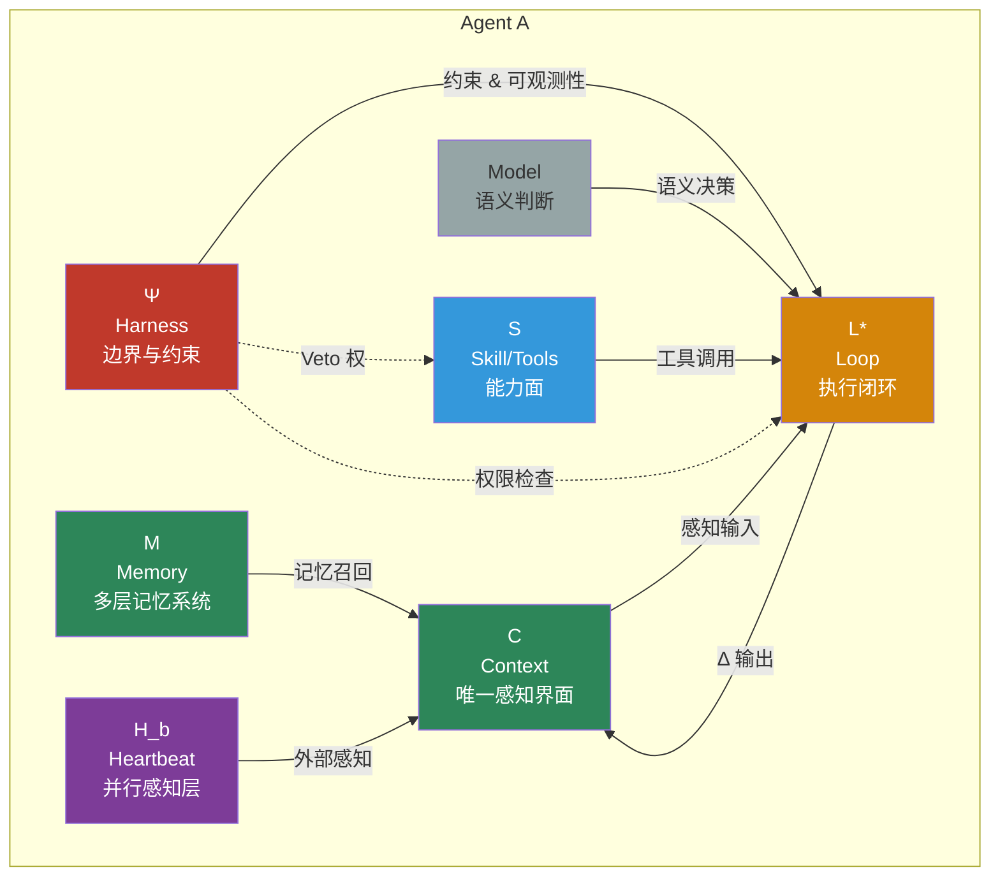
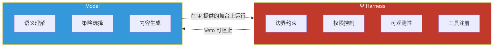
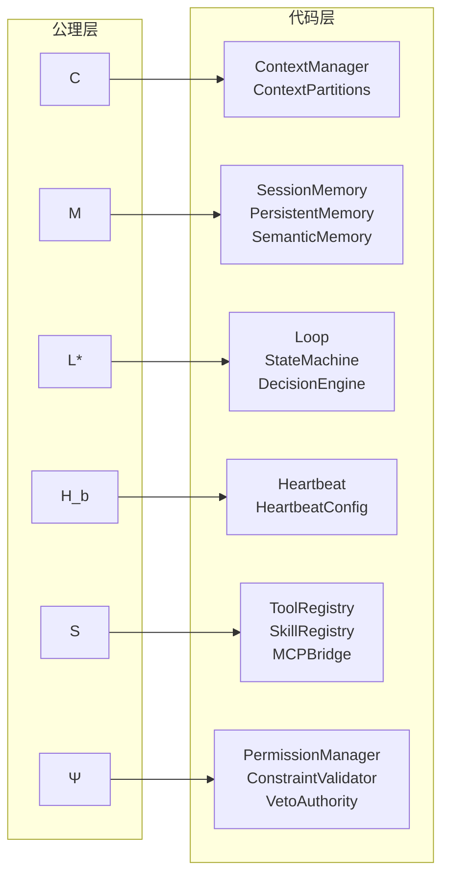

# 系统公理

Loom 的顶层定义基于 hernss 公理系统：

```text
A = ⟨C, M, L*, H_b, S, Ψ⟩
```

## 公理系统结构图



## 六元素详解

| 符号 | 含义 | 设计定义 | 当前代码映射 |
|---|---|---|---|
| `C` | Context | Agent 的唯一感知界面，五分区结构 | `loom/context/`（`ContextManager`、`ContextPartitions`、`ContextCompressor`、`ContextRenewer`） |
| `M` | Memory | 会话、持久化、语义等记忆层 | `loom/memory/`（`SessionMemory`、`PersistentMemory`、`WorkingMemory`、`SemanticMemory`） |
| `L*` | Loop | `Reason → Act → Observe → Δ` 主闭环 | `loom/execution/loop.py`（`Loop`、`StateMachine`、`DecisionEngine`、`Observer`） |
| `H_b` | Heartbeat | 并行感知与中断机制 | `loom/execution/heartbeat.py`、`loom/runtime/heartbeat*.py` |
| `S` | Skill / Tools | 工具、Skill、Plugin、MCP 能力面 | `loom/tools/`、`loom/ecosystem/`（`SkillRegistry`、`PluginLoader`、`MCPBridge`）、`loom/capabilities/` |
| `Ψ` | Harness | 环境、边界、权限、约束 | `loom/api/`、`loom/safety/`（`PermissionManager`、`ConstraintValidator`、`HookManager`、`VetoAuthority`） |

## 核心关系

```text
Agent = Model ∘ Ψ
```



核心纪律：

- **模型负责**：语义判断、任务推进、局部策略选择
- **Harness 负责**：环境、上下文、约束和可观测性
- **Harness 可以阻止危险动作**，但不应该替模型做过程性语义决策
- **如果 Harness 过度接管中间判断**，Agent 会退化成流程机

## 公理到代码的映射关系



## 当前实现的真实情况

| 能力 | 状态 | 说明 |
|---|---|---|
| 六维度模块切分 | `已实现` | `loom/` 下已形成清晰目录，每个公理元素有独立模块 |
| Context 五分区结构 | `已实现` | `ContextPartitions` dataclass 明确定义了 system/working/memory/skill/history |
| L* 主闭环骨架 | `已实现` | `Loop` 类含 `StateMachine` + `DecisionEngine` + `Observer` |
| 记忆系统分层 | `已实现` | Session / Persistent / Working / Semantic 四层 |
| 工具注册与生态 | `部分实现` | `ToolRegistry` 已可工作，`Skill/Plugin/MCP` 有基础骨架 |
| `H_b` 独立并行感知层 | `部分实现` | 有 `heartbeat` 相关模块，但与 hernss 完整设计目标仍有距离 |
| Harness 不替模型决策 | `已体现在设计` | 代码中仍可继续强化接口边界和职责收敛 |

## 关键约束

| 约束 | 含义 | 代码体现 |
|---|---|---|
| `ρ = 1.0` | 上下文压力硬边界，`ρ = token_count / max_tokens` | `ContextManager.rho` 属性，`ρ >= 1.0` 时触发 renew |
| `d_max` | 多 Agent 递归拆解最大深度 | `DecisionEngine.decide()` 中 `depth >= max_depth` 时触发 DECOMPOSE |
| Veto 权 | Harness 对危险动作的一票否决权 | `VetoAuthority` 模块 |

## 相关页面

- [设计原则](设计原则.md)
- [能力边界](能力边界.md)
- [总体架构](../03-架构说明/总体架构.md)
- [运行时与决策](../03-架构说明/运行时与决策.md)
