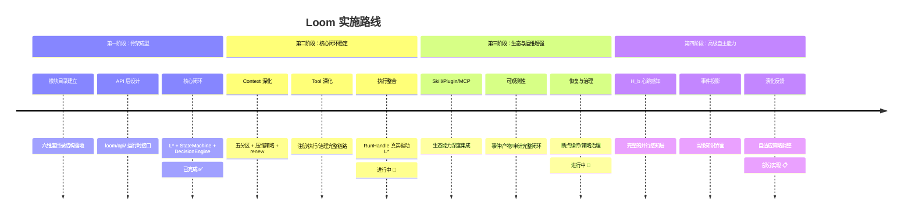
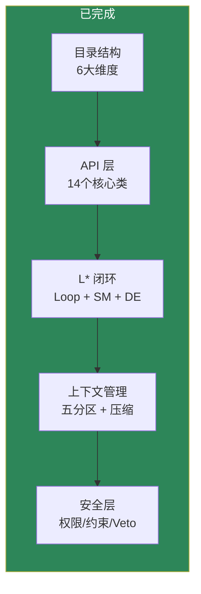
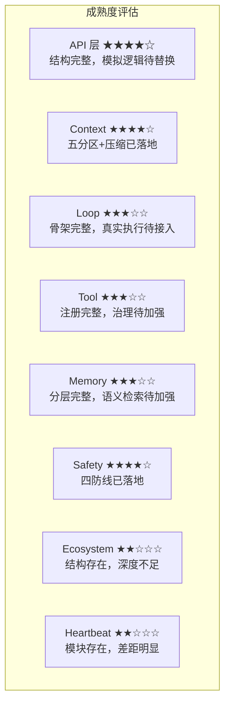
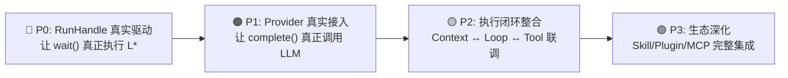

# 实施路线

这里不沿用旧文档分期，而是结合当前代码状态，给出更接近现实的路线表达。

## 当前阶段判断

从仓库结构看，Loom 已经完成了"六维度骨架化"的关键阶段：

## 各阶段详细说明

### 第一阶段：骨架成型 — 已完成 ✅

| 交付物 | 状态 | 说明 |
|---|---|---|
| 六维度目录结构 | `已实现` | `loom/` 下有清晰模块边界 |
| 统一 API 入口 | `已实现` | `loom/api/` 包含完整运行时接口 |
| L* 主闭环骨架 | `已实现` | `Loop` + `StateMachine` + `DecisionEngine` |
| 五分区上下文 | `已实现` | `ContextPartitions` 明确定义 |
| 安全四防线 | `已实现` | `Permission` → `Constraint` → `Hook` → `Veto` |
| 生态三大组件 | `部分实现` | `Skill` / `Plugin` / `MCP` 结构已存在 |

### 第二阶段：核心闭环稳定 — 进行中 🔧

| 交付物 | 状态 | 说明 |
|---|---|---|
| RunHandle 真实驱动 L* | `部分实现` | 当前 `wait()` 有模拟逻辑 |
| Provider 真实 LLM 接入 | `部分实现` | 当前为 mock 实现 |
| 压缩策略深度验证 | `部分实现` | 四种策略已存在，但缺乏真实场景验证 |
| 工具执行完整链路 | `部分实现` | 注册/执行已有，治理仍需加强 |
| 记忆系统深度整合 | `部分实现` | 分层已存在，语义检索仍需加强 |

### 第三阶段：生态与运维增强 — 进行中 🔧

| 交付物 | 状态 | 说明 |
|---|---|---|
| Skill 渐进式加载 | `部分实现` | 已有 lazy loading |
| Plugin 深度集成 | `部分实现` | PluginLoader 已存在 |
| MCP 桥接 | `部分实现` | MCPBridge 已有注册和连接骨架 |
| 事件流与审计 | `部分实现` | EventBus 已存在 |
| 断点续传 | `设计目标` | ResumePoint 已定义，实现仍在进行 |

### 第四阶段：高级自主能力 — 部分实现 📋

| 交付物 | 状态 | 说明 |
|---|---|---|
| H_b 独立并行感知 | `部分实现` | Heartbeat 模块存在，但与设计目标有差距 |
| 高级事件投影 | `设计目标` | 设计语言比代码更完整 |
| 知识界面 | `设计目标` | KnowledgeQuery 已定义，深度整合仍在进行 |
| 演化反馈 | `部分实现` | Evolution 模块已存在，策略仍在演进 |
| 自校准 | `部分实现` | Calibrator 已存在 |

## 能力成熟度雷达图

## 对团队的意义

这份路线的作用不是做营销时间表，而是统一预期：

- **我们已经不是概念验证阶段** — 五层架构、六维度模块、14 个核心类已经落地
- **我们也还没有到"所有设计目标都稳定兑现"的阶段** — 真实 LLM 接入、执行闭环整合仍在进行
- **wiki 应该真实表达这种中间态** — 每个能力都有明确的状态标记

## 优先级建议

