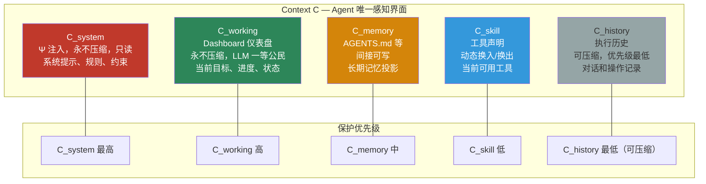
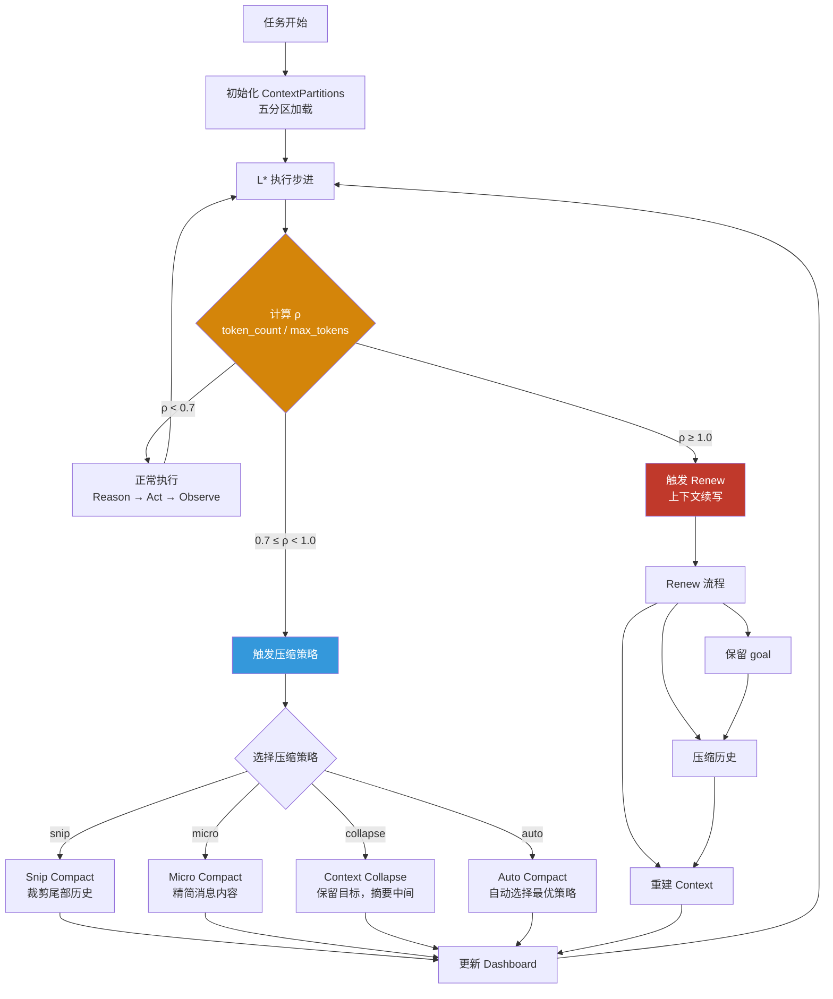
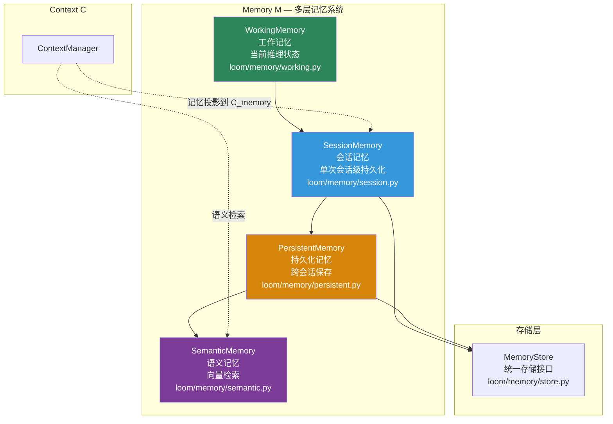

# 上下文与记忆

上下文和记忆是 Loom 最重要的"稳定器"。按 hernss 顶层设计，**Context 是 Agent 的唯一感知界面**，Memory 是超出当前上下文窗口的外部延展。

## 设计定义

```text
C = C_system ⊕ C_working ⊕ C_memory ⊕ C_skill ⊕ C_history
```

## 五分区上下文结构



### 分区详解

| 分区 | 可压缩 | 读写 | 内容 | 代码 |
|---|---|---|---|---|
| `system` | 永不 | 只读 | Ψ 注入的系统提示、规则、约束 | `ContextPartitions.system` |
| `working` | 永不 | 可写 | Dashboard 仪表盘，LLM 一等公民 | `ContextPartitions.working` → `Dashboard` |
| `memory` | 不压缩 | 间接可写 | AGENTS.md 等长期记忆投影 | `ContextPartitions.memory` |
| `skill` | 换入/换出 | 动态 | 当前可用工具声明 | `ContextPartitions.skill` |
| `history` | **可压缩** | 追加 | 对话和操作执行历史 | `ContextPartitions.history` |

## 上下文管理流程



## 记忆系统分层



| 记忆层 | 生命周期 | 用途 | 代码 |
|---|---|---|---|
| `WorkingMemory` | 单步推理 | 当前推理状态 | `loom/memory/working.py` |
| `SessionMemory` | 单次会话 | 会话级信息保持 | `loom/memory/session.py` |
| `PersistentMemory` | 跨会话 | 长期知识保存 | `loom/memory/persistent.py` |
| `SemanticMemory` | 永久 | 语义向量检索 | `loom/memory/semantic.py` |

## 当前代码结构

| 模块 | 主要代码 | 职责 |
|---|---|---|
| 上下文管理器 | `loom/context/manager.py` | 统一入口：ρ 计算、压缩触发、renew 触发 |
| 上下文分区 | `loom/context/partitions.py` | 五分区数据结构 `ContextPartitions` |
| 仪表盘 | `loom/context/dashboard.py` | Dashboard 驱动推理辅助 |
| 压缩器 | `loom/context/compression.py` | 四种压缩策略：snip / micro / collapse / auto |
| 续写器 | `loom/context/renewal.py` | Context Renewal 流程 |
| 事件聚合 | `loom/context/event_aggregator.py` | 上下文事件聚合 |
| 会话记忆 | `loom/memory/session.py` | 会话级记忆 |
| 持久化记忆 | `loom/memory/persistent.py` | 跨会话持久化 |
| 工作记忆 | `loom/memory/working.py` | 当前推理状态 |
| 语义记忆 | `loom/memory/semantic.py` | 语义向量检索 |
| 存储接口 | `loom/memory/store.py` | 统一存储抽象 |

## ContextManager 核心方法

```python
class ContextManager:
    @property
    def rho(self) -> float:
        """计算上下文压力 ρ = token_count / max_tokens"""

    def should_renew(self) -> bool:
        """检查是否需要续写 (ρ >= 1.0)"""

    def renew(self):
        """执行续写 - goal 永远随 renew 传递"""

    def should_compress(self) -> str | None:
        """检查是否需要压缩，返回策略名"""

    def compress(self, strategy: str):
        """执行指定压缩策略"""
```

## 实现观察

### 1. 上下文已经有独立管理器

`ContextManager` 负责 token 压力计算、压缩触发、renew 触发和分区协作。这说明 **"Context 不是 prompt 拼接，而是管理对象"** 这一点已经在代码层成立。

### 2. 记忆已经和上下文分离

`loom/memory/` 独立存在，说明项目并没有把所有长期信息都塞进 Context，而是在结构上区分了：
- 当前窗口中的感知材料（Context）
- 会话持有的信息（SessionMemory）
- 可持久化或语义化的信息（PersistentMemory / SemanticMemory）

### 3. 压缩策略已形成体系

四种压缩策略按激进程度递增：

| 策略 | 激进程度 | 说明 |
|---|---|---|
| `snip` | 低 | 裁剪尾部历史消息 |
| `micro` | 中 | 精简消息内容 |
| `collapse` | 高 | 保留目标，摘要中间部分 |
| `auto` | 自适应 | 自动选择最优策略 |

## 设计与实现差距

| 主题 | 状态 | 说明 |
|---|---|---|
| 五分区上下文结构 | `已实现` | `ContextPartitions` dataclass 明确定义 |
| ρ 压力计算与硬边界 | `已实现` | `ContextManager.rho` 属性 + `should_renew()` |
| 四种压缩策略 | `已实现` | `ContextCompressor` 已实现 |
| 仪表盘驱动推理 | `部分实现` | `DashboardManager` 存在，但设计目标仍可继续增强 |
| 高级事件投影与知识界面 | `设计目标` | 设计语言比当前代码更完整 |
| 稳定的 renew 语义 | `部分实现` | 已有 `ContextRenewer`，但仍处在演化期 |

## 读代码建议

建议按这个顺序阅读：

1. `loom/context/manager.py` — 理解统一入口
2. `loom/context/partitions.py` — 理解五分区结构
3. `loom/context/compression.py` — 理解压缩策略
4. `loom/context/renewal.py` — 理解续写流程
5. `loom/context/dashboard.py` — 理解仪表盘
6. `loom/memory/*.py` — 理解记忆分层

## 继续阅读

- [运行时与决策](运行时与决策.md) — 理解 L* 如何与 Context 交互
- [生态与安全](生态与安全.md) — 理解约束如何影响 Context
