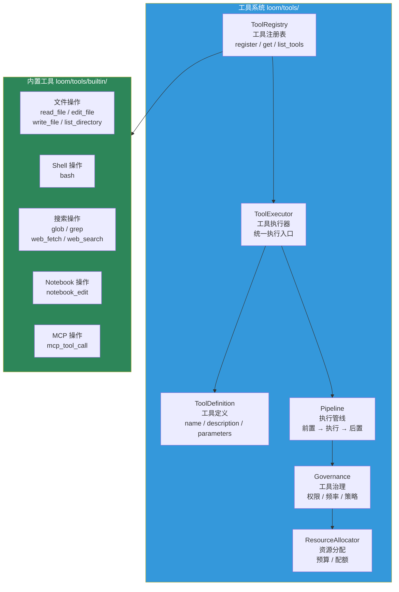
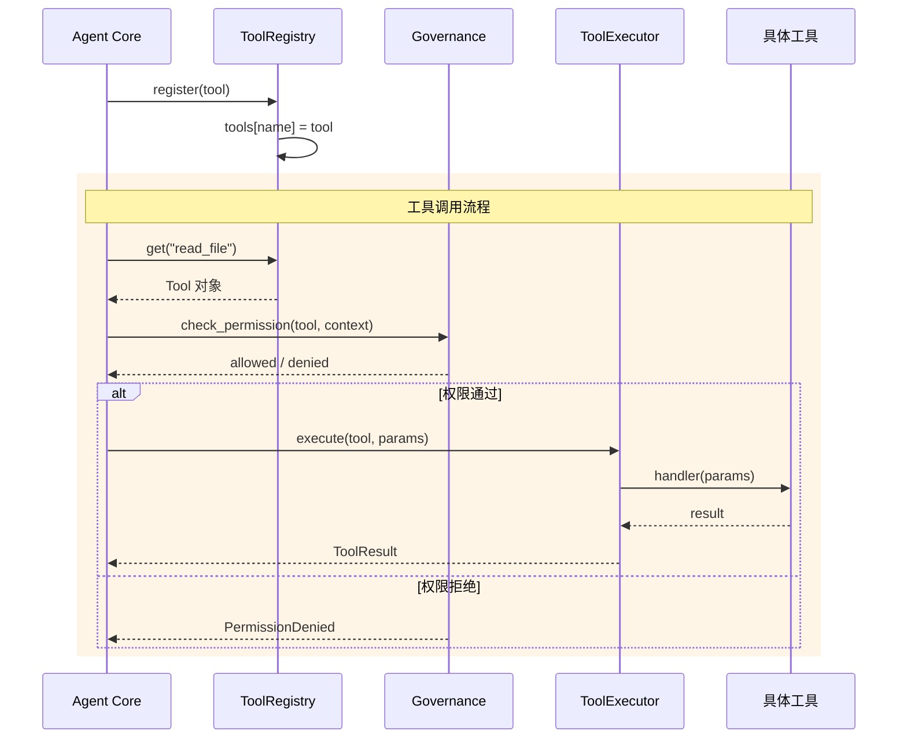
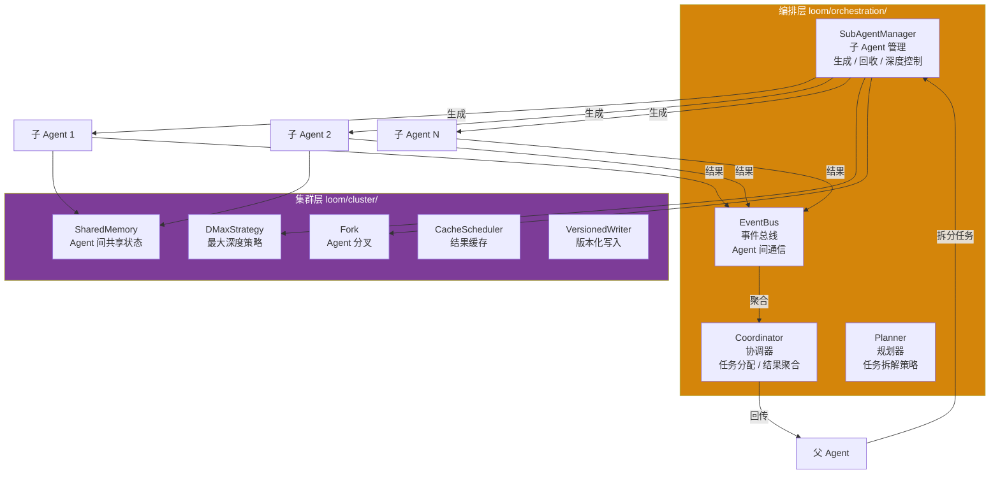
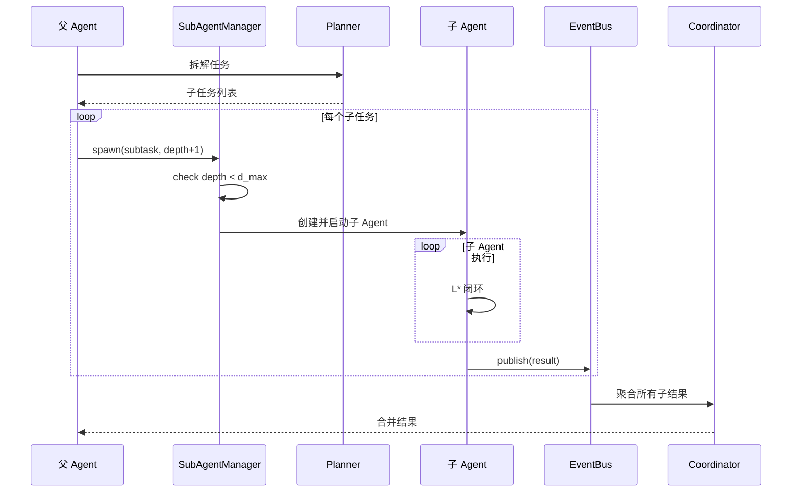

# 工具与多Agent

Loom 的"行动能力"主要来自工具系统和多 Agent 协作。

## 工具系统架构

### 工具注册与执行流程

### 工具系统代码

| 模块 | 文件 | 职责 |
|---|---|---|
| 工具注册 | `loom/tools/registry.py` | `ToolRegistry` — 注册、查询、列举 |
| 工具定义 | `loom/tools/schema.py` | `Tool`、`ToolDefinition` — 工具元数据 |
| 工具执行 | `loom/tools/executor.py` | `ToolExecutor` — 统一执行入口 |
| 执行管线 | `loom/tools/pipeline.py` | 前置检查 → 执行 → 后置处理 |
| 工具治理 | `loom/tools/governance.py` | 权限、频率限制、策略 |
| 资源分配 | `loom/tools/resource_allocator.py` | 预算、配额管理 |
| 内置工具 | `loom/tools/builtin/` | 文件/Shell/搜索等操作 |
| 知识工具 | `loom/tools/knowledge.py` | 知识检索工具 |
| 证据压缩 | `loom/tools/evidence_compressor.py` | Evidence Pack 压缩 |

### 当前实现判断

| 能力 | 状态 | 说明 |
|---|---|---|
| 工具注册表 | `已实现` | `ToolRegistry` 已可 `register`、`get`、`list_tools`、`unregister` |
| 工具定义模型 | `已实现` | `Tool` + `ToolDefinition` 已明确定义 |
| 工具执行器 | `已实现` | `ToolExecutor` 已存在独立执行层 |
| 工具治理与资源分配 | `部分实现` | `Governance`、`ResourceAllocator` 结构已存在 |
| 内置工具集合 | `已实现` | `loom/tools/builtin/` 已有文件/Shell/搜索等操作 |
| 知识检索工具 | `部分实现` | `knowledge.py` 已有基础骨架 |

## 多 Agent 协作

### 多 Agent 协作流程

### 多 Agent 代码

| 模块 | 文件 | 职责 |
|---|---|---|
| 子 Agent 管理 | `loom/orchestration/subagent.py` | `SubAgentManager` — 生成、回收、深度控制 |
| 事件总线 | `loom/orchestration/events.py` | `EventBus` — Agent 间通信 |
| 协调器 | `loom/orchestration/coordinator.py` | `Coordinator` — 任务分配与结果聚合 |
| 规划器 | `loom/orchestration/planner.py` | `Planner` — 任务拆解策略 |
| Agent 分叉 | `loom/cluster/fork.py` | `Fork` — Agent 分叉机制 |
| 共享内存 | `loom/cluster/shared_memory.py` | `SharedMemory` — Agent 间共享状态 |
| 深度策略 | `loom/cluster/dmax_strategy.py` | `DMaxStrategy` — 最大深度策略 |
| 缓存调度 | `loom/cluster/cache_scheduler.py` | `CacheScheduler` — 结果缓存 |
| 版本化写入 | `loom/cluster/versioned_writer.py` | `VersionedWriter` — 版本控制 |
| 子结果 | `loom/cluster/subagent_result.py` | 子 Agent 结果封装 |

### 当前实现判断

| 能力 | 状态 | 说明 |
|---|---|---|
| 子 Agent 生成 | `已实现` | `SubAgentManager` 已存在 |
| 最大深度约束 `d_max` | `已实现` | 代码中有递归终止判断 |
| 事件总线 | `已实现` | `EventBus` 已存在 |
| 任务规划器 | `部分实现` | `Planner` 已有基础结构 |
| Fork、共享内存、版本化写入 | `部分实现` | `loom/cluster/` 中已有对应方向的模块 |

## 真实能力表达

- 工具系统已经形成独立能力层，`ToolRegistry` 可直接使用
- 多 Agent 协作已经有基础实现，`SubAgentManager` + `EventBus` 可用
- 高级协作策略（动态调度、自适应拆解）仍在演进
- 不宜包装成完全成熟的编排平台

## 相关页面

- [运行时与决策](运行时与决策.md)
- [生态与安全](生态与安全.md)
- [扩展开发](../../04-开发说明/扩展开发.md)
