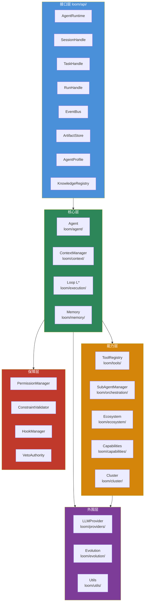
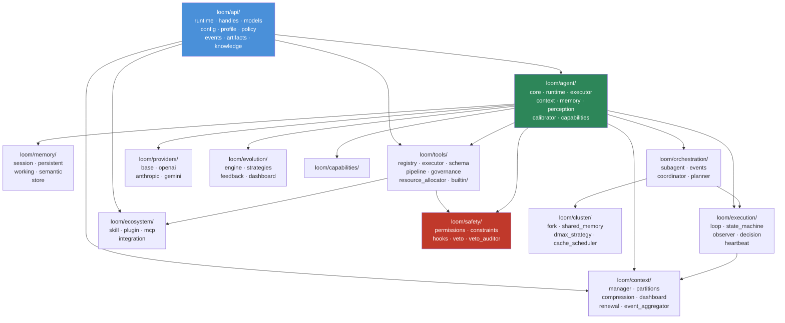
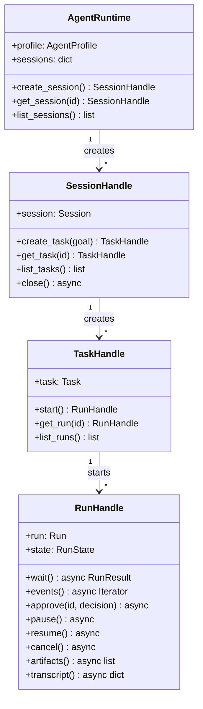

# 总体架构

Loom 的整体结构已经稳定地映射到 `loom/` 目录层次，形成五层架构。

## 五层架构总览



## 模块依赖关系



## API 优先入口

当前最重要的外部入口是 `loom/api/`：



## 关键入口索引

| 入口文件 | 核心类 | 说明 |
|---|---|---|
| `loom/__init__.py` | 统一导出 | 对外暴露 API 层 + Core 层 |
| `loom/api/runtime.py` | `AgentRuntime` | 运行时总入口 |
| `loom/api/handles.py` | `SessionHandle` / `TaskHandle` / `RunHandle` | 生命周期句柄 |
| `loom/api/models.py` | `Session` / `Task` / `Run` / `Event` / `Approval` / `Artifact` | 数据模型 |
| `loom/api/config.py` | `AgentConfig` / `LLMConfig` / `ToolConfig` / `PolicyConfig` | 配置模型 |
| `loom/api/profile.py` | `AgentProfile` | Agent 画像 |
| `loom/api/events.py` | `EventBus` / `EventStream` | 事件系统 |
| `loom/api/artifacts.py` | `ArtifactStore` | 产物存储 |
| `loom/api/knowledge.py` | `KnowledgeRegistry` / `KnowledgeSource` | 知识源 |
| `loom/context/manager.py` | `ContextManager` | 上下文管理 |
| `loom/execution/loop.py` | `Loop` | 主循环 |
| `loom/tools/registry.py` | `ToolRegistry` | 工具注册 |
| `loom/agent/core.py` | `Agent` | Agent 内核 |
| `loom/orchestration/subagent.py` | `SubAgentManager` | 子 Agent 管理 |
| `loom/ecosystem/__init__.py` | `SkillRegistry` / `PluginLoader` / `MCPBridge` | 生态入口 |
| `loom/safety/__init__.py` | `PermissionManager` / `ConstraintValidator` / `VetoAuthority` | 安全入口 |

## 核心层内部协作

```mermaid
sequenceDiagram
    participant Dev as 开发者
    participant API as AgentRuntime
    participant Agent as Agent Core
    participant Ctx as ContextManager
    participant Loop as Loop L*
    participant Provider as LLMProvider

    Dev->>API: create_session()
    API-->>Dev: SessionHandle
    Dev->>API: create_task("分析代码")
    API-->>Dev: TaskHandle
    Dev->>API: start()
    API-->>Dev: RunHandle

    rect rgb(240, 248, 255)
        Note over Agent,Provider: L* 主闭环
        loop 每一步
            Agent->>Ctx: 检查 ρ 压力
            Ctx-->>Agent: 返回 rho 值
            Agent->>Loop: step(rho, depth, max_depth)
            Loop->>Loop: DecisionEngine.decide()
            alt ρ >= 1.0
                Loop-->>Agent: RENEW
                Agent->>Ctx: renew()
            else depth >= max_depth
                Loop-->>Agent: DECOMPOSE
            else 正常推进
                Agent->>Provider: complete(messages)
                Provider-->>Agent: response
            end
        end
    end

    Agent-->>API: RunResult
    API-->>Dev: result
```

## 设计定义与当前实现

| 主题 | 设计定义 | 当前实现判断 |
|---|---|---|
| 五层架构 | 顶层设计中已明确定义 | `已实现` — 已被真实目录结构承接 |
| 统一 Runtime API | 运行时对象模型已经稳定成型 | `已实现` — `loom/api/` 已存在，14个核心类 |
| L* 主闭环 | `Reason → Act → Observe → Δ` 循环 | `已实现` — `Loop` + `StateMachine` + `DecisionEngine` |
| 五分区上下文 | `C_system ⊕ C_memory ⊕ C_skill ⊕ C_history ⊕ C_working` | `已实现` — `ContextPartitions` dataclass |
| 高级协同与演化 | Cluster、SubAgent、Evolution | `部分实现` — 有目录和模块，但成熟度不均衡 |
| 生态成熟度 | Skill / Plugin / MCP 完整集成 | `部分实现` — 结构已存在，深度整合仍在进行 |

## 架构判断

从目录结构上看，项目已经不是"单文件 SDK"或"几个 helper 的集合"，而是有明确边界的运行时系统。

wiki 应该优先服务下面两类读者：

- **想理解系统拆分逻辑**的人 → 从本页开始
- **准备在某一个维度上继续扩展代码**的人 → 进入对应的架构说明子页

## 继续阅读

- [运行时对象模型](运行时对象模型.md) — API 层对象与句柄详解
- [上下文与记忆](上下文与记忆.md) — C 与 M 模块详解
- [运行时与决策](运行时与决策.md) — L* 闭环与决策引擎详解
- [工具与多Agent](工具与多Agent.md) — S 与协作模块详解
- [生态与安全](生态与安全.md) — 生态扩展与安全保障详解
