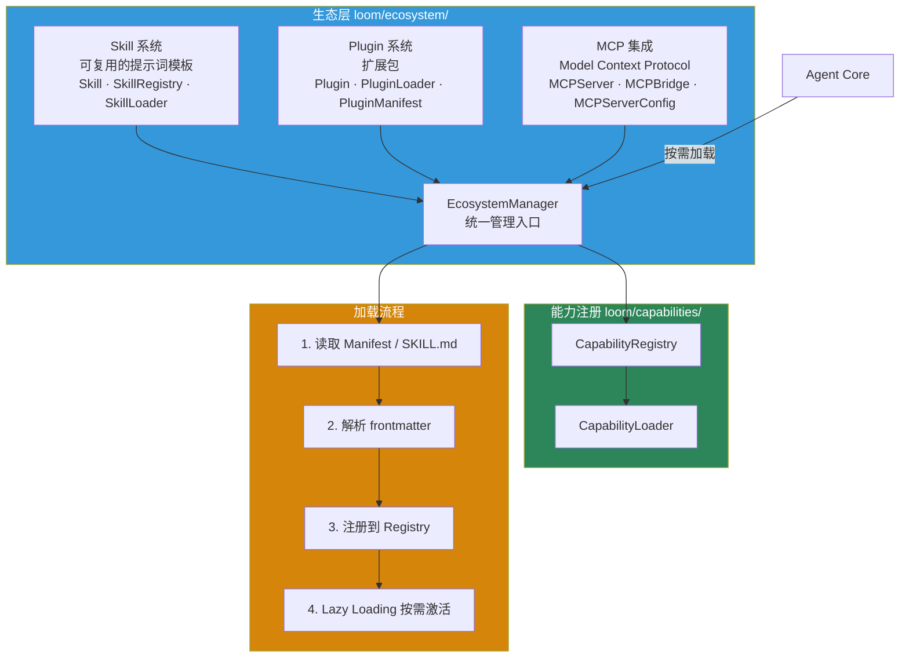
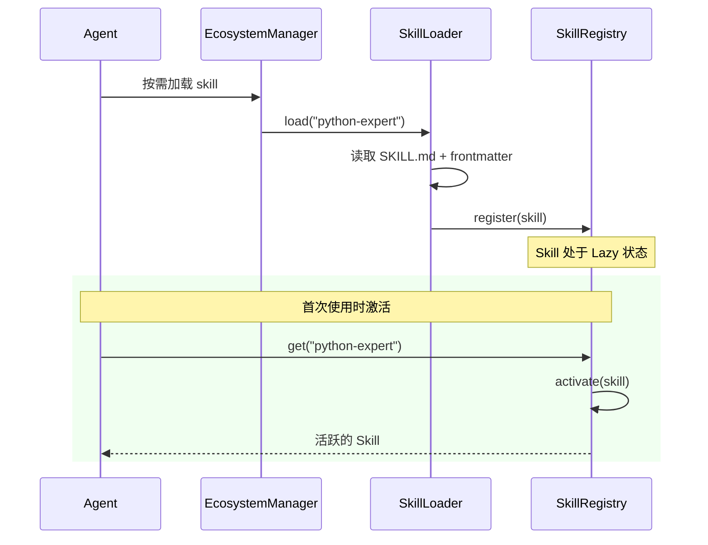
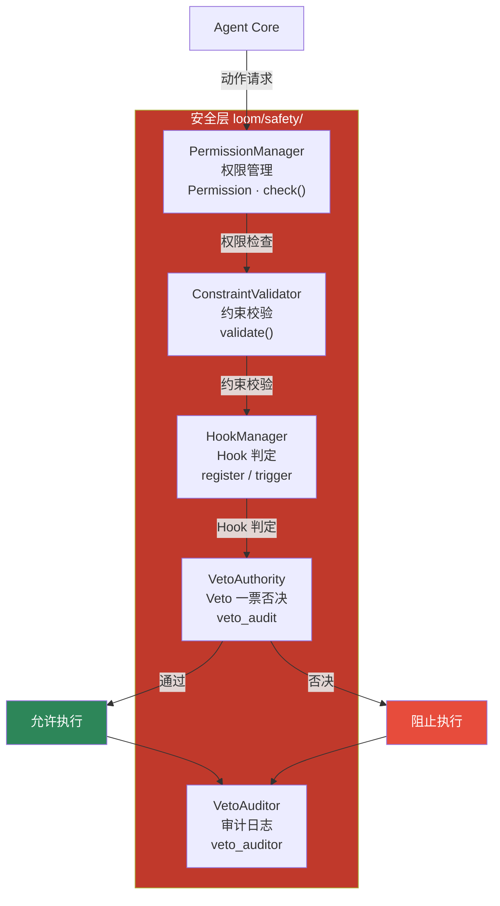
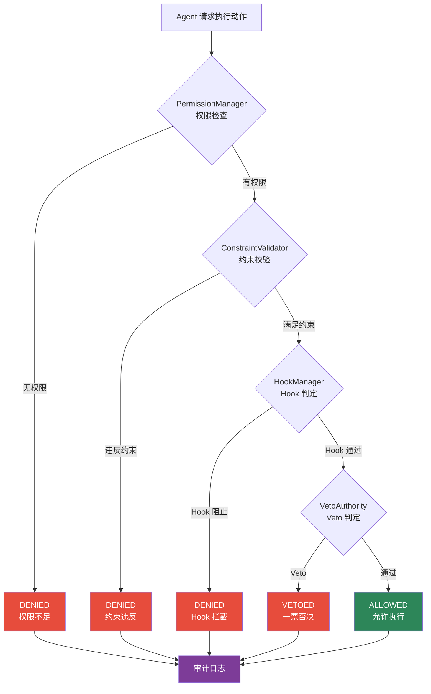

# 生态与安全

Loom 不把 Skill、Plugin、MCP 和权限治理当成边角料，而是把它们看成长期运行系统的一部分。

## 生态层架构

### 生态组件详解

| 组件 | 说明 | 核心类 | 代码位置 |
|---|---|---|---|
| **Skill** | 可复用的提示词模板（类似 Claude Code 的 skills） | `Skill`、`SkillRegistry`、`SkillLoader` | `loom/ecosystem/skill.py` |
| **Plugin** | 扩展包，可包含 Skills、Tools、Hooks、MCP servers | `Plugin`、`PluginLoader`、`PluginManifest` | `loom/ecosystem/plugin.py` |
| **MCP** | Model Context Protocol 服务器集成 | `MCPServer`、`MCPBridge`、`MCPServerConfig`、`MCPTransportType` | `loom/ecosystem/mcp.py` |
| **统一管理** | 生态组件的统一入口 | `EcosystemManager` | `loom/ecosystem/integration.py` |
| **能力注册** | 通用能力注册与加载 | `CapabilityRegistry`、`CapabilityLoader` | `loom/capabilities/` |

### Skill 加载流程

### 当前实现判断

| 主题 | 状态 | 说明 |
|---|---|---|
| Skill Registry / Loader | `已实现` | 目录和加载结构已具备，支持 Markdown + frontmatter 解析 |
| Skill Lazy Loading | `已实现` | 已支持按需激活 |
| Plugin 集成 | `部分实现` | 已有 `PluginLoader` 和 `PluginManifest`，接口仍在稳定 |
| MCP 集成 | `部分实现` | `MCPBridge` 已有注册、连接和执行骨架 |
| EcosystemManager | `已实现` | 统一管理入口已存在 |
| 完整生态联动 | `部分实现` | 多模块已具备骨架，但深度整合仍在继续 |

## 安全层架构

### 安全组件详解

| 组件 | 说明 | 核心类 | 代码位置 |
|---|---|---|---|
| **权限管理** | 管理工具和操作的权限 | `Permission`、`PermissionManager` | `loom/safety/permissions.py` |
| **约束校验** | 校验操作是否满足约束 | `ConstraintValidator` | `loom/safety/constraints.py` |
| **Hook 判定** | 注册和触发 Hook | `HookManager` | `loom/safety/hooks.py` |
| **Veto 权** | 对危险动作的一票否决 | `VetoAuthority` | `loom/safety/veto.py` |
| **审计** | Veto 审计日志 | `VetoAuditor` | `loom/safety/veto_auditor.py` |

### 安全判定流程

### 当前实现判断

| 主题 | 状态 | 说明 |
|---|---|---|
| 权限管理 | `已实现` | `PermissionManager` 已存在，支持权限检查 |
| 约束校验 | `已实现` | `ConstraintValidator` 已存在 |
| Hook 判定 | `已实现` | `HookManager` 已存在 |
| Veto 一票否决 | `已实现` | `VetoAuthority` 已存在 |
| 审计日志 | `已实现` | `VetoAuditor` 已存在 |
| 细粒度策略 | `部分实现` | 基础检查已落地，生产级策略仍在演进 |

## 架构意义

把生态和安全独立出来，有两个好处：

1. **能力扩展不会直接污染核心闭环** — Skill/Plugin/MCP 的变化不影响 L* 执行
2. **安全策略可以作为系统级边界** — 权限/约束/Veto 集中管理，不散落在业务逻辑里

## 诚实表述

- 生态层已经具备可扩展骨架，Skill/Plugin/MCP 三大组件结构清晰
- 安全层已经有系统性切分，四道防线（权限→约束→Hook→Veto）已落地
- 生态成熟度和安全策略完备度仍需继续演进
- 不宜包装成生产级安全平台

## 相关页面

- [工具与多Agent](工具与多Agent.md)
- [技能插件与知识源](../../04-开发说明/技能插件与知识源.md)
- [扩展开发](../../04-开发说明/扩展开发.md)
