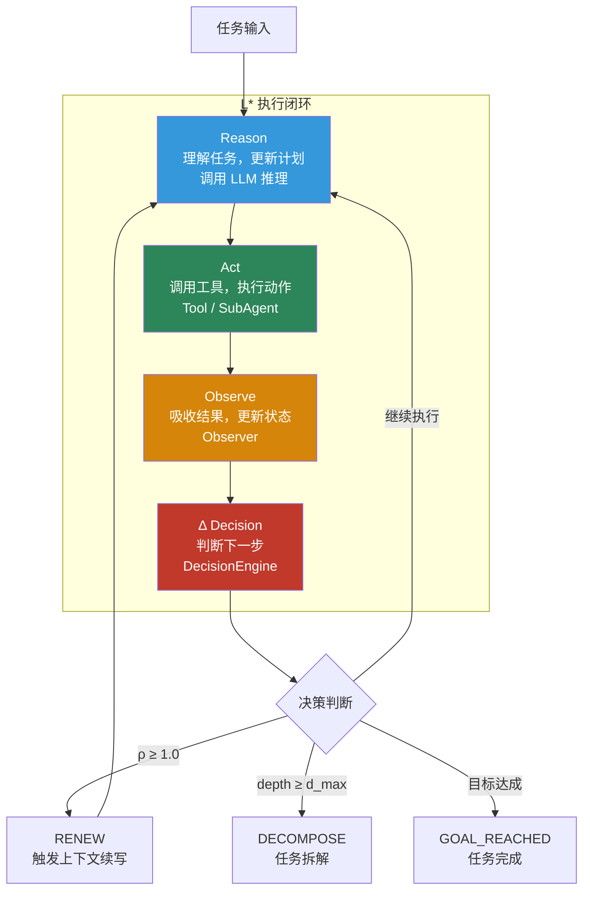
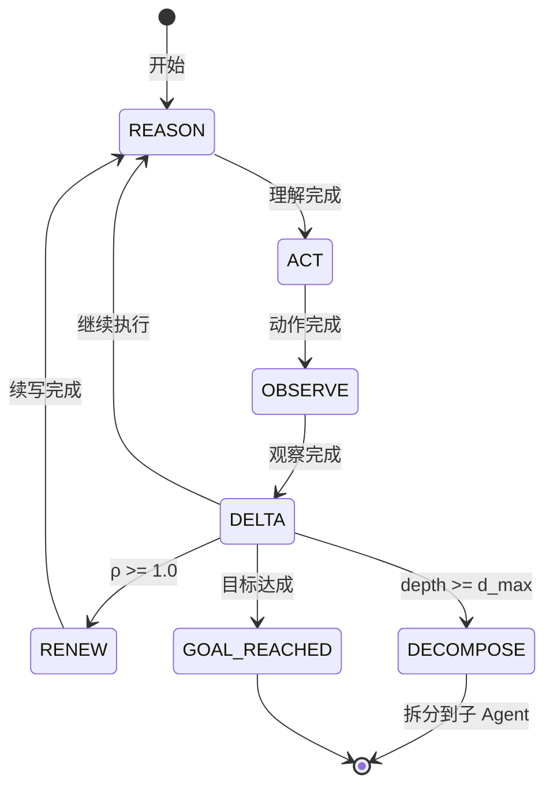
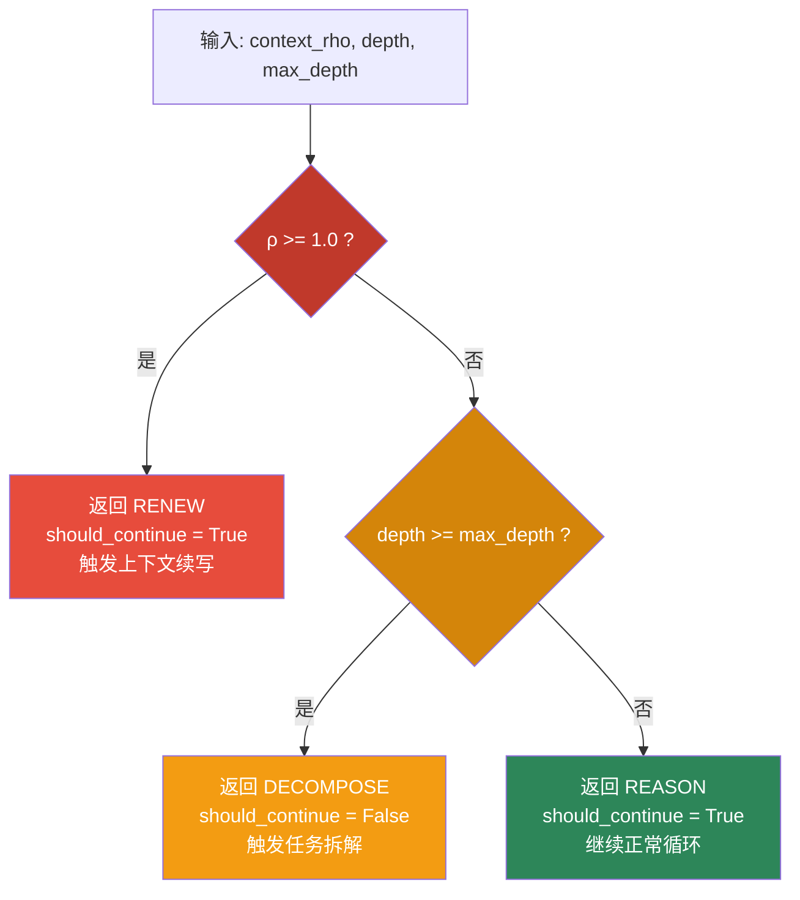

# 运行时与决策

这一层负责让 Agent 不只是"调用一次模型"，而是形成可推进、可约束、可恢复的执行闭环。

## L* 主闭环

核心闭环是：

```text
Reason → Act → Observe → Δ
```



### 四阶段详解

| 阶段 | 职责 | 输入 | 输出 |
|---|---|---|---|
| **Reason** | 理解任务与更新计划 | Context + 目标 | 推理结果 |
| **Act** | 调用工具、执行动作 | 推理结果 + 工具 | 执行结果 |
| **Observe** | 吸收结果并更新状态 | 执行结果 | 观察结果 |
| **Δ** | 判断继续、续写、拆解或终止 | ρ + depth + 观察结果 | LoopResult |

## L* 状态机



## 决策引擎

`DecisionEngine` 是 Δ 阶段的核心，负责根据物理约束做出硬边界判断：



### 硬约束规则

| 约束 | 条件 | 动作 | 代码位置 |
|---|---|---|---|
| 上下文压力 | `ρ >= 1.0` | 触发 Renew | `DecisionEngine.decide()` |
| 深度限制 | `depth >= max_depth` | 触发 Decompose | `DecisionEngine.decide()` |
| 步数限制 | `step_count >= max_steps` | 触发 Goal Reached | `Loop.step()` |

## Agent 执行流程

```mermaid
sequenceDiagram
    participant Dev as 开发者
    participant Agent as Agent Core
    participant Ctx as ContextManager
    participant Loop as Loop L*
    participant Decision as DecisionEngine
    participant SM as StateMachine
    participant Provider as LLMProvider

    Dev->>Agent: run(goal, max_steps)

    loop 执行闭环
        Agent->>Ctx: check_constraints(rho, depth)
        Ctx-->>Agent: ok/reason

        alt 约束不满足
            Agent-->>Dev: "Stopped: {reason}"
        end

        Agent->>Loop: step(rho, depth, max_depth)
        Loop->>Decision: decide(rho, depth, max_depth)

        alt ρ >= 1.0
            Decision-->>Loop: RENEW
            Agent->>Ctx: renew()
        else depth >= max_depth
            Decision-->>Loop: DECOMPOSE
        else 正常
            Decision-->>Loop: REASON
        end

        Loop->>SM: transition(result)
        SM-->>Loop: next_state

        alt should_continue = false
            Loop-->>Agent: result
        end
    end

    Agent-->>Dev: "Goal reached"
```

## 主要代码文件

| 模块 | 文件 | 职责 |
|---|---|---|
| 主循环 | `loom/execution/loop.py` | `Loop` 类，协调 StateMachine + DecisionEngine + Observer |
| 状态机 | `loom/execution/state_machine.py` | `StateMachine` 类，管理 `REASON → ACT → OBSERVE → DELTA` 转换 |
| 观察器 | `loom/execution/observer.py` | `Observer` 类，吸收执行结果 |
| 决策引擎 | `loom/execution/decision.py` | `DecisionEngine` 类，基于 ρ 和 depth 做硬约束判断 |
| 心跳 | `loom/execution/heartbeat.py` | `Heartbeat` + `HeartbeatConfig`，并行感知层 |
| 运行时心跳 | `loom/runtime/heartbeat.py` | 运行时级别心跳策略 |
| 心跳策略 | `loom/runtime/heartbeat_strategy.py` | 心跳触发策略 |
| Agent 内核 | `loom/agent/core.py` | `Agent` 类，组合 Provider + Context + Loop |
| 运行时配置 | `loom/agent/runtime.py` | `Runtime` + `RuntimeConfig`，约束检查 |

## LoopState 枚举

| 状态 | 含义 |
|---|---|
| `REASON` | 推理阶段 |
| `ACT` | 执行阶段 |
| `OBSERVE` | 观察阶段 |
| `DELTA` | 决策阶段 |
| `RENEW` | 上下文续写 |
| `DECOMPOSE` | 任务拆解 |
| `GOAL_REACHED` | 目标达成 |

## 当前实现判断

| 主题 | 状态 | 说明 |
|---|---|---|
| 主循环作为独立模块 | `已实现` | `Loop` 类含 `step()` 方法 |
| 决策与状态机分离 | `已实现` | `DecisionEngine` 和 `StateMachine` 各自独立 |
| 基于物理约束做硬边界判断 | `已实现` | ρ >= 1.0 和 depth >= d_max 两个硬约束已落地 |
| Agent 组合 Provider + Context + Loop | `已实现` | `Agent.__init__` 中明确组装 |
| 心跳感知作为独立主题 | `部分实现` | `Heartbeat` 模块存在，但与 hernss 完整定义仍有差距 |
| 真实 LLM 调用接入 L* | `部分实现` | Provider 层为 mock 实现，实际推理链路仍在收敛 |

## 适合谁看

- 要做 loop、scheduler、runtime 能力的人
- 要判断 Agent 为何会继续、终止、续写或拆解的人
- 要扩展决策引擎或添加新约束的人

## 继续阅读

- [上下文与记忆](上下文与记忆.md) — 理解 ρ 压力和压缩如何工作
- [工具与多Agent](工具与多Agent.md) — 理解 Act 阶段如何调用工具和子 Agent
- [生态与安全](生态与安全.md) — 理解安全约束如何影响决策
