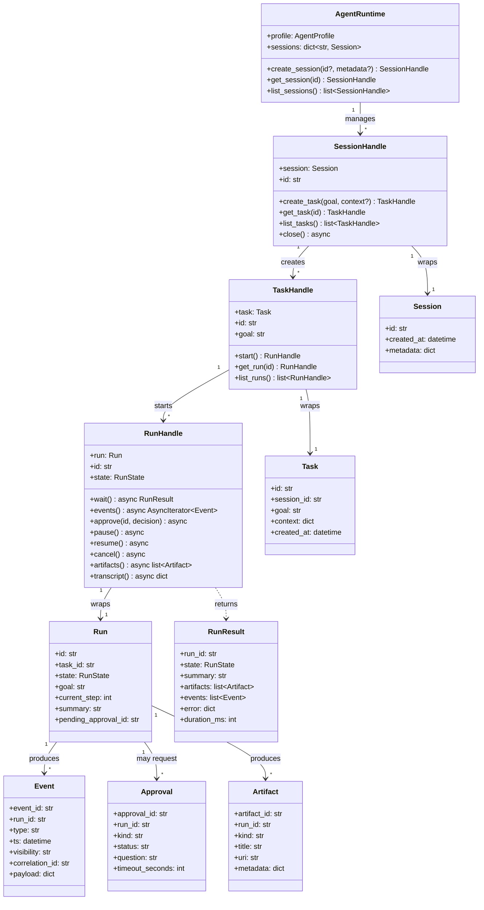
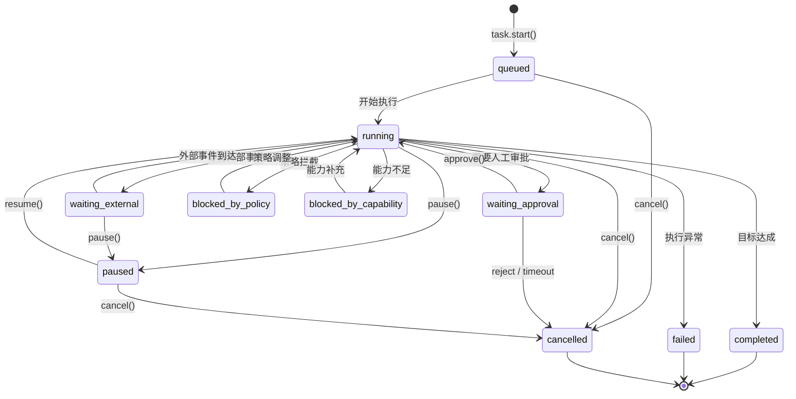

# 运行时对象模型

`loom/api` 是面向开发者的中心入口，这组对象是最先要理解的核心。

## 对象关系图



## Run 状态机

`RunState` 定义了 Run 的完整生命周期状态：



| 状态 | 含义 | 可转换到 |
|---|---|---|
| `queued` | 已创建，等待执行 | `running`、`cancelled` |
| `running` | 正在执行中 | `waiting_approval`、`waiting_external`、`paused`、`completed`、`failed`、`cancelled`、`blocked_by_policy`、`blocked_by_capability` |
| `waiting_approval` | 等待人工审批 | `running`（审批通过）、`cancelled`（拒绝/超时） |
| `waiting_external` | 等待外部事件 | `running`、`paused` |
| `paused` | 已暂停 | `running`、`cancelled` |
| `completed` | 执行完成 | 终态 |
| `failed` | 执行失败 | 终态 |
| `cancelled` | 已取消 | 终态 |
| `blocked_by_policy` | 被策略拦截 | `running` |
| `blocked_by_capability` | 能力不足被阻断 | `running` |

## 核心对象详解

### Session

```python
@dataclass
class Session:
    id: str                    # UUID 自动生成
    created_at: datetime       # 创建时间
    metadata: dict[str, Any]   # 用户自定义元数据
```

Session 代表一个持久交互上下文。它不直接执行任务，而是作为 Task 的容器。

### Task

```python
@dataclass
class Task:
    id: str                    # UUID 自动生成
    session_id: str            # 所属 Session
    goal: str                  # 任务目标描述
    context: dict[str, Any]    # 任务上下文
    created_at: datetime       # 创建时间
```

Task 是可执行目标单元。一个 Task 可以有多次 Run（例如重试、不同参数）。

### Run

```python
@dataclass
class Run:
    id: str                    # UUID 自动生成
    task_id: str               # 所属 Task
    state: RunState            # 当前状态
    goal: str                  # 继承自 Task 的目标
    current_step: int          # 当前步数
    summary: str               # 执行摘要
    pending_approval_id: str   # 待审批 ID（如有）
```

Run 是一次具体的任务执行。它跟踪状态变化、步数和审批流程。

### Event

```python
@dataclass
class Event:
    event_id: str              # UUID 自动生成
    run_id: str                # 所属 Run
    type: str                  # 事件类型
    ts: datetime               # 时间戳
    visibility: str            # 可见性: user / system / audit
    correlation_id: str        # 关联 ID
    payload: dict[str, Any]    # 事件载荷
```

### Approval

```python
@dataclass
class Approval:
    approval_id: str           # UUID
    run_id: str                # 所属 Run
    kind: str                  # 类型: tool_execution / policy_override / external_publish
    status: str                # 状态: pending / approved / rejected / expired
    question: str              # 审批问题
    timeout_seconds: int       # 超时时间（默认 600s）
```

### Artifact

```python
@dataclass
class Artifact:
    artifact_id: str           # UUID
    run_id: str                # 所属 Run
    kind: str                  # 类型: patch / report / json / text / evidence_pack
    title: str                 # 标题
    uri: str                   # 存储位置
    metadata: dict[str, Any]   # 附加元数据
```

## 扩展对象

`loom/api/models.py` 还定义了以下知识检索相关对象：

| 对象 | 作用 |
|---|---|
| `EvidencePack` | 证据包 — RAG as Evidence, not Memory |
| `EvidenceItem` | 单条证据 |
| `Citation` | 知识源引用 |
| `KnowledgeQuery` | 知识搜索查询 |
| `ActiveQuestion` | 正在解析中的问题 |
| `ResumePoint` | Run 恢复检查点 |

## 配套对象

除了运行对象本身，`loom/api/` 还提供三组配套能力：

| 组 | 对象 | 说明 |
|---|---|---|
| 配置 | `AgentConfig`、`LLMConfig`、`ToolConfig`、`PolicyConfig` | 统一配置模型 |
| 画像与策略 | `AgentProfile`、`PolicySet` | Agent 画像和行为策略 |
| 知识源 | `KnowledgeRegistry`、`KnowledgeSource` | 知识源注册与信任分级 |

## 当前实现判断

| 能力 | 状态 | 说明 |
|---|---|---|
| 运行时对象模型 | `已实现` | `models.py` 已完整定义 13 个 dataclass |
| 句柄层 | `已实现` | `handles.py` 已提供 Session/Task/Run 三个 Handle |
| `wait / pause / resume / cancel` | `已实现` | 生命周期动作接口和状态转换已实现 |
| 真实 L* 执行接入句柄 | `部分实现` | `RunHandle.wait()` 内部有 TODO，当前模拟完成 |
| 事件流对象 | `已实现` | `EventBus`、`EventStream` 已存在 |
| 审批与人在回路 | `已实现` | `RunHandle.approve()` 已实现审批决策 |

## 继续阅读

- [Agent与Run](../../04-开发说明/Agent与Run.md) — 开发者接入示例
- [事件审批与产物](../../04-开发说明/事件审批与产物.md) — 事件与审批详解
- [运行时与决策](运行时与决策.md) — L* 执行闭环
