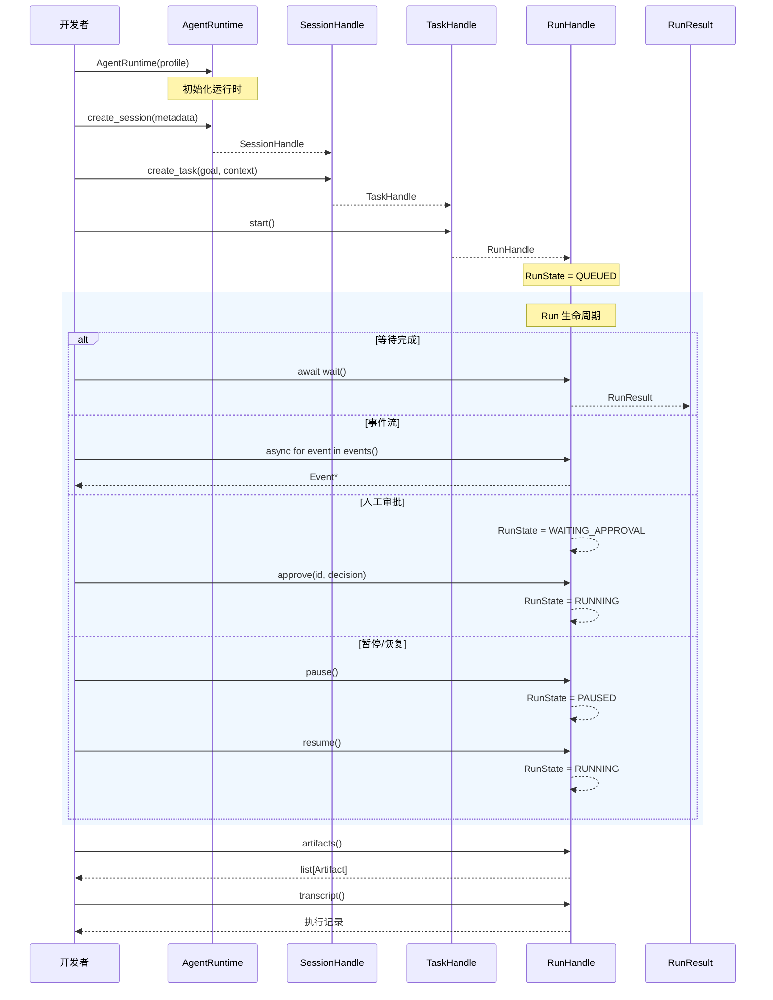
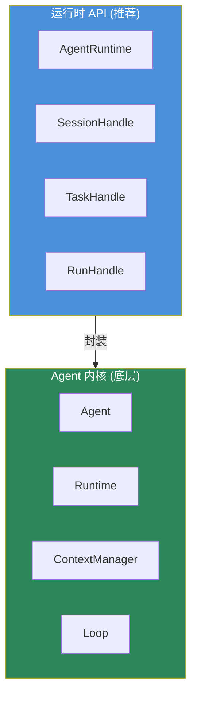

# Agent与Run

这一页描述运行时接入主线。如果你是从外部系统接入 Loom，最常用的就是这条链路。

## 运行时接入主线

```text
AgentRuntime → SessionHandle → TaskHandle → RunHandle
```



## 创建运行时

```python
from loom.api import AgentRuntime, AgentProfile

# 使用预设配置
profile = AgentProfile.from_preset("default")
runtime = AgentRuntime(profile=profile)
```

`AgentRuntime` 负责：

| 方法 | 说明 |
|---|---|
| `create_session(metadata?)` | 创建新会话 |
| `get_session(id)` | 按 ID 查询会话 |
| `list_sessions()` | 列举所有会话 |

## Session — 会话管理

```python
session = runtime.create_session(metadata={"tenant": "demo"})
```

`SessionHandle` 负责：

| 方法 | 说明 |
|---|---|
| `create_task(goal, context?)` | 创建任务 |
| `get_task(id)` | 按 ID 查询任务 |
| `list_tasks()` | 列举所有任务 |
| `close()` | 关闭会话 |

## Task — 任务管理

```python
task = session.create_task(
    goal="审查一个运行时设计",
    context={"repo": "loom-agent"},
)
```

`TaskHandle` 负责：

| 方法 | 说明 |
|---|---|
| `start()` | 启动新的 Run |
| `get_run(id)` | 按 ID 查询 Run |
| `list_runs()` | 列举所有 Run |

## Run — 执行控制

```python
run = task.start()
result = await run.wait()
```

`RunHandle` 提供的核心动作：

| 方法 | 说明 | 返回 |
|---|---|---|
| `wait()` | 等待执行完成 | `RunResult` |
| `events()` | 事件流 | `AsyncIterator[Event]` |
| `approve(id, decision)` | 审批决策 | `None` |
| `pause()` | 暂停执行 | `None` |
| `resume()` | 恢复执行 | `None` |
| `cancel()` | 取消执行 | `None` |
| `artifacts()` | 获取产物 | `list[Artifact]` |
| `transcript()` | 获取执行记录 | `dict` |

## 完整使用示例

```python
import asyncio
from loom.api import AgentRuntime, AgentProfile

async def main():
    # 1. 创建运行时
    profile = AgentProfile.from_preset("coding")
    runtime = AgentRuntime(profile=profile)

    # 2. 创建会话
    session = runtime.create_session(
        metadata={"project": "loom-agent", "env": "dev"}
    )

    # 3. 创建任务
    task = session.create_task(
        goal="分析项目结构并生成报告",
        context={"depth": "high"}
    )

    # 4. 启动执行
    run = task.start()

    # 5. 等待完成
    result = await run.wait()
    print(f"状态: {result.state}")
    print(f"摘要: {result.summary}")

    # 6. 获取产物
    artifacts = await run.artifacts()
    for artifact in artifacts:
        print(f"产物: {artifact.kind} - {artifact.title}")

asyncio.run(main())
```

## 直接使用 Agent 内核

如果你需要更底层的控制，可以直接使用 `loom/agent/` 内核：

```python
from loom import Agent
from loom.providers.openai import OpenAIProvider

provider = OpenAIProvider(api_key="demo-key")
agent = Agent(provider=provider)

result = await agent.run("分析一个简单目标")
print(result)
```

### Agent 内核组成

```python
class Agent:
    provider: LLMProvider      # LLM 提供方
    runtime: Runtime            # 运行时配置和约束检查
    context: ContextManager     # 上下文管理器
    loop: Loop                  # L* 执行闭环
    heartbeat: Heartbeat        # 心跳感知
    depth: int                  # 当前递归深度
```

## 两套接口的关系



| 场景 | 推荐使用 |
|---|---|
| 集成系统 | `loom/api` — `AgentRuntime` → `Session` → `Task` → `Run` |
| 修改框架内核 | `loom/agent` — `Agent` → `ContextManager` → `Loop` |
| 简单脚本 | `loom/agent` — `Agent(provider).run(goal)` |

## 当前实现判断

| 主题 | 状态 | 说明 |
|---|---|---|
| 会话、任务、运行对象 | `已实现` | `models.py` 中有完整 dataclass 定义 |
| 句柄化控制层 | `已实现` | `handles.py` 已提供主要方法 |
| `wait()` 驱动真实执行引擎 | `部分实现` | 当前有 TODO，模拟完成逻辑 |
| 生命周期动作接口 | `已实现` | `pause`/`resume`/`cancel`/`approve` 接口齐全 |

## 推荐阅读

- [运行时对象模型](../../03-架构说明/运行时对象模型.md) — 理解对象模型细节
- [事件审批与产物](事件审批与产物.md) — 理解事件与审批
- [快速开始](快速开始.md) — 最小可运行示例
