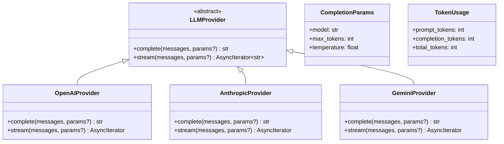
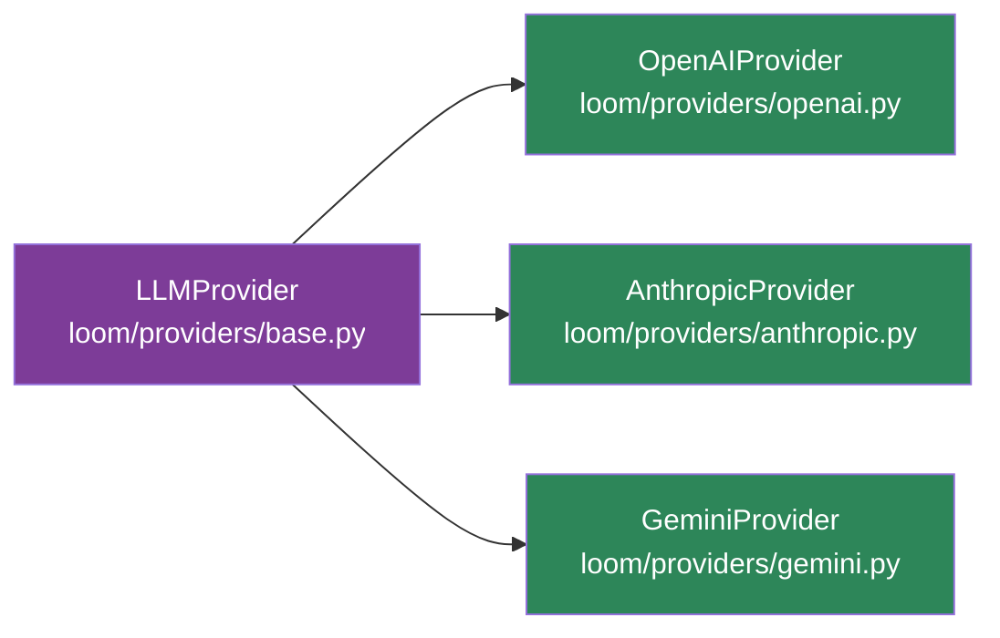

# Provider与模型接入

当前 Provider 接口比旧 wiki 里描述的更简洁，先理解 `LLMProvider` 抽象即可。

## Provider 抽象



`loom/providers/base.py` 定义了两个核心方法：

### LLMProvider

```python
from loom.providers.base import LLMProvider, CompletionParams

class LLMProvider:
    async def complete(messages: list, params: CompletionParams | None = None) -> str: ...
    async def stream(messages: list, params: CompletionParams | None = None) -> AsyncIterator[str]: ...
```

### CompletionParams

```python
@dataclass
class CompletionParams:
    model: str          # 模型名称
    max_tokens: int    # 最大 token 数
    temperature: float  # 温度参数
```

### TokenUsage
```python
@dataclass
class TokenUsage:
    prompt_tokens: int
    completion_tokens: int
    total_tokens: int
```

## 已有 Provider 实现



| Provider | 状态 | 说明 |
|---|---|---|
| `OpenAIProvider` | `部分实现` | Mock 风格实现，结构已定 |
| `AnthropicProvider` | `部分实现` | Mock 风格实现，结构已定 |
| `GeminiProvider` | `部分实现` | Mock 风格实现，结构已定 |

```python
from loom.providers.openai import OpenAIProvider

provider = OpenAIProvider(api_key="demo-key")
```

Provider 抽象已经定下来了，但具体接云端模型的细节还在继续演进。

## 自定义 Provider

如果要接自己的模型提供方，当前最直接的方式是实现 `LLMProvider`：

```python
from typing import AsyncIterator
from loom.providers.base import LLMProvider, CompletionParams

class MyProvider(LLMProvider):
    async def complete(self, messages: list, params: CompletionParams | None = None) -> str:
        # 实现你的模型调用逻辑
        return "ok"

    async def stream(self, messages: list, params: CompletionParams | None = None) -> AsyncIterator[str]:
        # 实现流式返回
        yield "ok"
```

## 与运行时配置的关系

新的 API 配置模型在 `loom/api/config.py`：

```python
@dataclass
class LLMConfig:
    model: str
    max_tokens: int
    temperature: float

@dataclass
class ToolConfig:
    builtin_tools: list[str]
    custom_tools: list[dict]

@dataclass
class PolicyConfig:
    max_depth: int
    require_approval: bool
    allowed_tools: list[str]

@dataclass
class AgentConfig:
    llm: LLMConfig
    tools: ToolConfig
    policy: PolicyConfig
    system_prompt: str
```

其中 `AgentConfig` 把模型、工具、策略和系统提示放在同一配置对象里。

## 当前实现判断

| 主题 | 状态 | 说明 |
|---|---|---|
| Provider 抽象接口 | `已实现` | `LLMProvider` 已定义 |
| Completion 参数模型 | `已实现` | `CompletionParams` 已定义 |
| TokenUsage 模型 | `已实现` | `TokenUsage` 已定义 |
| OpenAIProvider | `部分实现` | 当前是 mock 风格实现 |
| AnthropicProvider | `部分实现` | 当前是 mock 风格实现 |
| GeminiProvider | `部分实现` | 当前是 mock 风格实现 |
| 多 Provider 生态成熟度 | `部分实现` | 目录存在，但能力深度仍需继续补足 |

## 推荐阅读

- [快速开始](快速开始.md)
- [运行时对象模型](../../03-架构说明/运行时对象模型.md)
- [API总览](../../05-参考资料/API总览.md)
