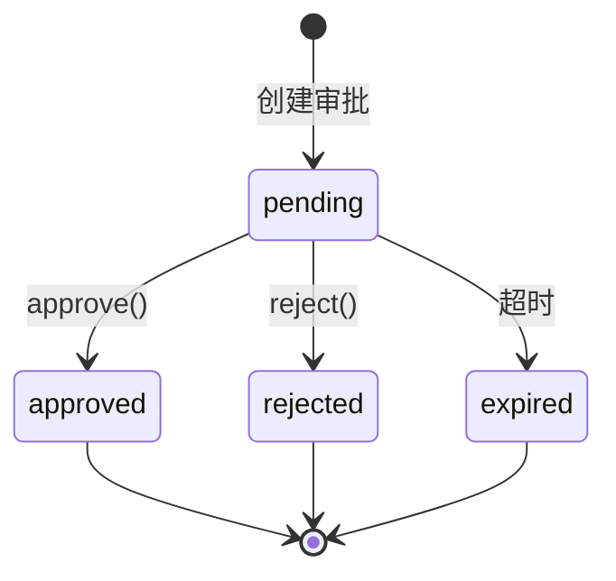
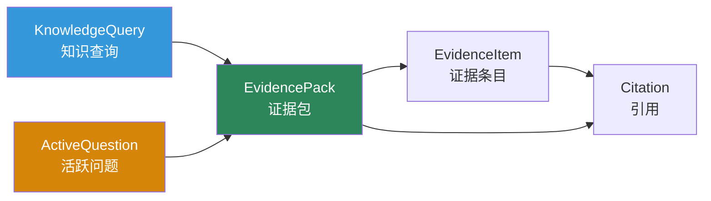

# 事件审批与产物

除了 `Run` 本身，新的运行时 API 还定义了三类关键附属对象：`Event`、`Approval`、`Artifact`。

## 对象关系

```mermaid
graph TB
    Run["Run"] --> Event["Event<br/>运行中产生的结构化事件"]
    Run --> Approval["Approval<br/>人在回路审批节点"]
    Run --> Artifact["Artifact<br/>执行产物"]
    Run --> EvidencePack["EvidencePack<br/>证据包"]

    Event --> EventBus["EventBus<br/>事件总线"]
    Event --> EventStream["EventStream<br/>事件流"]

    Approval --> |approve|" RunHandle
    Artifact --> ArtifactStore["ArtifactStore<br/>产物存储"]

    style Event fill:#3498DB,color:#fff
    style Approval fill:#D4850A,color:#fff
    style Artifact fill:#2D8659,color:#fff
    style EvidencePack fill:#7D3C98,color:#fff
```

## Event — 事件系统

### 事件对象

```python
@dataclass
class Event:
    event_id: str              # UUID 自动生成
    run_id: str                # 所属 Run
    type: str                  # 事件类型
    ts: datetime               # 时间戳
    visibility: str            # 可见性: user / system / audit
    correlation_id: str        # 关联 ID（用于追踪因果链）
    payload: dict[str, Any]    # 事件载荷
```

### 事件生命周期

```mermaid
sequenceDiagram
    participant Loop as L* 闭环
    participant Bus as EventBus
    participant Stream as EventStream
    participant Dev as 开发者

    rect rgb(240, 248, 255)
        Note over Loop,Dev: 事件产生与消费
        Loop->>Bus: publish(event)
        Bus->>Stream: 路由到对应 run_id
        Stream-->>Dev: async for event in stream
        Dev->>Dev: 处理事件
    end
```

### EventBus API

```python
from loom.api import EventBus

bus = EventBus()

# 订阅特定事件类型
def handler(event):
    print(f"[{event.type}] {event.payload}")

bus.subscribe("tool_call", handler)

# 订阅全部事件
bus.subscribe_all(handler)

# 取消订阅
bus.unsubscribe("tool_call", handler)

# 发布事件
bus.publish(Event(
    run_id="run-123",
    type="tool_call",
    payload={"tool": "read_file", "args": {...}}
))
```

### EventStream API

```python
from loom.api import EventStream

stream = EventStream(event_bus=bus, run_id="run-123")

# 流式消费
async for event in stream:
    print(f"[{event.type}] {event.payload}")
```

### 事件可见性

| visibility | 说明 | 使用场景 |
|---|---|---|
| `user` | 用户可见 | 显示给终端用户 |
| `system` | 系统可见 | 内部系统事件，不对外暴露 |
| `audit` | 审计可见 | 仅用于审计日志 |

## Approval — 审批系统
### 宣批对象

```python
@dataclass
class Approval:
    approval_id: str       # UUID
    run_id: str             # 所属 Run
    kind: str               # 类型
    status: str             # 状态: pending / approved / rejected / expired
    question: str           # 审批问题
    context: dict           # 审批上下文
    timeout_seconds: int    # 超时时间（默认 600s）
```

### 审批类型

| kind | 说明 |
|---|---|
| `tool_execution` | 危险工具执行前需要确认 |
| `policy_override` | 策略变更需要人工确认 |
| `external_publish` | 对外发布前需要审批 |

### 审批流程



```python
# 提交审批决策
await run.approve(approval_id, "approve")  # 通过
await run.approve(approval_id, "reject")  # 拒绝
```

## Artifact — 产物系统
### 产物对象

```python
@dataclass
class Artifact:
    artifact_id: str      # UUID
    run_id: str            # 所属 Run
    kind: str              # 产物类型
    title: str             # 标题
    uri: str               # 存储位置
    metadata: dict         # 附加元数据
```

### 产物类型

| kind | 说明 |
|---|---|
| `patch` | 代码补丁 |
| `report` | 分析报告 |
| `json` | 结构化数据 |
| `text` | 文本内容 |
| `evidence_pack` | 证据包 |

### ArtifactStore API

```python
from loom.api import ArtifactStore

store = ArtifactStore()

store.store(artifact)             # 存储
artifact = store.get(artifact_id) # 获取
artifacts = store.list_by_run(run_id) # 按 Run 查询
store.delete(artifact_id)          # 删除
```

## 证据与知识检索

`models.py` 还定义了知识检索相关的扩展对象：



| 对象 | 说明 |
|---|---|
| `EvidencePack` | 证据包 — RAG as Evidence, not Memory |
| `EvidenceItem` | 单条证据，含引用和相关性评分 |
| `Citation` | 知识源引用 |
| `KnowledgeQuery` | 知识搜索查询 |
| `ActiveQuestion` | 正在解析中的活跃问题 |
| `ResumePoint` | Run 恢复检查点 |

## 当前实现判断

| 主题 | 状态 | 说明 |
|---|---|---|
| 事件对象模型 | `已实现` | `Event` dataclass 已明确定义 |
| 事件总线与事件流 | `已实现` | `EventBus`、`EventStream` 已存在 |
| 审批对象与审批接口 | `已实现` | `Approval`、`RunHandle.approve()` 已存在 |
| 产物对象与存储 | `已实现` | `Artifact`、`ArtifactStore` 已存在 |
| 证据包与知识检索 | `已实现` | `EvidencePack`、`EvidenceItem`、`Citation` 等已定义 |
| 事件与真实执行引擎的深度整合 | `部分实现` | API 已就位，执行侧仍在继续接入 |

## 推荐阅读

- [Agent与Run](Agent与Run.md) — 运行时接入主线
- [运行时对象模型](../../03-架构说明/运行时对象模型.md) — 对象模型详解
- [技能插件与知识源](技能插件与知识源.md) — 知识源注册
