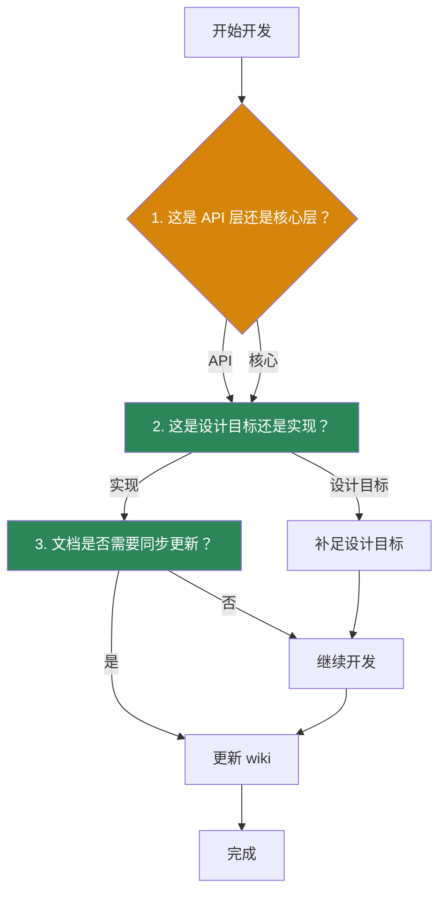

# 开发者工作流
Loom 不是那种"读完一个 README 就能完全吃透"的项目。当前更高效的方式是先按 API 对象，再按模块维度进入。

## 娡块地图

```mermaid
graph TB
    subgraph 判断["1. 判断你改的是哪一层？"]
        Q_API{"API 层？<br/>loom/api/"}
        Q_Core["核心层？<br/>loom/agent/"}
        Q_Context["上下文？<br/>loom/context/"}
        Q_Tools["工具？<br/>loom/tools/"}
        Q_Orch["协作？<br/>loom/orchestration/"}
        Q_Safety["安全？<br/>loom/safety/"}
        Q_Eco["生态？<br/>loom/ecosystem/"}
    end

    Q_API --> Read["先看对象模型"]
    Q_Core --> Read["再看模块实现"]
    Q_Context --> Read["再看压缩策略"]

```

## 娡块索引

| 需求类型 | 优先查看 |
|---|---|
| 会话、任务、运行控制 | `loom/api/` |
| Agent 内核、约束、主循环 | `loom/agent/`、`loom/execution/` |
| 上下文管理 | `loom/context/` |
| 工具能力 | `loom/tools/` |
| 子 Agent / 协作 | `loom/orchestration/`、`loom/cluster/` |
| 权限与约束 | `loom/safety/` |
| 生态接入 | `loom/ecosystem/` |

## 寏次开发先判断三件事



1. **先判断你改的是 API 层还是核心层**
2. **再判断"目标是补实现，还是修正表达"**
3. **最后确认文档是否需要同步更新**

## 测试建议

| 场景 | 优先查看 |
|---|---|
| 接口变更 | `tests/api/` |
| 工具/上下文/运行时变更 | `tests/core/` |
| 跨模块链路变更 | `tests/integration/` |

## 文档同步建议

只要出现下面三种情况，就应该同步更新 wiki：

- **模块边界变了** — 新增或重命名了目录
- **能力状态变化** — 从 `部分实现` 単级到了 `已实现`
- **对外说法不再准确** — 文档描述与代码事实不符

## 推荐阅读顺序

1. [运行时对象模型](../../03-架构说明/运行时对象模型.md)
2. [对应架构页](../../03-架构说明/README.md)
3. [代码能力矩阵](../../05-参考资料/代码能力矩阵.md)
