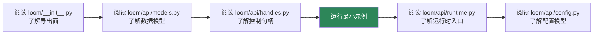
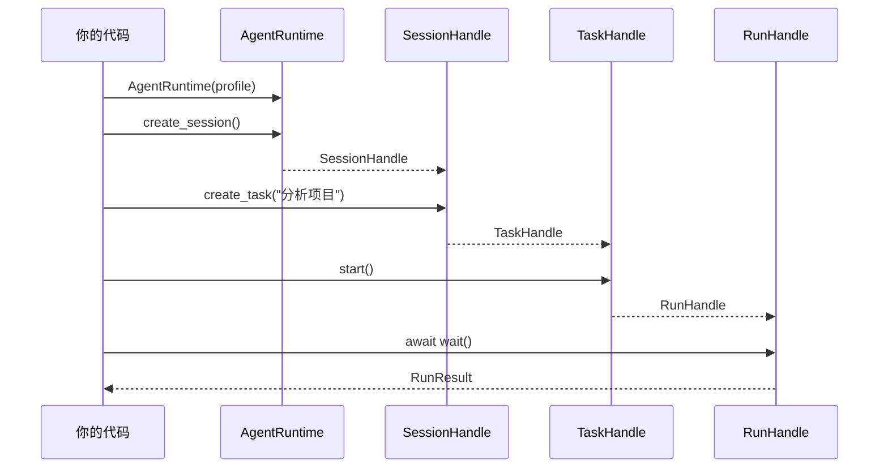
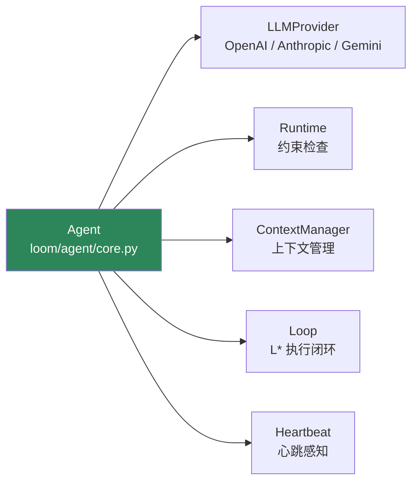

# 快速开始

这一页只保留能直接指导开发者基于新 API 落地的内容。

## 安装

```bash
pip install -e .
```

## 学习路径



## 新 API 最先该看的入口

| 序号 | 文件 | 了解什么 |
|---|---|---|
| 1 | `loom/__init__.py` | 对外导出的完整 API 面（API 层 + Core 层） |
| 2 | `loom/api/runtime.py` | `AgentRuntime` — 运行时总入口 |
| 3 | `loom/api/handles.py` | `SessionHandle / TaskHandle / RunHandle` — 控制句柄 |
| 4 | `loom/api/models.py` | 数据模型 — 13 个 dataclass |
| 5 | `loom/api/config.py` | `AgentConfig / LLMConfig / ToolConfig / PolicyConfig` |

## 最小运行时示例



```python
import asyncio
from loom.api import AgentRuntime, AgentProfile

async def main():
    # 1. 创建运行时
    profile = AgentProfile.from_preset("default")
    runtime = AgentRuntime(profile=profile)

    # 2. 创建会话
    session = runtime.create_session(metadata={"project": "demo"})

    # 3. 创建任务
    task = session.create_task("分析当前项目结构")

    # 4. 启动运行
    run = task.start()

    # 5. 等待结果
    result = await run.wait()
    print(result.state)    # RunState.COMPLETED
    print(result.summary)   # "Completed: 分析当前项目结构"

asyncio.run(main())
```

## 直接使用 Agent 内核

如果你需要的是更底层的 Agent 执行骨架，可以直接使用 `loom/agent/`：



```python
from loom import Agent
from loom.providers.openai import OpenAIProvider

provider = OpenAIProvider(api_key="demo-key")
agent = Agent(provider=provider)

result = await agent.run("分析一个简单目标")
print(result)
```

### Agent 内核组件

| 组件 | 类 | 说明 |
|---|---|---|
| Provider | `LLMProvider` | 模型调用（complete / stream） |
| Runtime | `Runtime` + `RuntimeConfig` | 运行时配置和约束检查 |
| Context | `ContextManager` | 上下文管理（ρ 计算、压缩、renew） |
| Loop | `Loop` | L* 主闭环（`StateMachine` + `DecisionEngine` + `Observer`） |
| Heartbeat | `Heartbeat` | 心跳感知层 |

## 事件流使用

```python
# 订阅事件
async for event in run.events():
    print(f"[{event.type}] {event.payload}")

# 获取产物
artifacts = await run.artifacts()
for a in artifacts:
    print(f"  {a.kind}: {a.title}")
```

## 审批流程

```python
# 启动运行（可能触发审批）
run = task.start()

# 如果进入审批等待
if run.state == RunState.WAITING_APPROVAL:
    # 查看审批信息
    approval = run.run.pending_approval_id

    # 做出决策
    await run.approve(approval, "approve")  # 或 "reject"

# 继续等待
result = await run.wait()
```

## 上手建议

### 如果你先接运行时

1. 先掌握 `AgentRuntime → Session → Task → Run`
2. 再看 `Event`、`Approval`、`Artifact` 这些附属对象
3. 最后看配置模型和知识源

### 如果你先接内核

1. 先从 `Agent`、`RuntimeConfig`、`ContextManager`、`Loop` 四个支点理解系统
2. 再进入协作、安全、生态等高阶模块

## 现在就能依赖的事实

| 主题 | 结论 |
|---|---|
| 有统一包入口 | 是 — `loom/__init__.py` 导出完整 API |
| 有新的运行时 API 对象层 | 是 — `loom/api/` 包含 14 个核心类 |
| 有句柄式控制接口 | 是 — `SessionHandle / TaskHandle / RunHandle` |
| 所有执行链路都已完整打通 | 否 — `RunHandle.wait()` 内部仍有 TODO |

## 推荐阅读顺序

1. [运行时对象模型](../../03-架构说明/运行时对象模型.md)
2. [Agent与Run](Agent与Run.md)
3. [事件审批与产物](事件审批与产物.md)
4. [Provider与模型接入](Provider与模型接入.md)
5. [总体架构](../../03-架构说明/总体架构.md)
6. [代码能力矩阵](../../05-参考资料/代码能力矩阵.md)
