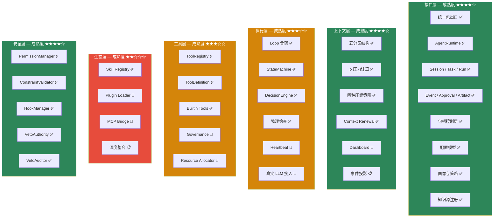
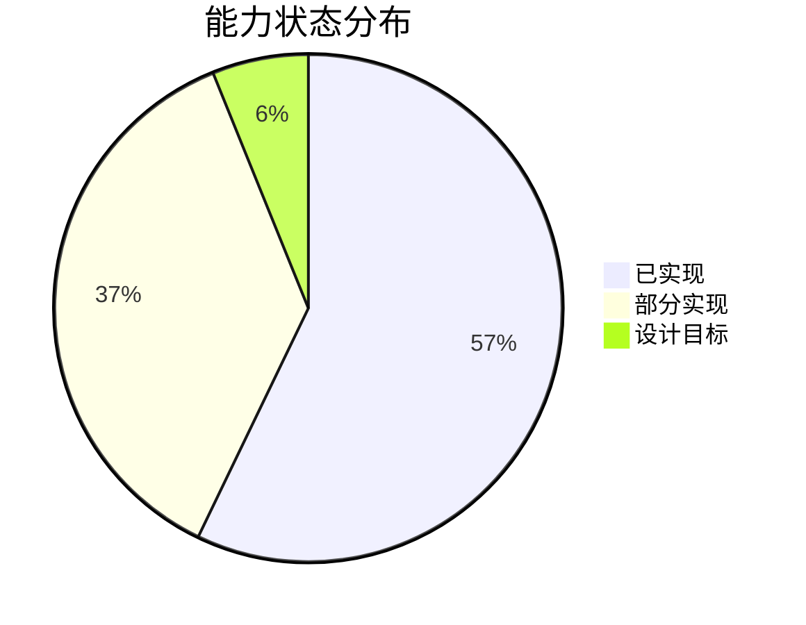

# 代码能力矩阵

这张表的目标是统一预期：哪些能力已经落地，哪些只是方向。

## 状态定义

| 标记 | 含义 |
|---|---|
| `已实现` | 代码中已有清晰模块和可调用结构，可实际使用 |
| `部分实现` | 有代码骨架或局部能力，但未达到完整设计目标 |
| `设计目标` | 当前仓库没有完整落地，只在设计材料中被定义 |

## 核心矩阵

> ✅ = 已实现 | 🔧 = 部分实现 | 📋 = 设计目标

## 详细矩阵

| 维度 | 能力 | 状态 | 代码依据 | 关键类/文件 |
|---|---|---|---|---|
| **顶层入口** | 统一包出口 | `已实现` | `loom/__init__.py` | 导出 API 层 + Core 层共 40+ 符号 |
| **Runtime API** | `AgentRuntime` | `已实现` | `loom/api/runtime.py` | `create_session` / `get_session` / `list_sessions` |
| **运行时对象** | Session / Task / Run | `已实现` | `loom/api/models.py` | 13 个 dataclass |
| **运行时句柄** | Session/Task/Run Handle | `已实现` | `loom/api/handles.py` | 生命周期控制（wait/pause/resume/cancel） |
| **配置模型** | AgentConfig / LLMConfig / ToolConfig / PolicyConfig | `已实现` | `loom/api/config.py` | 四组配置 dataclass |
| **画像与策略** | AgentProfile / PolicySet | `已实现` | `loom/api/profile.py`、`loom/api/policy.py` | 预设 + 自定义配置 |
| **事件流** | EventBus / EventStream | `已实现` | `loom/api/events.py` | 订阅/发布/流式消费 |
| **产物库** | ArtifactStore | `已实现` | `loom/api/artifacts.py` | store / get / list / delete |
| **知识源** | KnowledgeRegistry / KnowledgeSource | `已实现` | `loom/api/knowledge.py` | 注册 + TrustTier 信任分级 |
| **证据系统** | EvidencePack / EvidenceItem / Citation | `已实现` | `loom/api/models.py` | RAG as Evidence |
| **上下文控制** | ContextManager | `已实现` | `loom/context/manager.py` | ρ 计算、压缩触发、renew 触发 |
| **五分区** | ContextPartitions | `已实现` | `loom/context/partitions.py` | system/working/memory/skill/history |
| **压缩策略** | ContextCompressor | `已实现` | `loom/context/compression.py` | snip / micro / collapse / auto |
| **续写** | ContextRenewer | `已实现` | `loom/context/renewal.py` | goal 随 renew 传递 |
| **仪表盘** | DashboardManager | `部分实现` | `loom/context/dashboard.py` | 基础 Dashboard 存在 |
| **主循环** | Loop | `已实现` | `loom/execution/loop.py` | step() 含物理约束检查 |
| **状态机** | StateMachine | `已实现` | `loom/execution/state_machine.py` | REASON → ACT → OBSERVE → DELTA |
| **决策引擎** | DecisionEngine | `已实现` | `loom/execution/decision.py` | ρ 和 depth 硬约束判断 |
| **心跳机制** | Heartbeat | `部分实现` | `loom/execution/heartbeat.py` | 模块存在，与设计目标有差距 |
| **Agent 内核** | Agent | `已实现` | `loom/agent/core.py` | 组合 Provider + Context + Loop |
| **工具注册** | ToolRegistry | `已实现` | `loom/tools/registry.py` | register / get / list / unregister |
| **工具执行** | ToolExecutor | `已实现` | `loom/tools/executor.py` | 统一执行入口 |
| **内置工具** | BUILTIN_TOOLS | `已实现` | `loom/tools/builtin/` | 文件/Shell/搜索等操作 |
| **工具治理** | Governance | `部分实现` | `loom/tools/governance.py` | 结构已存在 |
| **资源分配** | ResourceAllocator | `部分实现` | `loom/tools/resource_allocator.py` | 结构已存在 |
| **多 Agent** | SubAgentManager | `部分实现` | `loom/orchestration/` | 基础子 Agent 管理 |
| **Cluster** | fork / shared_memory / dmax | `部分实现` | `loom/cluster/` | 基础集群能力 |
| **Skill 系统** | SkillRegistry / SkillLoader | `部分实现` | `loom/ecosystem/skill.py` | Markdown + frontmatter 解析 |
| **Plugin 系统** | PluginLoader / PluginManifest | `部分实现` | `loom/ecosystem/plugin.py` | plugin.json 读取 |
| **MCP 桥接** | MCPBridge / MCPServerConfig | `部分实现` | `loom/ecosystem/mcp.py` | 注册/连接/执行骨架 |
| **权限管理** | PermissionManager | `已实现` | `loom/safety/permissions.py` | 权限检查 |
| **约束校验** | ConstraintValidator | `已实现` | `loom/safety/constraints.py` | 约束校验 |
| **Hook 判定** | HookManager | `已实现` | `loom/safety/hooks.py` | Hook 注册和触发 |
| **Veto 权** | VetoAuthority | `已实现` | `loom/safety/veto.py` | 一票否决 |
| **Veto 审计** | VetoAuditor | `已实现` | `loom/safety/veto_auditor.py` | 审计日志 |
| **Provider 抽象** | LLMProvider | `已实现` | `loom/providers/base.py` | complete / stream 抽象接口 |
| **OpenAI** | OpenAIProvider | `部分实现` | `loom/providers/openai.py` | Mock 风格实现 |
| **Anthropic** | AnthropicProvider | `部分实现` | `loom/providers/anthropic.py` | Mock 风格实现 |
| **Gemini** | GeminiProvider | `部分实现` | `loom/providers/gemini.py` | Mock 风格实现 |
| **演化系统** | EvolutionEngine | `部分实现` | `loom/evolution/engine.py` | 基础结构 |

## 统计

## 读表方式

这张表不是在否定设计价值，而是在约束表达精度：

- **可以对外讲"有这个方向"**，但不要把 `部分实现` 说成"已经完整可商用"
- **可以对内用 hernss 继续拉高目标**，但 wiki 必须按代码事实写
- **每次代码变更后**，应该同步更新这张表的状态

## 结论

Loom 现在最准确的状态是：

> 一个以 `loom/api` 为入口的运行时对象模型已经建立，核心模块具备清晰骨架，更深的执行整合仍在继续收敛。
