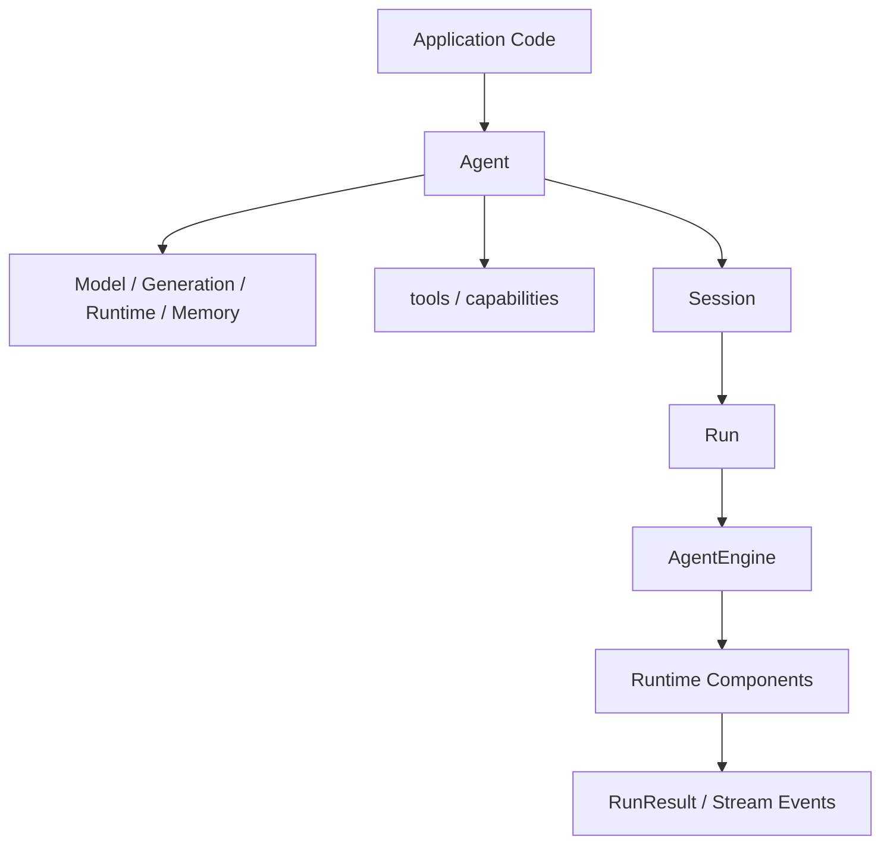

# Public API System

This page defines the active Loom public API system. It is the source of truth
for examples, docs, and future API changes.

## One Public Path

Application code should start from `Agent(...)`:

```text
Agent + Model + Runtime + capability entries
    -> Session / Run
    -> RuntimeTask / RuntimeSignal
    -> RunContext / SessionConfig
```

The API is designed around one rule: users declare intent at the SDK layer,
and Loom compiles that intent into runtime components.



## Import Rules

Most user code imports from `loom`:

```python
from loom import Agent, Files, MCP, Model, Runtime, RunContext, SessionConfig, Shell, Skill, Web, tool
```

Use `loom.config` for advanced configuration objects. Use `loom.runtime` only
when testing or extending runtime mechanism contracts.

## Layer Model

| Layer | Owns | Typical objects |
|---|---|---|
| Public SDK | User-facing assembly and execution | `Agent`, `Session`, `Run`, `RuntimeTask`, `RuntimeSignal` |
| Configuration | Declarative setup | `Model`, `Generation`, `Runtime`, `Memory`, `Toolset` |
| Assembly | Normalization and compilation | provider resolution, capability compilation, engine building |
| Runtime Kernel | Execution mechanics | context, loop, tools, memory, signals, policies |
| Provider Layer | Model IO | `CompletionRequest`, `CompletionResponse`, provider adapters |

The public SDK does not expose separate product-specific gateway, cron,
dashboard, or webhook APIs. Those producers normalize into `RuntimeSignal`.

## Core Objects

### `Agent`

`Agent` is the top-level SDK object. It owns user declarations and creates
sessions and runs.

```python
agent = Agent(
    model=Model.openai("gpt-5.1"),
    instructions="You are a reliable technical assistant.",
    runtime=Runtime.sdk(),
    capabilities=[Files(read_only=True), Web.enabled()],
)
```

Constructor domains:

| Domain | Purpose |
|---|---|
| `model` | Select provider-backed model |
| `instructions` | Stable behavior instructions |
| `tools` | Register exact Python tools |
| `capabilities` | Grant classes of abilities such as files, web, shell, and MCP |
| `generation` | Control provider generation parameters |
| `runtime` | Compose runtime policy behavior |
| `memory` / `knowledge` | Attach state and retrieval sources |
| `session_store` | Persist sessions and runs |

### `Model` and Providers

`Model` is the user-side model declaration. Runtime provider calls use the
request-native provider contract:

```text
CompletionRequest -> CompletionResponse
```

Provider implementations should implement request-native methods rather than
message-list convenience methods.

### `Runtime`

`Runtime` selects or composes execution policy behavior:

```python
agent = Agent(
    model=Model.openai("gpt-5.1"),
    runtime=Runtime.long_running(criteria=["tests pass", "docs updated"]),
)
```

Runtime policy domains include context, continuity, harness, quality,
delegation, governance, feedback, attention, and session restore.

### User Capability Entries

Use direct domain names for common ability surfaces:

```python
capabilities=[
    Files(read_only=True),
    Web.enabled(),
    Shell.approval_required(),
    MCP.server("github"),
]
```

These entries normalize into `CapabilitySpec`, compile into executable tool
specs when available, and then enter the same governed tool path as explicit
tools. `Capability` remains available for advanced architecture-level custom
declarations.

### `tools`

Use `tools` when you already have exact Python callables:

```python
@tool(description="Look up a customer by account id", read_only=True)
def lookup_customer(account_id: str) -> str:
    return "..."


agent = Agent(model=Model.openai("gpt-5.1"), tools=[lookup_customer])
```

### `Session` and `Run`

`Session` is a stateful interaction boundary. `Run` is one concrete execution
inside a session.

```python
session = agent.session(SessionConfig(id="support"))
result = await session.run("Summarize the current escalation.")
```

Use `agent.run(...)` for simple one-off flows. Use `agent.session(...)` when
state, transcript, signals, or persistence matter.

### `RuntimeTask`

Use `RuntimeTask` when a run needs structured inputs or acceptance criteria:

```python
task = RuntimeTask(
    goal="Review this pull request",
    input={"files": ["loom/runtime/engine.py"]},
    criteria=["find correctness risks", "avoid style-only feedback"],
)

result = await agent.run(task)
```

### `RunContext`

`RunContext` carries run-scoped structured context:

```python
context = RunContext(
    inputs={"tenant": "acme", "trace_id": "req-123"},
    knowledge=knowledge_bundle,
)

result = await agent.run("Answer using the provided context.", context=context)
```

Prefer `RunContext.inputs` for business context instead of hiding structured
data inside prompts.

### `RuntimeSignal` and `SignalAdapter`

External events normalize into `RuntimeSignal`:

```python
adapter = SignalAdapter(
    source="gateway:slack",
    type="message",
    summary=lambda event: event["text"],
)

await session.receive({"text": "Deployment failed"}, adapter=adapter)
```

Signal flow:

```text
gateway / cron / heartbeat / webhook / app callback
    -> SignalAdapter
    -> RuntimeSignal
    -> AttentionPolicy
    -> session dashboard
    -> optional run
```

## Tools vs Capabilities

| Input | User intent | Runtime result |
|---|---|---|
| `tools=[fn]` | Add one exact Python callable | `ToolSpec -> ToolRegistry` |
| `Files(read_only=True)` | Grant file access | built-in file toolset |
| `Web.enabled()` | Grant web research | built-in web toolset |
| `Shell.approval_required()` | Grant shell execution | shell toolset with governance |
| `MCP.server("github")` | Attach external MCP tools | MCP activation and scoped tools |
| `Skill.inline("review", ...)` | Add task behavior and optional tools | skill context and optional tools |

Both paths enter the same governed capability path:

```text
Tool request
    -> hooks
    -> permission checks
    -> veto checks
    -> governance policy
    -> tool executor
    -> observation
```

## Runtime Component Map

The public API is backed by internal runtime components:

| Runtime component | Responsibility |
|---|---|
| `ContextRuntime` | initialize context, inject instructions, render messages, compress and renew |
| `MemoryRuntime` | load, inject, and save session or semantic memory |
| `SignalRuntime` | queue signals, evaluate attention, drain signal dashboard |
| `ToolRuntime` | parse tool calls, apply governance, execute tools, append observations |
| `ProviderRuntime` | build completion requests and call providers |
| `LoopRunner` | run the L* reason-act-observe loop |
| `HarnessRunner` | execute harness strategies for long tasks |
| `RunLifecycle` | emit run events, artifacts, and completion state |

These are internal mechanism boundaries. Public application code should not
depend on their private methods.

## Streaming

User-facing streaming stays on `Agent` and `Session`:

```python
async for event in agent.stream("Investigate this issue."):
    print(event.type, event.payload)
```

Provider streaming remains request-native internally. Application code should
not call provider methods directly.

## Governance Boundary

Governance applies to explicit tools and compiled capabilities:

```text
tools + capabilities
    -> CapabilityCompiler
    -> ToolSpec list
    -> ToolRegistry
    -> GovernancePolicy
    -> execution
```

This means read-only rules, destructive checks, rate limits, approvals, hooks,
and veto decisions are enforced at one runtime boundary.

## Public API Stability Rules

When changing the SDK, follow these rules:

1. Keep examples centered on `Agent(...)`.
2. Add common user abilities as direct domain declarations that normalize into
   `CapabilitySpec`; use `tools` when the user owns an exact Python callable.
3. Normalize external producers into `RuntimeSignal`.
4. Keep provider implementations request-native.
5. Keep runtime mechanics behind `Runtime` policies and internal components.
6. Add public API freeze tests when removing or adding public names.
7. Avoid adding aliases that create a second way to express the same concept.

## Quick Decision Guide

| Need | Use |
|---|---|
| One simple task | `await agent.run("...")` |
| Stateful workflow | `session = agent.session(SessionConfig(...))` |
| Structured task | `RuntimeTask` |
| Per-run structured inputs | `RunContext` |
| External event | `RuntimeSignal` or `SignalAdapter` |
| Exact app function | `tools=[...]` |
| Built-in or external ability class | `capabilities=[Files/Web/Shell/MCP]` or `skills=[Skill...]` |
| Provider selection | `Model.*(...)` |
| Execution policy | `Runtime.*(...)` |
