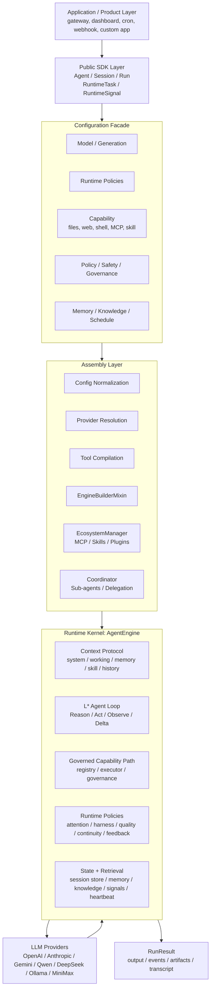
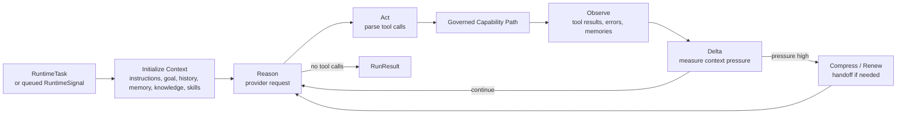
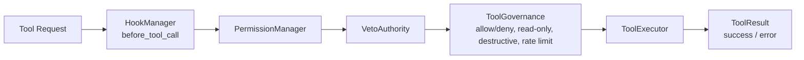

# Loom Architecture

Version: 0.8.2 | Updated: 2026-04-30

## Overview

Loom exposes a Python Agent SDK centered on `Agent`, while keeping the runtime split across context, memory, tools, safety, heartbeat, orchestration, providers, and ecosystem adapters.

The architectural rule is:

- SDK kernel first
- product adapters outside the kernel
- runtime mechanisms as composable policies

Application developers should reason about Loom as:

```text
Agent + Model + Runtime
    + capabilities=[Files/Web/Shell/MCP]
    + skills=[Skill]
    -> Run / Session
    -> RuntimeTask / RuntimeSignal
```

Gateway, cron, heartbeat, webhook, and app-specific inputs are not separate kernel concepts. They normalize into `RuntimeSignal`.

## Architecture Map



The map has three strict boundaries:

- Public SDK Layer: stable user-facing contracts.
- Assembly Layer: converts user configuration into executable runtime pieces.
- Runtime Kernel: owns context, loop execution, governed capabilities, policies, and state.

## Conceptual Model

```text
A = <C, M, L*, H_b, S, Psi, P>
```

| Symbol | Meaning | Module |
|---|---|---|
| `C` | Context protocol, partitions, compaction, renewal | `loom/context/`, `loom/runtime/context.py` |
| `M` | Memory and session restore | `loom/memory/`, `loom/runtime/session_restore.py` |
| `L*` | Execution loop | `loom/runtime/engine.py`, `loom/runtime/loop.py` |
| `H_b` | Heartbeat sensing that emits runtime signals | `loom/runtime/heartbeat.py`, `loom/runtime/signals.py` |
| `S` | Skills, tools, MCP, capabilities | `loom/tools/`, `loom/ecosystem/`, `loom/runtime/capability.py` |
| `Psi` | Safety boundaries and veto | `loom/safety/`, `loom/runtime/governance.py` |
| `P` | Runtime policies: attention, harness, quality, delegation, feedback | `loom/runtime/` |

## Public Layer Map

```text
loom/__init__.py
    ├── Agent
    ├── Model / Generation / Runtime / Memory
    ├── Capability
    ├── RuntimeTask / RuntimeSignal / SignalAdapter
    └── SessionConfig / RunContext

loom/config.py
    └── advanced configuration facade

loom/runtime/
    ├── sessions, runs, events, stores
    ├── signals and attention
    ├── context / continuity
    ├── harness / quality / delegation
    ├── capability / governance
    ├── feedback / skill injection / session restore
    └── engine and loop internals
```

## Runtime Flow

```text
Agent(...)
    -> compiles tools + capabilities
    -> builds Runtime policies
    -> Session
        -> Run
            -> AgentEngine
                -> ContextPolicy
                -> Provider request
                -> Tool governance
                -> Tool execution
                -> Feedback events
                -> SessionStore persistence
```

External input flow:

```text
gateway / cron / heartbeat / webhook / app callback
    -> SignalAdapter
    -> RuntimeSignal
    -> AttentionPolicy
    -> C_working dashboard
    -> optional Agent run
```

## Runtime Loop



The `L*` loop is implemented by `AgentEngine`: it renders context, calls the provider, routes tool calls through governance, appends observations, and renews or compresses context when pressure rises.

## Governed Capability Path



Both explicit Python `tools` and higher-level `capabilities` compile into this path. User-facing entries such as `Files`, `Web`, `Shell`, `MCP`, and `Skill` normalize into runtime capability specs; `ToolSpec` and `Toolset` are the executable tool descriptions registered into the runtime.

Practical API rule:

- `tools=`: register exact callable tools you already own.
- `capabilities=`: declare classes of abilities with `Files`, `Web`, `Shell`, and `MCP`; use `skills=` for `Skill` declarations.

## Public Contracts

### Agent Assembly

`Agent` is the primary public assembly and execution object.

Key constructor domains:

- `model`: provider-backed model reference
- `instructions`: stable behavior instructions
- `tools`: explicit function tools
- `capabilities`: files, web, shell, MCP, skills, custom sources
- `generation`: generation controls
- `runtime`: runtime policy profile or custom composition
- `session_store`: optional durable session persistence

### Runtime Objects

The supported public execution path is:

```text
Agent -> Session -> Run
```

`RunContext` is the structured runtime input object. It carries:

- `inputs`: arbitrary structured run inputs
- `knowledge`: one aggregated `KnowledgeBundle`
- `extensions`: future-compatible extra fields

`RuntimeTask` is the structured task object. It carries:

- `goal`
- `input`
- `criteria`
- metadata/extensions

`RuntimeSignal` is the normalized external input object. It carries:

- `source`
- `type`
- `urgency`
- `summary`
- `payload`
- dedupe and metadata fields

## Runtime Policies

| Policy | Responsibility |
|---|---|
| `AttentionPolicy` | Decide whether a signal is observed, queued, or interrupts |
| `ContextPolicy` | Render, measure, compact, renew, and snapshot context |
| `ContinuityPolicy` | Preserve task continuity after compaction/reset |
| `Harness` | Select single-run, generator/evaluator, or other long-task strategy |
| `QualityGate` | Own acceptance criteria and PASS/FAIL parsing |
| `DelegationPolicy` | Bound subtask and sub-agent dispatch |
| `GovernancePolicy` | Decide tool permission, veto, rate limit, read-only/destructive checks |
| `FeedbackPolicy` | Normalize runtime outcomes for dashboards or evolution |
| `SessionRestorePolicy` | Decide what persisted state returns to context |
| `SkillInjection` | Decide which skill content enters runtime context |

## Module Reference

### `loom/agent.py`

- exposes `Agent` and `tool()`
- normalizes public constructor inputs
- compiles capabilities and tools into the engine path
- adapts runtime policies into engine inputs

### `loom/config.py`

- public config facade
- `Model`, `Generation`, `Runtime`, `Memory`
- advanced configuration objects such as `Model`, `Generation`, `RuntimeConfig`, and `AgentConfig`

### `loom/runtime/`

- `session.py`: `Session`, `Run`, `RunContext`, `RunResult`
- `signals.py`: `RuntimeSignal`, `SignalAdapter`
- `capability.py`: `Capability`, registry, runtime provider bridge
- `governance.py`: runtime governance policy
- `context.py`: runtime context protocol
- `continuity.py`: handoff and continuation policy
- `quality.py`: quality contracts and PASS/FAIL evaluation
- `delegation.py`: delegation boundary
- `feedback.py`: runtime feedback events
- `engine.py`: provider orchestration and tool loop

### `loom/tools/`

Registry, execution, built-in tools, and low-level governance integration.

### `loom/ecosystem/`

Skills, plugins, MCP bridge, and activation helpers.

### `loom/providers/`

Request-native provider adapters for Anthropic, OpenAI, Gemini, Qwen, Ollama, and compatible providers.
