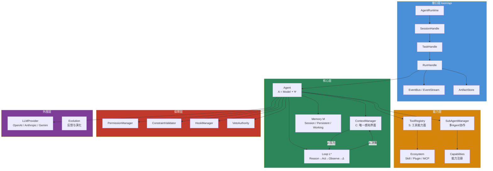
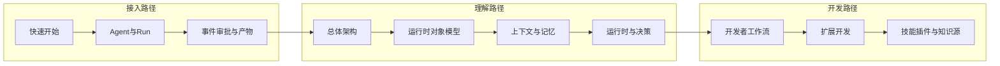

# Loom Agent Framework

> 面向复杂任务、长链路执行和可控协作场景的 Agent Runtime Framework。
>
> Loom 不是 prompt 包装器，也不是把工具简单串起来的 workflow 壳。它要提供的是一套可以持续运行、可观察、可扩展、可约束的 Agent 运行时。

## 系统总览



## 公理系统

Loom 基于六元素公理定义 Agent：

```text
A = ⟨C, M, L*, H_b, S, Ψ⟩
```

| 元素 | 含义 | 代码映射 |
|---|---|---|
| `C` | Context — 唯一感知界面 | `loom/context/` |
| `M` | Memory — 多层记忆系统 | `loom/memory/` |
| `L*` | Loop — 执行闭环 | `loom/execution/loop.py` |
| `H_b` | Heartbeat — 并行感知层 | `loom/execution/heartbeat.py` |
| `S` | Skill/Tools — 能力面 | `loom/tools/`、`loom/ecosystem/` |
| `Ψ` | Harness — 边界与约束 | `loom/safety/`、`loom/agent/` |

## 快速入口

| 角色 | 推荐入口 |
|---|---|
| 首次接入 | [快速开始](04-开发说明/快速开始.md) → [Agent与Run](04-开发说明/Agent与Run.md) |
| 理解架构 | [总体架构](03-架构说明/总体架构.md) → [运行时对象模型](03-架构说明/运行时对象模型.md) |
| 扩展开发 | [扩展开发](04-开发说明/扩展开发.md) → [技能插件与知识源](04-开发说明/技能插件与知识源.md) |
| 查询事实 | [API总览](05-参考资料/API总览.md) → [代码能力矩阵](05-参考资料/代码能力矩阵.md) |

## Loom 提供什么

| 能力 | 说明 | 核心模块 |
|---|---|---|
| Runtime API | 用 `AgentRuntime` → `Session` → `Task` → `Run` 组织执行生命周期 | `loom/api/` |
| Context Control | 用五分区上下文管理分区、压缩和续写 | `loom/context/` |
| Execution Loop | 用 `Reason → Act → Observe → Δ` 主闭环驱动任务 | `loom/execution/` |
| Tooling | 用工具注册、执行、治理和资源分配组织外部动作 | `loom/tools/` |
| Collaboration | 用子 Agent、事件总线和集群模块支持协作与拆解 | `loom/orchestration/`、`loom/cluster/` |
| Safety | 用权限、约束、Hook、Veto 组织可控边界 | `loom/safety/` |
| Ecosystem | 用 Skill、Plugin、MCP 构建可扩展生态 | `loom/ecosystem/` |

## 推荐阅读路径



### 我想先接 API

- [快速开始](04-开发说明/快速开始.md)
- [Agent与Run](04-开发说明/Agent与Run.md)
- [事件审批与产物](04-开发说明/事件审批与产物.md)

### 我想理解系统结构

- [总体架构](03-架构说明/总体架构.md)
- [运行时对象模型](03-架构说明/运行时对象模型.md)
- [运行时与决策](03-架构说明/运行时与决策.md)

### 我想继续开发或扩展

- [开发者工作流](04-开发说明/开发者工作流.md)
- [扩展开发](04-开发说明/扩展开发.md)
- [技能插件与知识源](04-开发说明/技能插件与知识源.md)

## 文档分区

| 分区 | 适合谁看 | 内容重点 |
|---|---|---|
| [顶层设计](01-顶层设计/README.md) | 架构与方向设计者 | 公理、原则、边界 |
| [战略表达](02-战略表达/README.md) | 产品、对外表达、方案沟通 | 定位、场景、路线 |
| [架构说明](03-架构说明/README.md) | 架构师、核心开发者 | 模块拆分、对象模型、系统关系 |
| [开发说明](04-开发说明/README.md) | 接入方、贡献者 | 接入、扩展、排障 |
| [参考资料](05-参考资料/README.md) | 需要快速查事实的人 | API、能力矩阵、术语 |

## 能力标记

| 标记 | 含义 |
|---|---|
| `已实现` | 代码中已有明确对象、模块或接口，可直接调用 |
| `部分实现` | 结构存在，但执行整合或完整性仍在收敛 |
| `设计目标` | 方向清晰，但仓库里还没有完整兑现 |
